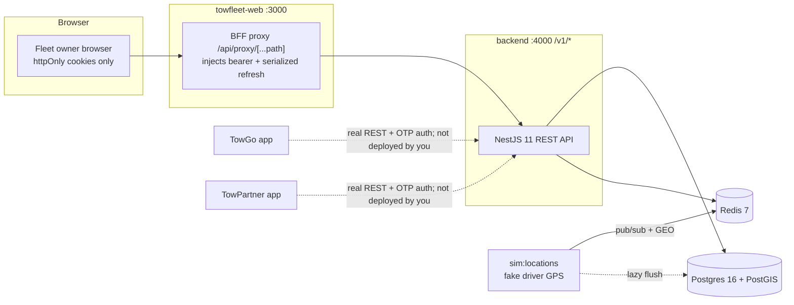

# 01 — Project Overview: the Towing Platform

**Audience:** AWS engineer taking over deployment (Phase 9). You have never seen this codebase.
**Repo root:** `f:\1. Webcros projects 3\Towing` (pnpm + Turborepo monorepo, Node ≥ 20, pnpm 11.1.2).
**One sentence:** An Uber-style on-demand towing marketplace for India; the fleet-owner web console and its NestJS backend are built and working end-to-end locally against Postgres/PostGIS + Redis, and your job is to put them on AWS.

---

## 1. Business context

Towing is an on-demand roadside-assistance and towing marketplace for India ("Fast · Reliable · Emergency Roadside Assistance"), modeled on Uber/Rapido/Bolt: stranded vehicle owners book a tow, nearby verified drivers accept, and everyone tracks the job live. Revenue is a **pure per-booking commission, tiered by service type** — 10% local (Band A), 8% highway/intercity (Band B), 5% long-distance (Band C) — with **no driver subscriptions or joining fees**; the band and % are locked at booking confirmation. The defining product constraint is the supply-side gate: a driver cannot receive a single job until admin approves their KYC, enforced at app, API, and database layers. Fleet businesses (multiple trucks + drivers) get a dedicated desktop web console — that console and the shared backend are what has been built so far.

Full product detail: [`docs/Towing-Project-Specification_v3.md`](../docs/Towing-Project-Specification_v3.md) §1–§2 (business), §15 (AWS architecture).

## 2. The four interfaces — what exists today

| Interface | Users | Platform | Repo location | Status |
|---|---|---|---|---|
| **TowGo** | Customers | React Native (Expo) | `apps/towgo` | UI built; since Phase 12 it has **real phone-OTP sign-in, a real REST client and MMKV storage** and does talk to the backend. Mocks remain the *default* (`EXPO_PUBLIC_USE_MOCKS`); only the features whose routes exist (auth, `/me` profile group, privacy) flip to REST today |
| **TowPartner** | Tow drivers | React Native (Expo) | `apps/towpartner` | Same stack, plus the driver KYC document-upload wizard, a capabilities screen and a durable offline mutation queue. **No EAS build has ever been produced, so neither app has run on a physical device** |
| **TowFleet Web** | Fleet owners | Web — Next.js 15 App Router | `apps/towfleet-web` | **Built and wired to the real backend** (mock mode also available); the deployable web app |
| **Towing Admin** | Platform ops | Web — `/admin/*` routes **inside `apps/towfleet-web`** | `apps/towfleet-web` | **Minimally built (Phase 11)**: admin login and the driver-KYC approval queue, realm-separated from the fleet console and sharing its BFF proxy. The wider live-ops surface arrives in Phase 20 |

All four sit on one **shared NestJS backend** (`apps/backend`), which now serves **four auth realms** (customer, driver, fleet, admin). A location **simulator** (`pnpm sim:locations` inside `apps/backend`) still stands in for real driver GPS by streaming fake truck positions into Redis — the driver app's location pipeline is Phase 16, not built yet.

**What you are deploying in Phase 9:** `apps/backend` + `apps/towfleet-web` (plus Postgres/PostGIS, Redis). The Expo mobile apps are not deployed by you — but they are **consumers of what you deploy**: Phase 9a (staging) exists partly so they get a reachable HTTPS origin, since an Expo client on cellular cannot reach a laptop. The `/admin/*` console ships inside `apps/towfleet-web` and needs no separate service.

## 3. Monorepo map

pnpm workspaces `apps/*` + `packages/*` (`pnpm-workspace.yaml`), orchestrated by Turborepo (`turbo.json`). React is pinned to a single hoisted `19.2.3` via root `pnpm.overrides`.

```
Towing/
├── apps/
│   ├── backend/            @towing/backend — NestJS 11 API (the shared backend)
│   │   ├── docker-compose.yml   local Postgres+PostGIS & Redis (dev + test profiles)
│   │   ├── drizzle/             ★ CANONICAL SQL migrations (0000–0004)
│   │   └── src/                 modules, db/migrate.ts, db/seed/, scripts/simulate-locations.ts
│   ├── towfleet-web/       Next.js 15 fleet-owner console (the deployable web app)
│   ├── towgo/              Expo customer app (real auth + REST; mocks are the default toggle)
│   └── towpartner/         Expo driver app (same, + KYC wizard and offline mutation queue)
├── packages/
│   ├── api-contracts/      @towing/api-contracts — Zod schemas + branded ids shared web↔backend
│   │                       (TS source via `import` condition; compiled CJS dist/ via `require`)
│   ├── web-ui/             @towing/web-ui — shadcn-style web component kit (Button/Card/Table/…)
│   ├── theme/              @towing/theme — design tokens; web imports ONLY `@towing/theme/tokens`
│   │                       (the root entry imports react-native — never in web code)
│   ├── ui/                 @towing/ui — React Native component kit for the Expo apps
│   └── config/             @towing/config — shared ESLint preset for the Expo apps
├── docs/                   spec v3 + implementation plan (see §7 below)
├── Aws/                    ★ this deployment handover pack (see §7 below)
├── infrastructure/         deploy-all.sh (Phase 9 extends this into CDK per the plan)
├── turbo.json · pnpm-workspace.yaml · package.json (root scripts: fleet/backend/build/test)
```

## 4. Tech stack per component

| Component | Stack | Notes for deployment |
|---|---|---|
| Backend (`apps/backend`) | NestJS 11, TypeScript, Drizzle ORM + `postgres` (postgres.js), `ioredis`, Zod (via api-contracts), `@nestjs/jwt`, `@nestjs/throttler`, pino (`nestjs-pino`) | Global prefix **`/v1`**; health at **`GET /v1/health`**; port from `PORT` env (default **4000**); CORS origins from env; graceful shutdown hooks already enabled (written with ECS task drain in mind). Build: `nest build` → `node dist/main.js` |
| Database | **PostgreSQL 16 + PostGIS** (`postgis/postgis:16-3.4` locally) | Target: RDS Postgres 16 + PostGIS. Migrations are plain SQL run by `apps/backend/src/db/migrate.ts` (drizzle migrator, single connection, journal table `drizzle.__drizzle_migrations`) |
| Cache / realtime substrate | **Redis 7** | Target: ElastiCache. Used today for idempotency (CAS), OTP/session state, dashboard cache, location pub/sub + GEO sets; Phase 5 adds the Socket.io Redis adapter |
| Fleet console (`apps/towfleet-web`) | Next.js 15.5 App Router, React 19.2.3, Tailwind v4, TanStack Query 5, Recharts, `@towing/web-ui` + `@towing/theme/tokens`, Playwright for e2e | Browser holds **only httpOnly cookies** (`fleet_session` 15-min JWT, `fleet_refresh` rotating 30-day token); a BFF proxy route `/api/proxy/[...path]` injects the bearer and transparently refreshes. **Refresh is serialized per-process** → multi-instance needs sticky sessions or a shared lock (flagged for Phase 8) |
| Env semantics (web) | — | `NEXT_PUBLIC_USE_MOCKS` is **inlined at build time** into the bundle (bake `false` into the production image); `API_BASE_URL` is read **at runtime, server-side only** |
| Mobile apps | Expo ~57 / React Native 0.86, React Navigation 7, Zustand, TanStack Query (+ persist-client), MMKV | **Not deployed by you, but they do send backend traffic** since Phase 12: bearer tokens (no cookies/BFF — that model is web-only), phone-OTP auth, the customer `/v1/me/*` group and driver KYC pre-signed uploads. High-volume **location ingestion is not among it yet** (Phase 16). No EAS build exists, so neither app has run on a physical device |
| Shared contracts | `@towing/api-contracts` | Run `turbo build` after editing contracts — the compiled backend consumes `dist/` CJS |

### System shape today (local)



## 5. Current status — Track A phases 1–9, Track B phases 10–21

Source of truth: [`docs/TowFleet-Implementation-Plan-V2.md`](../docs/TowFleet-Implementation-Plan-V2.md) (current as of 10 Aug 2026; V1 `TowFleet-Implementation-Plan.md` is superseded). The plan splits into **Track A** (the fleet console + backend — what you deploy) and **Track B** (the marketplace and the two mobile apps).

**Track A — TowFleet Web + backend**

| Phase | Deliverable | Status |
|---|---|---|
| 1 | Monorepo & workspace scaffolding | ✅ Complete |
| 2 | Console shell + design system + full mock-mode UI | ✅ Complete |
| 3 | Backend foundation: DB, auth, tenancy, seed & simulator | ✅ Complete |
| 4 | Core fleet REST APIs (trucks, drivers, dashboard, jobs) + console goes real | ✅ Complete |
| 5 | Realtime: Socket.io gateway + Redis adapter, live fleet map, presence | ✅ Complete |
| 6 | Compliance worker (BullMQ) + bulk CSV import | ✅ Complete |
| 7 | Money: earnings, split, payouts (Razorpay Route sandbox), reports | ✅ Complete |
| 8 | Hardening & scale rehearsal (multi-instance statelessness, k6, observability) | ✅ Complete |
| **9a** | **AWS staging** — your phase, and it is **next** | ⬜ Planned |
| 9b | AWS production + autoscaling | ⬜ Planned |

**Track B — marketplace & mobile:** phases **10 (multi-realm identity), 11 (driver KYC + the admin console) and 12 (both mobile apps off mocks) are complete**; **13 (notifications & push) is next**. Phases 14–21 (pricing, booking, presence, dispatch, tracking, money, safety, release) are planned.

**Phase 9 now executes in two stages, and 9a comes first.** 9a is a staging environment pinned to `desiredCount: 1` — the pin is a written deploy gate, not a convention, because the Redis-backed throttler storage and shared BFF refresh lock from Phase 8 are what make >1 task safe. It was pulled forward ahead of Track B Phase 13 for three reasons: APNs/FCM device testing needs a reachable origin, Razorpay webhooks and the public share-trip page need public HTTPS, and Expo dev clients on cellular cannot reach a laptop. See the plan's "Phase 9 executes in two stages" section.

**AWS is the committed target** (spec §15, locked decision in the plan): ECS Fargate + ALB (WebSocket stickiness, idle timeout ≥ 75 s), RDS Postgres 16 + PostGIS, ElastiCache Redis, S3 SSE-KMS (swaps in for the current disk `StoragePort`), SQS/EventBridge for notifications/jobs, CloudFront, WAF, Secrets Manager, ECR + GitHub Actions, DNS `fleet.towing.app`. All vendor touchpoints are behind ports/adapters today, so these are configuration swaps, not rewrites. Phases 5–8 have all landed, so Socket.io traffic (ALB stickiness matters) and BullMQ workers are running inside the API task **today**, not "by the time you deploy". Phase 11 also added pre-signed upload/download through `StoragePort` — the S3 adapter is now load-bearing for driver KYC documents, not just future-proofing.

## 6. What runs today, and how

Prerequisites: Node ≥ 20, pnpm 11.1.2 (`packageManager` pinned), Docker Desktop.

```bash
pnpm install

# 1. Infra — Postgres+PostGIS :5432 and Redis :6379 (test profile: :5433/:6380, tmpfs)
cd apps/backend && docker compose up -d --wait

# 2. Schema + demo data (deterministic seed; REFUSES NODE_ENV=production)
pnpm db:migrate && pnpm db:seed

# 3. API on :4000 — dev OTPs print in this terminal (DevOtpAdapter, never in production)
cd ../.. && pnpm backend

# 4. Optional: live truck movement (stands in for the driver app)
cd apps/backend && pnpm sim:locations

# 5. Console on :3000 — mock mode by default
pnpm fleet
#    Real mode: NEXT_PUBLIC_USE_MOCKS=false + API_BASE_URL=http://localhost:4000
#    (see apps/towfleet-web/.env.example)

# Login: lakshmi@recovery.in / Password123!  (OTP appears in the backend terminal)

# Tests
cd apps/backend && docker compose --profile test up -d --wait && pnpm test   # 502 tests / 62 files
cd ../towfleet-web && pnpm test:e2e                                          # Playwright, 29 hermetic
```

Backend env vars (see `apps/backend/.env.example` for the full annotated list): `NODE_ENV`, `PORT`, `LOG_LEVEL`, `DATABASE_URL`, `DATABASE_POOL_MAX`, `REDIS_URL`, `JWT_ACCESS_SECRET` (32+ chars — generate a real one for any deploy), `JWT_ACCESS_TTL_SECONDS`, `JWT_REFRESH_TTL_SECONDS`, `OTP_TTL_SECONDS`, `OTP_MAX_ATTEMPTS`, `CORS_ORIGINS`.

## 7. Where the authoritative docs live

| Document | Path | Role |
|---|---|---|
| Product spec v3 | `docs/Towing-Project-Specification_v3.md` | Single source of truth for product behavior; §15 = AWS architecture, §19 = SLOs |
| Implementation plan & progress | `docs/TowFleet-Implementation-Plan-V2.md` | Engineering source of truth: what is built, locked decisions, phase details, hard-won engineering notes. **V2 supersedes `docs/TowFleet-Implementation-Plan.md` (V1)** — same phase numbering, re-homed into ownership lanes; read V2 |
| **This AWS handover pack** | `Aws/` | Deployment-focused docs; this file (`01-project-overview.md`) is the overview |
| Migrations snapshot | `Aws/migrations/` (0000–0004 + drizzle journal) | **Point-in-time copy for reference only** — `apps/backend/drizzle/` is CANONICAL; always run migrations from there |
| Schema snapshot | `Aws/db/schema-snapshot.sql` | `pg_dump` of the schema as of 03 Aug 2026 — orientation aid, not an apply script |
| Older spec | `docs/Towing-Project-Specification_1.md` | Superseded by v3; historical only |

## 8. AWS account & existing state

**What the repo shows** (all of it from `.github/workflows/production-deploy.yml`):

- The CI workflow assumes region **`ap-south-1`** and the resource names **`towing-backend`** (ECR repository), **`towing-cluster`** (ECS cluster), and **`towing-api-service`** (ECS service).
- It expects the GitHub Actions secrets **`AWS_ACCESS_KEY_ID`** / **`AWS_SECRET_ACCESS_KEY`**.
- Its deploy jobs are **deliberately commented out** ("PAUSED TO AVOID AWS BILLING DURING EARLY DEVELOPMENT") — only the lint/typecheck `validate` job runs.
- **Nothing in the repo proves any AWS resource actually exists.** The names above may be aspirational; treat the account as unknown until inventoried.

**Decisions / information needed from the project owner before any bring-up** (cross-referenced from [06 §1](06-operations-runbook.md)):

| # | Needed | Why |
|---|---|---|
| 1 | AWS account ID(s) + billing owner | Who pays, and where the resources live |
| 2 | Access mechanism — IAM Identity Center vs IAM user vs assumed role | How the AWS engineer gets credentials at all |
| 3 | Whether the GitHub secrets are populated, and with what principal | Determines blast radius of the existing CI wiring and what must be rotated/replaced (see [05 "IAM & deployment identity"](05-security-networking.md)) |
| 4 | Inventory of anything already provisioned — ECR repos, ECS clusters, hosted zones, CDK bootstrap | Tells the engineer whether this is **greenfield or brownfield**; the CI resource names above are the first things to check for |

## 9. Owners & contacts

Deployment decisions in this pack (each doc's "Decisions needed" section) are ratified by these owners. **All values must be supplied by the project owner before Phase 9 starts.**

| Role | Who | Contact |
|---|---|---|
| Repo maintainer (built Track A 1–8 and Track B 10–12) | TBD — must be supplied by project owner | TBD |
| Product / business owner | TBD — must be supplied by project owner | TBD |
| AWS account owner | TBD — must be supplied by project owner | TBD |
| Vendor-relationship owner (MSG91, Razorpay, Google Maps) | TBD — must be supplied by project owner | TBD |
| Alarm / on-call recipient | TBD — must be supplied by project owner | TBD |

## 10. Decisions needed from the AWS engineer

These are genuinely undecided — do not assume:

1. **AWS region** (India users suggest `ap-south-1`, but nothing is provisioned or decided).
2. **Instance/task sizing** — RDS class, ElastiCache node type, Fargate CPU/memory, task counts (§19.1 SLOs: p95 API < 200 ms, realtime ≤ 2 s at 500 trucks are the targets to size against).
3. **Web hosting choice** — spec §15.2 leaves it open: AWS Amplify Hosting (SSR) *or* ECS + CloudFront; the plan's Phase 9 sketch assumes ECS Fargate for both backend and towfleet-web.
4. **Account/VPC topology, environments (staging vs prod), and domain/DNS ownership** — only `fleet.towing.app` is named in the plan.
5. **Sticky sessions vs shared refresh lock** for the multi-instance BFF refresh problem (plan defers this to Phase 8 — coordinate before going multi-instance).
6. **Secrets bootstrap** — which secrets go to Secrets Manager first (`JWT_ACCESS_SECRET`, `DATABASE_URL`, `REDIS_URL`); no real Razorpay/MSG91 credentials exist yet (business task, spec §14.4).

---

_Last updated: 03 Aug 2026 · Sources: docs/TowFleet-Implementation-Plan.md, docs/Towing-Project-Specification_v3.md (§0–§2, §14–§15), .github/workflows/production-deploy.yml, package.json, pnpm-workspace.yaml, turbo.json, apps/backend/package.json, apps/backend/src/main.ts, apps/backend/.env.example, apps/backend/docker-compose.yml, apps/backend/drizzle/, apps/towfleet-web/package.json, apps/towfleet-web/.env.example, apps/towgo/package.json, apps/towpartner/package.json, packages/*/package.json, Aws/migrations/, Aws/db/schema-snapshot.sql_
