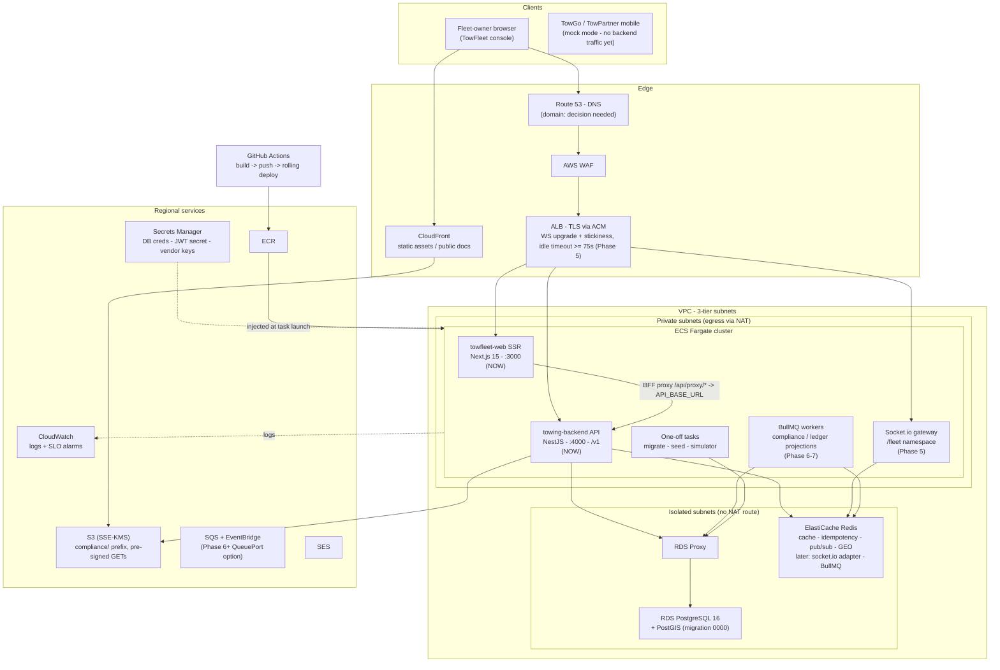

# 02 — Target AWS Architecture

**Audience:** the AWS engineer executing Phase 9 of [docs/TowFleet-Implementation-Plan.md](../docs/TowFleet-Implementation-Plan.md).
**Source of truth for the architecture:** spec §15 ([docs/Towing-Project-Specification_v3.md](../docs/Towing-Project-Specification_v3.md), lines 1014–1130). AWS is the committed deployment target; every vendor touchpoint in the codebase is already behind a port so the deploy is an adapter swap, not a rewrite.

**What you are deploying now (Phases 1–6 complete):** the NestJS backend API (`apps/backend`) and the TowFleet Next.js SSR console (`apps/towfleet-web`), backed by RDS PostgreSQL 16 + PostGIS, ElastiCache Redis, and S3. The mobile apps (TowGo, TowPartner) are Expo/React Native running on in-app mocks — they do **not** talk to the backend yet and need nothing from this deployment.

**What arrives later:** Redis-backed throttling and multi-instance hardening (Phase 8). The Socket.io realtime gateway (Phase 5) and BullMQ workers (Phase 6) have LANDED and run inside the API task today. The architecture below reserves room for them so Phase 9 does not have to be redone.

---

## 1. Spec §15 → concrete AWS services

| Concern (spec §) | Spec choice | AWS service | Status in code today |
|---|---|---|---|
| API compute (§15.3) | Long-running containers (persistent WebSockets rule out Lambda) | **ECS on Fargate** | NestJS 11 app, `node dist/main.js`, port from `PORT` (default 4000), global prefix `/v1`, health `GET /v1/health`, graceful-shutdown hooks for clean task drain |
| Load balancing (§15.3) | WebSocket upgrade + sticky sessions | **Application Load Balancer** | HTTP only today; WS stickiness + idle timeout ≥ 75 s required from Phase 5 |
| Relational + spatial (§15.4) | PostgreSQL + PostGIS, Drizzle ORM | **RDS for PostgreSQL 16** (+ RDS Proxy in the generated CDK) | Migrations 0000–0004 in `apps/backend/drizzle` (canonical); `0000_enable_postgis.sql` runs `CREATE EXTENSION IF NOT EXISTS postgis` |
| Ephemeral / realtime state (§15.4) | Redis | **ElastiCache for Redis** | ioredis, two connections (commands + subscriber); usage inventory in §5.2 below |
| Files / KYC docs (§15.5) | S3 SSE-KMS, private + pre-signed | **S3 + KMS** | `StoragePort` seam with a disk adapter (`local://` URLs); S3 adapter is a Phase 9 deliverable |
| CDN (§15.5) | CloudFront for public assets | **CloudFront** | Nothing in code depends on it yet |
| Edge protection (§15.5) | WAF managed rules on the ALB | **AWS WAF** | — |
| Secrets (§15.5) | No secrets in code | **Secrets Manager / SSM** | Backend env is Zod-validated at boot (`src/config/env.ts`); production boot refuses the dev JWT placeholder |
| Async / cron (§15.5) | SQS + EventBridge Scheduler | **SQS / EventBridge** — *or* BullMQ on the existing Redis | Plan locks BullMQ behind a `QueuePort` (Phase 6); "SQS/EventBridge becomes an adapter swap on AWS" — see Decisions |
| Email (§15.5) | Invoices, alerts | **SES** | `NotificationPort` stub only |
| Web hosting (§15.2) | Amplify Hosting SSR *(or ECS + CloudFront)* | Plan Phase 9 specifies **ECS Fargate service for towfleet-web** | Next.js 15 App Router; `output: 'standalone'` build is a Phase 9 deliverable |
| CI/CD (§15.5) | GitHub Actions → ECR → ECS rolling deploy | **GitHub Actions + ECR** | Generator emits a placeholder workflow only |
| Observability (§15.5) | CloudWatch + Sentry | **CloudWatch** | pino structured logs with credential redaction; Sentry behind env flag is Phase 8 |
| Network (§15.5) | 3-tier VPC, isolated data tier, VPC endpoints | **VPC** | Generated CDK covers most of it (see §6) |

---

## 2. Architecture diagram

Notes on the diagram:

- The **browser never holds tokens** — only httpOnly cookies (`fleet_session` = 15-min JWT, `fleet_refresh` = rotating 30-day refresh token). The Next.js BFF proxy (`/api/proxy/[...path]`) injects `Authorization` and transparently refreshes. Refresh is **serialized per process only** — a multi-instance `towfleet-web` needs ALB sticky sessions or a shared lock (flagged for Phase 8). Plan for stickiness on the web target group from day one.
- `towfleet-web` reaches the backend via `API_BASE_URL`, read **server-side at runtime** — it can point at an internal ALB listener or service-discovery name. `NEXT_PUBLIC_USE_MOCKS` is **inlined at build time** into the browser bundle: the production image must be built with `NEXT_PUBLIC_USE_MOCKS=false`, not just run with it.
- Mobile traffic is drawn dashed-out on purpose: nothing to route until the driver-app ingestion lands (post-Phase 5). The location **simulator** stands in for driver GPS today.

---

## 3. ECS service inventory

### Runs NOW (deployable after Phase 9 packaging)

| Service | Source | Port | Health | Key env | Statefulness notes |
|---|---|---|---|---|---|
| `towing-backend` (API) | `apps/backend`, `node dist/main.js` | `PORT` (default **4000**) | `GET /v1/health` | `DATABASE_URL`, `DATABASE_POOL_MAX`, `REDIS_URL`, `JWT_ACCESS_SECRET` (≥32 chars), `JWT_ACCESS_TTL_SECONDS`, `JWT_REFRESH_TTL_SECONDS`, `OTP_TTL_SECONDS`, `OTP_MAX_ATTEMPTS`, `UPLOADS_DIR`, `CORS_ORIGINS`, `LOG_LEVEL`, `NODE_ENV` (full list: `apps/backend/src/config/env.ts` — Zod-validated, bad config crashes at boot with a readable report) | Stateless **except**: (a) in-memory throttler counters — N instances ⇒ N× effective limits until Phase 8 Redis storage; (b) disk `StoragePort` writes to `UPLOADS_DIR` — must be swapped for S3 before running >1 instance or losing task storage |
| `towfleet-web` (SSR console) | `apps/towfleet-web`, Next.js 15 App Router (`output: 'standalone'` — Phase 9 deliverable) | 3000 (Next default) | none defined yet — decision needed | `API_BASE_URL` (runtime, server-side), `NEXT_PUBLIC_USE_MOCKS=false` (**build-time**) | Per-process refresh serialization ⇒ sticky sessions required for >1 instance until Phase 8 |

### ARRIVES in later phases

| Service | Phase | What it is | Infrastructure it needs ready |
|---|---|---|---|
| Socket.io gateway (`/fleet` namespace) — **LANDED** | 5 | Realtime fan-out: `location:update`, KPI deltas, presence; `@socket.io/redis-adapter` installed in `main.ts`; fleet-scoped rooms from a single-use Redis handshake ticket | **ALB idle timeout ≥ 75 s** (default 60 s kills the 25 s heartbeat) and Redis reachable. **Stickiness is no longer required for the handshake**: the gateway is configured `transports: ['websocket']`, so there is no polling handshake to pin to one task. Keep stickiness on the list anyway if polling is ever re-enabled. Still undecided: separate ECS service vs. inside the API task (see Decision 5) |
| Compliance worker + bulk import — **LANDED** | 6 | Hourly BullMQ job: 30-day expiry alerts, auto `non_compliant` truck status; plus queued bulk-CSV imports >500 rows. Runs **inside the API task**; split it out with `QUEUE_ENABLED=false` on the API service + a worker service on the same image | BullMQ on Redis (or `QueuePort` → SQS adapter — see Decisions); no inbound port. **Redis is now durable state** — see the RPO row in [06 §backups](06-operations-runbook.md). Depth/DLQ probe: `GET /v1/health/queues` |
| Ledger/earnings projection worker | 7 | Consumes ledger events, maintains `earnings_daily`; nightly wallet-balance reconciliation with drift alarm | Same queue infrastructure; CloudWatch alarm target |

### One-off tasks (ECS run-task, not services)

| Task | Command | When | Guard rails |
|---|---|---|---|
| Migrate | `pnpm db:migrate` → `tsx src/db/migrate.ts` | Every deploy, before rollout | Drizzle migrator, single connection, journal table `drizzle.__drizzle_migrations`; env-driven and non-interactive; migration 0000 creates the PostGIS extension |
| Seed | `pnpm db:seed` → `tsx src/db/seed/index.ts` | dev/staging demo data only | **Refuses `NODE_ENV=production`**; deterministic; three money invariants asserted at exit; demo login `lakshmi@recovery.in` / `Password123!`; dev OTP printed to backend log by `DevOtpAdapter` (never wired in production) |
| Location simulator | `pnpm sim:locations` → `tsx src/scripts/simulate-locations.ts` | dev/staging demos of the live map | Streams fake truck GPS into Redis (pub/sub `location:ping` + `GEOADD trucks:online:{fleetId}`), lazy Postgres flush; stands in for the driver app |

> Packaging note: all three one-off entrypoints run **TypeScript via `tsx`**, while the API service runs compiled `dist/`. The production image (or a dedicated "tools" image) must ship `tsx` + sources for these tasks, or they must be precompiled — a Phase 9 Dockerfile decision.

---

## 4. Data stores

### 4.1 RDS PostgreSQL 16 + PostGIS

- **Engine:** PostgreSQL 16 with PostGIS — local dev runs `postgis/postgis:16-3.4` (`apps/backend/docker-compose.yml`, dev ports 5432/6379, tmpfs test profile on 5433/6380). RDS ships PostGIS as an allow-listed extension; migration `0000_enable_postgis.sql` (`CREATE EXTENSION IF NOT EXISTS postgis`) registers it in the target database, so the migrate one-off task handles the bootstrap — but it must run as a role with `rds_superuser` membership (the RDS master user qualifies).
- **Migrations:** `apps/backend/drizzle` is **CANONICAL** — `0000_enable_postgis`, `0001_core_schema`, `0002_spatial_and_constraints`, `0003_fleet_credentials`, `0004_petite_richard_fisk`. `Aws/migrations/` is a **point-in-time snapshot** of the same files and `Aws/db/schema-snapshot.sql` is a pg_dump schema snapshot dated 03 Aug 2026 — use them for review/sizing, never as the deploy source.
- **Access pattern:** postgres.js pool (`DATABASE_POOL_MAX`, default 10) per API task. The generated CDK fronts RDS with an **RDS Proxy**; verify postgres.js prepared-statement behavior against proxy pinning before committing to it (see Decisions).
- **Spatial:** `geography(Point)` columns with GIST indexes; PostGIS KNN is the authoritative nearest-driver path behind the Redis GEO hot path (spec §6.1) — dispatch itself is out of current scope (seams only).

### 4.2 ElastiCache Redis — usage inventory

Local dev: `redis:7` (append-only). Backend holds **two ioredis connections** (`src/redis/redis.module.ts`): `commands` (fail-fast, `maxRetriesPerRequest: 3`) and `subscriber` (retries forever — subscriber mode rejects normal commands). `REDIS_URL` accepts `redis://` or `rediss://`, so TLS-enabled ElastiCache works without code changes.

**What Redis holds TODAY (Phases 3–4):**

| Use | Keys / channel | Written by | Semantics |
|---|---|---|---|
| Dashboard KPI cache | per-feature keys via `CacheService.getOrSet` | API (dashboard module) | 15 s TTL read-through JSON cache with event-driven invalidation; **availability-first** — a Redis blip serves fresh data, never an error |
| Idempotency markers (§19.4) | `idem:{tenant}:{method}:{path}:{sha256(clientKey)}` | API (`IdempotencyInterceptor`, header-driven on mutating routes) | SET NX + Lua CAS; in-flight TTL 90 s, completed-response TTL 24 h; **fast path only** — DB unique constraints on payments/payouts/wallet idempotency keys are the real exactly-once backstop |
| Live location fan-out | pub/sub channel `location:ping`; GEO sets `trucks:online:{fleetId}` | **Simulator today** (driver app later) | Pipeline of `PUBLISH` + `GEOADD` per ping; Postgres only gets a lazy sample flush |

**What Redis is explicitly NOT used for today (do not over-provision for it):**

| Concern | Where it actually lives today | When it moves to Redis |
|---|---|---|
| Rate limiting / throttling | **In-memory per process** (`@nestjs/throttler` default storage; buckets reads 120/min, money 20/min, auth 5/min). With N tasks the effective limit is N× and restarts reset counters — the storage seam in `src/common/throttling/throttler.config.ts` takes a Redis-backed `ThrottlerStorage` | Phase 8 |
| OTP codes & attempt caps | **Postgres** (`otp_verifications` table — hashed codes, attempt-capped, single-use) | Not planned |
| Sessions / refresh tokens | **Postgres** (rotating refresh tokens, hashed, family reuse detection) | Not planned |

**What ARRIVES on Redis in later phases:**

| Use | Phase |
|---|---|
| `@socket.io/redis-adapter` — cross-task WS room fan-out | 5 |
| Presence keys (15 s TTL per truck) | 5 |
| BullMQ queues (compliance worker, bulk import, ledger projections) — unless the `QueuePort` adapter is swapped to SQS | 6–7 |
| Redis-backed throttler storage (multi-instance-correct, per-tenant keys) | 8 |
| Dispatch offer locks, surge/pricing hot cache | Post-scope (spec §15.4) |

Sizing implication: today's footprint is tiny (cache + idempotency markers + one pub/sub channel). Phase 5 adds connection volume (adapter + presence), Phase 6 adds BullMQ persistence — pick a node class you can resize without re-architecting, and note ElastiCache cluster-mode choices constrain BullMQ (it requires keys co-located per queue; single-shard/cluster-mode-disabled is the simple safe choice).

### 4.3 S3

- **Today:** `StoragePort` (`src/common/storage/storage.port.ts`) with a **disk adapter** — server-minted keys `{keyPrefix}/{uuid}{ext}` under `UPLOADS_DIR` (default `var/uploads`), recorded in the DB as opaque `local://…` URLs. `keyPrefix` is a logical folder, e.g. `compliance/<truckId>` (compliance document uploads from the trucks module are the only writer today).
- **Phase 9:** drop-in S3 adapter behind the same `STORAGE` token — **SSE-KMS**, private-by-default, pre-signed GETs (the interface documents exactly this intent). The `fileUrl` column simply starts holding `s3://…` — but rows written before cutover keep `local://` URLs; any dev/staging data that must survive needs a backfill or re-upload (production has none yet).
- **Bucket layout per the generated CDK:** a private KYC/compliance bucket (KMS-encrypted, all public access blocked) + a public-assets bucket served via CloudFront. Task role needs `s3:PutObject`/`GetObject` scoped to the compliance prefix + `kms:GenerateDataKey`/`Decrypt` on the key.

---

## 5. Edge & supporting services

| Service | Role here | Notes |
|---|---|---|
| CloudFront | Public assets/thumbnails CDN; optionally in front of the consoles | Not generated by the CDK script today; spec §15.5 |
| AWS WAF | Managed rules on the ALB | Generator creates the WebACL association for staging/prod but with an **empty rules array** — add AWS managed rule groups |
| ACM + Route 53 | TLS + DNS (`fleet.towing.app`, `api.towing.app` per plan/spec) | Entirely absent from the generator; ALB is HTTP:80 only |
| Secrets Manager | DB credentials (generated by CDK), plus **to be added**: `JWT_ACCESS_SECRET`, future Razorpay/MSG91 keys | Backend refuses to boot in production with the dev JWT placeholder (`assertProductionSafety`) |
| SQS + EventBridge Scheduler | Spec's async/cron answer; the plan's locked decision is **BullMQ behind a `QueuePort` first** (Redis already required), with SQS/EventBridge as an adapter swap on AWS | Generator already creates one SQS queue (unused). Decide before Phase 6 builds the worker |
| SES | Invoices, alerts email | Nothing in code yet (`NotificationPort` stub); no CDK resource |
| CloudWatch | Logs (awslogs driver), SLO alarms per spec §19.1 (API p95 < 200 ms, realtime ≤ 2 s) | Generator makes a log group + an **empty** dashboard |

---

## 6. `infrastructure/deploy-all.sh` — what exists vs what Phase 9 must add

**Read this first:** the script does not deploy checked-in infrastructure code — it **generates a CDK TypeScript project into `./towing-aws-infra/` at run time** (via `cdk init` + heredocs), then runs `cdk bootstrap` and `cdk deploy --all`. **Nothing from a generator run is checked into the repo.** The script itself is the only source; treat its heredoc contents as v0 scaffolding to be extracted into a real, committed CDK app.

Mechanics: `./deploy-all.sh {dev|staging|prod}`; region from `AWS_REGION` (default **`ap-south-1`**); env selection reaches CDK via `APP_ENV`; per-env sizing lives in the generated `lib/config.ts`; installs `aws-cdk-lib@^2.150.0` and `@aws-cdk/aws-amplify-alpha` (the Amplify package is installed but **never used** by any stack).

### 6.1 What the generated stacks already cover

| Stack | Resources | Assessment |
|---|---|---|
| `VpcStack` | VPC with `maxAzs` (2) and configurable NAT count; **3-tier subnets** (Public / Private-with-egress / Isolated); S3 gateway endpoint; interface endpoints for Secrets Manager, ECR, ECR-Docker, CloudWatch Logs | Matches spec §15.5 topology. Missing the **SQS interface endpoint** the spec lists |
| `DbStack` | RDS PostgreSQL **16** instance, isolated subnets, DB name `towing`, generated secret (user `postgres`), Multi-AZ + storage per env; **RDS Proxy**; ElastiCache **single-node `CfnCacheCluster`** with SG open to the whole VPC CIDR on 6379 | Right shape. But: instance strings are broken (see gaps); Redis has **no TLS, no AUTH, and no replication in any environment (including prod)** — the `CfnCacheCluster` is a single node with no transit encryption or auth token (gap item 10); DB name `towing` vs local dev's `towfleet` — harmless, but set `DATABASE_URL` accordingly |
| `StorageStack` | Private KYC bucket (`BLOCK_ALL` public access, `KMS_MANAGED` encryption), public-assets bucket (also `BLOCK_ALL`), one SQS queue | KYC bucket matches the SSE-KMS intent (AWS-managed key — customer-managed CMK is a decision). "Public" bucket blocks all public access, so it only works behind CloudFront OAC — which doesn't exist yet |
| `ComputeStack` | ECR repo `towing-backend` (keep last 5 images); ECS cluster; **one** Fargate task def sized per env, running the **placeholder image `amazon/amazon-ecs-sample` on port 3000**, awslogs (1-month retention), `NODE_ENV` env var, whole DB secret injected as `DB_CRED`; internet-facing ALB on **HTTP:80** only; target group → port 3000, health check **`/health`**, stickiness cookie 24 h; Fargate service at min capacity; WAF WebACL (empty rules) associated when `enableWaf` | Skeleton only — see gaps: wrong port, wrong health path, placeholder image, unusable secret shape, no TLS, no autoscaling |
| `MonitoringStack` | CloudWatch dashboard `Towing-{env}-SLO` — **empty** (comment: "Add latency and error rate widgets here") | Placeholder |
| CI/CD | `.github/workflows/deploy-backend.yml` — a dummy `echo` step | Placeholder; also written into the *generated* project, not this repo |

### 6.2 Gap list — what Phase 9 must add or change

Deployment-blocking fixes to the generated code:

1. **Real images.** Multi-stage Dockerfiles (backend via `pnpm deploy`; towfleet-web via Next `output: 'standalone'`), built and pushed by CI — the task def currently runs `amazon/amazon-ecs-sample`.
2. **Port and health mismatch.** Container/target group/SG are hard-coded to **3000** with health check **`/health`**; the backend listens on **4000** and serves **`/v1/health`**.
3. **Secrets shape.** The app needs `DATABASE_URL` (postgres URL) and `REDIS_URL`; injecting the whole RDS secret JSON as `DB_CRED` is unusable. Compose the URL (ECS per-field secret references or a small entrypoint), and add Secrets Manager entries for `JWT_ACCESS_SECRET` (≥32 chars) plus every var in `src/config/env.ts` (`CORS_ORIGINS` must list the console origin or every browser call fails).
4. **Instance class strings are invalid.** `rdsInstanceType` values include the `db.` prefix (`db.t2.micro`, …) but are fed to `new ec2.InstanceType(...)`, which CDK renders as `db.db.t2.micro` — CloudFormation will reject it. Additionally `t2` classes are not offered for PostgreSQL 16, and `cache.t2.micro` is previous-generation; re-pick all sizes (see Decisions).
5. **`towfleet-web` service is entirely missing.** Second ECR repo, task def, service, target group (with **sticky sessions** for the BFF refresh serialization), listener rules routing console traffic vs `/v1/*` API traffic — none of it exists (and the installed Amplify alternative is never wired either).
6. **TLS/DNS/CDN.** No ACM certificate, no HTTPS listener, no Route 53 records, no CloudFront distribution.

Required for correctness/scale (some can land with Phase 5–8 rather than day one):

7. **ALB WebSocket readiness (Phase 5 — the gateway now exists).** Set ALB **idle timeout ≥ 75 s**: the gateway heartbeats every 25 s (`pingInterval`) and the 60 s default would cull quiet-but-alive sockets. Route `/socket.io/*` to the gateway target group. **Stickiness is not needed for the handshake** — the gateway runs `transports: ['websocket']`, so there is no two-request polling handshake to pin; cross-task fan-out is the Redis adapter's job. (The BFF refresh-serialization stickiness need on the *web* tier is separate and still open — see [04 §2.4](04-runtime-environment.md).) Also add `PUBLIC_WS_URL` to the gateway's task definition: it is what the ticket endpoint hands the browser, so a wrong value points every console at the wrong origin.
8. **PostGIS bootstrap + migrate/seed one-off task definitions.** Nothing runs migrations: add ECS run-task defs for `db:migrate` (every deploy, before rollout — it also creates the PostGIS extension) and `db:seed` (dev/staging only; it refuses `NODE_ENV=production`), plus optionally the simulator for demos.
9. **Autoscaling.** `fargateMinCapacity`/`fargateMaxCapacity` exist in config but no scalable target/policies are created.
10. **Redis hardening.** Enable transit encryption + AUTH (code already accepts `rediss://`), at-rest encryption, replicas for prod (config's `redisReplicasPerShard` is never used by the `CfnCacheCluster`, which cannot express replication — switch to `CfnReplicationGroup`), and narrow the SG from VPC-CIDR to the ECS task SGs.
11. **RDS backup retention is never wired.** `config.rdsBackupRetentionDays` (1/3/14 per env) is never passed to the `DatabaseInstance` (no `backupRetention` prop) — the generated stack falls back to the CDK default; wire it up or set retention explicitly in Phase 9.
12. **RDS Proxy vs postgres.js.** Validate prepared-statement pinning behavior, or drop the proxy initially (pool of 10/task is modest).
13. **WAF rules, SLO alarms, SQS endpoint, SES.** Populate the empty WebACL with managed rule groups; build the §19.1 alarms into `MonitoringStack`; add the SQS interface endpoint (if SQS is chosen) and SES identities (Phase 6+).
14. **Real CI/CD.** Turbo-pruned build → ECR → ECS rolling deploy per plan; replace the dummy workflow and commit it to **this** repo.
15. **Commit the CDK app.** Extract the generator's output into a reviewed, checked-in `infrastructure/` CDK project so infra changes go through PRs instead of regenerated heredocs.

---

## 7. Decisions needed from the AWS engineer

| # | Decision | Context |
|---|---|---|
| 1 | **Region** | Script defaults to `ap-south-1` (Mumbai — sensible for an India product) but it is an env-var default, not a committed decision |
| 2 | **Instance/node sizing** | All values in the generated `lib/config.ts` need re-picking (current strings are malformed/unsupported — §6.2 item 4). Load basis: Phase 8 targets p95 < 200 ms at seed ×10 and realtime ≤ 2 s at 500 trucks |
| 3 | **Domains + cert strategy** | Plan says `fleet.towing.app`; spec sketches `api.towing.app` and `admin.towing.app`. Ownership/registrar unknown |
| 4 | **towfleet-web hosting: ECS Fargate vs Amplify Hosting** | Plan Phase 9 locks ECS (backend + towfleet-web as sibling services); spec §15.2 lists Amplify with ECS+CloudFront as the alternative. ECS keeps one deploy model and gives the sticky-session control the BFF needs |
| 5 | **Socket.io gateway: in the API task or a separate service** | Still open, but **cheaper than it looked**: Phase 5 ships one `AppModule` that serves both HTTP and `/fleet`, so "separate service" is the same image with different scaling — no code split needed either way. Phase 5's two-process rehearsal (two `PORT`s, one Redis, 50 clients / 200 trucks) passed at **p95 1041 ms with 0 duplicates**, so multi-instance fan-out is proven. Phase 8 rehearses "2× API + 2× gateway"; decide then, on the §19.6 argument that a gateway task saturates on socket count at low CPU and so wants its own scaling policy |
| 6 | **Queue backbone: BullMQ-on-ElastiCache vs `QueuePort` → SQS + EventBridge** | Plan's locked decision starts with BullMQ (Redis already required); spec prefers SQS/EventBridge on AWS. Affects Redis sizing/cluster mode and IAM |
| 7 | **RDS Proxy: keep or defer** | Generated CDK includes it; value vs postgres.js pinning risk at current pool sizes is unproven |
| 8 | **KMS: AWS-managed vs customer-managed CMK for the KYC bucket** | Generator uses `KMS_MANAGED`; compliance posture may require a CMK with rotation |
| 9 | **Redis TLS/AUTH rollout** | Code accepts `rediss://` today; enabling it is pure infra config — decide per env |
| 10 | **NAT/AZ economics** | Config: 1 NAT (dev/staging) / 2 NAT + 2 AZ (prod). Interface endpoints already reduce NAT traffic; confirm AZ count vs RDS Multi-AZ story |
| 11 | **Migration execution model** | ECS run-task before service rollout (recommended; scripts are non-interactive) vs pipeline-driven — and whether the tools image ships `tsx` + TS sources or precompiled entrypoints |
| 12 | **`local://` file backfill** | Any dev/staging compliance uploads that must survive the S3 cutover need re-upload or a backfill job; production has no data yet |
| 13 | **Cost envelope** | The business must state the target monthly spend per environment and whether **cost or availability wins on conflicts** (1 vs 2 NAT gateways, single-AZ vs Multi-AZ RDS, RDS Proxy yes/no). Recommendation: create an **AWS Budget with alert thresholds as the FIRST deployed resource** — this project already halted its CI deploy jobs once over billing (`production-deploy.yml`: "PAUSED TO AVOID AWS BILLING DURING EARLY DEVELOPMENT") |
| 14 | **Environments & promotion** | Environment count (dev/staging/prod vs staging/prod), single vs multi-account, and the promotion trigger (tag / manual approval / push-to-`main`). A non-production environment is **functionally mandatory before launch**: the deepest smoke test (seeded login via the dev OTP adapter) cannot run in production until an SMS provider is wired, so a prod-only setup leaves the platform unverifiable end-to-end. See also the "Environments & promotion" paragraph in [06 §1](06-operations-runbook.md) |

### Demand assumptions (extends decision 2 — business input required)

Sizing cannot be finished until the business supplies demand numbers: **fleets, trucks, and drivers at launch and at 6 months; concurrent console sessions; bookings/day; GPS ping rate per truck** (matters from Phase 5). What the repo can state today: the deterministic seed models **2 fleets / 20 trucks / 12 drivers / ~506 bookings over 90 days**; the Phase 8 k6 load target is **seed ×10** (plan: p95 < 200 ms, realtime ≤ 2 s at 500 trucks); and each console login costs one **~16 MiB memory-hard scrypt derivation** (see [05 §1.2](05-security-networking.md)), so login bursts size Fargate CPU/memory, not just request throughput.

> Decisions in this table are ratified by the owners listed in [01 "Owners & contacts"](01-project-overview.md) — all currently TBD.

---

_Last updated: 03 Aug 2026 · Sources: infrastructure/deploy-all.sh, docs/Towing-Project-Specification_v3.md (§15, lines 1014–1130), docs/TowFleet-Implementation-Plan.md, .github/workflows/production-deploy.yml, apps/backend/src/db/seed/seed.ts, apps/backend/src/modules/auth/password.ts, apps/backend/docker-compose.yml, apps/backend/package.json, apps/backend/src/main.ts, apps/backend/src/config/env.ts, apps/backend/src/redis/redis.module.ts, apps/backend/src/redis/redis.constants.ts, apps/backend/src/common/cache/cache.service.ts, apps/backend/src/common/idempotency/idempotency.interceptor.ts, apps/backend/src/common/throttling/throttler.config.ts, apps/backend/src/common/storage/{storage.port.ts,disk-storage.adapter.ts,storage.module.ts}, apps/backend/src/scripts/simulate-locations.ts, apps/backend/src/db/schema/auth.ts, apps/backend/drizzle/0000_enable_postgis.sql, apps/towfleet-web/.env.example, Aws/migrations/, Aws/db/schema-snapshot.sql_
