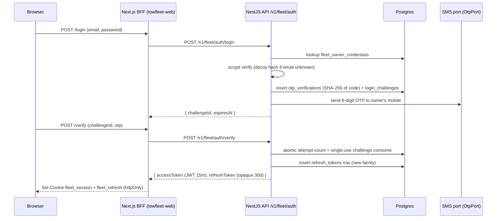
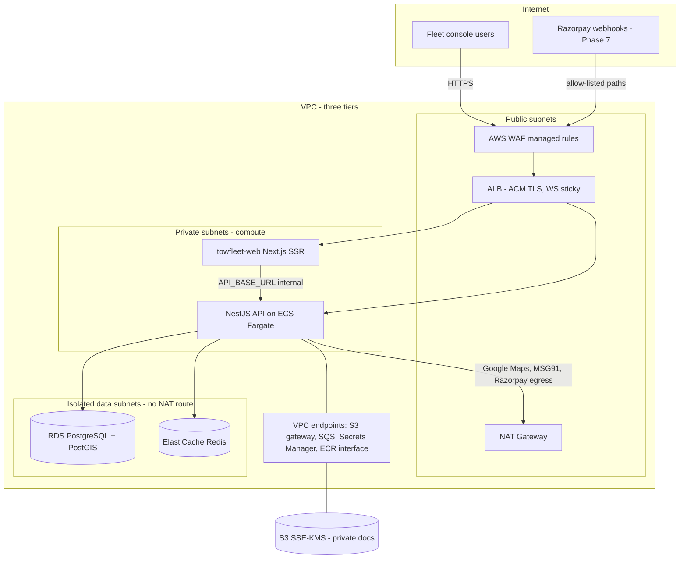

# 05 — Security Model & Networking

**Audience:** the AWS engineer deploying the Towing platform (Phase 9 — **9a staging** first, then 9b — of `docs/TowFleet-Implementation-Plan-V2.md`; V1 is superseded).
**Scope:** the fleet-console auth realm and everything the application already enforces at the code level, plus the AWS network/secrets topology the spec commits to. Every claim below is verified against the repo files listed in the footer; anything genuinely undecided is in [§12 Decisions needed](#12-decisions-needed-from-the-aws-engineer).

**The five things that will bite you if skipped:**

| # | Fact | Where it matters |
|---|---|---|
| 1 | Rate limiting keys on the client IP Express reports, and **`trust proxy` is NOT configured** in `apps/backend/src/main.ts` | Behind an ALB, every request appears to come from the ALB — the whole console shares one 5/min auth bucket. Must be fixed at deploy time (§6) |
| 2 | Rate-limit counters are **in-memory, per-process** | N Fargate tasks = N× the configured limit; Redis storage seam exists but is a Phase 8 task (§6) |
| 3 | The Next.js BFF serializes token refreshes **per-process only** | Multi-instance web deployment without sticky sessions (or a shared lock) triggers refresh-token *reuse detection* and logs users out (§2.4) |
| 4 | Production boot **fails closed** on bad secrets — and OTP delivery in production is a black hole until an SMS provider is contracted | `assertProductionSafety` throws on the dev placeholder JWT secret; `DevOtpAdapter` refuses to log codes when `NODE_ENV=production`, so no one can complete a login (§2.2, §5) |
| 5 | Data-tier subnets must be **isolated (no NAT route)** and the WAF must **allow-list Razorpay webhook paths** | Spec §20.5 / §15.5 commitments; webhooks arrive in Phase 7 (§7) |

---

## 1. Auth architecture — the fleet realm

Spec §15.2 defines separate auth realms per console. This section documents the **fleet** realm in detail. Since Phase 10 **all four realms are implemented** — customer and driver (phone + OTP, from the mobile apps), fleet (email + password + OTP) and admin (password + OTP with four sub-roles and an audit log). They share the `refresh_tokens` table via its `realm` column, and a token presented against another realm is rejected without burning the refresh family (`token.service.ts`, `jwt-auth.guard.ts`). Nothing below changes for the other realms; there are simply more of them, and mobile clients now hold bearer tokens directly rather than going through the console's cookie/BFF model.

### 1.1 Login flow (two steps, §16.4)

### 1.2 Step 1 — email + password (scrypt)

`apps/backend/src/modules/auth/password.ts`:

- **scrypt from `node:crypto`**, deliberately not bcrypt/argon2: those are native modules, and the deployment target is a slim container image built **without a toolchain**. Nothing to compile — keep the Docker image minimal.
- Parameters `N=16384, r=8, p=1` (~16 MiB working set per verification), encoded as `scrypt$N$r$p$salt$hash` so cost can be raised later without invalidating stored rows. Parse-time upper bounds (`N≤32768, r≤8, p≤4`) prevent a poisoned row from becoming a memory-exhaustion DoS.
- **Anti-enumeration:** unknown email, wrong password, and locked account all return the same message and burn exactly one scrypt derivation (a decoy hash is verified when no row exists), so neither the body nor the timing reveals which emails have accounts (`auth.service.ts`).
- **Account lockout:** 5 failed attempts → 15-minute lock, counted atomically in a single UPDATE. Hard-coded by design ("a security policy, not a deployment knob") — do not look for env vars for these.

> Sizing note: one login = one ~16 MiB, CPU-bound scrypt derivation. Factor this into Fargate task CPU/memory when picking sizes, and note the auth throttle bucket (§6) already caps this per-IP.

### 1.3 Step 2 — OTP challenge

- 6-digit code from `crypto.randomInt`, stored **only as a SHA-256 digest** in `otp_verifications`. No KDF on purpose — ~20 bits of entropy can't be saved by a work factor; the protection is the attempt cap + TTL.
- Defaults (env-tunable): `OTP_TTL_SECONDS=300`, `OTP_MAX_ATTEMPTS=5`. Attempts are counted in the *same* UPDATE that reads the row, so parallel guessing cannot bypass the cap; the challenge is consumed with a conditional UPDATE, so a valid code is single-use even under a race.
- **Delivery is a port** (`otp.port.ts`). Only `DevOtpAdapter` is wired (`auth.module.ts` line 35): in dev it logs `DEV OTP (...) : <code>` to the backend log; in **production it logs an error and delivers nothing** — a live OTP must never reach a log sink. Consequence for deployment: **production logins are impossible until the MSG91 (or Twilio) adapter is implemented and credentialed.** That is a business/credential task, not an infra task, but the AWS engineer should treat "SMS provider contracted" as a launch gate.

### 1.4 Step 3 — JWT access + rotating refresh tokens

`apps/backend/src/modules/auth/token.service.ts`:

| Token | Form | Lifetime | Storage |
|---|---|---|---|
| Access | JWT (`@nestjs/jwt`, symmetric `JWT_ACCESS_SECRET`), claims `sub`, `role: 'fleet_owner'`, `fleet_id` | 900 s default (`JWT_ACCESS_TTL_SECONDS`) | Stateless — nowhere server-side |
| Refresh | Opaque, 48 random bytes (64 base64url chars) | 30 d default (`JWT_REFRESH_TTL_SECONDS`) | `refresh_tokens` table, **SHA-256 digest only** — a DB dump hands out no sessions |

Rotation and reuse detection:

- Every refresh **claims** the presented token with a conditional UPDATE (`rotated_at IS NULL AND revoked_at IS NULL AND expires_at > now`). Two concurrent refreshes of the same value → exactly one winner; the loser falls through to reuse detection.
- Tokens are grouped by `family_id` (one family per login). Presenting an already-rotated or revoked token means the value exists in two places at once — indistinguishable from theft — so **the entire family is revoked** (`revoked_reason = 'refresh_token_reuse'`) and both sides must log in again.
- Logout revokes the whole family; unknown values return silently (no token oracle). `user_agent` and `ip` are recorded per row for post-revocation forensics.
- `verifyAccessToken` treats a signature-valid token with the wrong claim shape as hostile (someone signing with our secret from outside), and `JwtAuthGuard` returns **403** (not 401) for a valid token of the wrong realm.

---

## 2. Web console session model (BFF)

### 2.1 The browser never sees a token

`apps/towfleet-web/src/lib/session.ts`:

| Cookie | Contains | Flags | Max-Age |
|---|---|---|---|
| `fleet_session` | access JWT | `httpOnly`, `SameSite=Lax`, `Secure` when `NODE_ENV=production`, `Path=/` | 30 d |
| `fleet_refresh` | refresh token | same | 30 d |

Both cookies live for the *refresh* TTL: middleware only checks presence, and the proxy transparently refreshes an expired access token — a 15-minute cookie would bounce users to login mid-session.

### 2.2 The proxy

`apps/towfleet-web/src/app/api/proxy/[...path]/route.ts`: browser calls `/api/proxy/<path>`; the route handler forwards to `${API_BASE_URL}/v1/fleet/<path>`, injecting `Authorization: Bearer <fleet_session>` server-side.

- Request headers forwarded upstream: `content-type`, `accept`, `idempotency-key`, plus `x-forwarded-for` — **cookies are never forwarded**.
- Response headers relayed back: `content-type`, `content-disposition` (CSV export), `x-request-id`.
- Bodies are buffered (not streamed) so a post-refresh retry can replay them; safe because backend uploads are capped at 5 MB (§8).

### 2.3 Transparent refresh — and why it must stay serialized

On upstream 401, the proxy calls `POST /v1/fleet/auth/refresh` **once**, retries with the new access token, and re-sets both cookies. Refreshes are serialized **per refresh token** via a module-level in-flight `Map` (`inFlightRefreshes`): concurrent 401s from parallel tabs/requests share one refresh promise.

This is not an optimization — it is a correctness requirement. The backend's rotation is single-winner (§1.4): if two proxy invocations both called refresh with the same token, the loser's request would be read as **token theft** and revoke the whole family, logging the user out of everything.

### 2.4 Infrastructure implication (multi-instance web)

The in-flight map is **per Node.js process**. Two web instances (or serverless invocations on different workers) refreshing the same cookie concurrently defeats the serialization. Until Phase 8 lands a shared lock, the deployment must guarantee one of:

1. **Sticky sessions** at the web tier's load balancer (ALB stickiness if the console runs on ECS; check Amplify Hosting SSR behavior if that route is chosen — see §12), or
2. a single web task, or
3. a shared refresh lock (Redis) — the documented Phase 8 fix.

### 2.5 Web-side env

| Var | Read | Consequence |
|---|---|---|
| `NEXT_PUBLIC_USE_MOCKS` | **Inlined at build time** into the client bundle (`src/lib/env.ts`; defaults to mocks ON unless exactly `'false'`) | A production image must be **built** with `NEXT_PUBLIC_USE_MOCKS=false` — it cannot be flipped at runtime |
| `API_BASE_URL` | Runtime, server-side only (proxy target; default `http://localhost:4000`) | Point at the internal ALB/service DNS of the backend; never needs to be public |

---

## 3. Tenancy enforcement

Multi-tenancy is enforced in code, not by RLS. Three cooperating pieces (`apps/backend/src/common/tenancy/`, `packages/api-contracts`):

1. **The only source of `fleet_id` is the verified JWT.** `JwtAuthGuard` copies `claims.fleet_id` onto `request.auth.fleetId` after signature + realm checks. A fleet id in a path param, query string, or body is client data and never reaches a WHERE clause.
2. **`FleetScopeGuard`** (applied controller-wide alongside `JwtAuthGuard`, e.g. `trucks.controller.ts`) rejects any request whose `params`/`query`/`body` carries `fleetId` or `fleet_id` differing from the authenticated one — 403, before any handler runs. Cross-tenant intent is never legitimate, so it fails early instead of trusting each handler to ignore the field.
3. **Branded `FleetId` type.** Repository methods take `fleetId: FleetId` as their first argument and filter every query on it; the `@CurrentFleet()` decorator is the only sanctioned producer of a `FleetId`, so passing a raw client string is a compile error. The decorator also fails closed (403) if no guard has bound a fleet.

Additional tenant isolation in shared state: idempotency keys in Redis are namespaced by `fleetId` (§9), so two fleets replaying the same client-chosen key can never read each other's stored responses.

**AWS consequence:** there is no per-tenant infrastructure. One database, one Redis, one task fleet; isolation is entirely application-level. Nothing to provision per tenant, but also nothing at the infra layer that catches an application regression — treat schema changes touching `fleet_id` predicates as security-sensitive in review.

---

## 4. Secrets inventory → AWS Secrets Manager

All backend env is parsed once at boot by a zod schema (`src/config/env.ts`); a bad or missing value **crashes the process with a readable report** — misconfiguration cannot boot.

### 4.1 Secrets (→ Secrets Manager, injected into the Fargate task definition)

| Secret | Validation at boot | Notes |
|---|---|---|
| `JWT_ACCESS_SECRET` | ≥ 32 chars; in production, **must not contain `dev-only`** (`assertProductionSafety`, called from `config.module.ts` at boot) | Symmetric JWT signing secret. Generate per `.env.example`: `crypto.randomBytes(48).toString('base64url')`. Rotation invalidates all live access tokens (max 15 min of disruption); refresh tokens are unaffected (opaque, DB-checked) |
| `DATABASE_URL` | must be `postgres://` or `postgresql://` URL | Contains the DB password → Secrets Manager, not SSM plain. RDS + PostGIS |
| `REDIS_URL` | must be `redis://` or `rediss://` URL | Schema already accepts TLS (`rediss://`) — use it against ElastiCache in-transit encryption |

### 4.2 Future secrets (no code reads these yet — names are placeholders to reserve, wired in Phases 5–8)

| Secret | Arrives with | Purpose |
|---|---|---|
| Razorpay key id + key secret | Phase 7 (money/payouts) | API auth to Razorpay + Route |
| Razorpay webhook secret | Phase 7 | Webhook signature verification (spec §20.3) |
| MSG91 auth key (+ DLT template ids) | SMS adapter (business/credential task, §1.3) | Real OTP delivery |
| Sentry DSN | Phase 8 (hardening/observability) | Error tracking (spec §15.5) |

**Vendor account status & lead-time risk.** Repo-verifiable fact: **no real vendor credentials exist anywhere in the repo** — every vendor touchpoint is a port with a sandbox/dev adapter only. SMS is the **hard production-login gate** (§1.3). Statuses below must be filled in by the vendor-relationship owner ([01 "Owners & contacts"](01-project-overview.md)):

| Vendor | What's needed | Owner | Account status | Lead-time risk |
|---|---|---|---|---|
| **MSG91** | Auth key + **DLT template IDs** | TBD | Unknown | **HIGH — India DLT registration is a WEEKS-long lead item**; start it before any launch date is set. Blocks all production logins |
| **Razorpay** | Key id/secret, webhook secret, **Route activation + KYC** | TBD | Unknown | Medium — needed by Phase 7 (money); Route/KYC approval has its own lead time |
| **Google Maps** | API keys — **mobile apps only** | TBD | Unknown | **None for this deployment** — the keys are consumed by TowGo/TowPartner, which you do not deploy, and the fleet console's map is **MapLibre**, not Google Maps. (The backend gains a server-side Distance Matrix caller in Phase 14; not your phase.) |

### 4.3 Non-secret config (→ SSM parameters or plain task-def env)

| Var | Default | Note |
|---|---|---|
| `NODE_ENV` | `development` | Must be `production` in prod — gates the OTP adapter (§1.3), pino-pretty removal, `Secure` cookies, and seed refusal |
| `PORT` | `4000` | Container port for the ALB target group |
| `LOG_LEVEL` | `info` | pino level |
| `DATABASE_POOL_MAX` | `10` | Per task — multiply by task count against RDS `max_connections` |
| `JWT_ACCESS_TTL_SECONDS` / `JWT_REFRESH_TTL_SECONDS` | `900` / `2592000` | 15 min / 30 d |
| `OTP_TTL_SECONDS` / `OTP_MAX_ATTEMPTS` | `300` / `5` | §1.3 |
| `UPLOADS_DIR` | `var/uploads` | Disk-adapter root; irrelevant once the S3 adapter lands (§8) |
| `THROTTLE_DISABLED` | off | Test-suite escape hatch — **must never be set in any deployed environment** (disables all rate limiting) |
| `CORS_ORIGINS` | `http://localhost:3000` | Comma-separated allow-list, `credentials: true` (`main.ts`). Set to the fleet console origin(s) |

---

## 5. Production guard behavior (fail-closed summary)

| Guard | Behavior in production |
|---|---|
| `loadEnv` (zod) | Invalid/missing env → process refuses to boot, per-field error report |
| `assertProductionSafety` | `JWT_ACCESS_SECRET` containing `dev-only` (i.e. the checked-in sample) → boot failure |
| `DevOtpAdapter` | Logs an error, **never the code** — login OTPs are generated but undeliverable until a real SMS adapter is wired |
| Seed (`pnpm db:seed`) | Refuses to run with `NODE_ENV=production` |
| Cookies | `Secure` flag only when the web app runs with `NODE_ENV=production` — the console must be served over HTTPS |
| Logging | `pino-pretty` transport disabled in production; raw NDJSON to stdout → CloudWatch |

---

## 6. App-level rate limiting

`src/common/throttling/throttler.config.ts` + global `ThrottlerGuard` (`app.module.ts`). Buckets are opt-in per route via `@ThrottleBucket(...)`; untagged routes get the baseline:

| Bucket | Limit | Window | Applied to |
|---|---|---|---|
| `reads` | 120 | 60 s | Every route (baseline) |
| `money` | 20 | 60 s | Routes tagged `@ThrottleBucket('money')` — **none exist yet**; money endpoints arrive in Phase 7 |
| `auth` | 5 | 60 s | The whole `fleet/auth` controller (login, verify, refresh, logout, me) — this cap, not the hash strength, is what makes 6-digit OTP brute force infeasible |

Two deployment-critical properties:

1. **Keying — depends on `X-Forwarded-For`.** The guard uses the default `@nestjs/throttler` tracker, i.e. the client IP as Express resolves it (`req.ip`). **No `trust proxy` setting exists anywhere in `apps/backend/src`** (verified by search). Behind an ALB, `req.ip` is therefore the ALB node's private IP: every user shares one bucket, and 5 auth requests/min across *all* users locks everyone out. The deployment needs both:
   - Express configured to trust exactly the ALB hop (e.g. `app.getHttpAdapter().getInstance().set('trust proxy', 1)` — a small code change to `main.ts`, currently a Phase 8/9 gap), and
   - tasks reachable **only** through the ALB (private subnets, security group from the ALB SG only), so `X-Forwarded-For` cannot be spoofed by direct hits.
   The same `req.ip` value is recorded on refresh-token rows for forensics (§1.4) and used in the BFF's forwarded `x-forwarded-for`, so this fix matters beyond throttling.
2. **Storage — in-memory, per-process.** With N tasks behind the ALB the effective limit is N× the configured one, and a deploy resets every counter. The config factory already exposes a `ThrottlerStorage` seam for a Redis-backed store (Phase 8); until then, run the WAF's rate-based rules (§7) as the coarse backstop and keep task count in mind when reasoning about the auth bucket.

---

## 7. Network topology on AWS

Per spec §15.5 (Network / Private AWS access rows) and §20.5. Nothing below exists yet — this is the target the code was written against (e.g. `main.ts` comments assume ECS task drains; the logger ignores `/v1/health` because ALB probes would dominate log volume).

| Element | Commitment (spec §15.5 / §20.5) | Why it matters to this codebase |
|---|---|---|
| 3-tier subnets | Public edge (IGW/ALB/NAT) → private compute (Fargate) → **isolated data subnets with no NAT route**; per-tier least-privilege security groups; no public DB/Redis | Data tier has no internet exfiltration path even from a compromised container |
| TLS | ACM certs on ALB/CloudFront/Amplify; TLS 1.2+ everywhere | `Secure` cookies (§2.1) require HTTPS end-to-end to the console |
| WAF | Managed rules (SQLi/XSS/bot control) + rate-based rules on the ALB, ahead of app-layer limiting; **Razorpay webhook paths allow-listed** | The app's in-memory throttling needs the WAF backstop until Phase 8 (§6) |
| VPC endpoints | S3 gateway; SQS / Secrets Manager / ECR interface | AWS-service traffic stays private and off the NAT bill |
| ALB specifics | WebSocket upgrade + sticky sessions (spec §15.3) | Socket.io arrives Phase 5; the BFF sticky-session need (§2.4) is separate and applies to the **web** tier now |
| Health checks | `GET /v1/health` (global prefix `v1`, port from `PORT`, default 4000) | Already excluded from access logs |
| Graceful drain | `enableShutdownHooks()` closes pg/Redis on SIGTERM | ECS task drains exit clean instead of hitting the 30 s kill |
| CORS | `CORS_ORIGINS` env, `credentials: true` | Browser traffic normally goes same-origin through the BFF; still set the console origin correctly |

---

## 8. File upload security

Compliance-document upload (`POST /v1/fleet/trucks/:id/compliance`, `trucks.controller.ts`):

| Control | Value | Enforced where |
|---|---|---|
| Size cap | 5 MB (`MAX_FILE_BYTES`) | Multer `limits.fileSize` |
| MIME allow-list | `application/pdf`, `image/jpeg`, `image/png`, `image/webp` | Multer `fileFilter` → 422 on anything else |
| Object keys | **Server-minted**: `compliance/<truckId>/<randomUUID><ext>`, extension derived from the MIME map — the client's filename never touches storage (no traversal, no collisions) | `disk-storage.adapter.ts` |
| Storage seam | `StoragePort` interface; disk adapter (`local://…` URLs under `UPLOADS_DIR`) is dev-only. The S3 adapter (Phase 9) drops in behind the same DI token: **SSE-KMS, private bucket, pre-signed GET URLs later** — private-by-default travels with the interface | `storage.port.ts` |

Notes for the S3 adapter build-out: uploads are buffered in memory (Multer memory storage; bounded by the 5 MB cap), and the MIME check trusts the client-declared `Content-Type` part header — magic-byte sniffing is a reasonable Phase 8 hardening item, mitigated today by private storage and no public serving path. Spec §20.1 additionally commits sensitive docs to short-lived pre-signed URLs, never public.

---

## 9. Idempotency for money routes

`src/common/idempotency/idempotency.interceptor.ts`, registered globally but **header-driven**: only `POST/PATCH/PUT/DELETE` requests carrying an `Idempotency-Key` header pay its cost (money-route DTOs will require the header at the contract layer in Phase 7). The BFF already forwards the header (§2.2).

Mechanics:

- Redis key `idem:<fleetId>:<METHOD>:<path>:<sha256(clientKey)>` — tenant-namespaced (§3), concrete path (so `/bookings/A/accept` and `/bookings/B/accept` are distinct ops), client key hashed (length-bounds + delimiter-injection proof).
- Acquire via `SET NX` (in-flight TTL 90 s); release/complete via Lua CAS scripts that only touch markers they still own. Completed responses stored 24 h and replayed **verbatim** — original status code plus `Idempotency-Replayed: true`.
- Same key + different payload (canonicalized query+body hash) → 409 `idempotency_replay_mismatch`; concurrent duplicate → 409 retry-shortly; handler error → marker released so an honest retry is not refused for 24 h.
- **Explicitly not exactly-once:** Redis is outside the DB transaction; a crash between COMMIT and store lets the retry re-execute. The real backstop is the **DB unique constraints on `idempotency_key`** for payments/payouts/wallet rows (spec §17, arriving with the Phase 7 schema). Infra takeaway: Redis loss degrades idempotency to the DB constraints — safe, but ElastiCache should still be Multi-AZ (§12).

---

## 10. Data protection notes

| Concern | Implementation |
|---|---|
| Log redaction | pino redacts **before serialization** (`logger.module.ts`): `req.headers.authorization`, `cookie`, `proxy-authorization`, `x-api-key`, `res.headers.set-cookie`, and `password` / `otp` / `token` / `accessToken` / `refreshToken` / `authorization` / `cookie` / `secret` at top level and one nesting level (`*.`). Censored value: `[redacted]` |
| Request correlation | `X-Request-Id` minted/propagated by `request-id.middleware.ts` + pino `genReqId`; the BFF relays it to the browser — same id in ALB logs, app logs, and client |
| Credentials at rest | Passwords: scrypt (§1.2). OTP codes: SHA-256 digest only. Refresh tokens: SHA-256 digest only. Raw secrets never enter Postgres |
| Card data / PCI | **None touches this platform.** Razorpay hosted/native checkout owns PCI scope (spec §3.4 "No raw card data stored", §20.4); backend stores payment references and ledger rows only (Phase 7) |
| Documents / PII | S3 SSE-KMS (AES-256), private buckets, pre-signed access; RDS + ElastiCache encryption at rest with KMS keys (spec §20.1) |
| Dev OTP leak prevention | §1.3 — codes reach logs only outside production, by explicit guard |

---

## 11. IAM & deployment identity

Cross-referenced from the CI section of [06 §4](06-operations-runbook.md).

### 11.1 Deployment identity — replace static keys with OIDC

`.github/workflows/production-deploy.yml` (deploy jobs currently commented out) authenticates with **static GitHub secrets `AWS_ACCESS_KEY_ID` / `AWS_SECRET_ACCESS_KEY`**. Before those jobs are re-enabled, replace this with **GitHub OIDC role assumption** (`aws-actions/configure-aws-credentials` with `role-to-assume`): no long-lived keys to leak or rotate, and the trust policy can be pinned to this repo and the `main` branch. Scope the assumed role to exactly what the pipeline does — **ECR push** (to the `towing-backend` repo, plus the towfleet-web repo once it exists) and **ECS deploy** (register task definition, update service, pass the task/execution roles).

### 11.2 Runtime roles the tasks imply

What the codebase and target architecture already imply, per role:

| Role | Permissions | Implied by |
|---|---|---|
| **Task role** (the running app) | `s3:PutObject`/`s3:GetObject` scoped to the compliance prefix of the KYC bucket + `kms:GenerateDataKey`/`kms:Decrypt` on its key | The Phase 9 S3 storage adapter (§8); bucket layout per [02 §4.3](02-target-architecture.md) |
| **Execution role** (task launch) | Secrets Manager read (`secretsmanager:GetSecretValue`) for the injected secrets (§4.1); ECR pull; `awslogs` log delivery (`logs:CreateLogStream`/`PutLogEvents`) | Secrets injected at task launch; pino NDJSON → CloudWatch |

### 11.3 Decisions (→ §12)

**Permission boundaries** for the deploy and task roles; **per-environment deploy rights** (who/what may deploy to staging vs prod); and **branch protection on `main`** before the deploy jobs are re-enabled (the workflow deploys on push to `main` — an unprotected branch is a production deploy button).

---

## 12. Decisions needed from the AWS engineer

Undecided items — do not infer these from this document:

1. **Region** (and AZ count). India user base suggests `ap-south-1`, but nothing in the repo pins it.
2. **Instance/task sizing**: Fargate CPU/memory (remember scrypt's ~16 MiB/CPU burst per login, §1.2), RDS instance class, ElastiCache node type, task counts.
3. **Web tier hosting**: spec §15.2 offers Amplify Hosting SSR *or* ECS + CloudFront. The BFF serialization constraint (§2.4) is a first-class input to this choice — whichever platform is picked must support sticky routing or run single-instance until the shared refresh lock lands.
4. **`trust proxy` hop configuration** (§6): the one-line backend change and its hop count must match the actual proxy chain (ALB only, or CloudFront → ALB).
5. **Secrets Manager vs SSM split** for §4.3 config, and the KMS key strategy (customer-managed vs AWS-managed) for S3/RDS/Secrets.
6. **Final domains** for the console and API (spec sketches `fleet.towing.app` / `api.towing.app` but nothing is registered in the repo), certificate SANs, and cookie domain scoping.
7. **WAF specifics**: which managed rule groups, rate-based rule thresholds, and the exact Razorpay webhook allow-list paths (unknown until Phase 7 defines the routes).
8. **ElastiCache topology** (Multi-AZ / failover) and whether `rediss://` + AUTH is enforced from day one.
9. **RDS connection budget**: `DATABASE_POOL_MAX` × task count vs `max_connections`, and whether RDS Proxy (mentioned in spec §20.5) is in scope for launch.
10. **SMS provider contracting** (MSG91 + DLT registration) — a launch gate for production logins (§1.3), owned by the business but blocking go-live; see the vendor status table in §4.2.
11. **IAM & deployment identity** (§11.3): permission boundaries for the deploy/task roles, per-environment deploy rights, and branch protection on `main` before the CI deploy jobs are re-enabled.
12. **Regulatory inputs** — business/legal must confirm whether **RBI payment-data localization** (relevant when Razorpay lands in Phase 7) and **DPDP Act** obligations constrain the region choice, cross-region backups, and the KMS CMK strategy. If they apply, they strengthen committing to `ap-south-1` and may prohibit DR outside India. Flag only — nothing in the repo can answer this.

> Decisions in this list are ratified by the owners listed in [01 "Owners & contacts"](01-project-overview.md) — all currently TBD.

---

_Last updated: 03 Aug 2026 · Sources: apps/backend/src/modules/auth/{password.ts, token.service.ts, auth.service.ts, jwt-auth.guard.ts, auth.controller.ts, auth.module.ts, otp.port.ts, dev-otp.adapter.ts}, apps/backend/src/common/tenancy/{fleet-scope.guard.ts, current-fleet.decorator.ts}, apps/backend/src/common/throttling/throttler.config.ts, apps/backend/src/common/idempotency/idempotency.interceptor.ts, apps/backend/src/common/logging/logger.module.ts, apps/backend/src/common/storage/{storage.port.ts, disk-storage.adapter.ts}, apps/backend/src/modules/trucks/{trucks.controller.ts, trucks.service.ts}, apps/backend/src/db/schema/auth.ts, apps/backend/src/config/{env.ts, config.module.ts}, apps/backend/src/{main.ts, app.module.ts}, apps/backend/.env.example, apps/towfleet-web/src/lib/{session.ts, env.ts}, apps/towfleet-web/src/app/api/proxy/[...path]/route.ts, apps/towfleet-web/src/app/(console)/map/page.tsx, .github/workflows/production-deploy.yml, infrastructure/deploy-all.sh, docs/TowFleet-Implementation-Plan.md, docs/Towing-Project-Specification_v3.md (§3.4, §15, §16, §20)_
