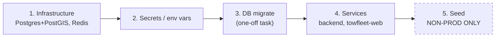

# 06 — Operations Runbook (Day-1 Bring-Up & Day-2 Operations)

**Audience:** the AWS engineer deploying and operating the Towing platform (TowFleet web console + shared NestJS backend).
**Scope today:** `apps/backend` (NestJS 11, port 4000, prefix `/v1`) and `apps/towfleet-web` (Next.js 15). The Expo mobile apps (`towgo`, `towpartner`) run on mocks and do **not** talk to the backend yet — they are out of deployment scope.
**Implementation status:** Phases 1–6 of `docs/TowFleet-Implementation-Plan.md` are complete (including the Socket.io realtime gateway and BullMQ workers, both running inside the API task). Phase 7 (money), 8 (hardening), 9 (AWS deploy) are pending. Everything below describes the system **as it exists today**, with Phase-9 translation notes.

---

## 1. Environment bring-up order

> **Before any bring-up:** establish what already exists in the AWS account — account ID(s), access mechanism, whether the CI GitHub secrets are populated, and an inventory of anything already provisioned. See [01 §8 "AWS account & existing state"](01-project-overview.md); nothing in the repo proves any AWS resource exists.

The order is not optional: services crash at boot if the env is invalid (`src/config/env.ts` parses every variable with Zod and throws), and the API assumes the schema exists.



### Step 1 — Infrastructure

| Component | Local (today) | AWS (Phase 9 target per plan) |
|---|---|---|
| Postgres 16 + PostGIS | `postgis/postgis:16-3.4` via `apps/backend/docker-compose.yml`, port 5432, user/pass/db `towfleet` | RDS Postgres 16 with PostGIS extension |
| Redis 7 | `redis:7` (appendonly), port 6379 | ElastiCache |
| Test stack | `--profile test`: ports 5433/6380, **tmpfs + fsync off** — throwaway | CI only, never deployed |

Local command (Docker Desktop must be running):

```bash
cd apps/backend && docker compose up -d --wait
```

### Step 2 — Secrets / environment variables

The backend parses these once at boot (`apps/backend/src/config/env.ts`); a missing or malformed value crashes the process with a readable report. Values below are the ones needed for bring-up — see `apps/backend/.env.example` for the local defaults.

| Variable | Required | Default | Notes |
|---|---|---|---|
| `NODE_ENV` | no | `development` | `development` \| `test` \| `production` |
| `PORT` | no | `4000` | Container port. NB: the placeholder `.aws/task-definition.json` maps port **3000** — must be fixed in Phase 9 |
| `LOG_LEVEL` | no | `info` | pino levels |
| `DATABASE_URL` | **yes** | — | `postgres://` URL |
| `DATABASE_POOL_MAX` | no | `10` | |
| `REDIS_URL` | **yes** | — | `redis://` or `rediss://` |
| `JWT_ACCESS_SECRET` | **yes** | — | ≥ 32 chars. `assertProductionSafety()` refuses to boot in production if it still contains `dev-only` (the checked-in sample) |
| `JWT_ACCESS_TTL_SECONDS` | no | `900` (15 min) | |
| `JWT_REFRESH_TTL_SECONDS` | no | `2592000` (30 d) | |
| `OTP_TTL_SECONDS` / `OTP_MAX_ATTEMPTS` | no | `300` / `5` | |
| `UPLOADS_DIR` | no | `var/uploads` | Disk storage adapter root; replaced by S3 in Phase 9 |
| `THROTTLE_DISABLED` | no | off | Test escape hatch — **never set in a deployed environment** |
| `CORS_ORIGINS` | no | `http://localhost:3000` | Comma-separated list; must include the web console origin |

Web console (`apps/towfleet-web/.env.example`):

| Variable | Read | Notes |
|---|---|---|
| `NEXT_PUBLIC_USE_MOCKS` | **build time** — inlined into the Next bundle | Must be `false` at `next build` time for a real deployment; changing it requires a rebuild, not a restart |
| `API_BASE_URL` | runtime, server-side only | Backend base URL used by the session routes + BFF proxy |

Generate a real JWT secret (comment in `.env.example`):

```bash
node -e "console.log(require('crypto').randomBytes(48).toString('base64url'))"
```

### Step 3 — DB migrate (one-off, before services)

```bash
pnpm --filter @towing/backend db:migrate     # = tsx src/db/migrate.ts
```

- Runner: `apps/backend/src/db/migrate.ts` — drizzle migrator, dedicated single connection (`max: 1`), applies pending migrations serially, records them in journal table `drizzle.__drizzle_migrations`, then exits (non-zero on failure).
- Migrations folder resolved relative to the script: `apps/backend/drizzle` — **this is the canonical migration source**. `Aws/migrations/` is a point-in-time copy and `Aws/db/schema-snapshot.sql` is a pg_dump schema snapshot (dated 03 Aug 2026); both are reference-only and will drift as new migrations land.
- Current journal: **8 migrations** — `0000_enable_postgis`, `0001_core_schema`, `0002_spatial_and_constraints`, `0003_fleet_credentials`, `0004_petite_richard_fisk`, `0005_aberrant_joshua_kane` (alerts + truck_imports), `0006_money_and_settings` (Phase 7 money domain), `0007_multi_realm_identity` (Phase 10 — admin/social tables, the `login_challenges` polymorphic-subject repair, `drivers.kyc_status` default → `incomplete`). **0004 through 0007 each carry a HAND-WRITTEN tail** (partial indexes, CHECK constraints and a column rename that drizzle-kit cannot emit) — do not regenerate any of them without re-adding it.
- Idempotent and non-interactive: safe to run on every deploy; a no-op when nothing is pending.

### Step 4 — Services

```bash
pnpm backend    # root script → pnpm --filter @towing/backend dev (nest start --watch)
pnpm fleet      # root script → pnpm --filter towfleet-web dev
```

Production process (backend): `pnpm --filter @towing/backend build` then `node dist/main.js` (the package's `start` script). Boot behavior (`src/main.ts`): global prefix `/v1`, CORS from `CORS_ORIGINS` with credentials, pino logger with buffered boot logs, and `enableShutdownHooks()` so SIGTERM closes the pg pool and Redis connections cleanly — ECS task draining exits clean instead of hitting the 30 s kill.

### Step 5 — Seed (NON-PROD ONLY)

```bash
pnpm --filter @towing/backend db:seed      # = tsx src/db/seed/index.ts
pnpm --filter @towing/backend db:reset     # same script with --reset
```

- Deterministic demo data: 2 fleets, 20 trucks + compliance docs, 12 drivers, 506 bookings, signed ledger rows — with **three SQL money invariants enforced at exit** (wallet = SUM ledger; commission + payout = total; ledger legs = payout).
- **Hard refusal in production** (`src/db/seed/index.ts`): `if (env.NODE_ENV === 'production') throw new Error('db:seed refuses to run with NODE_ENV=production')`. Do not attempt to work around this.
- Optional demo tooling: `pnpm --filter @towing/backend sim:locations` streams fake truck GPS into Redis (pub/sub + GEO) and lazily flushes Postgres — it stands in for the driver mobile app. **Demo/dev only, never production.**

### Translating steps 3 & 5 to ECS one-off tasks

The Implementation Plan (Phase 9) states migrations + seed run as **ECS one-off tasks** — the scripts are already env-driven and non-interactive, so the translation is `aws ecs run-task` with a command override:

```bash
aws ecs run-task \
  --cluster towing-cluster \
  --launch-type FARGATE \
  --task-definition <backend-task-def> \
  --overrides '{"containerOverrides":[{"name":"towing-backend-container","command":["<migrate command — see caveat>"]}]}' \
  --network-configuration '<same subnets/SGs as the service, DB-reachable>'
```

**Caveat that Phase 9 must resolve:** `db:migrate` and `db:seed` invoke `tsx`, which is a **devDependency** of `@towing/backend`. A production-pruned image will not contain it. Either (a) run the compiled output (`node dist/db/migrate.js`, which requires the `drizzle/` folder to be copied into the image at the path the script resolves — `../../drizzle` relative to the compiled file), or (b) keep `tsx` in the one-off task image. This choice is listed under Decisions Needed (§12). Run migrate as a one-off **before** flipping the service to the new task definition when a deploy includes new migrations.

### Environments & promotion

How many environments to run (dev/staging/prod vs staging/prod), single vs multi-account, and the promotion trigger (tag / manual approval / push-to-`main`) are business+engineer decisions — see [02 §7 decision 14](02-target-architecture.md) and the owners in [01 "Owners & contacts"](01-project-overview.md). One constraint is not negotiable: **a non-production environment is functionally mandatory before launch.** The deepest smoke test this runbook has (§3 check 4 — seeded login via the dev OTP adapter) **cannot run in production** until an SMS provider is wired, so a prod-only setup leaves the platform unverifiable end-to-end.

---

## 2. Backend command reference

All scripts from `apps/backend/package.json` (invoke as `pnpm --filter @towing/backend <script>` from repo root, or `pnpm <script>` inside `apps/backend`):

| Script | Command | Purpose | Runs in prod? |
|---|---|---|---|
| `build` | `nest build` | Compile to `dist/` | build stage |
| `dev` / `start:dev` | `nest start --watch` | Local dev server | no |
| `start` | `node dist/main.js` | **Production entrypoint** | yes |
| `typecheck` | `tsc --noEmit` | CI validate job | CI |
| `test` / `test:watch` | `vitest run` / `vitest` | 86 tests; needs the docker `--profile test` stack | CI/local |
| `db:generate` | `drizzle-kit generate` | Author a new migration (dev only) | no |
| `db:migrate` | `tsx src/db/migrate.ts` | Apply migrations | one-off task |
| `db:studio` | `drizzle-kit studio` | DB browser (dev only) | no |
| `db:seed` | `tsx src/db/seed/index.ts` | Demo data | **non-prod one-off only** |
| `db:reset` | `tsx src/db/seed/index.ts --reset` | Wipe + reseed | non-prod only |
| `sim:locations` | `tsx src/scripts/simulate-locations.ts` | Fake GPS feed | demo only |

Root convenience scripts (`package.json`): `pnpm backend`, `pnpm fleet`, `pnpm build` / `lint` / `typecheck` / `test` (turbo).

---

## 3. Post-deploy verification checklist

Run after every deploy, in order:

| # | Check | How | Pass criteria |
|---|---|---|---|
| 1 | API liveness | `curl -i https://<api>/v1/health` | `200` with `{"status":"ok","service":"towing-backend","time":"..."}` |
| 2 | Request correlation | Same response | `x-request-id` header present (middleware echoes/mints it) |
| 3 | Migration journal | `SELECT count(*) FROM drizzle.__drizzle_migrations;` | **= 8** (as of 06 Aug 2026 — increases as new migrations land; must equal the entry count in `apps/backend/drizzle/meta/_journal.json` of the deployed commit) |
| 4 | Login flow (non-prod, seeded) | Console → `lakshmi@recovery.in` / `Password123!` → OTP from the backend log → dashboard | Two-step login completes; browser holds only httpOnly `fleet_session` + `fleet_refresh` cookies |
| 5 | Dashboard KPIs | Post-login `/` route | KPI tiles + alert feed render with real (seeded) data, not mock placeholders |
| 6 | Mocks are off | View console page source / behavior | Data changes with the DB — if it doesn't, `NEXT_PUBLIC_USE_MOCKS` was not `false` at **build** time (rebuild required) |
| 7 | CORS | Browser devtools on the console origin | No CORS errors; `CORS_ORIGINS` includes the console origin |

**Important caveats:**

- `/v1/health` is a static liveness response (`src/modules/health/health.controller.ts`) — it does **not** probe Postgres or Redis. A `200` proves the process booted with valid env, not that dependencies are reachable. Check 4 is what exercises DB + Redis end-to-end.
- Check 4 **cannot pass in production** until an SMS adapter is wired: the OTP is never delivered there (see FAQ, §8). In production the deepest current smoke is checks 1–3 + a `401` from an authenticated route.

---

## 4. CI/CD — current state (`.github/workflows/production-deploy.yml`)

**Workflow:** "Production Deployment Pipeline". Triggers: push to `main`, PRs to `main`, manual `workflow_dispatch`.

| Job | State | What it does |
|---|---|---|
| `validate` | **Active** | pnpm 9 + Node 24 → `pnpm install` → `pnpm run lint` → `pnpm run typecheck`. Note: despite the job name ("Lint, Type-Check, and Test"), **no test step currently runs in CI** |
| `build-and-deploy-backend` | **Commented out — deliberate** ("PAUSED TO AVOID AWS BILLING DURING EARLY DEVELOPMENT") | Configure AWS creds → ECR login → `docker build -f apps/backend/Dockerfile` tagged with the git SHA → push → render `.aws/task-definition.json` with the new image → deploy to ECS with `wait-for-service-stability` |
| `deploy-web-amplify` | **Commented out** | Placeholder only (echoes that Amplify auto-deploys from `main` when connected) |

Workflow-level constants (already chosen): `AWS_REGION: ap-south-1`, `ECR_REPOSITORY: towing-backend`, `ECS_SERVICE: towing-api-service`, `ECS_CLUSTER: towing-cluster`, `ECS_TASK_DEFINITION: .aws/task-definition.json`, `CONTAINER_NAME: towing-backend-container`. Secrets expected: `AWS_ACCESS_KEY_ID`, `AWS_SECRET_ACCESS_KEY`.

**What Phase 9 re-enables / must fix before uncommenting:**

1. `apps/backend/Dockerfile` is a **placeholder** (`node:20-alpine`, `CMD ["node","-v"]` — it runs nothing). Phase 9 delivers real multi-stage Dockerfiles (`pnpm deploy` for the backend; Next `output: 'standalone'`).
2. `.aws/task-definition.json` is a **placeholder**: sample image `amazon/amazon-ecs-sample`, container port **3000** (the app listens on **4000**), 256 CPU / 512 MB, no env/secrets/log configuration.
3. Un-comment the two deploy jobs; the plan also calls for a turbo-pruned build, a migration one-off step in the pipeline, and DNS `fleet.towing.app`. The commented jobs also authenticate with static `AWS_ACCESS_KEY_ID`/`AWS_SECRET_ACCESS_KEY` secrets — replace with GitHub OIDC role assumption before re-enabling (see [05 §11 "IAM & deployment identity"](05-security-networking.md)).
4. ⚠️ **Align CI to the pinned toolchain before re-enabling deploys.** The `validate` job drifts from the repo on three counts: (a) it installs **pnpm 9** explicitly — drop the `version: 9` input so `pnpm/action-setup` reads `packageManager: pnpm@11.1.2` from the root `package.json`; (b) it sets **`node-version: '24'`** — set it to **20**, matching `engines.node >= 20` and the planned `node:20-alpine` runtime image; (c) despite the job name, **no test step runs** — add `pnpm run test` to `validate` using the docker-compose `test` profile (ports 5433/6380) that the 86-test suite expects.

---

## 5. Rollback strategy

**Application (ECS):** roll the service back to the previous task definition revision — task definitions are immutable and revisions are retained:

```bash
aws ecs update-service --cluster towing-cluster --service towing-api-service \
  --task-definition towing-api-service:<previous-revision>
```

**Database:**

- Migrations are **forward-only**. All 5 existing migrations are additive (extensions, tables, indexes, constraints, columns) — **no destructive migration exists yet**, so rolling the app back one version does not require a schema rollback today.
- **Policy: never edit an applied migration.** The drizzle journal records what ran; fixing a mistake means shipping a **new** forward migration. This also keeps `Aws/migrations/` meaningful as a snapshot.
- Once destructive or backwards-incompatible migrations appear (Phase 7+ money work is the likely first case), adopt expand/contract: deploy N must run against schema N-1, or the migration one-off and service flip must be coordinated. Until then, app rollback is always safe.
- Last-resort schema recovery reference: `Aws/db/schema-snapshot.sql` (03 Aug 2026 pg_dump) — reference only; RDS point-in-time restore is the real recovery mechanism (see §10 Backup & DR).

---

## 6. Observability

### Today

| Signal | Implementation | AWS mapping |
|---|---|---|
| Logs | pino via `nestjs-pino`, NDJSON to stdout, credential redaction, buffered boot logs | `awslogs` driver → CloudWatch Logs; filter/metric on `level >= 50` (error) |
| Correlation | `x-request-id`: inbound header accepted if it matches `^[A-Za-z0-9._:-]{8,128}$`, else a fresh UUID; stamped on every log line and echoed as a response header (`src/common/logging/request-id.middleware.ts`) | CloudWatch Logs Insights: `filter req.id = "<id>"` reconstructs one request across all lines |
| Health | `GET /v1/health` (static liveness, no dependency probe) | ALB target-group health check path `/v1/health`; Route 53/Synthetics canary for availability |
| Graceful shutdown | `enableShutdownHooks()` closes pg/Redis on SIGTERM | Clean ECS task draining on deploys |

### Added in Phase 8 (shipped)

| Signal | Implementation | Caveat |
|---|---|---|
| Metrics | `GET /v1/metrics` (prom-client): `http_request_duration_seconds{method,route,status}` with 0.2 s and 0.5 s buckets so the §19.1 p95/p99 read straight off a bucket; `http_request_db_seconds{route}` and `http_request_db_queries{route}`; `throttler_rejections_total{bucket}`; plus default metrics for **event-loop lag**, the best leading indicator for the latency SLO. `route` is always the Nest route PATTERN, never a concrete URL | **Nothing scrapes this yet** — see below. Unauthenticated unless `METRICS_TOKEN` is set, and excluded from the access log |
| Slow queries | Every statement is timed by a `Proxy` over the postgres.js client; anything at or above `DB_SLOW_QUERY_MS` (default 200, the §19.1 p95 budget) logs at `warn` with the request id and the truncated SQL | **Parameters are never logged** — they carry names, phone numbers and money |
| Per-request DB time | `dbMs` and `dbCalls` on every access-log line, carried on an `AsyncLocalStorage` | Answers "is this endpoint database-bound?" from a log query |
| Error reporting | `ErrorReporterPort` with a noop and an `@sentry/node` adapter, bound by `SENTRY_DSN`; fires on 5xx only and shares the logger's redaction list | Needs a Sentry project — `ToBeDoneEhsan.md` |

**⚠ Nothing scrapes `/v1/metrics` today.** There is no AMP, no ADOT collector and no Grafana in this
plan, so latency observability in AWS is still ALB metrics plus CloudWatch Logs. The endpoint's real
present value is making a k6 run *interpretable*. Choosing the production path — AMP + Grafana, an
ADOT sidecar writing CloudWatch EMF, or dropping prom-client for `aws-embedded-metrics` — is a cost
and vendor decision recorded in `ToBeDoneEhsan.md`. Do not let this endpoint pass for monitoring
until one is made.

### Measured baseline (Phase 8, 06 Aug 2026)

One laptop, one API process, `DATABASE_POOL_MAX=10`, seed ×10 (~5,000 bookings). **The knee is ~25
concurrent console sessions (~95 rps): p95 90 ms at 10 VUs, 191 ms at 25, 431 ms at 50.** It is
database-bound, not CPU-bound — `/fleet/trucks` and `/fleet/drivers` issue 4 statements each and
exhaust the pool first, while the Redis-cached `/fleet/dashboard` passes at every level. So the
sizing lever is task count and `DATABASE_POOL_MAX`. Full method and numbers in `docs/load-testing.md`.

### Suggested CloudWatch alarms mapped to spec §19.1 SLOs

The spec (§19.1) requires SLOs "dashboarded from day one". Applicable now vs. later:

| SLO (spec §19.1) | Target | Suggested alarm (source metric) | When |
|---|---|---|---|
| API availability (core paths) | 99.9% during operating hours | ALB `HTTPCode_Target_5XX_Count` / `RequestCount` ratio; plus a Synthetics canary on `/v1/health` | **Day 1** |
| API latency | p95 < 200 ms, p99 < 500 ms | ALB `TargetResponseTime` p95 > 0.2 s and p99 > 0.5 s (5-min windows) | **Day 1** |
| Realtime propagation | ≤ 2 s p95 | `pnpm --filter @towing/backend smoke:realtime` reports client and relay p95 from instrumented ping/emit timestamps and exits non-zero over budget. Phase 8, at the §19.1 target scale: **relay p95 840 ms / client p95 971 ms**, 100 clients / 500 trucks over two gateway processes **with a reconnect storm every 20 s** (§19.7), 0.00 % loss and 0 duplicates over 2.9 M positions. Most of that is the 1 s batch window (`REALTIME_FLUSH_MS`), not transport | **Wire to CloudWatch** — gate on the *relay* number (`emittedAt − pingAt`); the client number assumes one clock |
| Payment success rate | > 97% | Razorpay webhooks vs attempts | After Phase 7 |
| OTP delivery | < 10 s | MSG91 delivery receipts | After SMS adapter is wired |
| Crash-free sessions | ≥ 99.5% | Sentry | Phase 8 / mobile |
| Payout SLA | < 24 h | Ledger timestamps | After Phase 7 |

Day-1 infrastructure alarms worth adding regardless of SLOs: ECS `RunningTaskCount` < desired; RDS `FreeStorageSpace`, `CPUUtilization`, `DatabaseConnections` (pool max is 10 per task by default); ElastiCache `CurrConnections` / evictions; CloudWatch Logs metric filter on pino `level:60` (fatal) and on the production OTP error line (see FAQ — it indicates a misconfigured deployment).

---

## 7. Operational gotchas

**Engineering notes from `docs/TowFleet-Implementation-Plan.md` (hard-won, do not regress):**

1. Backend build uses `tsconfig.build.json` with its buildinfo **inside `dist/`** — typecheck and build must never share incremental state or `dist` comes out half-empty.
2. `@towing/api-contracts` serves TS source via the `import` condition and compiled CJS via `require` — run `turbo build` after editing contracts or the compiled backend sees stale code.
3. Express 5 route patterns: `'{*splat}'`, never `'*'` (middleware and nestjs-pino `forRoutes`).
4. Raw drizzle `sql` fragments bypass column mapping — pass `date.toISOString()`, never a bare `Date` (postgres.js Bind throws).
5. drizzle-kit emits `DESC NULLS LAST` indexes; queries must order `desc nulls last` explicitly to stay sortless.
6. `next dev` clobbers the production `.next` — rebuild before `next start`/Playwright.
7. `@towing/theme`'s root entry imports react-native; web code imports **only** `@towing/theme/tokens`.

**Additional operational gotchas:**

8. **Docker Desktop must be running** for any local backend work — DB, Redis, and the test stack all come from `apps/backend/docker-compose.yml`.
9. **The test stack is tmpfs** (`--profile test`, ports 5433/6380, fsync off) — all data vanishes on container restart. By design; never point anything durable at it.
10. **The simulator (`sim:locations`) is demo tooling** standing in for the driver mobile app. Never run it against production.
11. **`NEXT_PUBLIC_USE_MOCKS` is inlined at build time.** A console image built with mocks on serves mock data forever no matter what env you set at runtime. `API_BASE_URL` by contrast is read at runtime, server-side.
12. **BFF refresh serialization is per-process.** The Next proxy serializes token refresh per refresh token, but only within one process — running multiple `towfleet-web` instances risks parallel refreshes tripping refresh-token family reuse-detection (force-logout). Until Phase 8 solves it (sticky sessions or a shared lock), run a single web instance or enable ALB stickiness for the console.
13. **`apps/backend/Dockerfile` and `.aws/task-definition.json` are placeholders** (see §4) — nothing currently in the repo produces a runnable production image.
14. **Seed refuses `NODE_ENV=production`** and demo credentials exist only where seed has run.
15. **Production boot refuses the sample JWT secret** — `assertProductionSafety()` throws if `JWT_ACCESS_SECRET` contains `dev-only`.

---

## 8. FAQ

**Where are the demo credentials?**
Created by the seed (non-prod only): `lakshmi@recovery.in` or `ops@chennaihighwayrescue.in`, password `Password123!` (per `docs/TowFleet-Implementation-Plan.md`). They never exist in production because the seed refuses to run there.

**Where does the login OTP go?**
Login is two-step: email + password, then an OTP challenge.
- **Dev/test:** `DevOtpAdapter` (`apps/backend/src/modules/auth/dev-otp.adapter.ts`) logs a warn line to the backend log: `DEV OTP (<purpose>) for <phone>: <code>`. Locally that is the `pnpm backend` terminal; on a deployed non-prod environment it is CloudWatch Logs.
- **Production:** the adapter deliberately does **not** log the code (a log sink is read by more people than the phone's owner). It logs an **error** — `No SMS provider is wired: the <purpose> code for <masked phone> was generated but not delivered` — and delivers nothing. **Production login cannot complete until a real SMS adapter (MSG91 per spec) is wired behind `OtpPort`.** Treat that error line in production logs as a misconfiguration alarm, not noise.

**Which migrations are canonical?**
`apps/backend/drizzle/` (with `meta/_journal.json`) — applied by `pnpm db:migrate`. `Aws/migrations/` and `Aws/db/schema-snapshot.sql` are point-in-time snapshots for the AWS engineer's reference (03 Aug 2026) and are not executed by anything.

**How do I wipe and re-create demo data?**
`pnpm --filter @towing/backend db:reset` (non-prod only). Deterministic — same data every run, with money invariants verified at exit.

**Does the health endpoint check the database?**
No — it returns static JSON. Use it for liveness (ALB health checks); use the login flow or a DB query for readiness.

**What port does the backend listen on?**
`PORT` env, default **4000** (`src/config/env.ts`). The placeholder ECS task definition says 3000 — fix it before enabling deploys.

---

## 9. Deploy-day quick sequence (once Phase 9 lands)

1. Merge to `main` → `validate` passes → image built → pushed to ECR (`towing-backend`, tag = git SHA).
2. If the release contains new migrations: run the migrate one-off ECS task; confirm exit 0 and journal count increased.
3. New task definition revision deployed to `towing-api-service` on `towing-cluster` (`wait-for-service-stability`).
4. Run the verification checklist (§3).
5. Problems → roll back to the previous task definition revision (§5). Migrations stay (additive).

## 10. Backup & DR

Referenced from [03 §10 decision 6](03-database.md). None of the numbers below exist yet — they are business decisions (§12), but the facts that shape them are repo-verifiable:

**What the repo establishes today:**

- **Postgres is the sole source of truth.** Sessions/refresh tokens, OTP challenges, and the money ledger all live in Postgres; Redis holds only cache, idempotency markers, and location pub/sub. **Losing Redis WAS tolerable** (degraded idempotency falls back to DB unique constraints; cache repopulates). **As of Phase 6 it is not:** BullMQ queues live on Redis, so a flush loses queued bulk imports and the failed-job DLQ. The compliance sweep survives (idempotent, re-runs hourly); an in-flight import does not, and shows as `processing` forever. Enable ElastiCache persistence/Multi-AZ, or accept re-uploading.
- **Migrations are forward-only and additive** (all 5 to date), so the recovery story is coherent: RDS point-in-time restore, then re-run `db:migrate` (idempotent) — no schema rollback choreography exists or is needed yet.
- **The generated CDK never wires backup retention:** `rdsBackupRetentionDays` (1/3/14 per env) is defined in its config but never passed to the `DatabaseInstance` — see [02 §6.2 gap 11](02-target-architecture.md). Set retention explicitly in Phase 9.

**Decisions needed (→ §12, ratified per [01 "Owners & contacts"](01-project-overview.md)):**

| Decision | Notes |
|---|---|
| RPO / RTO per environment | Nothing in the repo states a number; spec §19 SLOs cover latency/availability, not recovery |
| Backup retention days | Per environment; must then actually be wired into the infra (gap above) |
| Cross-region copies: yes/no | Interacts with the regulatory inputs in [05 §12](05-security-networking.md) — DPDP/RBI may prohibit DR outside India |
| Acceptable Redis data-loss window | **Now live** — BullMQ (Phase 6) made Redis durable state. Decide persistence/Multi-AZ, and alarm on `deadLettered` from `GET /v1/health/queues` |

Once retention is set, **schedule a periodic restore drill** (restore the latest PITR to a scratch instance, run `db:migrate`, run §3 checks 1–3) so the recovery path is exercised, not assumed.

## 11. Operator access to the data tier

Every SQL/Redis check in this runbook presumes a human can reach the data tier: the migration-journal count (§3 check 3), the seed/reset one-offs (§1 step 5), and refresh-token forensics ([05 §1.4](05-security-networking.md) — `user_agent`/`ip` are recorded per token row for exactly this). `drizzle-kit studio` is dev-only (§2). No mechanism exists yet, and the constraint is fixed: **the data subnets are isolated by design — the access path must reach them without giving them an internet route.**

**Decisions needed (→ §12):**

| Decision | Options / notes |
|---|---|
| Mechanism | **SSM Session Manager port-forward** via a small bastion instance or ECS task (no inbound ports, IAM-audited) vs **ECS Exec** into the backend service task (has DB/Redis access already) vs **client VPN**. All three respect subnet isolation; pick one deliberately |
| Who is authorized | Named principals, per environment — production access should not equal staging access |
| Audit requirement | Session logging (SSM/ECS Exec can log to CloudWatch/S3) — decide whether it is mandatory before the first production incident, not after |

## 12. Decisions needed from the AWS engineer

Genuinely undecided — do not treat any value here as chosen except where noted:

| Decision | Notes |
|---|---|
| One-off task runtime for migrate/seed | `tsx` is a devDependency: keep it in the image, or run compiled `dist/db/migrate.js` with the `drizzle/` folder copied to the matching relative path (Phase 9 Dockerfile decision) |
| Region confirmation | CI workflow assumes `ap-south-1`; confirm as the committed region |
| Instance/task sizing | Placeholder task def says 256 CPU / 512 MB — not a validated size. RDS/ElastiCache classes unspecified (spec §19.6 says 3× expected peak headroom) |
| RDS backup/PITR retention & Multi-AZ | Spec requires Multi-AZ in production (§19.2/§19.6); retention window is unset — full decision set in §10 Backup & DR |
| Connection pooling | Spec suggests PgBouncer/RDS Proxy (§19.6); app-side pool is `DATABASE_POOL_MAX` (default 10) per task |
| Secrets Manager vs SSM Parameter Store | Phase 9 plan says Secrets Manager; wiring into the task definition is unbuilt |
| ALB idle timeout ≥ 75 s | **Required now** — the Phase 5 gateway heartbeats every 25 s and the ALB's 60 s default would cull quiet-but-alive sockets. Handshake stickiness is *not* required: the gateway is WebSocket-only, so there is no polling handshake to pin |
| Console hosting | Commented CI job assumes Amplify; the Phase 9 plan says ECS Fargate for `towfleet-web` + CloudFront — reconcile |
| CloudWatch log retention & alarm destinations | Unset; SNS/pager wiring is greenfield |
| Domain/DNS | Plan names `fleet.towing.app` for the console; API domain undecided |
| Backup & DR numbers | RPO/RTO per env, retention days, cross-region copies, Redis loss window — see §10 |
| Operator access to the data tier | Mechanism, authorized principals, audit requirement — see §11 |

> Decisions in this table are ratified by the owners listed in [01 "Owners & contacts"](01-project-overview.md) — all currently TBD.

---

_Last updated: 03 Aug 2026 · Sources: apps/backend/package.json, apps/backend/docker-compose.yml, apps/backend/src/main.ts, apps/backend/src/config/env.ts, apps/backend/src/db/migrate.ts, apps/backend/src/db/seed/index.ts, apps/backend/src/modules/health/health.controller.ts, apps/backend/src/modules/auth/dev-otp.adapter.ts, apps/backend/src/common/logging/request-id.middleware.ts, apps/backend/drizzle/meta/_journal.json, apps/backend/.env.example, apps/backend/Dockerfile, apps/towfleet-web/.env.example, .github/workflows/production-deploy.yml, .aws/task-definition.json, package.json, infrastructure/deploy-all.sh, docs/TowFleet-Implementation-Plan.md, docs/Towing-Project-Specification_v3.md §19.1, Aws/db/schema-snapshot.sql, Aws/migrations/_

