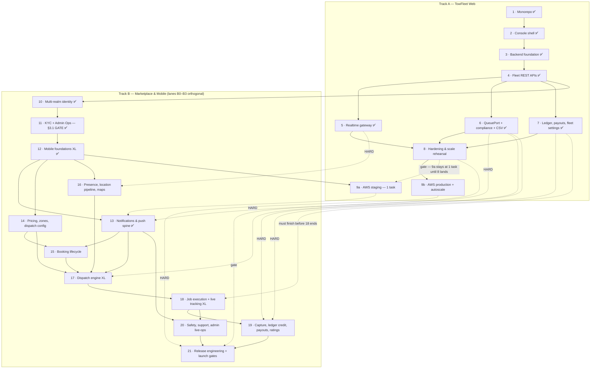

# TowFleet — Implementation Plan & Progress (V2)

> **This document supersedes [TowFleet-Implementation-Plan.md](./TowFleet-Implementation-Plan.md) (V1) as the working document.** Track A carries over unchanged; Track B is re-homed into ownership lanes **B0–B3** with phase numbering **10–21** preserved. Nothing was dropped — Appendix A maps every V1 content unit to its V2 home.

**Scope:** two tracks over one backend. **Track A** = TowFleet Web Console (fleet-owner web app, spec §8.3/§9.3) + the shared NestJS backend that powers it (spec §15–§17). **Track B** = the marketplace and the two mobile apps (TowGo customer §9.1, TowPartner driver §9.2) plus the minimum Admin Ops surface (§9.4) they cannot function without — organized in V2 as one shared spine (**B0**) and three surface lanes (**B1 TowGo · B2 TowPartner · B3 Admin Ops**).
**Source of truth for product behavior:** [Towing-Project-Specification_v3.md](./Towing-Project-Specification_v3.md).
**Status (20 Aug 2026, after Phase 17):** Track A phases 1–8 complete and verified · **the Phase 8 deploy gate is released** (Redis throttler storage + shared refresh fix, both proven across two instances), though two further items belong on it — see Phase 8 · Track A phase 9a next · **Track B Phases 10 (multi-realm identity), 11 (KYC + minimal Admin Ops, the §3.1 gate), 12 (mobile foundations), 13 (notifications spine), 14 (pricing engine, service catalog, zone & dispatch config) and 15 (booking lifecycle & the §5.1 state machine) are all COMPLETE** — the backend serves four auth realms, the §3.1 supply-side gate is real end to end (a driver can submit KYC, an admin can approve it through a working console, and the driver's own app now enforces the same gate on the online toggle), both TowGo and TowPartner run real sign-in, real network and real on-device storage instead of mocks, the §12.2 trigger matrix has a registry plus a test that fails on an unregistered row, the §7 fare engine prices from admin-editable config behind a 5–10 % commission guardrail, and a customer can create a real booking that locks its fare and commission, mints a hashed collection OTP and legitimately sits in `SEARCHING`. **Phase 16 (driver presence, the location pipeline & mobile maps) is COMPLETE** — §6.1's candidate store exists and is written by every ping, an approved driver goes online through the §3.1 gate and streams location over two doors into one pipeline, the Phase 5 fleet map shows a real human through a fan-out adapter that left `<FleetMap>` untouched (proven across two gateway processes), the customer can finally TYPE AN ADDRESS and drop a pin, and `/drivers/nearby` serves anonymous coarsened supply. **Phase 17 (the dispatch engine) is COMPLETE** — the loop is closed: a booking in `SEARCHING` now runs a progressive-radius search, offers to scored eligible drivers over the `/driver` socket and a high-priority push, and assigns exactly one of them in a four-check transaction backed by a partial unique index; the customer watches real wave transitions on a new `/customer` namespace instead of a timer; `drivers.acceptance_rate` has its first writer, so a quarter of the §6.2 score stops running on frozen seed values; and dispatch config plus §19.8's kill switches are editable without a deploy. Measured against §6.10's p50 < 30 s target, a live bench run assigned every booking at **p50 0.9 s / p90 3.2 s**. Track A phase 9a (staging) is next for Track A; **Phase 18 (job execution & live tracking) is next for Track B**. Track B was never blocked on Track A: Phases 5, 6 and 7 have all landed, so the 16/13/17/19 interlocks are met.

**How to read V2.** Phases **10–21** are the *execution sequence*, unchanged from V1 — the dependency graph, the track-interlock table and the external-dependencies table all reference them, and none of it is renumbered. Lanes **B0–B3** are *ownership*, orthogonal to sequence: **B0** is the shared spine (work serving two or more surfaces, plus pure platform), **B1** is TowGo (customer app), **B2** is TowPartner (driver app), **B3** is Admin Ops (API + `/admin/*` web UI inside `apps/towfleet-web`). Every Track B work item is tagged `[PNN]` and lives in exactly one lane; where an engine and its thin route/UI split across lanes, the semantics are stated once in the engine's lane and the consumer carries a cross-reference. Each phase has one **canonical block in B0** carrying its Goal, Spec targets, Depends on, Effort, status and cross-surface acceptance chain, plus a slice index; the B1/B2/B3 *slices* carry only that surface's work and surface-local verification. A slice of Phase N obeys Phase N's dependencies — lanes never alter the order.

### Track A — TowFleet Web (fleet SaaS)

| Phase | Deliverable | Status |
|---|---|---|
| 1 | Monorepo & workspace scaffolding | ✅ Complete |
| 2 | Console shell + design system + full mock-mode UI | ✅ Complete |
| 3 | Backend foundation: DB, auth, tenancy, seed & simulator | ✅ Complete |
| 4 | Core fleet REST APIs + console goes real | ✅ Complete |
| 5 | Realtime: live fleet map, KPI deltas, presence | ✅ Complete |
| 6 | Compliance engine + bulk CSV import | ✅ Complete |
| 7 | Money: earnings, split, payouts, reports **+ fleet settings & Route onboarding** | ✅ Complete |
| 8 | Hardening & scale rehearsal | ✅ Complete |
| 9 | AWS deployment (**executes in two stages — see Track interlock**) | ⬜ Planned |

### Track B — Marketplace & Mobile (TowGo + TowPartner + Admin Ops)

| Phase | Deliverable | Effort | Lanes | Status |
|---|---|---|---|---|
| 10 | Multi-realm identity: customer + driver + admin auth | M | **B0** (+ B3 stub) | ✅ Complete |
| 11 | Driver KYC pipeline + minimal Admin Ops console (**the §3.1 gate**) | L | B0 · B2 · B3 | ✅ Complete |
| 12 | Mobile foundations: both apps stop being mocks | **XL** | B0 · B1 · B2 | ✅ Complete |
| 13 | Notifications & push spine (FCM/APNs, SMS, WhatsApp, SES) | **L** | B0 · B1 · B2 | ✅ Complete |
| 14 | Pricing engine, service catalog, zone & dispatch config | M | B0 · B1 · B3 | ✅ Complete |
| 15 | Booking lifecycle & the §5.1 state machine | L | B0 · B1 | ✅ Complete ² |
| 16 | Driver presence, the location pipeline & mobile maps | L | B0 · B1 · B2 | ⬜ Planned |
| 17 | Dispatch engine (progressive-radius) | **XL** | B0 · B1 · B2 · B3 | ⬜ Planned |
| 18 | Job execution, live tracking & share trip | **XL** | B0 · B1 · B2 | ⬜ Planned |
| 19 | Money: capture, ledger credit, earnings, payouts, ratings | L¹ | B0 · B1 · B2 · B3 | ⬜ Planned |
| 20 | Safety, support, admin live-ops & the long tail | M | B0 · B1 · B2 · B3 | ⬜ Planned |
| 21 | Mobile release engineering & launch gates | L | B0 · B1 · B2 | ⬜ Planned |

¹ **L, now settled: Track A Phase 7 has landed**, so Phase 19 extends an existing ledger rather than absorbing one. It would have been XL otherwise — see Phase 19 · B0.

² **The carve-out is CLOSED as of Phase 16.** The Places/geocoding proxies and TowGo's address autocomplete + draggable map pin did not ship with Phase 15 and were re-homed to Phase 16, which is where a real map first exists. All three shipped there — on a local gazetteer, since no Places key exists yet. See Phase 15 · B1 and Phase 16 · B1.

**Why a second track and not phases 10–21 of one list.** Track A is a tenant-scoped CRUD console over data the seed and simulator fabricate. Track B is a two-sided realtime marketplace whose correctness bar is different in kind (never double-assign, never credit an uncaptured payment, never let an unapproved driver receive a job). They share the backend process, `packages/api-contracts`, the theme bridge and the ledger — but their dependency graphs barely interleave, so splitting them keeps Track A independently shippable, keeps existing numbering stable, and lets the two tracks run in parallel with the small, explicit set of interlocks below. V2 additionally re-homes Track B's work into ownership lanes **B0–B3** without renumbering anything: phases remain the execution sequence every table and the graph below reference; lanes say who owns each slice of a phase.

**Sequenced by the supply gate, not by app.** §3.1 makes admin KYC approval a hard gate: no approved driver → no online driver → no dispatch candidate → every customer screen after "Confirm Booking" is unreachable. The order is therefore forced: identity → KYC + admin approval surface → mobile apps can authenticate → notifications → pricing → booking → presence → dispatch → tracking → money → safety → launch. The flashiest work (dispatch, tracking) sits deliberately late because nothing testable can precede the gate. The lanes do not alter this order — a B1 slice of Phase 15 still cannot start before Phase 15's dependencies (12, 14) are met.

---

## Dependency graph



*Nodes are phases — the execution sequence, unchanged from V1. Ownership lanes B0–B3 are orthogonal to this graph: see the **Lanes** column in the Track B table above and the slice index at the top of each lane section.*

---

## Track interlock — what Track B needs from Track A

| Track A phase | Needed by | Hard or soft | Why |
|---|---|---|---|
| **5** ✅ — Socket.io gateway + `@socket.io/redis-adapter`, room scoping, REST-resync discipline | **16** (B0 pipeline / B2 ingress) | **Hard** | Every Track B event (`job:offer`, `location:update`, `booking:status`, `search:progress`, `eta:update`, `sos:alert`) rides this transport. The `/fleet` namespace generalizes; the adapter, handshake auth and the "never trust socket completeness" rule do not get rebuilt. **Landed** — see Phase 5 below, in particular the `.local` relay rule: Phase 17's `job:offer` to `driver:{id}` is the case that must NOT use it. |
| **6** ✅ — `QueuePort` + BullMQ adapter *(first bullet of Phase 6 only)* | **13, 17, 19** (all B0) | **Hard — LANDED** | §12.3 requires queue-backed notification fan-out with retries and a DLQ (13). Dispatch's 20 s offer timers and wave state must be durable and single-owner across N tasks (17). Phase 19's 5-minute reconciliation sweep and webhook retry must be single-owner too — `setInterval`/`@Cron` on N tasks runs the sweep N times against the same uncaptured payment (19). **Landed in Phase 6**: `bullmq ^5.81.3` is installed and `QueuePort` exposes `enqueue`/`schedule`/`process`/`stats`. `@nestjs/schedule` is deliberately NOT used — BullMQ repeatable jobs deduplicate by schedule key in Redis, so N tasks give one timer, which is exactly the single-owner property these three phases need. Phase 6's *compliance worker and CSV import* are **not** prerequisites and may slip past Track B. |
| **7** ✅ — `LedgerService` (sole `wallet_transactions` writer), split math, `PayoutProviderPort` + Razorpay Route adapter, fleet Route linked-account onboarding | **19** (B0 money core) | **Hard — LANDED** | Phase 19 extends this; it must not duplicate it. Two ledger writers is not a survivable state — `db/ledger/sole-writer.spec.ts` now fails the build if a second one appears. **The scheduling gate is met**, so Phase 19 starts against an existing ledger and stays L rather than XL. What generalizes with no migration: `LedgerService.post` (owner is a parameter), `payout_accounts` and `payouts` (both keyed `(owner_type, owner_id)`), `PayoutProviderPort` (`ownerType` on every call) and the webhook. What Phase 19 adds: capture → `creditBookingSettlement`, driver payouts, and the §9.4.10 Finance approval queue. |
| **8** — Redis-backed `ThrottlerStorage`, multi-instance statelessness audit, BFF refresh lock | **9a scale-out, 21** | **Hard for 9a > 1 task and for 21**; soft for day-to-day Track B development | `throttler.config.ts` documents in its own comment that the default store is per-process and that "with N instances behind the load balancer the effective limit becomes N x the configured one". Phase 10's bespoke Redis window covers only `/auth/otp/send`; the `money` (20/min) and `reads` (120/min) buckets and the BFF refresh serialization stay per-process until Phase 8. **Therefore 9a's ECS service is pinned to `desiredCount: 1` and may not be raised until Phase 8's Redis `ThrottlerStorage` and the shared BFF refresh lock have landed.** That pin is a written deploy gate, not a convention. |
| **9** — AWS deployment | **see below** | Split | — |

**Phase 9 executes in two stages.**

- **9a (staging), executed between Phase 12 and Phase 13.** ECS Fargate + ALB (WS sticky, idle ≥ 75 s) at **`desiredCount: 1`** (see the Phase 8 row), RDS Postgres 16 + PostGIS, ElastiCache, S3 SSE-KMS with pre-signed URLs behind the existing `StoragePort`, a real HTTPS origin and a `staging.towing.app` DNS record. Pulled forward for three reasons: APNs/FCM device testing wants a reachable origin; Razorpay webhooks and the public share-trip page need public HTTPS; and Expo dev clients on cellular cannot reach a laptop.
  **On presigning being "built twice": it is not.** Phase 11 (B0) ships `presignPut`/`presignGet` on `StoragePort` with a **disk** implementation, and that disk implementation is the **permanent local-development path** — `pnpm db:seed` + `pnpm backend` must keep working with no AWS account, forever, exactly as `LogNotificationAdapter` and `DevOtpAdapter` do for their ports. 9a adds an S3 SSE-KMS adapter behind the same two methods. That is an adapter swap, which is the entire reason the port exists.
- **9b (production), executed before Phase 21.** CloudFront, WAF, Secrets Manager, CloudWatch alarms on §19.1 SLOs, GitHub Actions ECR → ECS rolling deploy, `api.towing.app` / `fleet.towing.app`, **plus the whole of §19.6** (see Phase 9b below).

Track B **development** is not blocked by 9a — Expo dev clients over LAN plus a tunnel for webhooks cover it. Track B **acceptance** is blocked by it: device testing on cellular, real webhook delivery, store review, and the §19.7 load/chaos gates all require the deployed environment.

---

## Guiding decisions (locked)

| Decision | Choice | Why |
|---|---|---|
| Shared contracts | `packages/api-contracts` — Zod schemas, TS source for web/tsx/vitest via `import` condition, compiled CJS `dist/` for the built backend via `require` condition | One source of truth, runs in Nest pipes and browser forms; no codegen |
| ORM | Drizzle + plain SQL migrations | SQL-first fits PostGIS (`geography` customType, GIST), natural keyset pagination, no native binaries |
| Background jobs | BullMQ behind a `QueuePort` (Phase 6) | Redis already required; SQS/EventBridge becomes an adapter swap on AWS |
| Web map | MapLibre GL JS behind a `<FleetMap>` seam (Phase 5) | Always-open ops map is expensive on Google JS billing; mobile keeps Google per spec |
| Money | Ledger-first (§14): append-only signed `wallet_transactions`, unique idempotency keys, `wallets.balance` = SUM projection. API speaks **integer paise**; DB stores NUMERIC(12,2) rupee strings; `rupeeStringToPaise`/`paiseToRupeeString` are the only bridge | Float never touches money |
| Tenancy | `fleet_id` only from the verified JWT (`@CurrentFleet()` → branded `FleetId`); every repo method takes it as first arg; `FleetScopeGuard` rejects client-supplied foreign fleet ids | Tenant boundary is a compile error + runtime rejection |
| Sessions | Separate fleet auth realm (§15.2): email+password → OTP challenge → JWT (15 min) + rotating refresh tokens with family reuse detection. Browser holds only httpOnly cookies; the Next BFF proxy injects bearers | Tokens never reach client JS |
| Mock/real switch | Every web feature has a `DataSource` interface with mock + REST implementations behind `NEXT_PUBLIC_USE_MOCKS` (mirrors the mobile apps' seam) | Console demos with zero infrastructure, forever |
| Deploy target | **AWS** (§15): ECS Fargate + ALB (WS sticky), RDS Postgres+PostGIS, ElastiCache, S3 SSE-KMS, SQS/EventBridge, CloudFront — executed in Phase **9a (staging, after Phase 12) and 9b (production, before Phase 21)**; all vendor touchpoints behind ports today | Adapter swap, not rewrite |

## Track B — guiding decisions (locked)

| Decision | Choice | Why |
|---|---|---|
| Admin surface, minimum viable | **Routes inside `apps/towfleet-web` under `/admin/*`** with an `admin_session` realm-prefixed cookie — not a new Next app. Phase 11 ships the KYC queue + capability toggle + audit log; Phase 14 ships the pricing/commission config API; Phase 17 ships dispatch-config; Phase 19 adds the Finance payout queue; Phase 20 adds SOS, the dispatch inspector, live-ops and the thin config forms — in V2 this inventory is lane **B3**, each item tagged by its phase | Phase 2 already shipped the realm-prefixed cookie + `middleware.ts` coexistence seam for exactly this (§4.1); the BFF proxy, `web-ui` kit, theme and DataSource convention are reusable verbatim; `api-contracts/src/admin/` is an empty placeholder waiting. A second Next app duplicates the shell for zero pre-launch value. Only the KYC queue must be human-operable every booking-day |
| Auth realms | Four realms over one parameterized `TokenService`: `fleet` (exists), `customer`, `driver`, `admin`. `realm` becomes a **parameter** of mint/rotate/logout, not a compile-time constant | `refresh_tokens.realm`/`subject_id` (FK-free, already polymorphic) and `otpPurposeEnum` (`fleet_login`/`driver_login`/`customer_login`/`booking_start`) were built realm-agnostic in Phase 3. `login_challenges` was **not** — it is fixed in migration 0005, see Phase 10 |
| Dispatch execution model | **Durable + single-owner**: BullMQ delayed jobs (Phase 6 `QueuePort`) + a Redis lock per booking + wave state persisted on the booking row. Never in-process `setTimeout` | Over N stateless Fargate tasks, in-process timers produce **double-assignment** — two drivers against one fare-locked booking — which corrupts the ledger rather than degrading UX. §19.7's game day kills a task mid-dispatch and expects resumption |
| Degraded paths | Every degradation-ladder branch (§19.2) is written **in the same commit** as its primary: Redis GEOSEARCH + PostGIS `ST_DWithin` fallback; Directions + Haversine ETA; socket + 10 s REST polling; Razorpay + `COMPLETED (unpaid)`. The *detector* — timeouts, bounded retries with jitter, circuit breakers (§19.3) — is a single shared `ExternalCallPolicy` built in Phase 14 | Retrofitting the fallback later means rewriting the matcher and both mobile clients. A ladder that has never executed is not a ladder — and a ladder with no breaker never trips |
| Driver liveness | **Ping freshness, not socket connectivity.** A driver whose last location ping is > 15 s old is excluded from dispatch | Stale GPS is phantom supply — a connected socket with a frozen position is worse than an absent driver |
| Mobile money types | Integer paise over the wire everywhere; both apps' `formatINR` becomes paise-in/rupee-out **before** any real data flows | Both apps currently carry rupee floats. Displayed commission math must reconcile to the paisa against the ledger (§9.2.4 AC) — float rounding makes that assertion unpassable |
| Mobile runtime | **EAS dev-client builds become the default runtime from Phase 12.** `expo-dev-client` is already a dependency in both apps and both `eas.json` files already carry `development` / `preview` / `production` profiles — what does not exist is a single built binary | Expo Go cannot host react-native-maps, FCM, background location or MMKV. Native rebuild points are Phases 12 (MMKV, pickers), 13 (push) and 16 (maps, location, task-manager); 18 adds no new native module by design |
| OTA policy | `expo-updates` with runtime versions: JS-only changes ship OTA; **any** native module change (maps, location, push, MMKV) requires a store build | The failure mode is an OTA that bricks installs whose native layer predates the JS |
| Mobile e2e | **Maestro** flows in `apps/*/maestro/`, run both mocks-on (hermetic, CI) and mocks-off (against the docker test stack) | Mirrors the Playwright mocks-on/mocks-off split from Phases 2/4; no new heavyweight runner |

---
# Track A — TowFleet Web (unchanged from V1)

## ✅ Phase 1 — Monorepo & workspace scaffolding (complete)

**Delivered**
- `turbo.json` gained `build` (cached, `dependsOn ^build`), `dev` (persistent, `dependsOn ^build`), `test`; root scripts `pnpm fleet` / `pnpm backend` / `pnpm build`.
- `apps/towfleet-web`: Next 15.5 App Router, Tailwind v4, React pinned to the Expo apps' exact 19.2.3 via root `pnpm.overrides` (single hoisted React — verify with `pnpm why react` after dependency changes).
- `apps/backend`: NestJS 11 workspace package with `/v1/health`.
- `packages/api-contracts` (error envelope §16, branded ids, page/cursor envelopes) and `packages/web-ui` (shadcn-style kit: Button/Card/Input/Badge/Table/DataTable/Empty/Error states per §10.9).
- Theme bridge: `@towing/theme` gained a web-safe `./tokens` subpath (pure objects, no react-native import); `web-ui` emits the semantic tokens as CSS variables with the Fleet Navy accent (§10.3) and maps them into Tailwind utilities — one design-token source shared with the mobile apps.

**Verification:** one React version; full turbo build/typecheck green; Expo apps unaffected.

## ✅ Phase 2 — Console shell + full mock-mode UI (complete)

**Delivered**
- All §8.3 routes: `/login`, `/` (KPIs + alert feed), `/map`, `/trucks` (table + compliance drawer), `/drivers`, `/jobs`, `/earnings` (Recharts + split table), `/reports`, `/settings`; dark mode persisted; ≥1280 px layout (§10.12).
- Auth shell: realm-prefixed `fleet_session` httpOnly cookie + `middleware.ts` route guard (Admin-console coexistence seam, §4.1).
- Feature convention mirroring the mobile apps: `features/<name>/{api/*.keys,*.queries,*DataSource,*MockSource}, mocks/, types.ts` with per-feature §10.9 state overrides via `src/lib/env.ts`.
- Playwright smoke: login → every route renders (hermetic, mocks-on).

**Verification:** Playwright 2/2; `next build` proves no react-native leaks into the web bundle.

## ✅ Phase 3 — Backend foundation (complete)

**Delivered**
- Local infra: `apps/backend/docker-compose.yml` — `postgis/postgis:16-3.4` + `redis:7` (dev 5432/6379) plus a tmpfs/fsync-off **test profile** (5433/6380).
- Drizzle schema for §17 (users, fleets, trucks, compliance, drivers, bookings + status history, zones, wallets/ledger/payments/payouts/refunds, auth tables) with GIST geo indexes, the fleet feed index, and partial indexes; migrations 0000–0003.
- Auth realm (§16.4): scrypt credentials, anti-enumeration login, OTP challenges (attempt-capped, single-use), rotating refresh tokens with **family reuse detection**, `JwtAuthGuard` + `FleetScopeGuard` + `@CurrentFleet()`.
- Cross-cutting: §16 error-envelope filter, header-driven `IdempotencyInterceptor` (Redis CAS, replay/mismatch/in-flight semantics per §19.4), request-id middleware, pino with credential redaction, throttle buckets (reads 120/min · money 20/min · auth 5/min).
- **Deterministic seed** (`pnpm db:seed` / `db:reset`, importable as `runSeed()` for tests): 2 fleets, 20 trucks + 79 compliance docs at staged expiries, 12 drivers, 506 bookings over 90 days with §7-correct fares and §3.3 band locks, 755 signed ledger rows, payouts — with **three SQL invariants enforced at exit** (wallet = SUM ledger; commission + payout = total; ledger legs = payout).
- Location **simulator** (`pnpm sim:locations`): drives seeded trucks (Redis pub/sub + GEO sets per §6.1/§11.2, lazy Postgres flush), advances live bookings through §5.1.
- Test infrastructure + 68 tests: pricing/split math, scrypt, guards, token rotation/reuse/concurrency, full login flow, idempotency, seed invariants & tenancy audits.

**Verification:** 68/68 green; E2E login → OTP → JWT → `/me` against seeded data; seed invariants zero-drift.
**Console demo credentials:** `lakshmi@recovery.in` / `ops@chennaihighwayrescue.in`, password `Password123!` (dev OTP prints in the backend terminal).

## ✅ Phase 4 — Core fleet REST APIs + console goes real (complete)

**Delivered**
- Contracts `packages/api-contracts/src/fleet/{trucks,drivers,dashboard,jobs}.ts` + `common/money.ts`; new error codes `duplicate_plate`, `duplicate_mobile`, `truck_already_assigned`.
- Migration 0004: `drivers.assigned_truck_id` (partial unique index = one driver per truck, also the race arbiter) + per-fleet plate uniqueness; seed now assigns trucks to drivers.
- Backend modules (all `JwtAuthGuard + FleetScopeGuard`):
  - **trucks** — paged list (batched-lookup pattern; maps DB `expiring_soon`→client `expiring`, synthesizes `missing` checklist entries), create/update, multipart compliance upsert via `StoragePort` (disk adapter; S3 in Phase 9) with truck-status recompute (`active ↔ non_compliant`, manual `inactive` sticky) per §9.3.4.
  - **drivers** — list with ledger-derived month-net (IST boundaries), invite (KYC-incomplete + `NotificationPort` stub), assign-truck (§16.4).
  - **dashboard** — KPIs + live-derived alerts, 15 s Redis cache (`CacheService`) with event-driven invalidation. Utilization = distinct assigned trucks on active bookings ÷ active trucks (honest proxy until bookings carry a truck id).
  - **jobs** — cursor-keyset feed matching `idx_bookings_fleet_feed`, filters, and a batched **streaming CSV export** with quoting + formula-injection defense.
- Web: **BFF proxy** `/api/proxy/[...path]` (httpOnly `fleet_session` + `fleet_refresh`, **serialized refresh** — parallel 401s must not both call refresh or family reuse-detection force-logs-out; per-process, revisit in Phase 8), real two-step login, restSources for the four features, compliance upload form in the drawer, CSV export button. Earnings stays pinned to mock until Phase 7.
- 4 supertest e2e suites (full `AppModule` boot via `src/test/app.ts`): tenancy negatives, assign-truck races, month-net math, KPI fixtures, cursor stability, CSV escaping, EXPLAIN index check.

**Verification:** 86/86 tests; full mocks-off E2E through Next (login → cookies → proxied dashboard/trucks/CSV → logout); transparent refresh proven with a 3 s token TTL (DB showed the rotated token row); Playwright mocks-on still green.
**Notable fix found by tests:** drizzle-kit emits `DESC NULLS LAST` indexes while `ORDER BY … DESC` implies `NULLS FIRST` — the jobs feed now orders `desc nulls last` explicitly, or Postgres re-sorts every page.

---

## ✅ Phase 5 — Realtime: live fleet map, KPI deltas, presence (complete)

Spec targets: positions ≤ 2 s behind pings (§9.3.3, §11), fleet-scoped rooms (§16.6).

**Delivered**
- Contracts `packages/api-contracts/src/realtime/{events,presence,ticket,positions}.ts` — socket event
  names + payload schemas, `fleetRoom()`, the shared presence thresholds, and the snapshot DTO.
  `dashboardKpisSchema` was split out of `dashboardSummarySchema` so `ops:metrics` carries exactly the
  shape the console patches.
- **Socket.io gateway** (`/fleet` namespace) with `@socket.io/redis-adapter` installed in `main.ts`
  before `listen()`. **Zero `@SubscribeMessage` handlers** — rooms come only from the verified
  handshake, so nothing client-supplied can reach a room name (the WS analogue of `FleetScopeGuard`).
  `allowRequest` validates Origin, because a WebSocket upgrade bypasses browser CORS entirely.
- **Handshake tickets**: opaque `randomBytes(32)` in Redis, single-use via `GETDEL`,
  `POST /v1/fleet/realtime/ticket` through the existing BFF proxy. Not a JWT — a token signed with
  `JWT_ACCESS_SECRET` carrying `role: 'fleet_owner'` is indistinguishable from a real access token.
  The response carries `wsUrl` from backend env, so moving the gateway needs no web rebuild.
- **Location fan-out**: `REDIS_SUB` (provisioned since Phase 3 for exactly this) → `LocationBatcher`
  (last-write-wins, out-of-order drop) → one `location:update` per fleet per `REALTIME_FLUSH_MS`.
  Nodes with no local sockets for a fleet do zero work for its whole ping stream.
- **`GET /v1/fleet/realtime/positions`** — the §18 resync source and the §19.2 polling source.
  Postgres is authoritative for *which* trucks exist, Redis only upgrades *freshness*; read-repairs
  GEO members whose hash expired; returns `degraded: true` and serves PostGIS when Redis is down.
- **KPI deltas**: `FleetEventsService` (`common/events/`, `@Global()`) is now the single seam for
  "this fleet's dashboard is stale" — invalidate + publish in one place. `MetricsBroadcaster`
  debounces per fleet, takes a `SET NX PX` **cost** guard (not a correctness one), recomputes through
  `DashboardService`, and publishes a full `kpis` payload every node relays.
- **Web**: `<FleetMap>` (MapLibre 5, GeoJSON layers not DOM markers), rAF interpolation with
  shortest-arc heading (§11.4), presence-driven opacity (§11.6), click→side panel and status/driver/
  zone filters (§9.3.3), dashboard mini-map, a `RealtimeProvider` that patches the query cache, and a
  status chip that never claims "Live" when it isn't.
- **Active job legs** (§9.3.3 "active job routes"): a **dashed** truck→pickup→drop line per on-job
  truck, with hollow endpoint rings, redrawn with the tween so the leg tracks the marker. Dashed and
  labelled "(direct)" on purpose — it is a straight line, and §11.4's road-following polyline needs
  the Directions API from Track B. A solid line would imply a driven route.
- **Basemap is vendorless by default** — token-coloured background plus the seeded `service_zones` as
  GeoJSON. No API key, no external request, works offline. `NEXT_PUBLIC_MAP_STYLE_URL` swaps in a
  vendor style; the truck and zone layers compose on top either way.
- **§19.2 shipped with its primary**: `REALTIME_ENABLED=false` → ticket 503s `realtime_unavailable`,
  relays skip, console drops to 10 s REST polling. The client owns its reconnect loop with
  backoff + jitter, because a socket.io middleware rejection sets `socket.active === false` and
  **never auto-retries**.

**New surface**
- **Dependencies** — backend: `socket.io ^4.8.3`, `@socket.io/redis-adapter ^8.3.0`,
  `@nestjs/websockets` + `@nestjs/platform-socket.io ^11.1.28` (pinned to the `@nestjs/core ^11` peer
  range), `socket.io-client ^4.8.3` as a devDependency for the specs and the load script. Web:
  `socket.io-client ^4.8.3` and **`maplibre-gl ^5.24.0` — deliberately not 6.x**, which shipped
  2026-07-22 and was two weeks old at the time. No `react-map-gl` (raw MapLibre in a `useEffect` gives
  the interpolation control for one less dependency) and no `@nestjs/event-emitter` (the cross-process
  Redis bus is mandatory anyway; two event systems would mean a permanent "which one?" question).
- **Env** — `REALTIME_ENABLED`, `REALTIME_FLUSH_MS` (1000), `REALTIME_TICKET_TTL_SECONDS` (60),
  `REALTIME_METRICS_DEBOUNCE_MS` (2000), `PUBLIC_WS_URL`. All documented in `Aws/04`. Web gains
  `NEXT_PUBLIC_MAP_STYLE_URL` and `NEXT_PUBLIC_MOCK_REALTIME_STATE`; there is deliberately **no**
  `NEXT_PUBLIC_WS_URL` — the socket origin rides the ticket response so relocating the gateway needs
  no web rebuild.
- **Scripts** — `pnpm --filter @towing/backend smoke:realtime` (the §19.1 load gate). `src/scripts` is
  now excluded from `tsconfig.build.json`, so the `socket.io-client` devDependency never reaches the
  runtime image.
- **No migration.** Presence lives entirely in Redis and `booking_location_path` already existed, so
  `Aws/migrations/` and `Aws/db/schema-snapshot.sql` did not need regenerating. The new **env vars**
  did go into `Aws/04`.

**Deliberately NOT in this phase** — both need the Directions API, which Track B Phases 15–16 bring in:
**ETA** (the side panel says "Available with route tracking" rather than guessing; §11.5's smoothing
engine exists because a whiplashing estimate destroys trust) and **road-following route polylines**
(the straight leg above stands in). Presence uses §11.6's **15 s stale / 60 s offline** thresholds
rather than tying "offline" to the 30 s Redis hash TTL: the browser only ever sees `at` timestamps, so
a client-side age is the honest signal, and §11.6 is the spec the plan cites.

**Verification:** 127/127 backend tests (19 files, +41 over Phase 4); Playwright 9/9 mocks-on with the
real `canvas.maplibregl-canvas` rendering under swiftshader (`--use-angle=swiftshader` in
`playwright.config.ts`; without it headless Chromium has no GPU and every map assertion would land on
the fallback panel). Load smoke across **two gateway processes** (4000 + 4001, one Redis): 50 clients ·
200 trucks · 60 s → **p95 1041 ms** (budget 2000), **0.00 % loss**, **0 duplicates**. Full mocks-off
E2E: real login → OTP → snapshot with hot Redis positions and seeded zones → live socket carrying
`ops:metrics`, `location:update` (relay p50 732 ms) and a `booking:status` from a real simulator
transition, with ticket replay refused. Kill switch verified live: 503 + relays skipped + polling
source still 200.

> **Repeating the two-process rehearsal on Windows:** bash `kill`/`pkill` does **not** kill node
> processes started from an earlier shell — free the ports with PowerShell
> (`Get-NetTCPConnection -LocalPort 4000,4001 | Stop-Process -Id {OwningProcess} -Force`) and verify
> they are gone first. A surviving gateway on the port made the `REALTIME_ENABLED=false` check read as
> a bug until the stale process was found. Same class of trap as `next dev` clobbering the production
> `.next` before Playwright.

**Do not regress these** — each one cost real time to find or would fail silently:

1. **Every Redis-channel relay emits with `nsp.local`.** Each node is subscribed to the same channel
   and holds the same message, so a non-local emit republishes through the adapter and every client
   receives N copies (N = node count). `multi-instance.e2e.spec.ts` asserts both halves — exactly one
   frame per client, *and* that a deliberate non-local emit still crosses nodes (the first alone
   passes with no adapter installed at all). The load smoke's `duplicates 0` is the same assertion at
   scale. **Track B Phase 17's `job:offer` → `driver:{id}` (B0) is the case that must NOT be local** — use
   `FleetGateway.broadcastAcrossNodes()`, which exists and is named for exactly that.
2. **`RealtimeSubscriberService` holds a LIST of handlers per channel, not one.** `fleet:events` has
   two independent consumers — the relay (forwards `booking:status`) and `MetricsBroadcaster`
   (recomputes KPIs). The first implementation was a single-handler map and whichever registered
   second silently erased the other; `ops:metrics` simply never arrived, with no error anywhere.
3. **The positions snapshot is Postgres-authoritative, Redis-accelerated.** Redis may only make a
   Postgres-known truck *fresher*, never add one. Reading the GEO set first would let a stale or
   poisoned key inject another tenant's truck into the response — `positions.e2e.spec.ts` plants
   exactly that and asserts it never surfaces.
4. **WS tickets are opaque single-use Redis keys, never JWTs** (see the handshake bullet above).
5. **The console owns its reconnect loop.** socket.io-client does not auto-reconnect after a
   middleware rejection, which is precisely the expired-ticket case.
6. **Do not set `NEXT_PUBLIC_MAP_STYLE_URL` for the build Playwright runs against.** It is inlined at
   `next build`, and a vendor style would give the hermetic smoke a network dependency.
7. **Timers must not outlive the app.** `MetricsBroadcaster`'s debounce and the relay's flush interval
   are `.unref()`'d, cleared in `onModuleDestroy`, and guarded by a `destroyed` flag — otherwise they
   fire after `truncateAll()`/`app.close()` against a closed postgres pool and surface as an unhandled
   rejection in an unrelated spec.

**Bug found and fixed:** `DriversService.assignTruck` never invalidated `dash:{fleetId}` despite
moving `utilizationPct`'s numerator — the KPI stayed wrong for up to the 15 s TTL. Covered by a
regression test that fails without the fix. (`invite` deliberately does not emit: no KPI reads driver
count.)

**Deviation from the plan as written:** `GET /v1/fleet/realtime/positions` returns **all active
service zones, not fleet-scoped ones** — `service_zones` has no `fleet_id` column. It is platform-wide
coverage geography that every fleet dispatches into, so nothing tenant-specific is exposed; the truck
positions in the same response *are* strictly fleet-scoped. Worth knowing before Phase 14 adds
zone/pricing configuration on top.

**Consumed by Track B:** Phase 16 (hard; B0). The namespace/room/handshake design is generic — a
`/customer` or `/driver` namespace is a new gateway class over the same adapter, subscriber and ticket
service. `RealtimeSubscriberService` is a channel→handler table, so sharding `location:ping` per fleet
is a one-file change.

## ✅ Phase 6 — Compliance engine + bulk CSV import (complete)

Spec targets: §9.3.4 (30-day alerts, auto `non_compliant`, bulk import with row-level error report), §5.7 lifecycle.

**Delivered**
- **`QueuePort` + BullMQ adapter** (`common/queue/`) — the Track-B-blocking bullet. Typed job
  registry (`JobPayloads`), `enqueue` with dedup/delay/retry, `schedule` (cron), `process`, `stats`.
  **One BullMQ queue per job name**, not one shared queue: Phase 13's notification fan-out is
  high-volume and slow while Phase 17's offer timers are latency-critical, and sharing a queue would
  let a notification backlog delay an offer expiry — and make the §12.3 depth alarm one meaningless
  number over unrelated work.
- **`GET /v1/health/queues`** — per-queue waiting/active/delayed/failed/completed plus a top-level
  `deadLettered`. Failed jobs are **never trimmed**: an exhausted job *is* the DLQ, and deleting it
  throws away the only record that something needs a human.
- **Compliance engine** (`modules/compliance/compliance-sweep.ts`) — a plain function over a Drizzle
  handle, mirroring `runSeed()`, because the worker, the tests and `pnpm db:seed` all need to run it
  and only one has a DI container. Expiry → doc `expired` → truck `non_compliant`; the 30-day window
  → `expiring_soon` + alert; renewal walks all of it back. `ComplianceService` wraps it with the
  notification fan-out and a `FleetEventsService` emit so the dashboard busts and the console gets a
  live push.
- **`alerts` table + `GET /v1/fleet/alerts`** (keyset paginated, severity filter, `includeResolved`)
  and `POST /v1/fleet/alerts/recheck`. The dashboard feed now reads **stored** alerts —
  `AlertsService.dashboardFeed()` and the list endpoint are the same rows, so there is no second
  definition of what an alert is.
- **`POST /v1/fleet/trucks/bulk`** with `GET bulk/:id`, `bulk/:id/errors.csv` and
  `bulk/template.csv`. ≤ `BULK_IMPORT_SYNC_MAX_ROWS` (500) commits in the request; above that it is
  handed to the queue. **Row-at-a-time inserts**: one duplicate plate in a 500-row file must not roll
  back the other 499. Errors are `{row, field, code, message}`, capped at 500 in the report while the
  counts stay exact.
- **Web**: `/alerts` page (severity filter, show-resolved toggle, re-check button) and a bulk-import
  drawer on `/trucks` with Papa Parse preview + pre-validation against the *same*
  `truckImportRowSchema` the server uses — a courtesy, never a trust boundary.
- **Seed runs the real sweep** at the end, so a fresh `pnpm db:seed` produces a populated alert feed
  (10 alerts) rather than an empty one until the first cron tick.

**Verification:** 170/170 backend tests (23 files, +43 over Phase 5), Playwright 14/14. Mocks-off E2E:
6 stored alerts served identically by `/alerts` and the dashboard; a 3-row import committing 2 and
reporting 1 with a correct `row,field,code,message` CSV; **a 501-row import queued to BullMQ and
completed by a real worker (501/501)**; an idempotent re-check; and `/v1/health/queues` showing the
scheduled sweep as `delayed: 1` with `deadLettered: 0`.

**Design notes worth keeping**
- **Idempotence is the whole design.** The sweep runs hourly forever, so every write is either a
  no-op on re-run (`WHERE status <> $new`) or guarded by `uq_alerts_open_subject` — a hand-written
  partial unique index on *unresolved* rows, scoped that way so a renewed-then-re-expiring document
  can legitimately alert again next year. `alert_sent_30d` tracks *notification* separately from
  *open alert*, because an hourly job that emails hourly is worse than no alerting.
- **`QUEUE_ENABLED=false` disables workers, enqueue and cron.** Work is deferred, not lost — the
  sweep is idempotent and catches up. It is also what lets a task be deployed API-only.
- **Tests run with the queue OFF by default** (`src/test/setup.ts`). Every `createTestApp()` boots the
  full AppModule, so a live worker on the shared test Redis would pick up a queued import while the
  spec was still asserting it was `pending`. `common/queue/queue.e2e.spec.ts` turns it back on for
  itself and proves the real round trip: delivery, jobId dedup, retry→DLQ, delay, and **three
  adapters converging on one cron schedule** (the property `@nestjs/schedule` cannot give us).

**Bug caught by the queue spec:** BullMQ rejects a custom job id containing `:` — and the import path
used `import:<uuid>`, which would have failed at enqueue time in production only. The adapter now
normalises job ids so no caller has to know.

**Deviation from the plan as written:** failed-payout alerts are opened by the same sweep. Phase 6
made the dashboard stored-only, and without this a failed payout would silently stop appearing until
Phase 7 builds the payout write path. **Phase 7 should open that alert at the point of failure and
delete `syncPayoutAlerts`** — catching up hourly is a stopgap, not the design.

**Consumed by Track B:** the **`QueuePort` + BullMQ adapter bullet only** is a hard prerequisite for
Phases 13, 17 and 19 (all B0) — and it has landed, so none of them is blocked on this phase any more. Adding a
job is: one entry in `JobPayloads`, one `process()` call, one `enqueue()`. The compliance worker and
CSV import are not prerequisites for anything in Track B.

## ✅ Phase 7 — Money: earnings, split, payouts, reports, fleet settings (complete)

Spec targets: §14 (ledger-first, idempotent), §3.4, §7, §9.3.1, §9.3.7/§9.3.8, §19.3, §19.4.

**Delivered**
- **`LedgerService`** (`db/ledger/`) — the sole `wallet_transactions` writer, mirroring the seed's
  transaction shape exactly. `post(legs, {precondition})` resolves owners → wallets, locks every row
  `FOR UPDATE` in a deterministic order (no deadlock when two settlements touch the same
  driver+fleet pair), runs the caller's rule with all locks held, then inserts
  `ON CONFLICT (idempotency_key) DO NOTHING` and applies `balance = balance + x`. A duplicate key is
  a **replay, not an error** — queue redeliveries want "already done, carry on".
  `creditBookingSettlement` is the seed's two shapes as a named operation, and is what Phase 19
  extends.
- **Sole-writer enforcement, layered, cheapest first**: `sole-writer.spec.ts` walks `src/` and fails
  the build if any non-spec file writes the ledger (or if a `DB_READER` injector writes at all);
  then the unique key, now `NOT NULL`; then the nightly reconciliation. A `BEFORE INSERT` trigger is
  deliberately **not** shipped — it would break the seed, the fixtures and any psql repair.
- **`earnings_daily` projection** at grain `(fleet_id, IST day, driver_id)`, maintained by a
  BullMQ worker enqueued after each settlement commit, plus `pnpm earnings:rebuild`. **Recomputed
  absolutely, never as a delta** (at-least-once delivery makes an additive job double-count
  silently), and a cell whose source rows vanish is **deleted** — the projection bug that otherwise
  leaves stale money on screen forever.
- **Nightly `earnings.reconcile`** (01:00 IST): the three §14 invariants, a projection audit that
  **re-enqueues drifted cells** (self-healing), and a payout-alert reconcile. Throws on drift, so
  `deadLettered` rises on the existing `/health/queues` alarm. **Never auto-repairs** — `SET balance
  = sum(ledger)` would erase the evidence of the bug that caused it. New `GET /v1/health/ledger`.
- **`DbReader` seam**: `DB_READER`/`PG_READER`; with `DATABASE_READ_URL` unset the reader *is* the
  primary pool object, so there is no second connection locally or in CI (and `onApplicationShutdown`
  must not close it twice). Earnings, reports, statements, jobs, alerts and the dashboard compute
  take it.
- **`GET /v1/fleet/earnings`** (KPIs + trend from the projection), **`/earnings/split`** (keyset feed
  over the ledger), **`/earnings/statement.csv`**, **`GET /v1/fleet/reports`** (truck/driver/period)
  and **`/reports/export.csv`**. `csvEscape`/`streamCsv` hoisted to `common/csv/` and `jobs.service.ts`
  refactored onto it in the same commit — one formula-injection defence, not two.
- **`POST /v1/fleet/payouts`** — the first route ever to use the `money` throttle bucket. Preflight
  (linked account, min, max), then one transaction: insert + `payout_debit` under the wallet lock;
  the vendor call happens **after commit**. `@IdempotencyKey()` requires the header at the DTO layer.
- **`PayoutProviderPort`** with `DevPayoutAdapter` (the permanent local path, settling through the
  *real* `markPaid` on a durable delayed job) and `RazorpayRouteAdapter`, selected by
  `PAYOUT_PROVIDER`. **`POST /v1/webhooks/razorpay`** — no session, no fleet guard, not under
  `fleet/`, HMAC-verified before any DB write, deduped on `webhook_events(provider, event_id)`.
  Plus the §19.3 five-minute reconciliation poll.
- **Fleet settings & Route onboarding**: `GET/PUT /v1/fleet/settings`, `POST/DELETE
  /settings/payout-account`, `POST /settings/onboarding/advance`. The console gains a real settings
  screen, a resumable `/onboarding` wizard whose panels are the *same components*, a reports screen,
  a print statement route, and `Dialog`/`Switch` in `web-ui`. **`earningsDataSource.ts` is un-pinned.**
- **`syncPayoutAlerts` deleted.** `payout_failed` alerts are opened at the point of failure by
  `modules/money/payout-alerts.ts` and resolved when that payout is later paid.

**New surface**
- **Dependencies: none.** `Dialog` is the native `<dialog>` element, `Switch` is a button, the
  Razorpay adapter is `fetch`, and the PDF is the browser's own print dialog.
- **Migration 0006** — `payout_accounts`, `earnings_daily`, `webhook_events`; `fleets` gains
  `notification_prefs jsonb` / `onboarding_step` / `profile_completed_at` (with a backfill, without
  which every existing account would be locked out of payouts); `payouts` gains `failure_reason` /
  `provider` / `last_synced_at` / `updated_at` and **`uq_payouts_one_open_per_owner`**;
  `wallet_transactions.idempotency_key` becomes `NOT NULL`.
- **Env** — `DATABASE_READ_URL`, `LEDGER_*`, `PAYOUT_*`, `RAZORPAY_*`. All in `.env.example` and
  `Aws/04`. `assertProductionSafety` now also refuses `PAYOUT_PROVIDER=dev`, a placeholder webhook
  secret, and missing Razorpay credentials.
- **Scripts** — `pnpm --filter @towing/backend earnings:rebuild [--fleet <id>] [--since <days>]`.

**Verification:** 310/310 backend tests (34 files, +140 over Phase 6); Playwright 26/26 mocks-on
(+12). `pnpm db:reset` → all three invariants zero, 757 ledger rows, 299 projection cells built by
the real projector. Mocks-off E2E: real login → earnings KPIs/split/trend from the projection →
payout requested → `requested → processing → paid` on the dev adapter → statement CSV with no
customer column → forced failure opening a `payout_failed` alert on the dashboard immediately →
`GET /v1/health/ledger` clean → injected drift detected and the job failed.

**Do not regress these:**

1. **A hold in a signed append-only ledger IS a debit.** The wallet is debited at *request* time; a
   failure writes a compensating `adjustment` credit rather than removing it (§14.5: "compensating
   entries, never edits"). A `requested` payout with no debit means the balance still shows the money
   as available and the fleet can request it twice.
2. **A timeout is not a failure.** If the provider call times out the payout stays `requested` — the
   provider may have accepted it and only the response was lost. Failing it there would return money
   to a wallet the bank is about to debit. `PAYOUT_STUCK_MINUTES` resolves it later.
3. **`uq_payouts_one_open_per_owner`** is the database's own defeat of the concurrent double-payout.
   It holds with Redis down and the idempotency interceptor bypassed entirely.
4. **The stored payout idempotency key is namespaced by fleet.** `uq_payouts_idempotency_key` is
   global; two fleets sending `Idempotency-Key: 1` would otherwise collide and the second would
   receive the first one's payout.
5. **The webhook hashes `req.rawBody`,** never a re-serialised object — hence `rawBody: true` in
   `main.ts` **and in both factories in `src/test/app.ts`**. Miss the second and the spec fails with a
   baffling 401.
6. **`ORDER BY type` on a pgEnum column sorts by DECLARATION order,** not alphabetically. Use
   `type::text` in assertions.
7. **A raw `db.execute` bypasses Drizzle's column mappers,** so postgres.js returns timestamps as
   strings. Coerce in the repo, not downstream.
8. **The web payout `Idempotency-Key` is minted once per user intent** (when the dialog opens), and
   the mutation sets `retry: false`.
9. **The split feed is anchored on `bookings`, not on the fleet's wallet.** `fleet_driver_shares`
   permits a 100/0 split, which produces no fleet leg at all — a wallet-anchored feed would silently
   drop those jobs from the fleet's own split table.
10. **The settings mock defaults to `onboarding.step: 'done'`.** `NEXT_PUBLIC_*` is inlined at
    `next build` and the whole Playwright suite runs against one build, so anything else puts a setup
    banner in front of every spec.

**Deviations from the plan as written**
- **`wallets.balance` kept; no `wallet_balances` table.** Spec §17, the schema header and the shipped
  first invariant all say `wallets.balance`; the plan's phrasing was naming drift.
- **No `commission_debit` ledger row, ever.** The plan's prose listed one, but the seed never wrote
  one and the platform has no wallet for it to credit. Commission lives as
  `bookings.commission_amount` and by the pool's absence; writing one would break the third invariant.
  The enum member is now documented as reserved.
- **Split stays at credit time** — two positive credits, exactly the seed's shape. §3.4 and §9.3.7 say
  "split at payout layer" while §14.3 says "two ledger credits in one transaction"; the seed
  implements the latter and the plan names the seed as the executable specification. The readings
  reconcile because a payout draws only the fleet's own already-split balance — **a payout never
  re-splits**. Moving it later would leave a fleet's wallet holding the driver's money.
- **The §9.3.1 gate is scoped to the money paths** (`POST /fleet/payouts`, `POST
  /settings/payout-account`) rather than every mutation, and the wizard is reachable from a
  `/settings` banner rather than a forced redirect. An incomplete fleet can still run its business;
  it just cannot move money out.
- **`refunds.idempotency_key` is still absent**, matching §17 exactly. No refund writer exists yet
  (Track B owns it), and inventing a key grammar for a writer that does not exist would only mean
  altering it later.

**Consumed by Track B:** Phase 19 (hard; B0) — **the scheduling gate is met**. `LedgerService`,
`PayoutProviderPort`, `payout_accounts` (already keyed `(owner_type, owner_id)`) and the webhook all
generalize to drivers with no migration. Phase 19 adds capture, driver payouts and the Finance
approval queue on top; **it must not add a second ledger writer** — `sole-writer.spec.ts` will say so.

**Deliberately NOT in this phase** — each would ship an unsafe or unusable half:
**scheduled/automatic payouts** (§14.4's "schedule"): an unattended recurring bank transfer with no
approver, when §9.4.10's Finance role is Phase 19 and the admin console is Phase 11, is the one thing
here worth refusing; **Admin Finance approval** (no approver exists — and `payout_status` needs no
new value for it, since adding one nothing sets is worse than adding it later); a real PDF library;
refund paths; client-facing realtime payout events (named as a seam in `FleetEvent.payout_status`);
and web-ui Drawer/Toast/Tabs/Select/DatePicker.

## ✅ Phase 8 — Hardening & scale rehearsal (complete)

Spec targets: §19.1 (SLOs), §19.3, §19.7 (load & chaos), §15.5, §16.4 (rotation).

**Delivered**
- **`RedisThrottlerStorage`** — one Lua script via `defineCommand`, hand-rolled rather than
  imported (both published packages peer-dep `ioredis@^5` against our `6.0.0`, which would resolve a
  second `Redis` class and a second pool). Redis down ⇒ **fail *soft*** to the stock in-memory store:
  fail-closed makes a Redis blip a total outage, fail-open is a DoS hole, and the fallback degrades
  to exactly the guarantee we shipped before.
- **`TenantThrottlerGuard`** — budgets are per FLEET, not per source address, and per BUCKET, not per
  handler. Both were defects: behind the BFF every tenant shared one `req.ip` bucket, and the stock
  key hashes in `ClassName-handlerName`, so "120/min" was really 120/min × 21 GET handlers. The
  guard verifies the JWT itself, because a global guard runs before `JwtAuthGuard` and any tracker
  built on *unverified* client data is evadable by editing it. `reads` 120 → **300/min** to absorb
  the ~21× tightening; every limit is now env-driven.
- **Refresh grace window** (`refresh-grace.service.ts`) — the winner of the rotation parks its
  successor pair in Redis for `REFRESH_GRACE_SECONDS`; concurrent callers replay it instead of
  tripping reuse detection. Chosen over a lock in the BFF because it needs no new infrastructure and
  is correct across N Next processes **and** N backends **and** Track B's native clients, which have
  no BFF at all. It **fails closed** on a Redis error — the opposite polarity to `CacheService`.
- **Query timing** (`db/query-timing.ts`) — a `Proxy` over the postgres.js client, because drizzle's
  `logger` and postgres.js's `debug` both fire *pre-execution* and neither can produce a duration.
  Feeds a slow-query log (request-id correlated, SQL truncated, **never** parameters) and `dbMs` /
  `dbCalls` on every access-log line.
- **`GET /v1/metrics`** (prom-client) — request latency by route *pattern*, database time and
  statement count per route, throttle rejections by bucket, plus default metrics for event-loop lag.
- **`ErrorReporterPort`** with noop + `@sentry/node` adapters, hooked into the error filter's 5xx
  branch only, sharing the logger's redaction list.
- **Contract tests** — `expectMatchesContract(schema, body)` asserts responses parse **and** carry
  nothing undeclared, over every fleet GET route, with a completeness guard that walks Express's
  router so the table cannot rot.
- **`pnpm db:seed:load`** (`--scale=N`), the **k6 harness** (`load/`), the **rehearsal proxy**
  (`src/scripts/rehearsal-proxy.ts`), a **mocks-off Playwright suite** (`e2e-live/`), and a
  **CI job that actually runs the tests** — the `validate` job had been named "Lint, Type-Check, and
  Test" while running no tests at all.

**Measured** (one laptop, Docker Postgres/Redis, seed ×10 = 5,006 bookings / 7,589 ledger rows):

| Load | Result |
|---|---|
| 10 VUs (~66 rps) | p95 **90 ms** — SLO met with margin |
| 25 VUs (~95 rps) | p95 **191 ms** global (met); `/trucks` 248 ms and `/drivers` 225 ms breach |
| 50 VUs (~133 rps) | p95 **431 ms** — one instance is saturated |
| Realtime, 500 trucks / 100 clients, 2 gateways, reconnect storm every 20 s | relay p95 **840 ms**, client p95 971 ms, **0.00 % loss, 0 duplicates**, 2.9 M positions |
| Throttler across 2 instances via the proxy | **300 served, 1 refused** at a limit of 300 |

**The knee for a single instance is ~25 concurrent console sessions**, and it is database-bound, not
CPU-bound: `/fleet/dashboard` spends 4.5 ms per request in SQL (its 15 s cache) and passes at every
level, while `/trucks` and `/drivers` issue **4 statements each** and saturate the 10-connection pool
first. Not an N+1 — that is the batched-lookup pattern working as designed — so the lever for Phase
9a is task count and `DATABASE_POOL_MAX`, not query rewriting. **Per-route thresholds earned their
place here:** at 25 VUs the global p95 passes while two routes breach.

**Verification:** 351/351 backend tests (45 files, +15 over Phase 7); Playwright 26/26 hermetic and
**5/5 mocks-off across 2 backends + 2 Next processes behind the proxy**; `pnpm build` 3/3;
`pnpm typecheck` 8/8. `pnpm db:seed:load` → 5,006 bookings with all three §14 invariants at 0 in 15.6 s.

**Do not regress these:**

1. **`@SkipThrottle()` skips nothing here.** The library's decorator defaults to `{ default: true }`
   and the guard matches skip metadata per throttler NAME — no bucket is called `default`. It had
   been silently inert on the webhook controller and the gateway since Phase 7. **Use
   `SkipThrottling()`**, and `throttler.config.spec.ts` fails if a bucket is added without it.
2. **ms in, seconds out.** `@nestjs/throttler` passes `ttl`/`blockDuration` in MILLISECONDS and reads
   `timeToExpire`/`timeToBlockExpire` back in SECONDS. Getting it backwards yields `Retry-After: 60000`.
3. **A blocked caller must not keep counting**, or it re-arms its own block forever; and the window
   counter must be retired *with* the block, or one burst locks a tenant out permanently.
4. **The query-timing wrapper must return the SAME `Query` object** (drizzle chains `.values()`,
   which returns `this`) and must **never call `.then()` itself** (that executes the statement). It
   also reports **once per query** — postgres.js attaches its own continuation inside a transaction,
   which double-counted every statement in every transaction until it was guarded.
5. **`DbModule.onApplicationShutdown` compares `readerSql !== sql`.** The client is wrapped ONCE in
   the `PG` factory and the reader aliases that same wrapped object; wrapping twice would make the
   identity check false and `end()` the one pool twice.
6. **`X-Forwarded-For` must be forwarded rightmost-entry-only** by the BFF. A proxy *appends*, so the
   raw header contains whatever the browser claimed — replaying it makes `req.ip` attacker-chosen the
   moment `TRUST_PROXY_HOPS > 0`, and rate limits become evadable.
7. **Health probes and the metrics scrape must stay un-throttled.** They are unauthenticated, so
   per-tenant keying resolves every one of them to a single shared `ip:` bucket — a scaled-out
   deployment would 429 its own health checks and the load balancer would kill healthy targets.
8. **prom-client metrics go on the module's own `Registry`**, never the default global one, or the
   second app booted in a vitest file throws "already registered".
9. **The seed's `--scale` multiplies volume, never the cast.** Cloning fixtures would insert draws
   into the middle of one sequential RNG stream and silently change the demo data that
   `seed.spec.ts` pins seven counts against.
10. **The rehearsal proxy's two head buffers travel in opposite directions.** `upstreamHead` goes to
    the client, `head` goes to the upgraded upstream SOCKET (not the ClientRequest). Reversed, every
    WebSocket handshake fails with a timeout that says nothing about why.

**Deviations from the plan as written**
- **The seed scales volume, not the cast** (2 fleets / 20 trucks / 12 drivers stay put; bookings,
  payments, ledger and projection rows multiply). Query cost on every console read path is driven by
  table size, not by how many tenants the rows are spread across — and one fleet holding 2,600
  bookings is a harder case for per-tenant queries than twenty holding 260 each.
- **No standalone `db_query_duration_seconds`.** Feeding a global histogram from inside the postgres
  client would have needed module-level mutable state; `http_request_db_seconds{route}` and
  `http_request_db_queries{route}` come off the async context in the interceptor instead, are
  labelled by route, and answer the question better.
- **Access-log exclusion uses nestjs-pino's `exclude`, not `pinoHttp.autoLogging.ignore`.** The
  `ignore` predicate was verified against a running server to have no effect; `exclude` was verified
  to work.
- **`realtime_*` gauges were not added.** `pnpm smoke:realtime` already measures the realtime SLO and
  gates on it, and duplicating that through a second mechanism would mean two numbers to trust.

**Deploy gate — RELEASED, but wider than the brief stated.** The Redis `ThrottlerStorage` and the
shared refresh fix have both landed and are proven across two instances. Two further items belong on
the same gate and are **not** done: the **S3 `StoragePort` adapter** (`DiskStorageAdapter` writes
node-local `local://` URLs, so a document uploaded to one task 404s from another) and **ALB WebSocket
stickiness + idle timeout ≥ 75 s**. Both are Phase 9a work; see `ToBeDoneEhsan.md`.

**Deliberately NOT in this phase:** `@sentry/nextjs` (heavy integration, and the shipped console
build is mock-driven); OpenTelemetry tracing (9b); `pg_stat_statements` (needs an RDS parameter
group); §19.7's "500 concurrent active bookings" and "10× booking surge" — there is no
booking-creation path on the fleet console, so both are blocked on Track B Phase 15+; and raising
`desiredCount` itself, which lives in 9a's CDK.

## ⬜ Phase 9a — AWS staging (executes between Phase 12 and Phase 13)

- Multi-stage Dockerfiles (`pnpm deploy` for the backend; Next `output: 'standalone'`).
- CDK (extend `infrastructure/deploy-all.sh` output): VPC 3-tier, RDS Postgres 16 + PostGIS, ElastiCache, ECS Fargate services (backend + towfleet-web) **at `desiredCount: 1` — see the Phase 8 gate**, ALB with **WS stickiness + idle timeout ≥ 75 s**.
- `StoragePort` → **S3 SSE-KMS adapter** implementing the `presignPut`/`presignGet` methods added in Phase 11 (B0). The disk adapter stays as the permanent local-dev implementation; nothing that calls the port changes.
- Migrations + seed as ECS one-off tasks (scripts already env-driven and non-interactive).
- A real HTTPS origin + `staging.towing.app` DNS record, so APNs/FCM device testing, Razorpay webhooks, the public share-trip page and Expo dev clients on cellular all have somewhere to point.

## ⬜ Phase 9b — AWS production (executes before Phase 21)

- CloudFront, WAF, Secrets Manager, CloudWatch alarms on §19.1 SLOs; `api.towing.app` / `fleet.towing.app`.
- Notifications → SQS fan-out + the MSG91/FCM/SES adapters built in Phase 13 (B0).
- GitHub Actions: turbo-pruned build → ECR → ECS rolling deploy.
- **§19.6 autoscaling & capacity — required before Phase 21's gates can pass, not optional polish:**
  - Target-tracking scaling policies on **CPU *and* per-task active-WebSocket-connection count** (a gateway task can be socket-saturated at low CPU); aggressive scale-out, conservative scale-in.
  - **Connection draining**: ALB deregistration delay plus in-app graceful shutdown (stop accepting, emit a reconnect hint, drain, exit) on both deploy and scale-in. A rolling deploy without this drops every live tracking socket mid-job.
  - **RDS Proxy in front of Multi-AZ Postgres** — 2,000 drivers pinging at 3 s against an unpooled RDS exhausts connections on task churn.
  - Documented **3× peak headroom** sizing for RDS and ElastiCache.

---

# Track B — Marketplace & Mobile

**Lanes.** Track B's work is owned by four lanes:

- **B0 — Shared backend spine**: anything serving two or more surfaces, plus pure platform — identity, storage presigning, the notification spine, the pricing engine, the booking state machine, the location pipeline, the dispatch engine, the money core — **and the shared client foundations** (the Phase 12 "Shared" subsection, the `packages/ui` map seam), which serve both apps even though they are client-side. B0 also carries each phase's **canonical block**: Goal, Spec targets, Depends on, Effort, status, footnotes, sequencing callouts and the cross-surface acceptance chain.
- **B1 — TowGo (customer)** · **B2 — TowPartner (driver)** · **B3 — Admin Ops** (API + `/admin/*` web UI inside `apps/towfleet-web`): surface-specific work only, tagged `[PNN]`, each slice opening with a pointer back to its canonical block. Surface-specific backend endpoints live with their surface (`POST /v1/driver/kyc/documents` → B2; admin approve routes → B3); where an engine and its thin route/UI split across lanes, the semantics are stated once in the engine's lane and the consumer carries a cross-reference — never a copy.
- **When a phase completes**, its delivered record is written whole into the canonical block (as Phase 10's already is) and its slices collapse to one-line "delivered — see B0 · PNN" stubs — one completion narrative, never four.
- **Migration numbers in the planned phases below are V1-relative** (0005–0008 as originally written) and renumber at implementation time — exactly as Phase 10's "migration 0005" became **0007** when Phases 6 and 7 took 0005/0006.

## B0 — Shared backend spine

### ✅ [P10] Multi-realm identity: customer + driver + admin auth — **COMPLETE (06 Aug 2026)**

**Slices:** B1 — · B2 — · B3 (one-line stub; the delivered record below is canonical and unsplit).

**Delivered.** 44 backend test files → **59 files / 449 tests**, all green; the 374 that existed
before this phase are unchanged. Migration **0007** (not 0005 — the original text below predates
Phases 6 and 7 taking those numbers).

**What shipped:** `modules/auth` gained a four-realm `AccessClaims` union with `realm` DERIVED from
`role`, a `RealmPolicyRegistry` with one policy per realm, a realm-parameterised `TokenService`
(`issueSession`/`rotate`/`logout`/`revokeSubject`) and a generic `JwtAuthGuard` with `@Realms()` /
`@Roles()`. New `modules/auth-public` (customer + driver OTP, social sign-in, refresh, logout) and
`modules/admin-auth` (password → OTP, audit, one RBAC-gated KYC route). Contracts under
`packages/api-contracts/src/{common,customer,driver,admin}`. **Zero new dependencies.**

**Phase 10 invariants that must not regress:**
(43) **The realm predicate lives INSIDE `rotate()`'s conditional UPDATE**, never in a check after the
claim. Moved out, probing the wrong endpoint with a valid token stamps `rotated_at` on a row the
prober does not own, and the victim's next legitimate refresh trips reuse detection and burns their
family. `claims-cast.spec.ts` asserts the shape; `realm-isolation.e2e.spec.ts` asserts the behaviour.
(44) **`explainFailedClaim`'s branch order is load-bearing** — off-realm must precede
rotated/revoked, or a cross-realm probe burns a family.
(45) **No `@Realms()` metadata means FLEET-ONLY.** That default is what let all eleven existing
controllers keep byte-identical behaviour with zero edits, and it makes a new controller that forgets
the decorator fail CLOSED. Widening it to "any realm when unset" opens every fleet route in one
character.
(46) **Claims are rebuilt from live state on every rotation, never copied off the token row** — a
driver approved five minutes ago must refresh into `kyc_status:'approved'`. A policy returning `null`
means the subject may no longer hold a session, and the family is revoked. Consequence, deliberate: a
suspended fleet/driver/admin and a deleted customer now lose their session at the next refresh rather
than at the 30-day family expiry.
(47) **`RefreshGraceService` is realm-scoped.** Its key is the token digest alone and `rotate()`
consults it BEFORE the realm is known, so the parked entry stores its realm. Without that, a customer
token replayed at `/v1/fleet/auth/refresh` inside the 10-second window is handed the customer's pair
*by the fleet route*.
(48) **`verifyAccessToken` validates `sub` and `role` ONLY** — never `sub_role`/`kyc_status`.
Realm-specific shape is the guard's job, after the realm check, or an off-realm token reports as a
malformed-token 401 instead of a 403 (`jwt-auth.guard.spec.ts:73` pins that status).
(49) `login_challenges.subject_id` is FK-free and paired with `subject_type` (CHECK-constrained).
It referenced `users` until 0007, so the first driver OTP login took a 23503 —
`driver-login-challenge.e2e.spec.ts` is the guard.
(50) **`social_identities` is unique on `(provider, provider_subject, SUBJECT_TYPE)`**, not the first
two. One person can drive and also book tows, exactly as `users.mobile` and `drivers.mobile` are
independent unique keys. Found by a test: without `subject_type`, a driver signing in with the Google
account they already use as a customer silently gets no binding and orphans a driver row per login.
(51) `algorithms: ['RS256']` on the Google verification is a SECURITY CONTROL. Without it an attacker
signs their own payload with HS256 using the service's own `JWT_ACCESS_SECRET` and is accepted as any
Google user. Tested explicitly.

**Bug found and fixed in a Phase 8 file:** `THROTTLE_DISABLED=1` had only ever disabled the `reads`
bucket. `ThrottlerGuard` resolves the switch as `namedThrottler.skipIf || commonOptions.skipIf` — an
OR, not a merge — so every bucket carrying `skipUnlessTagged(...)` (money, auth, refresh, realtime)
never saw the module-level `skipIf`, in the test suite and in every k6 run. Same family as invariants
(33) and (41): a library option that looks applied and silently is not.

**Deliberately deferred, with reasons:** Sign in with Apple ships dark behind the port (no Apple
credentials exist; production refuses to boot with the flag on) → Phase 13. TOTP for admins — the
column ships nullable, but enrolment needs the Phase 11 console. The admin *console* itself, the KYC
queue and per-document review → Phase 11; only `POST /v1/admin/drivers/:id/kyc` ships here, so the
"a `support` admin cannot approve KYC" criterion is a test rather than an aspiration and
`drivers.approved_by`'s repointed FK is exercised rather than assumed.

<details>
<summary>Original phase plan (as written before Phases 6–7 took migrations 0005/0006)</summary>


**Goal:** turn the single-realm fleet auth into a four-realm identity layer so a customer, a driver and an admin can each hold a session — the precondition for every other Track B phase.

Spec targets: §15.2, §16.1, §16.4, §4.2 (RBAC), §3.1 (`kyc_status` as a JWT claim), §20.4 (audit).

- **Refactor `modules/auth/token.service.ts`** — `realm` becomes a parameter of `issueSession`/`rotate`/`logout`; `fleetId` is required only for `realm='fleet'`. Today `rotate()` filters on the fleet realm and revokes the **entire token family** with reason `missing_fleet_binding` for any token lacking a fleet, and `logout()` early-returns for any non-fleet realm — a non-fleet logout returns success having revoked nothing. Both are silent, destructive bugs the moment a second realm exists.
- **Widen the claim type** — replace `FleetAccessClaims` in `auth.types.ts` with a discriminated union over `role: 'customer' | 'driver' | 'fleet_owner' | 'admin'` (`actorRoleEnum` already enumerates exactly these plus `system`); driver claims carry `kyc_status`, admin claims carry `sub_role`. Note this is a **cross-cutting type change, not additive**: `common/idempotency/idempotency.interceptor.ts` and `common/tenancy/fleet-scope.guard.ts` both consume the fleet-shaped `AuthedRequest`.
- `@Realm()` / `@Roles()` metadata + a generic `JwtAuthGuard` (today it hard-403s anything whose role ≠ `fleet_owner`). `FleetScopeGuard` stays fleet-only. **Keep** `IdempotencyInterceptor`'s existing key namespace (`fleetId ?? sub ?? 'anon'`) — customer and driver tokens get per-subject namespacing for free.
- **`login_challenges` is not realm-portable yet — fix it in migration 0005 before writing anything else.** `db/schema/auth.ts` declares `loginChallenges.userId` as `uuid('user_id').notNull().references(() => users.id, { onDelete: 'cascade' })`. Drivers live in the separate `drivers` table and admins in the not-yet-existing `admin_users` table; **neither id exists in `users`, so the first driver OTP login inserts a challenge row and takes a foreign-key violation.** `refresh_tokens.subject_id` has no FK and happens to work, which will make this present as a driver-only mystery bug. Migration 0005 therefore: **drops `login_challenges_user_id_fkey`, renames `user_id` → `subject_id`, and adds `subject_type text NOT NULL` (`'user' | 'driver' | 'admin'`)** — mirroring the already-polymorphic, FK-free `refresh_tokens.subject_id` + `realm` pair — and re-points `idx_login_challenges_user` at `(subject_type, subject_id, expires_at)`. **Write the supertest that creates a driver login challenge first**, before the rest of this phase, so the constraint is proven gone rather than assumed.
- **New `modules/auth-public`**: `POST /v1/auth/otp/{send,verify}`, `/refresh`, `/logout`. Reuses `otp_verifications` + `otpPurposeEnum` (already enumerates `customer_login`, `driver_login`), the repaired `login_challenges`, `OtpPort`/`DevOtpAdapter`, `@ThrottleBucket('auth')`. `users.mobile` and `drivers.mobile` are both UNIQUE, so first-login provisioning is a plain upsert.
- **Driver provisioning writes `kyc_status: 'incomplete'` explicitly, and migration 0005 changes the column default to match.** `drivers.kyc_status` is `.notNull().default('pending')` today (`db/schema/drivers.ts`), and `pending` is exactly what Phase 11's approval queue selects — leave it and the queue fills with zero-document rows from every driver who has merely entered an OTP, while Phase 11's "resume from `incomplete`" path becomes unreachable for self-signup. Only the Phase 4 invite path sets `incomplete` explicitly today (`drivers.repo.ts` on invite; asserted in `drivers.e2e.spec.ts`). `pending` must mean *submitted and awaiting a human*, and nothing else.
- **`POST /v1/auth/social` — Google now, Apple dark.** A new `SocialIdentityPort` with a **Google ID-token verification adapter implemented and tested in this phase**. **Apple ships behind the same port and a feature flag, disabled, and is enabled and verified in Phase 13** — Sign in with Apple needs a Services ID, Team ID and private key from a paid Apple Developer account whose enrolment only *starts* at this phase (org enrolment needs a D-U-N-S number and takes weeks). Shipping an Apple code path that has never once executed is worse than shipping none. Schema: `users` has no provider columns today, so `social_identities` lands in migration 0005 covering both providers from the start.
- **Admin realm** — `admin_users` (reuse the existing scrypt helpers in `modules/auth/password.ts`, plus `twofa_secret`), `admin_actions` audit table, `POST /v1/admin/auth/{login,verify,refresh,logout}`, RBAC over `super_admin | operations | support | finance` enforced server-side on every admin route.
- **Migration 0005** — the `login_challenges` repair above; `drivers.kyc_status` default → `'incomplete'`; `admin_users`, `admin_actions`, `social_identities`; **repoint `drivers.approved_by` and `driver_documents.verified_by` FKs to `admin_users.id`** (both currently reference `users.id`, the *customer* table). Decide this now — post-launch it is an expensive data migration.
- Redis-backed rate window on the unauthenticated `/auth/otp/send`. `throttler.config.ts` documents its own store as per-process and therefore N× too permissive behind more than one task; Phase 8 fixes the general store, but an unauthenticated OTP endpoint cannot wait for it.
- Contracts: `packages/api-contracts/src/{customer,driver,admin}/auth.ts`, filling the empty `admin/` folder.

**Depends on:** Phase 4 state only.
**Verification:** the driver-login-challenge supertest lands first and must fail before migration 0005 and pass after. Then supertest suites per realm mirroring the existing fleet login e2e — a customer refresh token presented to the fleet route is rejected **without burning the family**; off-realm logout actually revokes; the driver JWT carries `kyc_status`; a freshly provisioned driver is `incomplete`, not `pending`; suspending a driver revokes the family so authority dies immediately rather than at the 900 s access TTL; admin RBAC negatives (a `support` admin cannot approve KYC); Google ID-token verification against a stubbed JWKS, and the Apple path asserted **disabled**. The existing 86 tests must stay green — the guard/type refactor is the whole risk of this phase, so run the full suite before and after.
**Effort:** M surface, **high blast radius** — small in lines, load-bearing for everything.

</details>

### ✅ [P11] Driver KYC pipeline + minimal Admin Ops console (the §3.1 gate) — **COMPLETE (10 Aug 2026)**

**Slices:** B2 (driver KYC submission API) · B3 (admin approval API + `/admin/drivers` console) — both delivered; see their slice sections below for surface-local detail.

**Delivered.** 57 backend test files / 485 tests, all green (baseline was 55/464 including this
phase's B0 foundation work; +21 across `files.controller.e2e.spec.ts`, `driver-kyc.e2e.spec.ts`
(including 2 regression tests from the security review below), `admin-drivers.e2e.spec.ts` and
extended `seed.spec.ts`). Migration **0008** (not 0006 — V1-relative
numbering, same renumbering as Phase 10's 0005→0007). Web: 29/29 Playwright hermetic (`e2e/`,
`--workers=1`) + 2/2 mocks-off (`e2e-live/admin-kyc.spec.ts`, real backend + real seeded data — the
signed-GET render was confirmed against real bytes, not a mock). **Zero new runtime dependencies**
(backend or web).

**What shipped:** `StoragePort` gained `presignPut`/`presignGet`; a new `modules/files` serves signed
GET **and PUT** (`GET/PUT /v1/files/:key`, `@Public()`, HMAC-SHA256 over `method:key:exp`,
`timingSafeEqual` compare, traversal-guarded via `resolveUploadsPath`) — the PUT half wasn't named in
the original plan text below but is the necessary local-dev counterpart to `presignPut` (see
`ToBeDoneEhsan.md`). `KycApprovedGuard` (two-layer: JWT claim fast-fail, then a DB re-read only when
the claim says approved) first guards `PUT /v1/driver/capabilities`. New `modules/driver-kyc`
(presign → confirm → submit, `GET /v1/driver/kyc/status`) and `modules/admin-drivers` — extracted out
of `admin-auth` into its own module — (`GET /pending`, the extended `POST :id/kyc` decision
including new `request_info`, `POST :id/documents/:docId/review` for per-document approve/reject,
`PUT :id/capabilities`). Migration 0008: `driver_documents.rejection_reason`/`issued_at`/`expires_at`,
`drivers.kyc_submitted_at`/`current_zone_id`, a schema-only `devices` table. Web: `/admin/login` +
`/admin/drivers` inside `apps/towfleet-web` (locked decision — not a new app), sharing one
`createProxyHandler` factory with the fleet console's BFF proxy (extracted from the fleet-only
version this phase, zero behavior change there — confirmed by the unchanged 26/26 hermetic suite
before this phase's 3 new admin tests were added).

**Phase 11 invariants that must not regress:**
(52) **A valid HMAC signature proves the key wasn't tampered with — it proves NOTHING about whether
the key is a safe filesystem path.** `resolveUploadsPath` is a second, independent check inside
`FilesController`, run even after signature verification passes; `files.controller.e2e.spec.ts`'s
traversal test signs a REAL, validly-signed `../../etc/passwd` key specifically to prove the
traversal guard catches what the signature cannot.
(53) **The HTTP method is bound into the signed payload.** A `GET`-scoped signature must not verify
for a `PUT` request or vice versa — `signFileUrl`/`verifyFileSignature` take `method` as part of what
gets hashed, not as a separate unchecked parameter.
(54) **`driver-kyc.confirm()` checks the driver-supplied `key` is prefixed with the CALLER's own id**
(`driver-documents/<their-own-driverId>/...`) before recording it — otherwise a driver could claim
another driver's already-uploaded document as their own by replaying its key.
(55) **`KycApprovedGuard`'s DB read only fires when the JWT claim says `approved`** — the common
"not approved at all" case fails on the cheap claim check alone. Reordering this (DB read first,
always) would work but adds a DB round-trip to the majority case for no correctness gain.
(56) **`admin-drivers.reviewDocument()` re-checks `driverId` against the document's own `driver_id`**,
not just the `docId` alone — a valid `docId` addressed through the WRONG driver's URL 404s rather
than silently reviewing someone else's document.
(57) **`GET /v1/admin/drivers/pending` allows `support`; every decision-making route does not.**
Matches the `realm.decorator.ts` doc-comment's own framing ("a support operator who can read the KYC
queue but must not approve from it") — Phase 10 only had one all-or-nothing route to test this
against, Phase 11's queue is the first thing that actually exercises the read/write split.
(58) **`middleware.ts` branches on path prefix, not on which cookie happens to be present** — an
`/admin/*` request is checked against `admin_session` ONLY, a non-`/admin/*` request against
`fleet_session` ONLY. A fleet session cookie sitting in the browser alongside a missing admin one
must still redirect `/admin/drivers` to `/admin/login` (`e2e/admin-kyc.spec.ts`'s realm-separation
test is the regression guard).

**Bug found and fixed via an adversarial security review, before ship:** `driver-kyc.service.ts`'s
`confirm()` checked document ownership with `body.key.startsWith('driver-documents/<driverId>/')` —
a bare prefix match on a client-supplied string. That check is bypassable: a key like
`driver-documents/<me>/../<victim>/selfie-<uuid>.jpg` starts with the right prefix and then walks out
via `..`, so if the caller can obtain any real key belonging to another driver (a leaked/shared
signed URL, a support screenshot), confirming it under their own account makes THEIR
`driver_documents` row resolve to the VICTIM's actual uploaded document — every downstream reader
(the admin queue's thumbnail, the signed-GET route) normalizes the `..` and serves the real file. The
same missing shape check meant `docType` was never tied to the key's own embedded doc type either, so
one uploaded file could be confirmed under all 5 required doc types and pass `submit()`'s "all 5
present" gate with zero real documents. Fixed by replacing the prefix check with
`isOwnPresignedKey()`: the key must match `driver-documents/<driverId>/<docType>-` **exactly**,
followed by nothing but a bare `<uuid>.jpg` (no `/`, no `.`, no traversal segment can hide inside
that shape) — which closes both holes with one check, since tying `docType` into the required prefix
also stops the key-reuse-across-doc-types case. Caught by a dedicated review workflow (parallel
find → independent adversarial verify per finding) run specifically because this phase is
unusually security-load-bearing (a public, unauthenticated file route; a driver-supplied key trusted
enough to be stored and later resolved to a filesystem path) — regression tests in
`driver-kyc.e2e.spec.ts` pin both the traversal attempt and the cross-doc-type attempt.

**A second, lower-severity finding from the same review, fixed as hardening rather than as a
confirmed exploit:** `createProxyHandler.ts` joined the catch-all route's path segments straight
into the upstream fetch URL. Next's matcher splits on a literal `/` only, so a percent-encoded slash
(`/api/admin-proxy/..%2Ffleet%2Fdashboard`) arrives as ONE already-decoded array element containing
its own `/` and `..` — `fetch()`'s own URL parser then collapses `/v1/admin/../fleet/...` down to
`/v1/fleet/...` on the wire, smuggling the request to the OTHER realm's upstream path while still
carrying the calling realm's Bearer token. The adversarial-verification pass reproduced this
end-to-end and then disproved the privilege-escalation reading of it: the backend's `JwtAuthGuard`
derives realm from the JWT's own signed `role` claim, never from the URL the request arrived on
(invariant 45), so a smuggled request still hits the target route's real `@Realms()` guard and gets
its 403 — "a guard elsewhere already prevents it," the adversarial-verification playbook's own
name for a finding that doesn't survive independent checking. Fixed anyway, as defense in depth
in code this phase wrote: any path segment that is exactly (or, after being split on `/`, contains)
`..`, `.`, or empty now 404s before the upstream URL is ever built — nothing guarantees every route
ever mounted outside `/v1/` stays as safe as the realm guard makes today's routes. Regression test in
`e2e/admin-kyc.spec.ts`.

**Windows/PowerShell gotcha (hit again):** `drizzle-kit generate` failed reading the migration
journal with `SyntaxError: Unexpected token ''` — `0007_snapshot.json` had a UTF-8 BOM, the
same PowerShell round-trip defect noted in Phase 10's own entry above, this time in a JSON file
`JSON.parse` has zero tolerance for. Stripped with a one-off Node script; the Edit-tool discipline
from Phase 10's note is why nothing else in this phase re-introduced it.

**Deliberately deferred, with reasons:** the rest of Admin Ops — the live-ops dashboard, dispatch
inspector, user/fleet/booking search, and the pricing/dispatch-config **forms** (their APIs land in
Phases 14/17, but with no UI until Phase 20) — stays out on purpose; only the KYC queue needed a
human operating it daily. `Suspend`/`Reactivate` are full API + RBAC + audit but have no console
button yet — nothing in Phase 11's queue-only view is ever in a state where suspending or
reactivating is the natural next click (both apply to a driver who has already left the `pending`
queue), so that entry point is Phase 20's driver-search screen, not this one.

<details>
<summary>Original phase plan (as written before implementation; migration numbered 0006 there, landed as 0008)</summary>

**Goal:** make it possible for a driver to submit KYC and an admin to approve it — the hard gate that every other Track B phase is downstream of.

Spec targets: §3.1, §5.3, §9.2.1, §9.4.3, §4.2, §20.4.

Why this comes third and why it is minimal: §3.1 makes admin approval a precondition of a driver going online, §6.1 only considers online drivers, and every customer screen after "Confirm Booking" is downstream of a driver accepting. Until an approval surface exists, no driver can legitimately reach `approved`, so dispatch, tracking, job execution and payments are **all** untestable end-to-end regardless of how much app UI gets built. The console stays minimal because only the KYC queue needs a human operating it daily; config editors can be SQL until Phases 14/17/20 give them endpoints and forms.

- **Nothing in the backend serves a file over HTTP today** — `DiskStorageAdapter.put()` writes under `UPLOADS_DIR` and returns an opaque `local://<key>` string, `StoragePort` declares only `put()`, and Phase 4's compliance upload stores and never reads back. The admin drawer cannot render a single document until that changes, so this phase ships:
  - **`StoragePort` gains `presignPut(key, ttl)` / `presignGet(key, ttl)`.**
  - **A signed-GET controller: `GET /v1/files/:key`**, `@Public()` (outside `JwtAuthGuard`), validating an HMAC `sig` + `exp` query pair against a server secret, rejecting expired signatures, and resolving the key **inside** `UPLOADS_DIR` with directory-traversal rejection. The disk adapter's `presignGet`/`presignPut` sign URLs against this route.
  - The S3 SSE-KMS adapter implements the same two methods in Phase 9a; the disk implementation stays as the permanent local-dev path.
- **`KycApprovedGuard`** — reads `kyc_status` from the JWT **and** re-reads `drivers.kyc_status` from the DB on sensitive actions. §3.1 specifies both layers; the claim alone goes stale for up to the access-token TTL. (B0 rather than B2: it guards B2's driver routes *and* feeds the B0 eligibility path in Phases 16–17.)
- **Migration 0006** — **`driver_documents.rejection_reason text`** plus expiry/renewal columns (today only `compliance_documents`, for fleet *trucks*, carries expiry); a **`devices` table** (§12 needs per-device FCM tokens and drivers reinstall — a column on `drivers` is the wrong shape); `drivers.current_zone_id` (§6.1 keys the hot set by zone).
- **Seed** — extend `db/seed` with drivers in each of the five `kycStatusEnum` states (`pending`/`approved`/`rejected`/`incomplete`/`suspended`) plus document fixtures, so `pnpm db:seed` produces a queue with content and the console is demoable with zero manual setup.

**Depends on:** 10.
**Acceptance chain (cross-surface):** a driver submits KYC (B2) → an admin approves it (B3) → the driver's status flips and the row leaves the queue — proven end-to-end across three surfaces by Phase 12's acceptance chain once the apps exist.
**Verification (B0-local):** **a pre-signed GET expires** and a traversal key (`../../etc/passwd`) is rejected — both now have a route to test against. Seed invariants extended to cover KYC-state fixtures.
**Effort:** L.

</details>

### ✅ [P12] Mobile foundations: both apps stop being mocks — **COMPLETE (10 Aug 2026)**

> **Acceptance-chain status — read this before treating the phase as closed.** The code half of the
> chain is complete and verified by construction: the driver app submits KYC through the real Phase 11
> API, the admin console approves through the real Phase 11 queue, and the driver's online toggle is
> gated on a **this-session-confirmed** approval (`kycVerified` + `kycStatus === 'approved'`,
> invariant 64) that a `/kyc/status` refetch flips. What has **not** happened is running that chain on
> a device: no EAS build exists, so neither app has executed outside a simulator/Expo Go, and the two
> Maestro flows are authored and reviewed but never run. **Phase 12's cross-surface acceptance chain
> is therefore unproven end-to-end and stays open against Phase 9a**, which is the step that produces
> a reachable origin and the first installable builds. Everything else in this phase is verified:
> `pnpm typecheck` clean across all 9 workspace packages, `pnpm test` 502/502 across 62 backend files.

**Delivered close to the sketch below, with the shape of the backend half narrower than planned and
the client half wider.** Backend: one new `modules/me` (not per-resource modules) — `GET/PUT /v1/me`,
full CRUD on `/v1/me/{vehicles,addresses,emergency-contacts}` (vehicles and addresses also get
`PUT`, addressed by the plan's literal GET/POST/DELETE list but dropping edit-in-place would have
been a UX regression for one route), `POST /v1/me/vehicles/:id/rc/{presign,confirm}`, and the
dual-realm (customer **and** driver) DPDP trio `DELETE /v1/me`, `GET /v1/me/export`,
`POST /v1/me/consent` — migration 0009 (`consent_records`, `deletion_requests`, the latter with a
partial unique index so a second open deletion request 409s rather than filing twice). The presigned
upload pattern Phase 11 built for KYC documents was extracted into
`common/storage/presigned-upload.helper.ts` and now backs both consumers. Client: `env.useMocks` is
real — **but only for the 9 of 16 `DataSource`s whose backend actually exists after this phase**
(TowGo: auth, profile, vehicles, addresses, emergency-contacts, privacy · TowPartner: auth, kyc,
capabilities). The other 7 (TowGo `bookings`/`home`; TowPartner `dashboard`/`earnings`/`jobs`/
`offers`/`profile`) still hardcode their mock, because every route they would call is a
customer/driver-realm endpoint that does not exist yet — the only backend routes on those nouns today
are `fleet/*` (Track A's console). Writing rest sources against 404s to satisfy the plan's literal
"every `xDataSource` export becomes conditional" would be worse than leaving them; each flips as its
own phase lands (15 bookings, 16 nearby-drivers, 17 jobs/offers, 19 earnings). `client.ts`'s
serialized-refresh-on-401 shipped as designed; MMKV replaced the in-memory
storage stub (see the invariant below — the dependency had moved to a new native-module API since the
stub was written); a TanStack Query persister is wired. **EAS dev-client builds were not produced** —
config is complete but the build itself needs an Expo-account login this environment has no
credentials for (`ToBeDoneEhsan.md`). **Google Sign-In on TowGo is a seam, not a shipped flow** —
what exists is the `env.googleSignInEnabled` flag (default `false`) gating a "Continue with Google"
`Button` whose `onPress` is `() => {}`, plus the backend's `POST /v1/auth/social` (shipped Phase 10).
There is no OAuth dependency in the app (`expo-auth-session` is not installed) and no `AuthDataSource`
method for social sign-in; **the client OAuth flow is not implemented**, deferred until real Google
OAuth client IDs exist (`SETUP-CHECKLIST.md` item 8 — they do not). No new `packages/*` workspace package was
created for the client-lib shape — duplicated per app instead (judgment call: the two apps' clients
differ by realm and by which mutations exist; promote to a shared package only if a third mobile
surface appears).

**Phase 12 invariants that must not regress**, found by running a dedicated adversarial-review
workflow (5 independent reviewers, each hunting a different failure class — auth/session, upload
flows, contract fidelity, security/privacy, navigation wiring — then a second pass trying to
independently *refute* every finding) once both apps typechecked clean. All 6 findings that came out
of Review survived Verify and are fixed; two are worth the mechanism, the rest are terse:

(59) **A screen that awaits a mutation must never reconstruct session state from tokens it closed
over before that `await`.** TowGo's first-run `ProfileSetupScreen` called `apiFetch('me', {PUT...})`
then wrote `accessToken`/`refreshToken` back into `authStore` from render-time-captured values — if
`apiFetch` had silently rotated the pair via its 401-refresh path during that call (plausible: OTP
verify → tapping Continue is exactly the kind of gap a short-lived access token can expire across),
the stale pair overwrites the fresh one and orphans the just-consumed refresh token, tripping the
backend's reuse-detection and revoking the brand-new customer's session on their very next request.
Invisible against `authMockSource` (fixed tokens, never rotates) — would not have been caught by
mocks-on QA. Fixed by adding `authStore.updateIdentity(patch)`, which reads current tokens from the
store itself rather than accepting them as params; any future "patch identity after an authenticated
call" screen must use it, never `setSession()`.
(60) **`authStore.setTokens()` must stay gated on `status === 'authenticated'`.** An in-flight
401-refresh that resolves after `clearSession()` (a race: user taps Logout while a request is
mid-retry) would otherwise still write a live token pair back into memory with the UI already showing
"logged out" — a session that looks ended but isn't, until app restart.
(61) **`useLogout()` must purge TowPartner's durable mutation queue, not just the session and query
cache.** A queued entry carries no session binding of its own — it replays under whichever driver is
logged in when connectivity returns, so on a shared device an unpurged queue lets one driver's queued
action execute against the next driver's session.
(62) **A presigned-upload failure must surface to the user before the screen navigates away.**
TowGo's `AddVehicleScreen` fired the RC-photo upload with a bare `.mutate()` (no `onError`) and called
`navigation.goBack()` immediately after, regardless of outcome — a dropped connection or an expired
signature left the vehicle saved with `rcUrl: null` and the user given zero indication anything failed.
TowPartner's sibling KYC flow (`DocUploadRow.tsx`) already had the right pattern
(`await mutateAsync()` in a try/catch, `Alert.alert` on failure); `AddVehicleScreen` now matches it.
(63) **`queryClient.clear()` must run on every path that ends a session or erases an account, not
only `useLogout()`.** `DELETE /me`'s success handler cleared the auth session but left the entire
persisted TanStack Query cache — profile, vehicles, addresses, emergency contacts, all of it — sitting
in **plaintext** MMKV (`towgo-query-cache`, 24 h `maxAge`) after a user had just asked for their data
to be deleted.
(64) **A KYC-gated control must require a THIS-SESSION confirmation, not just a persisted status
value.** TowPartner's online toggle read `authStore.identity.kycStatus` alone, which can be a stale
`'approved'` hydrated synchronously from MMKV at boot — if that approval was revoked server-side while
the app was closed, the toggle was interactively enabled for the whole window until (or unless) the
authoritative `/kyc/status` refetch resolved. Fixed with a `kycVerified` flag that only flips true once
that fetch has actually completed this session; the toggle now gates on both. (Today's blast radius is
cosmetic only — no dispatch API is wired to the toggle yet — but the gate must already be correct
before Phase 16 wires one.)
(65) **`DELETE /v1/me`'s request schema must stay `z.object({reason: ...}).default({})`, not
`.optional()` on the whole object.** NestJS's `@Body()` yields `undefined` (not `{}`) for a genuinely
bodyless DELETE — the ordinary case — and `.optional()` alone still rejects `undefined` at the
top level; only `.default({})` accepts the request ergonomically.

A second, **post-implementation completion audit** (4 gap-hunting auditors — P11, P12-backend,
P12-mobile, docs — then an adversarial refute pass, 46 candidates → 19 confirmed) ran after the
review above and found three things the first pass had missed entirely. They are invariants because
each is invisible to `tsc`, to the backend suite, and to Expo Go:

(66) **Every runtime permission API an app calls must have its Expo config plugin and usage string
declared in that app's `app.config.ts`.** TowGo shipped `expo-location` and `expo-image-picker` calls
in three files with neither plugin registered, so a real dev-client/EAS build would carry no
`NSLocationWhenInUseUsageDescription`/`NSPhotoLibraryUsageDescription` — iOS denies the prompt
outright and App Review rejects the binary. Expo Go papers over this completely (it ships its own
omnibus Info.plist), which is exactly why it survived a clean typecheck, a clean review pass and a
"both apps boot" check. Adding a permission call and adding its plugin are one change, never two.

(67) **A security regression test must assert something only the guard it protects can produce —
never a bare status code.** Invariant 52's traversal test asserted `.expect(404)` on a raw
`/v1/files/../../etc/passwd`. Superagent builds its path with `new URL()`, whose WHATWG parser
collapses `..` **client-side**, so the request left as `/etc/passwd`, matched no route, and returned
Nest's unmatched-route 404 — byte-identical in status to the guard's own. The test passed, and would
have passed with `resolveUploadsPath` deleted. Fixed by sending the traversal percent-encoded (it
survives normalization, and `extractKey`'s `decodeURIComponent` restores the exact signed key, so
signature verification still passes and the guard is the only thing left to catch it) and asserting
the body message `File not found`. Any future guard test gets the same treatment: prove the request
reached the code under test.

(68) **A dual-realm backend route needs its surface in BOTH apps before the phase that owns it
closes.** The DPDP trio (`DELETE /v1/me`, `GET /v1/me/export`, `POST /v1/me/consent`) is deliberately
customer-**and**-driver, and Phase 12 shipped the customer half only — TowPartner had no deletion, no
export and no consent capture at all. Beyond the §20.4 obligation this is a hard store gate: Apple
requires in-app account deletion of **every** app that creates accounts, so the driver app would have
failed submission at Phase 21 with the backend already complete and nobody looking at it again.

**Phase 13 invariants that must not regress** (69–75). *Recorded under Phase 12's heading when Phase
13 landed; split out here so the numbering and the owning phase agree.*

(69) **`NotifyParams.to` can only be produced by a trigger's `resolve()`.** Two of the four
pre-Phase-13 call sites passed a UUID into a field documented as "E.164 phone or email address" —
`compliance.service.ts` passed a fleet id, `payouts.service.ts` an owner id. Harmless against
`LogNotificationAdapter`, and a 400 on every send (or a silent accept) the instant a real adapter
bound. Producers now call `NotificationService.emit(event, domainIds)` and never see an address;
`notification-port-usage.spec.ts` fails the build on any `NOTIFICATIONS` import outside
`src/common/notifications/**`, which is what makes this enforceable rather than aspirational.

(70) **A §12.2 row is either registered or explicitly tagged `unregisteredUntilPhase` — never
absent.** `matrix-12-2.ts` is a literal transcription of the spec's 16 rows and `registry.spec.ts`
fails on any row in neither list, printing the deferred ones by name. **Editing a matrix row to make
the suite pass is the failure this exists to prevent** — if a row is wrong, the spec document is
wrong and both change together. This is the mechanism that makes each later phase wire its own
notification in the same commit as its feature, instead of a customer discovering the omission.

(71) **The preference check runs in the fan-out worker, never at a call site, and `alwaysOn`
bypasses it entirely.** A producer that decides "should I send this?" is a producer that can decide
wrong, once per emitter, forever. Only the genuinely opt-out-able categories have a preference key at
all — `promotions` and `weeklySummary` on a subject, plus the fleet console's shipped
`compliance`/`payouts`/`jobs` toggles — so a user opt-out **cannot** suppress a KYC rejection, a
payout failure or, from Phase 20, an SOS. Everything else is unsuppressible by construction rather
than by a default someone could flip.

(72) **A notification never runs inside a request path or a database transaction.** `emit()` writes
its rows and enqueues; the worker delivers. The best-effort `try/catch` wrappers in
`payouts.service.ts` and `compliance.service.ts` existed because a provider outage must not roll back
a completed money transition — enqueueing gives that property structurally instead of by remembering
to catch it at every new site.

(73) **A push token is device-scoped state, revoked on logout, suspension, rejection and account
deletion — not merely orphaned.** `devices.push_token` is the only thing in the system that can
deliver to a handset after the session on it has ended, and it renders on a lock screen without
anyone unlocking anything. Both apps unregister before clearing the session (the call needs the
bearer token), and the server revokes independently because a client cannot be relied on to tell it.
`uq_devices_push_token` closes the shared-depot-phone case: registering a token revokes whoever held
it. `notification_deliveries.destination` is masked at rest for the same reason — that table has no
retention purge until Phase 20. Same class as invariants 61 and 63, on a channel that is visible
without unlocking.

(74) **The in-app notification centre reads the `notifications` row written in `emit()`'s own
transaction, never a delivery receipt.** A message with no push token, delivered only by the log
adapter, suppressed by a preference or aimed at a revoked device must still appear in the bell. This
is what makes the entire spine demonstrable with zero vendor credentials — and it is exactly the
indirection a later phase would "simplify" away, at which point the centre goes empty in every
environment that has no Firebase project, including the whole test suite (`QUEUE_ENABLED=false`
drops every enqueue).

(75) **The push payload's discriminator is `data.event`, declared once in `pushDataPayloadSchema`
and imported by all three sides.** The backend stamps it, both apps parse the payload through the
shared schema and switch on it. If the two halves ever named it differently the push would arrive,
nothing would refetch, and the §9.4.3 acceptance chain would fail silently — a bug invisible without
a device in hand. Its `invalidate` value is a client query-key path, so it must match the key root it
targets (`kycKeys.all` is `['kyc']`, so the server sends `'kyc'`, not `'driver.kyc'`).

**Contract corrections — 4 of the 6 landed in full; the other 2 are partial by design.** Landed:
`BookingStatus` **and** `JobStatus` widened to the full ten-value contract enum with an exhaustive
`Record<Status, …>` display map in each app (`towgo/features/bookings/statusMeta.ts`,
`towpartner/features/jobs/statusMeta.ts` — the latter net-new; a partial 3-status copy that had been
sitting unused in `driverColors.ts` was deleted so one vocabulary owns it); `SavedLocation` gains
`lat`/`lng`; `Vehicle.type` re-modelled to the customer's own vehicle category; `'cash'` dropped from
TowGo's `BookingPaymentMethod` **and** TowPartner's `JobPayment` (both now `Record`-keyed labels, so
adding a method is a compile error rather than a silent fall-through to "Online"). Partial: **paise/
ISO-8601** — the helpers exist (`formatPaise` in TowGo, alongside the pre-existing rupee `formatINR`
its 8 callers still use) but `fare`/`dateTimeLabel` fields on still-mocked features are untouched, and
**`ImageSourcePropType` → `string | null`** — done for the one server-sourced instance the plan named
(`DriverProfile.avatar`), still in place for TowGo's `Booking.truckImage`/`driverPhoto` and the
booking flow's driver photo. Both partials follow the same rule: a field is corrected when its
DataSource becomes backend-real, since the correction is only load-bearing once bytes cross the wire —
`quickActions`-style bundled artwork stays `ImageSourcePropType` permanently and correctly. The
remaining fields flip with their own phases (15 bookings, 17 jobs).

**Deliberately deferred, with reasons:** EAS build execution and real device/Maestro execution (both
need credentials/hardware this environment doesn't have — flows are authored and reviewed, not run); a
mobile test runner (Jest/RTL) — flagged as a follow-up, not added, to keep an already-XL phase from
growing further; `GET /v1/driver/capabilities` — Phase 11 shipped the `PUT` only, so TowPartner's new
Capabilities screen can't seed a previously-saved value on open. Full list: `ToBeDoneEhsan.md`.

<details>
<summary>Original phase plan (as written before implementation)</summary>

**Goal:** give TowGo and TowPartner a real network layer, real persistence and real sessions, so that from this phase on every subsequent phase can put its feature in front of a human on a device.

Spec targets: §9.1.1–§9.1.3, §9.1.11, §9.2.1, §9.2.5, §16.1, §16.2 (profile group), §20.4 (DPDP), §22.1 (analytics), §21.
**Slices:** B1 (TowGo foundations) · B2 (TowPartner foundations).

Starting position, stated plainly: a repo-wide search finds **zero** fetch/axios/WebSocket calls and no API base-URL variable in either app. `apps/towgo/src/lib/storage/storage.ts` is an in-memory `Map` whose own header comment describes the MMKV swap that never happened; `react-native-mmkv` is in neither app's dependencies. Every `DataSource` is hardcoded (`export const homeDataSource: HomeDataSource = homeMockSource;`), and although `env.useMocks` exists in both apps' `src/lib/env.ts`, no DataSource reads it. Both apps are unreachable from a server today.

**Shared** (client foundations serving both apps — B0 by the ≥2-surfaces rule)
- `packages/api-contracts/src/{customer,driver}/*` mirroring the shape of `fleet/*`.
- Per-app `src/lib/api/client.ts`: base URL from `EXPO_PUBLIC_API_URL`, bearer injection, **serialized** refresh-on-401 (the Phase 4 BFF lesson — parallel 401s must not both call refresh, or family reuse-detection force-logs-out), decoding of the backend's existing `{error:{code,message,details}}` envelope into typed errors, `Idempotency-Key` on money and booking mutations.
- Install `react-native-mmkv`; implement the existing `KVStorage` interface against it exactly as `storage.ts` documents; persist the token bundle, last-known location and a TanStack Query persister (`queryClient.ts` already sets a 24 h `gcTime` in anticipation).
- Make `env.useMocks` real: every `xDataSource` export becomes conditional. Add mutation methods to every DataSource interface — not one exists in either app today.
- **Contract corrections, all before real data flows:** integer paise on the wire and `formatINR` → paise-in/rupee-out; ISO 8601 replacing pre-formatted `date`/`time`/`dateTimeLabel`; `ImageSourcePropType` → `string | null` URLs; `BookingStatus` and `JobStatus` widened to the full §5.1/§5.2 enums (`bookingStatusEnum` already carries all ten values server-side) with a client display map (`statusMeta.ts`, `STATUS_CHIP`); `SavedLocation` gains lat/lng or a saved address can never seed a booking; `Vehicle.type` re-modelled to the **customer's** vehicle category with the tow class derived server-side (it currently models the tow-truck class, which §9.1.5 says is derived).
- **First EAS dev-client builds become the default runtime.** `expo-dev-client` is already a dependency in both apps and both `eas.json` files already define `development` (`developmentClient: true`), `preview` and `production` profiles — what has never happened is an actual build. Produce one for each app now, before maps, FCM, background location and MMKV land, so nobody debugs the runtime migration and a feature simultaneously.
- **Analytics spine (§22.1)** — install the client SDK (GA4 or Amazon Pinpoint) and a **typed `track(event, props)` wrapper** in both apps. This is the last cheap moment: the 19 spec-named events are the input to every §2.5 KPI (time-from-install-to-first-online, activation %, fill rate, repeat-booking rate) and **events not emitted at launch cannot be recovered for the launch cohort**. This phase emits `app_open`, `signup_start`, `signup_complete`; every later phase emits its own (Phase 11 `kyc_submit`/`kyc_approved`, 15 `service_selected`/`estimate_viewed`/`booking_confirmed`, 16 `driver_first_online`, 17 `search_wave_advanced`/`driver_assigned`/`no_drivers_found`, 18 `job_started`/`trip_shared`, 19 `payment_success`/`payment_failure`/`booking_cancelled`/`booking_completed`/`payout_requested`, 20 `sos_triggered`). The admin *analytics dashboards* stay deferred — instrumentation is a separate concern from reporting.
- **DPDP §20.4, client + API half.** Consent capture at first-run with a **versioned policy id** recorded server-side (privacy policy + terms acceptance record); `DELETE /v1/me` filing a deletion request and `GET /v1/me/export` returning the user's data; entry points on both apps' Account screens. Two reasons this cannot wait: §30 lists PII/DPDP compliance as a day-one risk, and **Apple requires in-app account deletion for any app that supports account creation** — without it Phase 21's submission fails for both apps. The server-side retention/erasure worker is Phase 20.

**Depends on:** 10, 11.
**Acceptance chain (cross-surface):** mocks-off runs of both apps against the local backend and seeded data on a physical device over LAN. Then the money shot — **driver submits KYC (Maestro) → admin approves (Playwright) → driver's online toggle unlocks on refetch**, proving the §3.1 gate across three surfaces.
**Verification (B0-local):** supertest for `DELETE /me` filing a request, and for the consent record carrying a policy version. Mocks-on Maestro flows retained as the hermetic CI path.
**Effort:** **XL** — two apps from zero networking, zero persistence and zero sessions. The largest single lift in Track B and the one most likely to be underestimated.

</details>

> **Phase 9a (staging AWS) executes here.** See Track interlock.

### ✅ [P13] Notifications & push spine — **COMPLETE (10 Aug 2026)**

**Goal:** a queue-backed, multi-channel delivery pipeline with a registry that later phases cannot silently skip, proven by making KYC approval unlock the driver's toggle instantly instead of on the next refetch.

Spec targets: §12 (whole), §9.4.3 AC.
> **Correction (Phase 13, delivered):** §16.6 `config:update` was listed here and belongs to **Phase 16 · B0**, alongside the ping-cadence bullet that already sits there. It is a `server→driver` socket event, and Phase 13 has no `driver:{id}` room to deliver it on. Nothing in Phase 13 addressed it, and nothing should have. *(Corrected again by Phase 16: this block said the driver realtime surface "arrives in 17". It arrived in **16** — `config:update` cannot be delivered without the `/driver` namespace and the `driver:{id}` room, so Phase 16 built both. Phase 17 inherits the room rather than inventing one.)*
**Slices:** B1 (notification centre + prefs screen, Apple sign-in enable) · B2 (notification centre, the high-priority Android offer channel).

- `notifications` table + the `devices` table from migration 0006; `POST /v1/{me,driver}/devices` registration with token refresh handling. (Kept whole in B0: two surface-prefixed routes over one device registry serving the whole spine.)
- **`NotificationPort` gains four adapters, all behind the one existing interface, all with a log/sandbox fallback exactly as Phase 7 does for Razorpay.** `common/notifications/notification.port.ts` already types `NotificationChannel = 'push' | 'sms' | 'whatsapp' | 'email'` and names MSG91/FCM/SES in its own comment, but ships only `LogNotificationAdapter`:
  - **FCM/APNs** via Expo push.
  - **MSG91 SMS.**
  - **WhatsApp Cloud API.**
  - **SES** (SMTP in dev). §12.1 lists email as a first-class channel and §12.2 marks it **required** for four rows — *Completed + invoice*, *Payment success/failure (receipt)*, *Compliance doc expiring (30d)* and *Payout processed/failed*. Without it customers never receive an invoice and fleets never receive a compliance-expiry mail. Ship the four templates here; the invoice **attachment** wiring lands with the invoice PDF in Phase 19.
- **The §12.2 trigger-matrix registry — the durable half of this phase.** A typed registry mapping *event → channels → template → recipient resolver*, plus **a test that enumerates every §12.2 row and fails on any row without a registered handler.** This phase registers only what exists today (OTP → SMS + WhatsApp; KYC approved / rejected / request-info → Push + SMS + WhatsApp) and leaves the rest failing-but-known. **Every later phase wires its own rows in the same commit that emits the event:** Phase 15 *booking confirmed*; Phase 17 *search widening*, *no drivers found*, *driver assigned* (this is the literal §9.1.6 AC — app backgrounded during search → push on match); Phase 18 *en route*, *arrived*, *job started*; Phase 19 *completed + invoice*, *payment success/failure*, *earnings credited per trip*, *weekly earnings summary*; Phase 20 *dispute update* (its emitter, `POST /v1/admin/bookings/:id/dispute`, is in the Phase 20 block — corrected when Phase 13 transcribed the matrix). *Payout processed/failed* moved **into Phase 13**, which has a live emitter for it. The registry test is what makes that non-optional.
- Queue-backed fan-out on `QueuePort` (**Phase 6 dependency**) with retries + exponential backoff + a **DLQ and a depth alarm**; the request path never blocks (§12.3). Outbound vendor calls go through the `ExternalCallPolicy` wrapper from Phase 14 (or, if 14 has not landed, this phase builds it and 14 reuses it — one policy, not four).
- Server-side notification preferences (TowGo's `notificationPrefsStore` is in-memory booleans today), with transactional and safety notifications always-on. (The spine consults these at send time; the TowGo settings-screen wiring is B1.)

**Depends on:** 11, 12; **Phase 6's `QueuePort`**.
**Acceptance chain (cross-surface):** on-device proof that admin approval unlocks the driver's toggle **without a manual refetch**, closing the §9.4.3 AC that Phase 11 could only approximate.
**Verification (B0-local):** supertest with a fake push/SES adapter asserting each *registered* trigger-matrix row fires on the right channels to the right recipients; the registry-completeness test enumerates §12.2 and reports the still-unregistered rows by name; a poison-message test proving DLQ landing and alarm-metric increment.
**Effort:** ~~M~~ **L** — re-tagged when delivered. The M estimate predated the mobile half (two apps, a new native module each), the `ExternalCallPolicy` this phase inherited from 14, and four provider adapters. Recorded rather than quietly overrun.

<details>
<summary><strong>Delivered (Phase 13)</strong> — what shipped, what was cut, and what is unproven</summary>

**The durable half.** `common/notifications/registry/matrix-12-2.ts` transcribes all 16 §12.2 rows;
`triggers.ts` registers 6 and defers 10 with the phase that owns each; `registry.spec.ts` fails on
any row in neither list and prints the deferred ones by name. Six rows registered: KYC
approved/rejected/request-info (push + SMS + WhatsApp), compliance doc expiring (WhatsApp + email),
payout processed/failed (push + SMS + email, fleet recipients). The OTP row is registered as
`deliveredBy: 'otp_port'` — accounted for, not re-plumbed.

**The `to: <uuid>` bug is gone by construction.** All four pre-13 `notify()` call sites now
`emit(event, domainIds)`; a trigger's `resolve()` is the only producer of an address, enforced by
`notification-port-usage.spec.ts`. `PayoutRow.ownerType` was widened from a two-value narrowing to
the three the `wallet_owner_type` column actually holds — a latent cast the resolver would have
inherited.

**Deliberate decisions, each with its reason in the code:**
- **Four per-channel provider switches**, not one, because Firebase / MSG91+DLT / WhatsApp BSP / SES
  production access arrive months apart and a single switch makes going live all-or-nothing.
- **OTP stays on `OtpPort`.** Routing it through the spine would write the live plaintext code into
  `notification_events.payload` — a table with no TTL and no purge until Phase 20 — reversing the
  hash-at-rest posture `login_challenges.code_hash` has, and putting a 300-second code behind a FIFO
  that a 400-truck compliance sweep can fill.
- **`devices.subject_type` normalised `'customer'` → `'user'`** in migration 0010. It was the only
  polymorphic subject table in the repo using the other spelling, and it had zero rows, so the
  correction was free now and a data migration later.
- **Templates are a typed const map, not a table, and the admin template UI is a NON-GOAL.** DLT and
  Meta bodies are pre-approved and referenced by id; runtime editing breaks compliance rather than
  enabling it.
- **`ExternalCallPolicy` built here** (L1102: Phase 13 owns it if 14 has not landed), applied to the
  notification adapters only. `razorpay-route.adapter.ts` is deliberately NOT migrated onto it —
  that is Phase 14, where the second consumer appears.
- **SES uses `@aws-sdk/client-sesv2`**, not a hand-rolled SigV4 signer: unexecuted request-signing
  crypto that reviews as finished is the failure mode this repo refuses elsewhere.
- **Four email templates shipped, two wired** (L1100 asks for four; only two have emitters).
- **No TowPartner preferences screen** — the B2 slice has exactly two bullets and this is not one.
  `PUT /v1/driver/notification-prefs` ships so the next TowPartner slice adds a screen, not a screen
  plus an API.

**Three bugs the phase's own tests found, in code that already looked right:**
1. `subjectNotificationPrefsSchema.partial()` kept each field's `.default()`, so a one-key PUT
   arrived as every key and reset the others. **The same defect existed in the shipped
   `fleetSettingsUpdateSchema`** — a fleet owner flipping one console toggle silently reset the other
   three. Both fixed; the fleet regression test that existed passed either way because every
   untouched key happened to equal its default, so a second case was added that does not.
2. `ExternalCallPolicy`'s timeout aborted the signal but did not race the call, so a callee that
   ignored the signal resolved normally after the deadline — the worker stayed parked for exactly as
   long as the timeout was supposed to prevent.
3. `expo prebuild` caught a missing `android.permission.POST_NOTIFICATIONS`. On Android 13+ the
   prompt would never have appeared and every device would have registered with a null token —
   invisible on an older emulator. Invariant 66's check earning its place a second time.

**Verified here:** backend `pnpm test` **577 tests / 70 files** (was 502/62); `pnpm typecheck` clean
across all **8 turbo tasks / 9 workspace packages**; both apps' Metro bundles export clean;
`expo prebuild --platform android` clean for both, with `POST_NOTIFICATIONS` and the notification
icon/colour confirmed in the generated manifest. `expo-doctor` reports 18/20 on both apps — the two
failures are pre-existing repo-wide dependency drift (duplicate hoisted `react-native`, seven Expo
packages one patch behind), not introduced here.

**NOT verified — no build, no device, no credentials.** The mobile half is **written and configured,
never executed**. No push token has ever been minted: Expo Go cannot issue one, a dev-client or EAS
build is required, and none has ever been produced for either app — TowPartner has no EAS project id
at all. The `job-offer-v1` Android channel exists in code and has never been created on a device;
neither its Doze bypass nor its presentation has been observed. All four provider adapters are
written against the vendors' documented request shapes and exercised **only by fakes** — not one has
called a real vendor, because no credentials for any of the four exist. `AppleIdentityAdapter` is
real and has its own 14-case spec including the algorithm-confusion attack, but has never seen a
token Apple minted, and the in-app Apple sign-in flow is not built. The five Maestro flows (three
new) are authored and reviewed, never run. **Phase 13's cross-surface acceptance chain — admin
approval unlocking the driver's toggle without a manual refetch — is unproven end to end** and stays
open alongside Phase 12's, against the same unblocker: Phase 9a plus the first installable builds.

</details>

### ✅ [P14] Pricing engine, service catalog, zone & dispatch config — **COMPLETE (16 Aug 2026)**

<details>
<summary><strong>Delivered (Phase 14)</strong> — what shipped, what the plan got wrong, and what is unproven</summary>

**Three of this block's own premises were stale, and the repo was right each time.** The migration is
**0011**, not 0007 — Phases 6, 7, 10, 11, 12 and 13 took 0005–0010 after this text was written.
`ExternalCallPolicy` **already existed**: Phase 13 built it under the escape clause in this block's own
notification bullet, and its file header assigns Phase 14 only "apply it to `RoutingPort`/`GeocodingPort`"
plus migrating `razorpay-route.adapter.ts` onto it — both of which happened here. And "promote
`pricing.ts`" was half done already: Phase 7 moved the §3.3 bands, the commission formula and the §14.3
split into `@towing/api-contracts`, so only the slabs and the fixture RNG were left to move.

**The engine.** `db/seed/pricing.ts`'s slabs became `modules/pricing/pricing.math.ts`; `pricing.spec.ts`
became `pricing.math.spec.ts` with its slab, roadside, commission, split and `toRupees` assertions
**unchanged except for dropping the `rng` argument** — that is the evidence it was a move. What stayed
behind is `createRng`/`pick`/`weighted`, which are fixture concerns. **The seed now calls the engine**:
the RNG picks each booking's scenario (was it at night, did the zone surge) and the engine prices it,
so the two cannot drift.

**Two spec bugs the promotion surfaced, both in the seed's inline arithmetic:**

1. **Surge was computed on the base fare alone.** §7.5's third worked example is the only place the
   spec pins the operand: "base ₹3,499 + ₹1,500 accident = ₹4,999 → +20 % surge ₹999.80". ₹4,999 × 20 %
   is ₹999.80; ₹3,499 × 20 % is ₹699.80. Surge applies to the **pre-surge subtotal**, so every accident
   recovery and every night tow had been under-charging it. All five §7.5 vectors are now asserted end
   to end.
2. **The highway surcharge was drawn randomly per booking** (₹500–₹1,000, `rng`-picked). A rate is
   configuration, not a property of one booking; it is `charge_config.highway_charge` now.

**Band C is interpolated, not drawn.** §7.3 gives ranges (100–150 km → ₹16,000–₹20,000) and the seed
picked a random point inside one — fine for fixtures, impossible for a live estimate, which must quote
the same tow twice at the same price. The fare now scales linearly from the band's floor at its lower
bound to its ceiling at its upper bound: monotonic in distance, always inside the published range (so
the promoted range assertions still hold), and the floor/ceiling pair lives in `pricing_rules`.
**Over 600 km throws `CustomQuoteRequiredError` → 422**, which is §7.3's "custom quote (manual at
launch)" made real rather than silently priced.

**The service catalogue is a TABLE over the six-value enum, not nine enum values.** Car / bike /
flatbed / wheel-lift tow all bill as `tow` and differ only in the class that picks the §7.1 or §7.2
slab — they are catalogue rows, not new economics. Widening `service_type` would have rippled into
`PricingServiceType`, `resolveBand`, the `bookings` and `jobs` columns and every fixture, and a
Postgres enum value cannot be dropped, so the decision would not have been reversible. **TowGo's static
list was advertising two services the platform cannot price** — `lockout` and `winch_out` are in no
Appendix B row, have no `service_type` and have no §7 fare — while missing four it does define, and its
six ids matched the backend enum on exactly zero of them.

**Zones stopped being decorative.** `service_zones` had never been read by a request handler:
`dispatch_config` had zero writers *and* zero readers, `is_highway` was false on every row, and
`surge_band` was free `text` holding the literal `standard`. Now `ZoneResolverService` runs the repo's
**first point-in-polygon** — `ST_Covers`, which finally gives `idx_service_zones_geo` (a GIST index
unused since migration 0002) a query to serve — the seed writes a `dispatch_config` on every zone, and
a **third standalone zone** exists: an NH-44 corridor with `is_highway`, deliberately overlapping
Bengaluru Metro so the precedence rule has something real to resolve. `surge_band` is a typed enum and
Chennai is seeded `high`, so the surge path and TowGo's surge badge are both reachable.

**`ExternalCallPolicy` moved out of `NotificationsModule`** into a `@Global()` `ExternalCallModule`. It
worked before only because the notification module is global — a routing adapter depending on that was
an edge nobody declared. Its three env knobs were renamed `NOTIFY_*` → `EXTERNAL_CALL_*`; a Maps
timeout read out of `NOTIFY_CALL_TIMEOUT_MS` is a variable nobody would find. The one metric it lacked,
a per-vendor latency histogram, was added — the counter says a vendor answered, only a distribution
says whether it is about to blow §7.6.

**Phase 14 invariants that must not regress:**

(76) **Surge multiplies the pre-surge SUBTOTAL, never the base fare.** §7's formula block lists the
addends without naming surge's operand; §7.5's third worked example is the only place the spec pins it,
and the seed had it wrong. `pricing.math.spec.ts` reproduces all five §7.5 vectors end to end, so the
operand cannot drift back without a named test failing.

(77) **`baseFarePaise` is deterministic — it takes a rule set, never an RNG.** The `rng` parameter it
used to take is what made the seed's Band C a random draw. A live estimate that quotes the same tow
twice at two prices is not a quote, and §7.6's "fare locks when you confirm" means nothing if the
pre-confirm number is noise.

(78) **The estimate response is built field by field and carries no commission of any kind.** §7.6:
"the customer sees fares, never commission." The engine computes `commissionPaise` and `driverPayout`
on the same object the response maps from, so one spread would leak the take rate to every customer.
`pricing.e2e.spec.ts` asserts the serialised body contains no `commission`, `driverPayout`,
`platformEarning` or `pool`, and `expectMatchesContract` `toEqual`s rather than parses, so an added
field fails rather than passes silently.

(79) **`resolveDispatchConfig()` is the only sanctioned reader of `service_zones.dispatch_config`, and
it never returns an undefined field.** A matcher reading the JSONB directly and falling back to its own
constants is precisely the hard-coded-ladder outcome Phase 17 is written to prevent — the constants
would then live where no admin can reach them. The column is nullable, was unwritten for four phases,
and any unparseable value resolves to the documented defaults.

(80) **`z.record()` keyed by an enum is EXHAUSTIVE in zod 4.** `perService: z.record(serviceTypeSchema, …)`
silently rejected `{ fuel: … }` because `tow`, `battery` and the rest were absent, so
`resolveDispatchConfig` accepted the override, stored it, and returned the defaults. `z.partialRecord`
is the fix. **The test that caught it asserts the override APPLIES, not that it parses** — a parse
assertion would have passed against the bug.

(81) **A guardrail that must be AUDITED cannot live in the validation pipe.** §3.3 requires out-of-band
commission attempts to be "rejected **and** audited", and a `ZodValidationPipe` rejection never reaches
the service that writes `admin_actions`. Pinning `commissionPctSchema` on the update DTO produced a
tidy 422 with no audit row — half a control. The schema stops at a sanity bound; the 5–10 guardrail
lives in `AdminConfigService`, which records `commission.update.rejected` **before** throwing and
outside any transaction the throw would roll back.

(82) **The three copies of the 5–10 guardrail must agree.** `commissionPctSchema`, the
`ck_commission_config_guardrail` CHECK on `commission_config`, and `ck_bookings_commission_pct_guardrail`
on `bookings.commission_pct` (which has existed since migration 0002). A config table allowed to hold
12 % while the booking column rejects it does not fail at the admin's edit — it fails as an insert
error on the first booking afterwards, unattributable.

(83) **The Haversine adapter returns raw great-circle metres; the ROAD FACTOR is applied in the pricing
layer.** Straight-line distance under-states a road tow and quoting it loses money on every booking
taken while Maps is down — but the correction is a §7.4 knob (`charge_config.haversine_road_factor`),
not a property of geometry. Keeping it out of the adapter leaves true distance available to anything
that needs it (a geofence check, a proximity sort) and leaves the factor with the other editable rates.

(84) **The §19.2 routing fallback lives in the router adapter, not in its callers, and is tested by
tripping the breaker rather than stubbing the adapter away.** If each caller had to catch
`CircuitOpenError`, the second one would forget, and the failure mode is a 500 on a fare quote during
exactly the outage the ladder exists for. A ladder whose detector has never fired is not a ladder.

(85) **Distance Matrix answers 200 OK with the failure in the body.** `REQUEST_DENIED` and
`ZERO_RESULTS` both arrive as HTTP 200; trusting the status alone hands the engine `undefined` metres,
and a 0 km tow prices at the §7.1 minimum slab — silently the cheapest possible answer for a 290 km
job. Response-level status checking is not optional. The routing timeout is **1.5 s, deliberately
tighter than §19.3's 2–5 s**, because it sits inside §7.6's 2-second guarantee.

**A Phase 12 gap this phase surfaced but did not close.** Widening `contracts.e2e.spec.ts`'s route walk
past `/v1/fleet/` immediately turned up **nine `/v1/me` routes with behaviour specs and no contract
assertion at all**. They are excluded individually rather than by a wildcard, so the debt is countable
and a tenth uncovered customer route cannot be added without the list growing in the diff. Backfilling
them is Phase 12's contract coverage, not this phase's.

**Verified here:** backend `pnpm test` **691 tests / 75 files** (was 577/70); `pnpm typecheck` clean
across all **8 turbo tasks / 9 workspace packages**; migration 0011 applied against a live Postgres with
**every new CHECK constraint exercised in both directions** (a guardrail nobody has tried to violate is
an assumption, not a control); `pnpm db:reset` seeds 506 bookings at zero ledger drift; TowGo's Metro
bundle exports clean. The **golden-file test re-prices all 506 seeded bookings through the live engine**
and reproduces every stored base fare, band, commission and payout exactly.

**NOT verified — no Maps key, no build, no device.** `ROUTING_PROVIDER` defaults to `haversine` and
that is the live path: **`GoogleDistanceMatrixAdapter` has never called Google**, because
SETUP-CHECKLIST item 7 does not exist yet. It is written against the documented request/response shape
and exercised only by fakes — the same standing as Phase 13's four channel adapters — and production
refuses to boot on it with no key. TowGo's fare sheet, skeleton rows and surge badge are **written and
never run on a device**: no EAS build exists for either app, unchanged since Phase 12 and blocked on
the same Phase 9a. The surge badge in particular has only ever been reachable through
`EXPO_PUBLIC_MOCK_PRICING_STATE=surge`, because no seeded mock zone surges.

</details>

**Goal:** `POST /v1/pricing/estimate` returns a spec-correct line-item breakdown with a locked commission band — the thing no booking can be created without and no offer card can be rendered without — and every runtime knob §6.7 calls tunable lives in a table with a seeded value.

Spec targets: §7 (whole), §3.3, §6.7 (config seam), §16.5, §19.3, Appendix B.
**Slices:** B1 (estimate route, service catalog endpoint, fare-breakdown UI) · B3 (admin pricing/commission config API).

The backend half has no runtime dependency on dispatch, realtime or payments — only on zones and config tables — which makes it the cheapest correct work in Track B and fully parallelizable with 12 and 13.

- **Promote, don't rewrite.** `src/db/seed/pricing.ts` is already a complete, unit-tested §7.1/§7.2/§7.3 implementation — wheel-lift and flatbed base slabs in integer paise, the Band C long-distance ranges, flat roadside fares, band resolution including the accident → Band B minimum, commission with half-up rounding, and largest-remainder §14.3 split math, with a single `toRupees` boundary. It lives under `db/seed` and is imported only by the seeder. Move it to `modules/pricing/pricing.math.ts`; `pricing.spec.ts` moves with it.
- **Migration 0007** *(landed as **0011** — this text predates Phases 6, 7, 10, 11, 12 and 13 taking 0005–0010)* — `pricing_rules`, `charge_config`, `commission_config`, `commission_config_history`, so slabs, night/highway/accident/waiting/surge and band percentages become admin-editable data instead of the `const BAND_PCT` / slab arrays they are today. **Plus the table that holds the §6.2 scorer weights** — proximity/ETA, rating, acceptance, completion, and the stale-ping threshold — named and created *here*, not discovered in Phase 17. Server-side guardrail: commission writes validated against **floor 5 / cap 10**, out-of-band attempts rejected *and* audited — the `bookings` CHECK already enforces 5..10, so the config table must never be allowed to disagree with it.
- **Zone + dispatch config, seeded — not just the polygon.** `seed.ts` currently inserts each zone with `{ name, area, surgeBand: 'standard' }`, leaving `service_zones.dispatch_config` **NULL** and `is_highway` false on every row. `dispatch_config` is a JSONB column that exists for exactly the §6.7 knobs and has never been written *or* read. This phase: seeds `dispatch_config` on **every** zone (radius ladder, Band C ladder, offers per wave, offer timeout, max search deadline, per-service overrides), seeds **one `is_highway = true` zone** so the highway surcharge path is reachable, and ships a **typed, validated code-level default used when the column is NULL** so Phase 17's matcher can never read undefined and silently fall back to constants — which is precisely the hard-coded-ladder outcome Phase 17 is written to prevent.
- Zone resolution by point-in-polygon against `service_zones` (the GIST index exists) supplying surge band, highway flag and the radius ladder. `service_zones` has never been read by any handler.
- **`ExternalCallPolicy` — §19.3, built once here and reused everywhere.** A shared wrapper providing explicit timeouts (2–5 s), bounded retries with exponential backoff **and jitter**, an opossum-style circuit breaker, and per-vendor metrics. Applied first to `RoutingPort`/`GeocodingPort`, then reused by `NotificationPort` and `OtpPort` (Phase 13) and `PaymentGatewayPort` (Phase 19). Without it the §19.2 ladder has no detector: "Maps degraded → Haversine" and "Razorpay down → COMPLETED (unpaid)" both need something that *notices*, and a slow Distance Matrix call otherwise sits inside `POST /pricing/estimate` and blows both the §7.6 ≤ 2 s guarantee and the §19.1 p95 < 200 ms SLO.
- `RoutingPort` + Google Distance Matrix adapter **with the straight-line Haversine fallback written in the same commit** (§19.2). Nothing in the repo computes road distance today; `distanceMetersSql()` already exists for the PostGIS side.
- **Service catalog decision** — resolve the catalog gap: `serviceTypeEnum` has 6 values (`tow`, `battery`, `flat_tyre`, `fuel`, `breakdown`, `accident_recovery`) while Appendix B defines 9 (car / bike / flatbed / wheel-lift tow are distinct services). Decide the enum extension here. (The customer-facing `GET /v1/services` endpoint that serves the catalog is B1.)

**Depends on:** 12 for the mobile surface; the backend half depends on nothing in Track B and can run in parallel with 12/13.
**Verification (B0-local):** `pricing.spec.ts` passes unchanged after the move (proof it was a move, not a rewrite); new suites for config-driven slabs, zone resolution, `dispatch_config` schema validation on seed **and** the NULL-column default path, and Distance-Matrix-down → breaker opens → Haversine fallback (asserted by tripping the breaker, not by stubbing the adapter away). **Golden-file test:** re-price a seeded booking through the live engine and assert it reproduces the seed's stored fare and commission exactly — the Phase 3 seed is already §7-correct, so it becomes the oracle for free.
**Effort:** M.

### ✅ [P15] Booking lifecycle & the §5.1 state machine — **COMPLETE (17 Aug 2026)**

<details>
<summary><strong>Delivered (Phase 15)</strong> — what shipped, what the plan got wrong, and what is unproven</summary>

**Corrections to this block's own premises.** The migration is **0012**, not 0008. And
"`users.status` … has never been read or written by any handler" is **wrong**:
`modules/auth/policies/customer.policy.ts` has read it since Phase 10, so a suspended customer already
loses their session at the next refresh. The creation guard still earns its place — an access token
minted a minute before the suspension stays valid until it expires, and that is the window it would
otherwise book in — but it is a second line of defence, not the first.

**Two live defects found and fixed, neither of them in Phase 15's own code.**

1. **`commissionPaise()` ignored `commission_config`.** It multiplies by the hard-coded `BAND_PCT`
   constants, while Phase 14 made the table the runtime source of truth. Harmless for exactly one
   phase — the estimate omits commission by design (§7.6) — and **real money the moment a booking
   locks one**. Split into `commissionPaiseAtPct(total, pct)` with `commissionPaise(total, band)`
   delegating at the launch defaults, so the seed and the golden-fare oracle stay byte-identical while
   the lock path reads the configured percentage. `bookings-create.e2e.spec.ts` sets band A to 9 % and
   asserts the booking locks 9.
2. **TowGo re-minted the Idempotency-Key on the 401 retry.** `client.ts` generated it inside `call`,
   which the refresh path re-enters — so a token expiring mid-confirm sent the retry under a key the
   server had never seen, and §19.4's protection against a double booking was defeated by the very
   refresh it needed to survive. Minted once per request now, outside `call`.

**The state machine.** `LEGAL_TRANSITIONS` is §5.1's table transcribed, and `transition()` does the
guard, the `UPDATE … WHERE status = <from>` and the `booking_status_history` row inside the CALLER's
transaction — a transition is never the only thing happening, and Phase 17 assigns a driver and locks a
truck alongside it. It also became the owner of `ACTIVE_JOB_STATUSES`, which existed as two private
copies (`dashboard.service.ts`, `positions.repo.ts`, the second commenting that it matched the first);
Phase 15 needed a third, and three copies of a status set is how two of them stop agreeing.

**The booking OTP stopped being plaintext.** `bookings.booking_otp` was `text` holding the live code —
the same thing Phase 13 refused to do when it kept OTPs off the notification spine, one table over. It
is `booking_otp_hash` now, SHA-256, the same digest `login_challenges.code_hash` uses. Which created
the problem the service exists to solve: a digest cannot be un-hashed, so a naive implementation mints
a new code on every read — and rotating while the customer is reading the code aloud to a driver
replaces the code being read. The durable store stays hashed; the readable copy lives in Redis for
exactly its window.

**Deliberate decisions, each with its reason in the code:**
- **The 30-minute window runs from RETRIEVAL, not confirm.** §5.1 mints at confirm and §9.1.7 wants
  "one-time, expires 30 min" and "never visible before assignment" — but a search plus a cross-city
  drive outruns thirty minutes, and a dead code at the handover has no remedy but cancelling a booking
  the customer still wants.
- **§3.8's one-active-booking is a partial UNIQUE INDEX, not only a service check.** §19.4 asks for
  "unique constraints as the final backstop"; two confirms racing each other both pass a
  SELECT-then-INSERT. `booking-state-machine.spec.ts` parses the migration's `WHERE status IN (…)` and
  asserts it matches `OPEN_BOOKING_STATUSES` — two sources of truth that must not drift.
- **"Unpaid prior balance" is a booking left in `completed`.** §5.1 separates delivered from settled,
  so the condition needs no new table and no customer wallet — `wallet_owner_type` reserves `'user'`
  and nothing has ever created one. §19.2's "Razorpay down → COMPLETED (unpaid)" lands exactly here.
- **The chargeable cancellation tiers are computed, reported and REFUSED.** Collecting a fee needs a
  ledger leg for the driver's compensation, which is Phase 19. A 409 naming the fee is honest;
  cancelling for ₹0 would be a revenue bug nobody notices for a month. The whole §3.5 ladder is
  implemented and tested against its three worked examples anyway, because a table people get wrong
  should be transcribed once, from the spec, with a test — not later from memory.
- **`no_drivers_found` is NOT terminal.** §9.1.6 gives that screen a "retry / widen" action, and
  re-searching the same booking preserves the fare locked at confirm; making the customer rebook would
  re-quote them, possibly at a higher surge, for the platform's own failure to find anyone.
- **A scheduled booking is created NOW and enters `searching` now** — §5.1 has no scheduled state —
  but its `dispatch.search` job is enqueued with a matching `delayMs`, so Phase 17 cannot offer
  tomorrow's tow today.
- **The dispatch job has a registered no-op worker.** Enqueueing into a queue nobody consumes would
  pile up jobs and leave the enqueue path unexercised.

**Three bugs the phase's own tests found:**
1. **The seed passed `uq_bookings_one_active_per_user` by luck.** All six live bookings drew their
   customer with `pick(rng, customerRows)` — 20 customers, 6 draws, better than an even chance of a
   collision. It survived only because the fixed RNG happened to miss, and any edit to an earlier draw
   (Phase 14 made several) would have turned `pnpm db:reset` into a constraint violation. They walk the
   customer list now.
2. `positions.e2e.spec.ts` seeded two active bookings for one user to test that a driver join cannot
   duplicate a truck row. The point was always the driver, never the customer; it seeds two customers.
3. `TERMINAL_BOOKING_STATUSES` listed `no_drivers_found` while `LEGAL_TRANSITIONS` gave it a retry
   edge — two declarations in one file contradicting each other, caught by the table-driven spec.

**TowGo.** `confirmBooking` was `navigation.navigate('Searching')`: the app showed a radar animation
for a booking that had never existed. `SearchingScreen`'s `useSearchSimulation` — a `setTimeout` ladder
that "contacted drivers" and produced a match after 6.5 s — is **deleted**, and the phase is derived
from the real §5.1 status polled on §19.2's 10-second REST fallback. It will read "Searching" forever,
which is the truth. The **active-trip card** is new: before it, leaving the tracking screen lost the
trip entirely, because nothing else in the app knew one was running (every mocked booking was
`completed`). Phase 12's deferred contract corrections came due and landed — rupees → paise,
`date`/`time` display strings → ISO `createdAt`, `require()`d images → nullable URLs — and TowGo's
invented eleventh status `'scheduled'`, which no server could ever return, is gone in favour of a badge
derived from `scheduledAt`. The schedule pill (`onPress={() => {}}`), the note row (`setNote` called
from nowhere) and the "for someone else" pill (a label reaching no request) all became real.

**The schedule picker is presets, not a calendar,** deliberately: a real picker means
`@react-native-community/datetimepicker`, a native module, and no build has ever been produced for this
app — a native dependency added now would be invisible until the first build crashed on it, which is
invariant 66's failure exactly.

**Phase 15 invariants that must not regress:**

(86) **`BookingStateMachineService.transition()` is the only thing that writes `bookings.status`, and
it takes the CALLER's transaction.** Dispatch, job execution, capture and admin actions all move
bookings; each writing its own UPDATE means four transition tables that disagree the first time two of
them touch one booking. Taking `tx` rather than opening its own is what keeps a status change inside
the assignment or the credit it belongs to — a rollback must not leave a booking claiming to be
`assigned` with nobody assigned.

(87) **A guard that is enforced in SQL must have its status set asserted against the SQL.**
`uq_bookings_one_active_per_user`'s `WHERE status IN (…)` and `OPEN_BOOKING_STATUSES` are two copies of
one rule; if they drift, either a customer is refused a booking the database would allow, or the guard
passes and the INSERT dies with a raw constraint violation instead of a readable error.
`booking-state-machine.spec.ts` reads the migration file and compares.

(88) **The booking OTP is a digest at rest and a Redis entry in flight — never a column holding the
code.** Rotating on every read is the naive consequence of hashing and it is wrong: the customer may
already be reading the code out. Re-reads inside the window return the same code; only a lapsed window
mints a new one, and a rotation resets the attempt cap so a customer cannot be locked out of a code
they were just handed.

(89) **A fare is locked through `PricingService.lock()`, which shares its pipeline with `estimate()`.**
Two code paths that both price a tow will disagree eventually, and the disagreement is a customer
charged something other than what they were shown. `estimate()` is a projection of the same result with
every commission field dropped (§7.6).

(90) **Commission locks at the CONFIGURED percentage, never at `BAND_PCT`.** The constants are the
seed's oracle and the unit tests'; `commission_config` is what an admin edits. Anything locking money
through the constant silently ignores that edit — see the defect above.

(91) **Notifications and queue jobs are emitted AFTER the transaction commits.** `ledger.service.ts`
states it: a worker can read the row before it is visible, and a rollback leaves a job for a booking
that does not exist. Both are best-effort — a confirmed booking must not fail because a queue is down.

(92) **An Idempotency-Key belongs to the REQUEST, not to the HTTP attempt.** Minting inside the retry
path defeats the entire mechanism precisely when it is needed — a token refresh mid-confirm.

(93) **A screen must not invent state the server has not reported.** §9.1.6's AC says "wave transitions
reflect the actual engine state (no fake progress)", and a simulated match is worse than a spinner that
keeps spinning: it teaches the team that the flow works when nothing behind it does.

**Verified here:** backend `pnpm test` **798 tests / 81 files** (was 691/75); `pnpm typecheck` clean
across all **8 turbo tasks / 9 workspace packages**; `turbo build` clean; migration 0012 applied against
a live Postgres with **every new constraint exercised in both directions**, including the one-active
index accepting a re-book after a cancellation; `pnpm db:reset` seeds 506 bookings at zero ledger drift;
TowGo's Metro bundle exports clean.

**NOT DELIVERED — Places, and the address entry that depends on it.** This block's slice line scoped
`GET /v1/places/autocomplete`, `/places/details` and reverse geocode behind a `GeocodingPort`, plus
TowGo's real autocomplete and draggable map pin (§9.1.5 step 2). **None of it shipped** — there is no
places or geocoding module, and `BookLocationScreen`'s "Select on map" is still `notReady`. Address
entry runs on the three seeded `recentLocations` entries, which is why Phase 14 gave them real
coordinates. The pin needs a rendered map and the proxies need a Places key, so both are **re-homed to
Phase 16 · B1** rather than left as a silent debt here. Nothing already delivered depends on them: a
booking made from a recent location prices and locks identically.

**NOT verified — and the list is unchanged in shape from Phase 12.** No EAS or dev-client build exists
for either app, so **nothing in the TowGo half has run on a device**; the new Maestro flow
(`customer-booking.yaml`) is authored and reviewed, never executed. The booking **sits in `SEARCHING`
forever** — correct, since dispatch is Phase 17 — which means `GET /bookings/:id/otp` always 409s in
real use and every chargeable cancellation branch is unreachable; all three are tested only through
seeded fixtures. `booking.confirmed` fans out to log adapters, because none of the four notification
channels has credentials. The `dispatch.search` worker logs and returns.

</details>

**Goal:** a customer can create a real booking that locks its fare, mints its OTB OTP and legitimately sits in `SEARCHING` — the spine every later subsystem hangs off.

Spec targets: §5.1, §3.4, §3.5 (free branch only), §3.7, §3.8, §9.1.4–§9.1.6, §9.1.10, §16.2.
**Slices:** B1 (booking read/cancel routes, ~~Places~~ *(re-homed to Phase 16)*, the TowGo booking flow).

- **`BookingStateMachine` as one transition service** — guarded transitions, `booking_status_history` write and event emission in a single place. Every downstream subsystem (dispatch, tracking, payments, admin actions) calls it. Built any other way, each subsystem invents its own inconsistent transitions.
- `POST /v1/bookings` — the §3.4 single transaction: fare lock + commission band/% lock + booking OTP mint + dispatch enqueue. `Idempotency-Key` required. Enforces §3.8 one-active-booking-per-customer. **The creation guard also enforces §3.7/§3.8 account state: `users.status` must be `active` (the column and `idx_users_status` exist in `db/schema/users.ts`; ~~never read or written by any handler~~ **corrected by Phase 15: `customer.policy.ts` has read it since Phase 10 — no handler WRITES it, and the admin writer is still Phase 20**), and a customer with an unpaid prior balance is blocked.** The `bookings` table is fully modelled to spec (fare breakdown, band/pct/amount/payout, OTP columns, share token, cancellation columns, plus CHECK constraints for 5..10 % and `commission + payout <= total`) and is currently written **only by the seed and the simulator**. (The transaction is B0; TowGo's `confirmBooking` in B1 is its caller.)
- **Migration 0008** *(landed as **0012**)* — `bookings.truck_id` snapshotted at assign (without it, reassigning a driver's truck silently rewrites historical job attribution and fleet earnings reports; `dashboard.service.ts` already carries the "honest proxy until bookings carry a truck_id" comment); durable dispatch-state columns (`search_wave`, `dispatch_deadline_at`); a **UNIQUE index on `share_token`** (today a plain nullable text column with no index — seq-scan lookups and unguarded collisions).
- **§12.2:** register and wire the *booking confirmed* row (Push + SMS + WhatsApp).

**Depends on:** 12, 14.
**Verification (B0-local):** supertest transition matrix — every legal transition writes history, every illegal one 409s; double-POST with the same idempotency key yields one booking; one-active-booking negative; a `suspended` user and an unpaid-balance user are both refused; OTP not exposed pre-assignment. **The booking correctly sits in `SEARCHING` forever at the end of this phase** — that is the honest end state, since dispatch is Phase 17, and it is fully verifiable.
**Effort:** L.

### ✅ [P16] Driver presence, the location pipeline & mobile maps — **COMPLETE (19 Aug 2026)**

<details>
<summary><strong>Delivered (Phase 16)</strong> — what shipped, what the plan got wrong, and what is unproven</summary>

**Corrections to this block's own premises.**
- The migration is **0013**, not 0008 — and it adds **no columns at all**. Every field this phase
  persists already existed and had never been written: `drivers.current_location` / `last_ping_at`
  (declared 0001, GIST-indexed 0002 for "the progressive-radius nearest-driver search"),
  `drivers.current_zone_id` (0007, an explicit schema-only seam) and `booking_location_path` (0001,
  zero writers). 0013 is three indexes: `idx_drivers_zone`, a **partial GIST**
  `idx_drivers_online_geo` (`WHERE is_online AND kyc_status = 'approved'`) for the §19.2 PostGIS
  rung — 0002's `idx_drivers_geo` is unfiltered and would scan every driver who has ever pinged —
  and `idx_bookings_driver_active` for the breadcrumb insert's join.
- **"the socket `location:update` ingress on the Phase 5 gateway" was not possible as written.**
  `/fleet` ships a deliberately EMPTY `ClientToServerEvents`, and its guarantee is that nothing
  client-supplied can reach a room name. Widening it would have spent the console's guarantee to buy
  the driver app a message it can have on its own namespace. Phase 16 adds a **separate `/driver`
  namespace** instead; `/fleet`'s type is untouched.
- The correction under Phase 13 says the driver realtime surface "arrives in 17". It arrives **here** —
  `config:update` is listed in this block, and it needs a `driver:{id}` room to be delivered on.

**The candidate store is a NEW key scheme, not a rename.** `trucks:online:{fleetId}` is keyed by truck
and by tenant — right for one fleet's console map, wrong for a marketplace matcher, which searches a
geography for anyone who can take the job across every fleet including the independents who belong to
none. `drivers:online:{zoneId}` sits beside it and **both are written by every ping**.

**The `seq` compare-and-set is one Lua script, and that is the phase's most load-bearing decision.**
The obvious implementation is HGET, compare in Node, HSET. Across N Fargate tasks that is a
read-modify-write race — two pings from one handset routinely land on two tasks (a REST post and a
socket frame, or two POSTs over a keep-alive pool), both read the same stored seq, both write, and the
OLDER one can win. "Late packets discarded server-side" would then hold on one node and fail on a
cluster: true in every test and false in production. `location-pipeline.e2e.spec.ts` fires twenty
shuffled concurrent pings and asserts the highest survives — the one test a Node-side compare fails.

**Deliberate decisions, each argued in the code:**
- **Liveness is ping freshness, and the threshold is read from `dispatch_config.stale_ping_seconds`,
  not from `presenceFor()`.** That helper is the shared DISPLAY rule (a fixed `PRESENCE_STALE_MS`,
  right for greying a marker in a browser); dispatch eligibility is a §6.7 admin knob an operator can
  widen during a network incident. Their agreeing at default values is a coincidence, not a contract.
- **Disconnect is not going offline.** A driver who loses their socket in a lift is still dispatchable
  while their last fix is fresh and resumes over REST with no state changed. Evicting on disconnect
  would make availability depend on TCP.
- **The hot hash caches `fleetId`/`truckId` at go-online.** A ping arrives every 3 s per active driver;
  resolving `drivers.assigned_truck_id → fleets.id` from Postgres on each would put a join on the
  hottest path in the system. The **tunnel case** is handled explicitly: the hash carries a 30 s TTL
  and the idle cadence is 10 s, so it survives the steady state — a driver out of signal for longer
  comes back to an expired hash and is REHYDRATED from the authoritative row and retried once, rather
  than told they are not online, which they are. That path also re-checks approval.
- **Going online requires a current fix and refuses one outside every zone** (`driver_outside_zone`,
  422). §6.1 partitions by zone, so a driver with no zone is in no partition — online in their own UI
  and invisible to every search. That failure is silent and unfalsifiable from the handset.
- **The breadcrumb insert finds its booking with its own SELECT.** No per-driver "which job is this"
  cache to keep warm, to invalidate when Phase 17 assigns, or to get wrong when a job completes
  mid-flush.
- **`/drivers/nearby` SNAPS positions onto a ~100 m grid rather than jittering them.** Jitter looks
  equivalent and is catastrophically weaker: it re-rolls per request, so a client polling every few
  seconds averages the noise away and recovers the true point to within metres — the privacy property
  evaporates for exactly the customer patient enough to break it. A grid snap adds no information no
  matter how long anyone watches. The longitude step comes from the **snapped latitude band**, not
  each point's own latitude; deriving it per point put two drivers four metres apart on two cells
  differing in the sixth decimal, which is one marker visually and two arithmetically. Found by the
  co-located-drivers test, fixed in `coarsen.ts`, pinned by `coarsen.spec.ts`.
- **§11.9's forbidden fields were deleted, not merely unused.** TowGo's `NearbyDriver` carried `name`,
  `vehiclePlate`, `rating` and `etaMinutes` from Phase 12's mock. Showing "Suresh, 4.8★, 3 min away"
  before dispatch has run promises a driver the matcher has not chosen. The e2e asserts over the whole
  serialised response, not field by field.

**One live defect found outside this phase's own code.** An admin **suspension revoked sessions and
devices but left the driver in the candidate store** — Redis knows nothing about tokens. A suspended
driver there is phantom supply: dispatch scores them, locks an offer against them, and waits out the
timeout while the customer's search widens for no reason. `AdminDriversService.decide()` now calls
`DriverPresenceService.evictRevoked()` in the same request, best-effort.

**Places shipped on a local gazetteer, and that is a permanent path.** `GeocodingPort` mirrors
`RoutingPort` file for file: a `google_places` adapter written against the documented shapes and
**never executed against Google**, a `LocalGazetteerAdapter` over 21 Bengaluru/Chennai localities plus
`service_zones`, and a router that degrades google → local. `GEOCODING_PROVIDER` defaults to `local`;
production refuses `google_places` with no key, exactly as `ROUTING_PROVIDER` already does.
`geocoding-fallback.spec.ts` trips the real breaker rather than stubbing the adapter away, and asserts
the open circuit **stops calling the vendor** — a fallback that still made the request passes every
other check. A legitimately empty Google result deliberately does NOT degrade: falling through to a
21-entry gazetteer would make the two rungs disagree about what exists.

**The map is key-gated, not switched outright.** iOS renders through Apple Maps with no key, no
billing account and no configuration — so the customer map is fully real there today. Android has no
keyless provider: without a Maps SDK key `react-native-maps` draws a blank grey grid with a Google
watermark, which is strictly worse than the themed placeholder because it looks like the app is
broken rather than like a map is pending. `configureMaps()` is a boot-time SLOT rather than an env
read inside `@towing/ui`, because that package is compiled from source by both apps and must not
depend on a variable only one defines. **No consumer of `<MapPreview />` changed** — the seam's
Phase-12 header comment promised exactly this and it held.

**`react-native-maps` went into BOTH apps.** TowPartner draws no map until Phase 18, but `@towing/ui`
is compiled from source by both and an unconditional import there breaks whichever app lacks the
module — the same trap the Reanimated slots exist for. Since this phase already forces a TowPartner
native rebuild for `expo-location` and `expo-task-manager`, taking the module now costs one rebuild
instead of two.

**NOT verified — and the shape is unchanged from Phase 13.** No EAS or dev-client build exists for
either app, so **nothing in the mobile half has run**: not one map tile, not the Android foreground
service, not the background task, not the ping buffer through a real tunnel, not the prominent
disclosure a Play reviewer will read, and not the §11.10 6–8 %/h battery target. `expo prebuild`
emits the five location permissions and expo-location's own manifest contributes
`LocationTaskService` with `foregroundServiceType="location"`; both apps' Metro bundles export clean.
That is the whole of the mechanical evidence. **The `/driver` socket has never been opened by a
handset** — only by `socket.io-client` inside the backend's own suite. The **Play background-location
declaration has not been filed**, and that review can reject weeks later (SETUP-CHECKLIST item 3).

**Also unproven for a reason that is not about devices:** nothing assigns a driver until Phase 17, so
the 3 s on-job cadence and the `booking_location_path` sample are exercised only against seeded
bookings, and `/drivers/nearby` has never been read by a customer who then got matched.

**Verified here:** backend `pnpm test` **901 tests / 89 files** (was 798/81 — 100 new tests across 8 new
files); `pnpm typecheck` clean across all **8 turbo tasks / 9 workspace packages**; migration 0013
applied against a live Postgres; `pnpm db:reset` + `pnpm sim:drivers` drives seeded approved drivers
into the candidate store and evicts them cleanly on shutdown (**7 of 8 fleet-affiliated with an
assigned truck**, which is the acceptance fixture, now pinned by `seed.spec.ts`); the simulator's Redis
writes were diffed against the field names `PresenceStore.searchZone` reads, because a drift there
would be invisible to every test; `expo prebuild --platform android` clean on **both** apps with the
five location permissions emitted and `expo-location`'s own manifest contributing
`LocationTaskService` with `foregroundServiceType="location"`; **both** apps' Metro bundles export
clean. The cross-node acceptance chain runs as an automated test
(`driver-multi-instance.e2e.spec.ts`), not as a manual rehearsal.

</details>

**Goal:** an approved driver can go online and stream location; the fleet map shows a real human instead of a simulated truck, and the customer's home screen renders a real map with real nearby-driver markers.

Spec targets: §11.2, §11.3, §11.8, §11.9, §6.1 (the candidate store), §16.3, §20.4.
**Slices:** B1 (`/drivers/nearby` + the home-screen map) · B2 (driver online/offline + location ingress + the on-device location work).

The framing that determines the sequence: **the same Redis writes that draw the customer's map *are* the dispatch candidate store.** The matcher has nothing to read until this exists, so this precedes Phase 17 rather than following it — and it is independently valuable on its own.

- **Redis key redesign.** The simulator writes `trucks:online:{fleetId}` (`scripts/simulate-locations.ts`), keyed by **truck** and by **tenant**; §6.1 needs `drivers:online:{zone}`, keyed by **driver**. This is a new scheme, not a reuse of the existing one. Plus a per-driver hash (heading, class, capability flags, last-ping timestamp) at 30 s TTL.
- **A fleet fan-out adapter, named explicitly because the fleet map does not otherwise get one.** Phase 5 fans out *truck*-keyed data into `fleet:{fleet_id}` rooms; nothing translates a driver ping into that shape. This phase adds an adapter that resolves an incoming driver ping to `drivers.assigned_truck_id` → the owning `fleets.id` → **the existing `fleet:{id}` room payload shape**, so Phase 5's `<FleetMap>` and its contracts are unchanged. **Only a fleet-affiliated driver with an assigned truck can appear on a fleet map** — an independent driver has `fleet_id` null and no assigned truck by construction, and the default self-signup driver Phase 12 creates is exactly that. Seed and fixture a fleet-affiliated, truck-assigned, KYC-approved driver deliberately, or the acceptance criterion below is unreachable. (B0 because its consumer is Track A's `<FleetMap>` — a surface outside all three Track B lanes.)
- **The location pipeline** (fed by B2's ingress — `POST /v1/driver/location` and the socket `location:update` on the Phase 5 gateway): monotonic `seq` with late/out-of-order packets **discarded server-side**, accuracy > 50 m flagged (rendered as a halo, not a confident position), fan-out to the Redis GEO set + pub/sub on `LOCATION_CHANNEL` (already shared with the simulator), sampled persistence to `booking_location_path` (~30 s; the table exists and nothing writes it), and the slow PostGIS flush to `drivers.current_location` (~30 s, and on go-online/offline) as the authoritative store for verification and Redis rebuild.
- **Liveness is ping freshness, not socket connectivity** — a driver whose last ping is older than 15 s is excluded from candidate selection. The threshold is read from the Phase 14 config table.
- `config:update` driving ping cadence (3 s on an active job, 10 s online-idle, none offline) so battery/fidelity tuning ships without an app release.
- **Mobile maps land here, not in Phase 18.** `packages/ui/src/map/MapPreview.tsx` is literally `export const MapPreview = MapPreviewPlaceholder` — a themed View — and `react-native-maps` is in neither app's dependencies, so without this the customer half of this phase's own goal cannot be demonstrated. Install `react-native-maps` **behind the existing `MapPreview` prop seam**, which its own header comment was written for ("point this at a react-native-maps implementation (`MapPreview.maps`) with the same props — no consumer changes required"), and ship `MapPreview.maps` with markers, user location and camera fit. (Wiring `useNearbyDrivers` into `HomeScreen` with real markers is B1.) **Route polylines, bearing interpolation, pan-pause/re-center and ETA camera work stay in Phase 18** — but the native module and the dev-client rebuild happen once, here, alongside `expo-location` and `expo-task-manager`.
- **Simulator:** add a `pnpm sim:drivers` mode writing driver-keyed zone GEO sets, so Phase 17 can be developed and load-tested without 200 physical phones.

**Depends on:** 12; **Phase 5** (gateway + Redis adapter).
**Acceptance chain (cross-surface):** **the Phase 5 fleet map shows a real driver** via the fan-out adapter — using the seeded fleet-affiliated, truck-assigned driver — the first end-to-end proof of the mobile → backend → web path.
**Verification (B0-local):** two gateway processes prove cross-node fan-out (ALB rehearsal). Supertest: a driver whose ping is aged past 15 s disappears from the candidate query (the `/drivers/nearby` half of that assertion is B1); out-of-order `seq` is discarded.
**Effort:** L.

### ✅ [P17] Dispatch engine (progressive-radius) — **COMPLETE (20 Aug 2026)**

<details>
<summary><strong>Delivered (Phase 17)</strong> — what shipped, what the plan got wrong, the two bugs only a live run found, and what is unproven</summary>

**Corrections to this block's own premises.**
- **"an empty wave advances immediately" is wrong as literally written, and it took a live backend to
  prove it.** Implemented literally — `nextDelayMs = 0` — an empty wave re-enqueues instantly, finds
  nothing, and re-enqueues instantly. `pnpm bench:dispatch` drove a booking to **wave 3992 in under
  two minutes**, hammering Redis and Postgres the whole way, while the unit test asserting
  `nextDelayMs === 0` stayed green. What the rule actually means is "do not wait out a twenty-second
  offer timeout that nobody is holding". `EMPTY_WAVE_DELAY_MS = 2_000` keeps the whole benefit — the
  five-rung ladder is walked in ten seconds instead of a hundred — and cannot spin. The test now
  asserts `0 < nextDelayMs < 5_000`, with a docblock recording that **a unit test cannot see a hot
  loop**; that is what the bench script is for.
- **The `search_widening` notification is `alwaysOn: true`, not a preference-gated transactional.**
  The instinct was the opposite and `registry.spec.ts`'s §12.3 invariant was right: the only keys in
  `SUBJECT_NOTIFICATION_PREF_DEFAULTS` are `promotions` and `weeklySummary`, so `alwaysOn: false`
  would consult a preference key that does not exist. A customer watching a search cannot opt out of
  being told it widened — that is the search, not marketing.
- **The accept transaction's re-check needed a fourth condition the block did not name.** "Still
  `SEARCHING` → still eligible" omits *this driver was actually offered this booking, and that offer
  is still `offered`* — without it any authenticated approved driver could accept any searching
  booking by id. The predicate `outcome = 'offered'` on the `dispatch_attempts` update is also what
  makes a double-tapped accept idempotent rather than a second assignment.
- Migration is **0014** and adds **no tables and no columns** — `dispatch_attempts` has existed since
  0001 with zero readers and zero writers, and 0012 already added `bookings.search_wave` /
  `dispatch_deadline_at`. What was missing was protection: `uq_bookings_one_active_per_driver`
  (partial UNIQUE, the driver-side mirror of 0012's customer-side §3.8 index),
  `idx_dispatch_attempts_driver` on `(driver_id, offered_at DESC NULLS LAST)` for the acceptance-rate
  recompute, and `ck_dispatch_attempts_outcome` pinning the five-word outcome vocabulary that had
  lived only in a trailing column comment.
- **`KillSwitchService` is in `common/`, not in `modules/dispatch/`** as the plan's file table had it.
  All three realtime ticket routes read the force-polling switch, so a dispatch-owned service would
  have made `BookingsModule → DispatchModule → BookingsModule` a cycle. It is `@Global` and fails
  **open** on every read: a Redis outage must not pause dispatch.

**The second bug a live run found, and the more dangerous one: read-repair was evicting live drivers.**
`PresenceStore.searchZone` pipelines a `HGETALL` per candidate and treats a missing hash as an expired
driver, `ZREM`-ing them from the zone GEO set — correct in itself, because members carry no TTL of
their own. It was applying the same treatment to a pipelined command that came back with an **error**,
so one transient Redis blip permanently deleted that driver from the candidate store until their next
go-online. Found while investigating "ten drivers online, zero in range". The fix is one line — `if
(error) continue;` — and the distinction is the whole point: *absent* is evidence, *unknown* is not.

**The engine is plain public methods with one-line queue workers over them, and that is load-bearing
rather than stylistic.** `QUEUE_ENABLED=false` across the entire suite (`test/setup.ts` — a live
worker on the shared test Redis would race every spec), so `runWave`, `expireOffer`, `redispatch` and
`giveUp` are called directly by the 85 dispatch specs. `runWave` returns a `WaveOutcome` rather than
only logging, because the §6.4 empty-wave rule is otherwise invisible to every test.

**Deliberate decisions, each argued in the code:**
- **`expiresAt` is an ABSOLUTE server instant, never `expiresInSeconds`.** TowPartner's offer type
  carried the relative form and the screen counted down from it locally, so every second of latency
  and any clock the handset kept made the driver's window *longer* than the server's — and two
  drivers could believe they held the same booking. `useOfferCountdown` recomputes `expiresAt - now`
  every 250 ms and is allowed to reach zero and stay there.
- **The offer lock is taken BEFORE the `dispatch_attempts` row, and both before any I/O.** Ordering
  the other way leaves a window where a driver has an audit row but no lock, and a concurrent wave
  can offer them a second booking inside it.
- **Money on the offer comes from the values LOCKED on the booking at confirm (§3.4), never from live
  config.** An admin editing the commission band mid-search must not change what a driver was
  offered — and the offer shows gross → commission (band + %) → **net**, because the card previously
  showed one unqualified number which was the gross (§9.2.2).
- **Acceptance rate is RECOMPUTED over a rolling 30 days, not incremented.** An incremented counter
  drifts and can never be reconciled; `revoked` is excluded from the denominator, because a driver
  whose offer was cancelled out from under them did nothing; and it stays **null** rather than 0 when
  there is no signal at all. The scorer treats null as `NEUTRAL = 0.5` — a cold-start trap otherwise,
  where a brand-new driver scores 0 on 30 % of the weights and is never offered the job that would
  give them a history.
- **Candidate selection narrows in Redis, then reads Postgres ONCE.** `DriverCandidatesRepo` gives
  ids, coordinates and freshness; the §3.2 facts Redis does not hold (vehicle class, long-distance
  opt-in, truck compliance, an existing active job) come from one batched join over those ids, and
  the per-driver offer locks are checked last because they are the cheapest to invalidate.
- **The §19.2 PostGIS rung was written in the same commit and is asserted, not assumed.** Flushing
  Redis mid-search still matches. `candidatesNear()` pre-filters approval in SQL, so the degraded-rung
  test asserts an exclusion that SQL *cannot* produce (`wrong_vehicle_class`) — otherwise it would
  pass without the shared §3.2 filter ever running.
- **The deadline terminates a search, not the last rung.** 5 rungs × 3 offers × 20 s = 300 s against
  a ~180 s deadline; the arithmetic is in the code beside the check.
- **§6.5 re-dispatch resumes at the stored wave and keeps the exclusion set; §9.1.6 retry resets the
  wave and keeps it.** Different rules for a reason: a cancelled assignment interrupted a search that
  was working, while `no_drivers_found` means the ladder was already exhausted and resuming at the
  widest rung would just repeat it.
- **`booking:status` is emitted on assign, not left to the customer's poll** — caught by the
  cross-node realtime spec. The customer's searching screen deliberately runs a slow poll *because* it
  has a socket; without the emission it would sit on a spinner for ten seconds after the match.

**Also shipped:** the `/customer` namespace (third gateway, booking id carried **in the ticket**, so
"nothing client-supplied reaches a room name" survives its third namespace); `GET/PUT
/v1/admin/dispatch-config` (`@Roles('super_admin','operations')` — deliberately not finance — audited
through `AdminAuditService`, `money` bucket, and zone rows carry both the raw editable `override` and
a display-only `resolved`, so an admin's first save does not freeze today's defaults into data); the
four §12.2 rows (`job.offered` high-priority push, `booking.driver_assigned`,
`booking.search_widening`, `booking.no_drivers_found`); §19.8's three kill switches, read at wave
start and failing open; and `pnpm bench:dispatch`, which drives real `POST /v1/bookings` → waves →
accept against a running backend.

**Client:** TowGo's `SearchingScreen` now shows real wave transitions — `driversContacted` was
hard-coded 0 and the `widening` phase was unreachable — over a `/customer` socket merged with the
REST poll, and its retry button posts a real re-search. TowPartner gained `OfferTakeoverScreen`
(`fullScreenModal`, gesture disabled so a swipe cannot decline a job by accident, countdown ring,
haptics at arrival and at five seconds, the net large), `AssignedJobScreen` (which Phase 18 extends
rather than replaces), and `job:offer` / `job:revoked` on the `/driver` socket — applied by **module
functions**, not by callbacks closed over the home screen's render, so an offer arriving while the
driver is reading their earnings still lands.

**Unproven, and honestly so.** **Nothing has run on a device** — there is still no dev-client build
for either app, so the takeover, the ring, the haptics and the high-priority offer push have never
been seen, and the two-device acceptance chain (customer confirms → driver's phone takes over →
accept → both see `ASSIGNED` within 1 s) has not been performed. The §19.7 game-day worker kill is
asserted as a *property* (calling `runWave` again after a simulated loss resumes at the right wave
with the right exclusions) rather than performed, because `QUEUE_ENABLED=false` makes a literal kill
impossible. `drivers.rating` is still a seeded default until Phase 19 — 15 % of the score.

**Verified:** `pnpm test` **1001 tests / 95 files green** (85 in `modules/dispatch` alone), `pnpm -r
typecheck` clean across all 9 workspace packages, migration 0014 applied against a live Postgres,
both apps' Metro bundles export clean, `expo prebuild --platform android` clean on both.
`pnpm bench:dispatch` against a live backend: 4 bookings / 10 drivers / 70 % accept →
**all 4 assigned, p50 0.9 s, p90 3.2 s** against §6.10's 30 s / 90 s targets, max wave 2. The
adversarial run at 25 % accept reached wave 72 over 150 s — bounded, deadline-terminated and correct.

</details>


**Goal:** a booking in `SEARCHING` finds a driver — offered, accepted, atomically assigned — with no double-offer and no double-assignment.

Spec targets: §6 (whole), §3.2, §3.4, §6.7 + §16.5 + §19.8 (config & kill switches), §9.1.6, §9.2.2.
**Slices:** B1 (real search UI replacing the simulation) · B2 (the offer takeover + thin accept/reject routes) · B3 (dispatch-config API).

**Architecture locked before the first line of code:** dispatch state is durable and single-owner — BullMQ delayed jobs (Phase 6 `QueuePort`) + a Redis lock per booking + wave state persisted on the booking row (~~migration 0008~~ — `search_wave` and `dispatch_deadline_at` **already landed in migration 0012**; Phase 17's own migration is **0014**). Twenty-second offer timers as in-process `setTimeout` over N stateless Fargate tasks produce **double-assignment** — two drivers against one fare-locked booking — which corrupts the ledger rather than degrading UX. `dispatch_attempts` is an append-only audit log, not state; it is not a substitute.

- **`modules/dispatch`** — candidate selection via Redis `GEOSEARCH` on `drivers:online:{zone}` **plus** the PostGIS `ST_DWithin` / KNN fallback path written in the same commit (§19.2 requires that Redis-degraded falls back to direct PostGIS; a ladder that has never run is not a ladder). `distanceMetersSql()` already exists.
- The §3.2 eligibility filter — the join point where KYC (11), presence + ping freshness (16), capabilities (11), zone (14) and truck compliance (Phase 4's `non_compliant` exclusion status) must **all** already be functioning. It cannot be built earlier.
- §6.2 weighted scorer — proximity/ETA 60 %, rating 15 %, acceptance 15 %, completion 10 % — with **every weight read at query time from the config table created in Phase 14's migration 0007.** Hard-coding constants and retrofitting a config service later is a matcher rewrite.
- **`drivers.acceptance_rate` gets its writer here.** All three of `drivers.rating`, `acceptance_rate` and `completion_rate` exist in `db/schema/drivers.ts` and are touched only by the seed and by one read in `drivers.service.ts` — that is 40 % of the §6.2 score plus the §9.2.2 dashboard number running on frozen seed values. **The offer lifecycle is the only place that knows offered/accepted/rejected/expired, so it owns acceptance rate:** recompute a rolling 30-day rate from `dispatch_attempts` on every offer resolution. `completion_rate`, `total_trips` and `rating` are owned by Phases 18/19. Until 19 lands, `rating` is still a seeded default — say so in the code comment rather than pretending the signal is live.
- **Offer lifecycle** — `job:offer` on `driver:{id}` over **both** the socket and high-priority FCM (Phase 13's channel, B2), carrying `expires_at` on the **server clock** so a lagging client can never extend it, plus the gross → commission (band + %) → net triple. A per-driver Redis lock `offer:{driver_id}` (TTL = timeout + grace) makes a driver with a pending offer invisible to every other search. `POST /v1/jobs/:id/{accept,reject}`, idempotent (listed as thin driver routes in B2 — the semantics live here). Accept is `SELECT … FOR UPDATE` → still `SEARCHING` → **still eligible (this is where the §3.1 database layer actually lands)** → write assignment + `bookings.truck_id` snapshot + status history → commit, with a graceful 409 "job no longer available" for the loser of a simultaneous accept.
- **Wave ladder** 2 / 4 / 7 / 10 / 15 km × 3–4 offers, read per-zone and per-service from `service_zones.dispatch_config` — **populated by Phase 14's seed, with Phase 14's typed default covering NULL**; a wider 10 / 25 / 50 km ladder for Band C; **an empty wave advances immediately**; ~180 s deadline. Note the arithmetic explicitly in code: 16 sequential offers × 20 s = 320 s, so **the deadline binds before the ladder exhausts** — the deadline is the real terminator, not wave 5.
- **§6.5 re-dispatch on driver cancel** — priority re-queue at the front, canceller excluded, **search resumes at the wave where it previously matched**, customer never charged, cancel logged against acceptance/completion rate.
- `search:progress` (wave, radius, drivers_contacted) to `booking:{id}`; every offer writes a `dispatch_attempts` row — the table has existed since Phase 3 and nothing has ever read or written it.
- **Kill switches (§19.8)**, Redis-backed, no deploy: pause new bookings per zone, disable long-distance offers, force REST-polling mode. (The mechanism is B0; the thin admin forms over it are Phase 20 · B3.)
- **§12.2:** register and wire *search widening*, *no drivers found* and *driver assigned* (Push) — the last of these is the literal §9.1.6 AC "app backgrounded during search → push on match". **§22.1:** emit `search_wave_advanced`, `driver_assigned`, `no_drivers_found` (server-emitted at engine truth points).

**Depends on:** 13, 14, 15, 16; **Phase 6's `QueuePort`**.
**Acceptance chain (cross-surface):** two-device manual: customer confirms → the driver's phone takes over → accept → both see `ASSIGNED` within 1 s.
**Verification (B0-local):** the heaviest test phase in the plan. Concurrency: two simultaneous accepts → exactly one assignment, loser 409s; the offer lock prevents double-offer under a 50-driver fixture. **Durability: kill the worker mid-wave and assert the search resumes at the correct wave with the correct exclusions** (§19.7's game day does exactly this). `sim:drivers` at 200 drivers / 2 km measures time-to-match against the §6.10 p50 < 30 s / p90 < 90 s target. Flush Redis mid-search and assert the PostGIS fallback still matches. Table-driven ladder + deadline tests, including the NULL-`dispatch_config` default path. Acceptance-rate recomputation asserted across accept / reject / expire.
**Effort:** **XL — the genuinely hard phase.** It is simultaneously stateful, latency-critical, correctness-critical and money-critical. Budget accordingly and do not compress it.

### ⬜ [P18] Job execution, live tracking & share trip

**Goal:** the assigned job runs to completion — arrive, OTP, start, complete — with a live map on both sides and a shareable public trip link.

Spec targets: §5.2, §9.1.7, §9.2.3, §11.4–§11.7, §11.10, §16.6.
**Slices:** B1 (share trip, the TrackingScreen rebuild) · B2 (thin job routes, arrival assist, the ActiveJob screen).

- Driver job machine on the Phase 15 transition service: `POST /v1/jobs/:id/{arrived,start,complete,unable}` (thin driver routes — B2; the machine semantics live here). `start` consumes `booking_otp` with capped retries against `otp_expires_at` (`otpPurposeEnum` already carries `booking_start`) — **the job cannot start without a valid OTP**. `arrived` arms the 15-minute waiting grace; `complete` finalizes the fare including waiting charges. `unable` carries a reason enum and triggers re-dispatch.
- **`drivers.completion_rate` and `total_trips` get their writers here** — incremented on `complete`, penalized on driver cancel / `unable`, computed **inside the same transition service** so the numbers reconcile against `booking_status_history` rather than drifting from it. Together with Phase 17's acceptance rate and Phase 19's rating rollup, this retires the last of the four frozen seed columns feeding the §6.2 scorer.
- **ETA engine (§11.5)** — Directions at assignment (through the Phase 14 `ExternalCallPolicy`); recompute every 60 s, on > 200 m deviation, > 90 s stationary, or a status change; **±40 % smoothing** so the displayed ETA never jumps without a route change to explain it; `eta:update` events. Straight-line fallback when the Directions breaker is open.
- Masked calling behind a new `TelephonyPort` (absent from §16.2 — added here). **Defer in-app chat to Phase 20** — §17 has no messages table and this phase is already XL; masked call satisfies the contact requirement.
- **Mobile maps, part two — the largest client rebuild in the plan.** Phase 16 installed `react-native-maps` behind the `MapPreview` seam **in both apps** and shipped markers, user location, a one-shot camera fit and the accuracy halo, so **no new native module lands here**. Note what Phase 16 deliberately did NOT do: the camera fit is one-shot precisely because re-fitting on every ping fights the customer's pan, and the pan-pause plus re-center chip that solve it properly are this phase's. This phase adds the parts that need a route: interpolated bearing-rotated driver markers, snapped Directions polylines, auto-fit camera with pan-pause + a re-center chip, and ETA-driven camera behaviour. (Shared `packages/ui` map components serving both apps; the TowGo-specific deletions ride B1's TrackingScreen rebuild.)
- §19.2 fallback in both apps: built-in REST polling every 10 s when the socket is unavailable.
- **§12.2:** register and wire *driver en route*, *arrived* and *job started* (Push + WhatsApp).

**Depends on:** 17. **Track A Phase 7 must complete before this phase finishes** — Phase 19 starts immediately after and must not have to build the ledger.
**Acceptance chain (cross-surface):** two-device manual run of the full §5.2 chain.
**Verification (B0-local):** §11.10 acceptance **measured, not asserted** — p95 ping → customer-render ≤ 2 s under `sim:drivers` load; no teleporting for updates ≤ 10 s apart; resync ≤ 3 s. Supertest: wrong OTP capped, `start` blocked without OTP, `unable` re-dispatches, `complete` increments `total_trips` and moves `completion_rate`.
**Effort:** **XL** — the second genuinely hard phase, mostly on the client.

### ⬜ [P19] Money: capture, ledger credit, earnings, payouts, ratings

**Goal:** a completed job gets paid, the ledger credits the driver at the locked commission, and both apps display math that reconciles to the paisa.

Spec targets: §14 (whole), §3.3, §3.5 (chargeable branches), §9.1.9, §9.1.10, §9.2.4, §9.4.10, §19.3.
**Slices:** B1 (customer wallet/coupons + payment UI) · B2 (driver earnings/payouts + UI) · B3 (Finance approval queue).

**This extends Track A Phase 7; it must not duplicate it.** Phase 7 delivers `LedgerService` as the sole `wallet_transactions` writer, the split math, `PayoutProviderPort` + the Razorpay Route sandbox adapter, and the fleet's Route linked account. **If Phase 7 has not run when this phase starts, pull it in wholesale — two ledger writers is not a survivable state — and this phase's effort becomes XL, not L.** The Phase 3 seed already writes the entire money path end-to-end (payment row → commission debit → driver share credit → fleet share credit → payout debit) with SQL invariants asserted at exit; treat `seed.ts` as the executable specification for `LedgerService` rather than inventing a second transaction shape.

- `PaymentGatewayPort` + Razorpay adapter (through the Phase 14 `ExternalCallPolicy`); `POST /v1/payments/:bookingId/capture` (idempotent, `@ThrottleBucket('money')` — the 20/min bucket is configured in `throttler.config.ts`; ~~currently has zero users~~ **corrected by Phase 14: it has six, from Phase 7 onward**); a **signature-verified webhook route** driving `COMPLETED → PAID` (required by §14.2, absent from the §16 endpoint table).
- **Reconciliation sweep as a BullMQ repeatable job (§19.3), not a cron.** A 5-minute sweep for missed webhooks, scheduled on **Phase 6's `QueuePort`** with **a Redis lock per booking**. `apps/backend/package.json` has neither `bullmq` nor `@nestjs/schedule` today; implemented as `setInterval` or `@Cron` it runs N times concurrently across N Fargate tasks against the same uncaptured payment — the exact double-credit failure mode Phase 17 refuses to accept for offers. Webhook retry rides the same queue.
- **Credit occurs only on capture.** The booking legitimately sits at `COMPLETED (unpaid)` indefinitely when Razorpay is down (§19.2 — the breaker from Phase 14 is what detects it), so the driver wallet must never assume a credit at completion. Commission retained at the **locked** %; a fleet driver's pool splits into two ledger legs in one transaction (`fleet_driver_shares` exists).
- Invoice PDF generation via `StoragePort`; the SES invoice-attachment wiring against Phase 13's email adapter. (The customer-facing `GET /v1/bookings/:id/invoice` download rides B1.)
- **`ratings` table + `POST /v1/bookings/:id/rate`** (two-way) + a rollup into `drivers.rating`. (B0: called by both apps.) Not cosmetic: §6.2 gives rating 15 % of the dispatch score, so **the Phase 17 scorer stops running on a seeded default here** — the last of the four scorer inputs to get a real writer.
- **Chargeable cancellation (§3.5)** — 2–10 min partial fee, > 10 min or driver en route → full base fare with driver compensation, all amounts from `charge_config`. Refunds and dispute reversals as **compensating ledger entries, never edits**.
- **§12.2:** register and wire *completed + invoice* (incl. email), *payment success/failure receipt* (incl. email), *earnings credited per trip*, *weekly earnings summary* (incl. email), *dispute update*. **§22.1:** emit `booking_completed`, `payment_success`, `payment_failure`, `booking_cancelled` (server-emitted at ledger/state-machine truth points; `payout_requested` is B2's client-journey emit).
>   **Correction (Phase 13, delivered):** *payout processed/failed* is already registered and wired — `payouts.service.ts` has had a live emitter since Phase 7, so Phase 13 claimed the row rather than leaving it unregistered for two more phases. Phase 19 adds only its DRIVER recipient; the fleet-owner half is done. *Dispute update* moved to Phase 20, where its emitter lives.

**Depends on:** 18; **Track A Phase 7**; **Phase 6's `QueuePort`**.
**Verification (B0-local):** extend the existing seed invariants (wallet = SUM ledger; commission + payout = total; ledger legs = payout) to cover every path this phase adds. Idempotent double-capture and a replayed webhook produce exactly one ledger effect. **Two workers racing the reconciliation sweep produce one capture, not two.** A dispute reversal leaves the original entries intact. A capture failure leaves `COMPLETED (unpaid)` and the sweep resolves it. Razorpay sandbox e2e. (The §9.2.4 paisa-reconciliation acceptance criterion is B2-local.)
**Effort:** **L if Track A Phase 7 has run; XL if it has not.** The schema and the seed have de-risked most of the L branch; the XL branch adds `LedgerService`, split math, `earnings_daily` projections and `PayoutProviderPort` on top of an already large scope.

### ⬜ [P20] Safety, support, admin live-ops & the long tail

**Goal:** SOS works on a degraded network, ops can actually see and resolve what is happening, and the remaining §9.1/§9.2 dead ends stop being no-ops.

Spec targets: §13, §5.6, §9.1.8, §6.6, §9.4.2, §9.4.4–§9.4.9, §20.4.

> **§12.1's Web channel lands here** (recorded by Phase 13, which found it unassigned). The FLEET half is already delivered — the console's `/alerts` page has served `GET /v1/fleet/alerts` since Phase 6, and a parallel toast channel would be a second source of truth for the same fact. The ADMIN half — ops toasts and badge counts — belongs with the `admin:ops` room and the SOS feed in this phase. A genuine web push channel (service worker + VAPID) is a fifth vendor integration serving zero §12.2 rows and is a non-goal.
**Slices:** B1 (SOS control + support + banners) · B2 (chat screen, if chat lands) · B3 (the entire admin live-ops surface).

- `sos_alerts` table; SMS + WhatsApp fan-out to `emergency_contacts` (captured in Phase 12); `sos:alert` to `admin:ops`. (`POST /v1/sos` and the client-side SMS fallback are B1; the acknowledge → contact → resolve timeline UI is B3.)
- **The `admin:ops` room** on the Phase 5 gateway — Phase 5 relays `ops:metrics` / `booking:status` to the *fleet* room only; this phase generalizes the relay so `sos:alert` (above) and B3's live-ops console have a platform-wide ops room to subscribe to.
- `support_tickets` table (migration; the `POST /v1/support/tickets` route and its entry points are B1).
- Content endpoints for FAQs and legal (consumed by both apps).
- In-app chat (`chat:message` + a messages table), if it was deferred from Phase 18. (Both apps consume; each app's chat screen is a thin slice line.)
- **DPDP §20.4, server half.** A **retention/erasure worker on `QueuePort`** that executes the deletion requests Phase 12 files and enforces the written retention policy: purge or anonymize `users` PII, booking PII, `driver_documents` and their S3 objects per policy, **while leaving `wallet_transactions`, `payments`, `payouts` and `refunds` intact as immutable financial records** (a ledger is not erasable; anonymize its subject, never its amounts). Data-access and correction paths ship alongside.

**Depends on:** 13, 18. Uses Phase 6's `QueuePort` for the erasure worker.
**Acceptance chain (cross-surface):** the full SOS resolution timeline — triggered on a device (B1), fanned out (B0), acknowledged → contacted → resolved in the console (B3) — fully audited.
**Verification (B0-local):** ops alerted within 2 s on a healthy network. An erasure run asserted to leave ledger row counts and the three seed invariants unchanged while the PII is gone.
**Effort:** M.

### ⬜ [P21] Mobile release engineering & launch gates

**Goal:** both apps ship to stores, and the whole system passes the §19.7 gates on production infrastructure.

Spec targets: §19.7, §19.8, §10.12, §21.
**Slices:** B1 (TowGo submission checklist) · B2 (TowPartner submission checklist).

- Both `eas.json` files already define `development` / `preview` / `production` build profiles; this phase adds **EAS Submit**, app signing, and **the OTA policy written down**: `expo-updates` with runtime versions — JS-only changes ship OTA, and **any** native module change (maps, location, push, MMKV) requires a store build. The failure mode this prevents is an OTA that bricks installs whose native layer predates the JS.
- Store readiness, shared items (both apps): privacy nutrition labels / Data Safety; permission rationale copy; screenshots; review notes. **Two hard submission gates that are built earlier and merely *verified* here: App Store Guideline 4.8 makes Sign in with Apple mandatory alongside Google sign-in — the Phase 10 flag must be ON before the first production build — and Apple requires in-app account deletion, which is the `DELETE /me` path Phase 12 ships.** (The TowPartner-only background-location declaration and the per-app verification items ride B2 and B1.)
- Device matrix and the §19.7 mobile gates: crash-free sessions ≥ 99.5 %, ANR < 0.5 %, cold start < 3 s on mid-range Android; Sentry behind an env flag; staged rollouts.
- Backend launch gates (§19.7) against production: k6/Artillery at 500 concurrent active bookings, 2,000 drivers pinging at 3 s, a 10× booking-creation surge for 5 min, and a WebSocket reconnect storm. **Pass = SLOs hold AND no message loss** (location samples and status history complete). Game days: kill a Fargate task mid-dispatch, fail over RDS, block Razorpay egress.
- Kill-switch drill and a full walk of the §19.2 degradation ladder, top to bottom.
- **§22.1 analytics acceptance:** assert all 19 spec-named events are arriving from both apps before the first production build — an event missing at launch is unrecoverable for the launch cohort.

**Depends on:** 19, 20; **Phase 9b** (including its §19.6 autoscaling, connection draining and RDS Proxy work — the load and chaos gates cannot pass without them), **Phase 8**.
**Effort:** L.

## B1 — TowGo (customer)

*Slice index:* **P12** auth stack + `/me` profile group + expo-location · **P13** notification centre + Apple sign-in · **P14** estimate + service catalog + fare sheet · **P15** booking flow + Places · **P16** nearby drivers + home map · **P17** real search UI (done) · **P18** share trip + TrackingScreen · **P19** wallet + payment UI · **P20** SOS + support + banners · **P21** submission checklist.

### ✅ [P12] Mobile foundations — TowGo slice — **COMPLETE (10 Aug 2026)**

*(canonical block: B0 · P12 — invariants 59–65 and the adversarial-review findings live there)*

**Delivered as sketched**, plus a first-run DPDP consent overlay (not itemized below but required by
the canonical block's §20.4 line) and account-screen work the sketch under-specified: Legal screen
(privacy/terms copy + "download my data" + "delete my account"), Contact Us wired to real `tel:`/
`mailto:`/WhatsApp `Linking` calls, Settings' Privacy/Terms rows pointed at Legal. `PaymentMethods`
was deliberately left `notReady` — no backend for saved payment instruments exists before Phase 19, and
a fake "add card" flow with nowhere real to send it is worse than an honest stub. `Vehicle.type`'s
customer-vehicle-category taxonomy isn't named anywhere in the spec docs — shipped as a 7-value
judgment call (`ToBeDoneEhsan.md`), not a migration (the column is bare `text`). **Google sign-in did
not ship** — only the seam did: the `googleSignInEnabled` flag (default off) and the "Continue with
Google" button it gates, whose `onPress` is empty. The backend half (`POST /v1/auth/social`) is real
from Phase 10, but the client OAuth flow was never built — no `expo-auth-session`, no
`AuthDataSource` social method — and stays deferred until the OAuth client IDs exist
(`SETUP-CHECKLIST.md` item 8).

**Verification (surface-local):** `apps/towgo/maestro/customer-login.yaml` — authored and reviewed
against the mock-mode login → consent → Home path; not executed (no device/emulator in this
environment). Backend supertest coverage for the `/me` group lives with the B0 canonical block (17
new tests, full suite 502/502).

### [P13] Notifications — TowGo slice

*(canonical block: B0 · P13)*

- In-app notification centre + unread/mark-read — the bell in `AppHeader` is a no-op today. The notification-preferences screen wires to the server-side model (B0 · P13).
- **Enable Sign in with Apple** (dark since Phase 10) if Apple Developer enrolment has completed, and verify it end-to-end on a device. (TowGo is the surface that exposes social sign-in, per Phase 12.)

### ✅ [P14] Pricing & service catalog — TowGo slice — **COMPLETE (16 Aug 2026)**

*(canonical block: B0 · P14)*

**Delivered.** `POST /v1/pricing/estimate` and `GET /v1/services` are live and TowGo consumes both
through the standard DataSource seam (`pricingRestSource.ts`, `servicesRestSource.ts`, with mock
sources retained for mocks-on). The static `services.data.ts` / `towTypes.data.ts` fares are gone —
including the two services TowGo was advertising that the platform cannot price (`lockout`,
`winch_out`, neither in an Appendix B row), and the four it defines but never offered.
`FareBreakdownSheet.tsx` is the itemised sheet behind the "Total Estimate ⓘ" icon that was inert since
Phase 2; `FareBreakdownSkeleton.tsx` is the "computing fare" state; the surge badge renders off the
estimate's own surge fields, reachable because the seed gives Chennai `surge_band: high`.
`service_selected` and `estimate_viewed` are wired in `lib/analytics/events.ts` —
`estimate_viewed` fires when a fare **lands**, not on mount, so an abandoned skeleton cannot inflate
the §2.5 funnel.

**Not proven on a device.** No EAS or dev-client build exists for TowGo, so every screen in this slice
has run only in Metro. And with no Google Maps key the distance behind every quoted fare is a
straight line scaled by `charge_config.haversine_road_factor` (1.3×) — a designed §19.2 fallback, but
one that under-states a real tow.

### ✅ [P15] Booking lifecycle — TowGo slice — **COMPLETE (17 Aug 2026), minus Places**

*(canonical block: B0 · P15 — the §3.4 creation transaction lives there; TowGo's `confirmBooking` is its caller)*

**Delivered.** `GET /v1/bookings` (cursor-paginated) + `GET /v1/bookings/:id` +
`GET /v1/bookings/:id/otp` + `POST /v1/bookings/:id/cancel` (free branch; the chargeable tiers are
computed, reported and **refused** — collecting one needs Phase 19's ledger). `confirmBooking` is the
real POST behind `navigation.replace`, not `navigate`, so "back" cannot offer a second booking §3.8
would refuse. `bookingStore` carries pickup/drop `LatLng`, `serviceId`, scheduled timestamp, note
and the "booking for someone else" contact; the schedule pill, the note row and the contact pill were
all no-ops and are all real. `useSearchSimulation` — the `setTimeout` ladder that invented a driver
after 6.5 s — is **deleted**; the screen shows the real §5.1 status on §19.2's 10 s REST fallback.
`ActiveTripCard.tsx` is new: before it, leaving Tracking lost the trip entirely. `booking_confirmed`
is emitted.

**⚠️ Carved out of this phase — Places did not ship.** `GET /v1/places/autocomplete`,
`/places/details` and reverse geocode behind a `GeocodingPort` were scoped here and **do not exist**;
there is no places or geocoding module in the backend. On the TowGo side that leaves
`BookLocationScreen`'s address entry on the seeded `recentLocations.data.ts` list (its three entries
are the only source of a real drop coordinate, and the airport entry sits deliberately outside the
Bengaluru polygon to exercise the 422), and **"Select on map" is still a no-op** — `notReady`. The
draggable pin §9.1.5 mandates needs a rendered map, which is exactly what Phase 16 installs behind the
`MapPreview` seam, so **both are re-homed to Phase 16 · B1** rather than back-filled here. Both also
need checklist item 7 (Google Maps / Places API), which does not exist yet.

**The schedule picker is presets, not a calendar** — In 1 hour · In 3 hours · Tonight 8 PM · Tomorrow
9 AM. A real picker means `@react-native-community/datetimepicker`, a native module, and no build has
ever been produced for this app; adding one blind is invariant 66's failure exactly.

**Verification (surface-local):** Maestro `customer-booking.yaml` is authored and reviewed and has
**never executed** — there is no device or emulator in this environment. Cursor stability under
concurrent insert is covered by `bookings-read.e2e.spec.ts`. TowGo's Metro bundle exports clean.

### ✅ [P16] Nearby drivers & home map — TowGo slice — **COMPLETE (19 Aug 2026)**

*(canonical block: B0 · P16)*

**Shipped:** the Places proxies behind a `GeocodingPort` with a local-gazetteer fallback;
`BookLocationScreen`'s real debounced autocomplete replacing `notReady` and the seven-preset list
(demoted to a recents list, not deleted); a new `MapPickerScreen` — fixed centre pin, the map moves
under it, reverse-geocode on settle — wired to the "Select on map" button that had been dead since
Phase 12; `GET /v1/drivers/nearby` with §11.9's forbidden fields DELETED from the contract and from
TowGo's own type; `homeDataSource` finally given its REST half (the last data source in the app still
hard-wired to a mock); and `useNearbyDrivers` — written in Phase 12 and never once called — wired into
`PickupMapCard` with anonymous coarsened markers and an honest "N tow trucks nearby" line.
**Not verified:** no device, no Maps key, so on Android the picker is disabled rather than misleading
and the home map keeps the themed placeholder.

- **Inherited from Phase 15 — Places and the map pin.** `GET /v1/places/autocomplete`,
  `/places/details` and reverse geocode behind a `GeocodingPort` (through Phase 14's
  `ExternalCallPolicy`), absent from the §16.2 table and added because §9.1.5 mandates them; then
  `BookLocationScreen`'s real autocomplete and the draggable pin replacing `notReady` and the three
  seeded `recentLocations` entries. Landing here rather than in 15 is deliberate: the pin needs the
  rendered map this phase installs, and both halves need checklist item 7's Places key. **Until they
  ship, a customer can only book to a preset location** — the single largest functional gap in the
  TowGo flow.
- `GET /v1/drivers/nearby` (§11.9) — count and ~100 m-coarsened positions **only**, viewport-scoped. TowGo's `NearbyDriver` type currently exposes `name`, `vehiclePlate` and `rating`; §11.9 forbids identity pre-assignment, so those fields are deleted from the contract. `useNearbyDrivers` already exists as a TanStack query but `HomeScreen` never calls it — wire it into `HomeScreen` and render real markers over B0 · P16's `MapPreview.maps`.

**Verification (surface-local):** a driver whose ping is aged past 15 s disappears from `/drivers/nearby`; `/drivers/nearby` responses contain no name, plate or rating. **TowGo's home screen renders a real map with real coarsened markers.**

### ✅ [P17] Dispatch — TowGo slice — **COMPLETE (20 Aug 2026)**

*(canonical block: B0 · P17)*

**Shipped:** `useSearchSimulation.ts` deleted and replaced by `useSearchProgress`, which merges a
`/customer` socket with the REST poll and prefers whichever fact is newer — so a customer on a dead
socket still sees wave transitions, one poll behind rather than not at all; `SearchingScreen`'s
`driversContacted` (hard-coded `0`) and its unreachable `widening` phase are both real, the widening
subtitle naming the actual radius and the actual cumulative count; the retry button, previously
`notReady`, posts `POST /v1/bookings/:id/retry-search`. `RadarPulse` was fed rather than rebuilt.
**Not verified:** no device.

- **TowGo:** `features/booking/hooks/useSearchSimulation.ts` is **deleted** — it is a pure timer producing fixed phase transitions, and "wave transitions reflect the actual engine state (no fake progress)" is a literal AC. Replaced by the socket plus `GET /bookings/:id` resync. Cancel wires to the real endpoint.

### [P18] Live tracking & share trip — TowGo slice

*(canonical block: B0 · P18)*

- **Share trip (§11.7)** — `POST` / `DELETE /v1/bookings/:id/share`; public `GET /v1/track/:shareToken` as a `@Public()` route outside `JwtAuthGuard`, projecting **first name + plate + coarse position only**; 128-bit booking-scoped token against the migration-0008 unique index, expires at completion + 30 min, revocable; public Next.js page at `/t/{token}` in `apps/towfleet-web` with no login. (B1-owned code — a customer feature — even though the page lives inside the web app.)
- **TowGo TrackingScreen rebuild** — takes a real `bookingId` (`navigation/types.ts` declares `Tracking: undefined` today, so the screen cannot know which booking it is showing), status timeline, booking OTP display, share sheet, policy-aware cancel showing the fee before confirming, and the §11.6 honesty states: ghost marker + "reconnecting…" at ping age > 15 s, support banner at > 60 s, REST resync on reconnect. The frozen `assignedDriver` mock the screen imports directly — which is why tracking would show the same driver forever regardless of who matched — is deleted. Every route line and driver marker in TowGo today is a hardcoded percent-positioned SVG path; all of it is deleted.
- **§22.1:** emit `trip_shared`.

**Verification (surface-local):** a contract test on the public share projection asserts it leaks nothing beyond first name and plate.

### [P19] Money — TowGo slice

*(canonical block: B0 · P19)*

- Customer wallets: provision `wallets` rows with `owner_type='user'` (`walletOwnerTypeEnum` includes `user` but no such row is ever created today); `GET /v1/wallet` + `/wallet/transactions`; `POST /v1/coupons/validate` + the `coupons` table.
- TowGo payment sheet (Razorpay tokenized instruments — never raw card data, §9.1.9 AC), wallet, coupon entry, invoice download (`GET /v1/bookings/:id/invoice` — generation and the email attachment are B0 · P19), post-trip rating prompt.

### [P20] Safety & support — TowGo slice

*(canonical block: B0 · P20)*

- `POST /v1/sos` (the `sos_alerts` table and the SMS/WhatsApp fan-out are B0 · P20). **The SMS fallback must fire when the data network is degraded** — the one safety path that has to be built into the client, not the server.
- TowGo SOS control: 2-tap arm, 5 s undo, available during any active booking. Zero occurrences of SOS exist anywhere in the app today. Emit `sos_triggered` (§22.1).
- `POST /v1/support/tickets` (the `support_tickets` table is B0 · P20) — gates the "Get help" action offered on `NO_DRIVERS_FOUND` (§6.6) and booking-scoped help from BookingDetails. Plus `Linking` wiring for `tel:` / `mailto:` / `wa.me` in ContactUs, where the rows are `notReady` no-ops today.
- `banners` (home carousel).

**Verification (surface-local):** SOS asserted to fire with the socket path blocked (SMS fallback exercised, not assumed). Supertest for ticket creation with `bookingId` attachment.

### [P21] Release — TowGo submission checklist

*(canonical block: B0 · P21 — OTA policy, shared store-readiness items and the launch gates live there)*

- EAS Submit + app signing for TowGo.
- Verify the two B0 hard gates on the TowGo production build: the Sign in with Apple flag (Phase 10) is **ON** before the first production build (Guideline 4.8), and in-app account deletion (`DELETE /me`, Phase 12) works.
- TowGo passes the §19.7 mobile gates defined in B0 · P21.

## B2 — TowPartner (driver)

*Slice index:* **P11** KYC submission API + events · **P12** auth + KYC wizard + capabilities + online-toggle fix + mutation queue · **P13** notification centre + the high-priority offer channel · **P16** online/offline + location ingress + on-device location · **P17** offer takeover + thin accept/reject routes (done) · **P18** thin job routes + ActiveJob screen · **P19** earnings + payouts · **P20** chat screen (thin) · **P21** submission checklist.

### ✅ [P11] Driver KYC — TowPartner slice — **COMPLETE (10 Aug 2026)**

*(canonical block: B0 · P11 — storage presigning, `KycApprovedGuard`, migration 0008 and the seed fixtures live there)*

**Delivered as `modules/driver-kyc`**, three calls rather than the single combined one sketched
below (a presign/confirm split — the presign response cannot itself know an upload succeeded, so a
separate confirm call is what actually records the `driver_documents` row): `POST
/v1/driver/kyc/documents/presign` → `{uploadUrl, key, expiresAt}`; `POST
/v1/driver/kyc/documents/confirm` (`{docType, key}`, rejects a key not prefixed with the caller's own
driver id — see Phase 11's invariant 54); `POST /v1/driver/kyc/submit` (422s if any of the 5 doc
types are missing, 409s if not currently `incomplete`); `GET /v1/driver/kyc/status`; `PUT
/v1/driver/capabilities` behind `KycApprovedGuard`. `driver_documents.rejection_reason` shipped in
migration 0008 as planned. `kyc_submit` is logged (structured log line) rather than emitted through a
tracker — Phase 12 doesn't exist yet to install one; see `ToBeDoneEhsan.md`.

**Verification (surface-local):** `driver-kyc.e2e.spec.ts`, 11 tests — the full presign→confirm→submit
happy path; 422 on an incomplete document set; 409 on submitting from the wrong status; 403 on a
confirm whose key wasn't issued to the caller; the traversal key that *starts with* the caller's own
prefix (the security regression recorded in invariant 54); a confirm under a doc type other than the
one the key was issued for; resubmission over a rejected document resets its review; and
the guard test the plan named: an un-approved driver gets `403 {reason:'kyc_not_approved'}` on
`PUT /v1/driver/capabilities` — including the case where the JWT claims `approved` but the DB has
since moved the driver to `suspended`, proving the guard's DB layer actually matters and isn't just
restating the claim.

### ✅ [P12] Mobile foundations — TowPartner slice — **COMPLETE (10 Aug 2026)**

*(canonical block: B0 · P12 — invariants 59–65 and the adversarial-review findings live there)*

**Delivered as sketched**, using `expo-image-picker` + `expo-image-manipulator` (not `expo-document-picker` — a photo-only flow covers all 5 required documents and needed one fewer dependency). `driverStatusStore`'s `isOnline: true` is gone (defaults `false`); the toggle additionally gates on a `kycVerified` session flag added during the post-implementation review (invariant 64) — `identity.kycStatus` alone can be a stale value hydrated from a previous session. The mutation queue is MMKV-backed and idempotency-keyed as planned, with its own review-driven fix: `useLogout()` now purges it (invariant 61), or a queued action could replay under the next driver's session on a shared device. Route renames landed (`MyVehicles`→`Capabilities`, `Documents`→`KycWizard`/`KycStatus`), compiler-checked. **Known gap:** `GET /v1/driver/capabilities` doesn't exist (Phase 11 shipped the `PUT` only), so the Capabilities screen can't seed a previously-saved value on open — cheap follow-up, not urgent (nothing consumes capabilities live yet).

**Verification (surface-local):** `apps/towpartner/maestro/driver-kyc-submit.yaml` — authored and
reviewed against the mock-mode login → wizard → submit path (a sub-flow handles the real OS photo
picker, since even mock mode doesn't fake that); not executed (no device/emulator in this
environment) — the first half of the B0 · P12 acceptance chain remains unproven end-to-end until one
exists.

### [P13] Notifications — TowPartner slice

*(canonical block: B0 · P13)*

- In-app notification centre + unread/mark-read — the bell in `DriverHeader` is a no-op today.
- **Create the high-priority Android notification channel with its distinct sound now**, unused, so it exists and is battle-tested before Phase 17's `job:offer` depends on it — this is the delivery mechanism for an offer when the driver's app is backgrounded, and a WebSocket-only offer path fails at exactly that moment. A normal-priority push will not reliably wake a Doze-mode device inside a 20-second window. (The server-side high-priority message half rides the B0 spine.)

### ✅ [P16] Presence & location — TowPartner slice — **COMPLETE (19 Aug 2026)**

*(canonical block: B0 · P16 — the candidate store, the pipeline internals and the liveness rule live there)*

**Shipped:** `POST /v1/driver/{online,offline,location}` behind `KycApprovedGuard` — the guard sits on
the whole controller, so a driver suspended mid-shift stops counting as supply on their next PING and
not only on their next toggle; `expo-location` + `expo-task-manager` with the Android foreground
service and the iOS `location` background mode; an MMKV ping buffer that flushes IN ORDER as one batch
(deliberately NOT the durable mutation queue — see `pingBuffer.ts` for why N racing requests would have
most of the backlog discarded as stale); the `/driver` socket for `config:update` and the fast ingress
path; a **prominent-disclosure sheet shown before the OS prompt**, which is a Play policy requirement
rather than a flourish; `NewJobScreen`'s `useState` that requested no OS permission at all replaced by
real permission state; and `driver_first_online` / `driver_online` (§22.1).
`driverStatusStore` stopped being the source of truth and became a mirror of the server — its own
docblock's "a real build persists it and syncs to the dispatch backend" is finally true, and `toggle()`
is gone because a local flip is no longer a meaningful operation.
**Not verified:** none of it has run. No dev-client build exists for this app.

- `POST /v1/driver/{online,offline}` behind `KycApprovedGuard` — **§3.1 layer 3** — resolving `current_zone_id` and doing the GEO add/evict against B0 · P16's candidate store.
- `POST /v1/driver/location` and the socket `location:update` ingress on the Phase 5 gateway — thin routes over the B0 · P16 pipeline (`seq` discard, accuracy halo, GEO fan-out, sampled persistence and the PostGIS flush all live there).
- **TowPartner:** `expo-location` + `expo-task-manager`; the §11.8 Android foreground service with its persistent "You're online — Towing" notification (Play policy) and the iOS background mode; a local ping buffer that flushes **in order** on reconnect; capture only while online or on a job (§20.4). `NewJobScreen`'s current "Enable location" banner flips a local `useState` and requests no OS permission at all. Emit `driver_first_online` (§22.1).

**Verification (surface-local):** an un-approved driver gets 403 on `/online`. On device: pings continue with the app backgrounded and the screen off; battery drain measured against the §11.10 6–8 %/h target.

### ✅ [P17] Dispatch — TowPartner slice — **COMPLETE (20 Aug 2026)**

*(canonical block: B0 · P17 — the offer lifecycle, the accept transaction and its double-assignment defense live there)*

**Shipped:** `OfferTakeoverScreen` as a `fullScreenModal` with `gestureEnabled: false` — the only
screen in the app that disables the back gesture, because a swipe here would decline a job worth real
money; a `CountdownRing` driven by the absolute `expiresAt` and recomputed every 250 ms, amber until
five seconds and red after; haptics on arrival and at five seconds, and **no repeating buzz** — a
phone that vibrates continuously gets silenced, which costs the driver every *future* offer;
gross → commission (band + %) → net with the net large; a pinned accept/decline pair above the fold,
because the card's own buttons sit below a note and a route that a driver has twenty seconds to
scroll past. `AssignedJobScreen` replaces the `PlaceholderScreen` Accept used to land on — customer
+ number (earned by assignment, absent from the offer), pickup → drop timeline, the net triple, the
"waiting for pickup OTP" statement, and call / navigate hand-offs — with **no arrive/start/complete**,
which Phase 18 adds to this same screen. `job:offer` / `job:revoked` land in the query cache via
module functions rather than a component's callbacks; the takeover is triggered by the cache, so the
socket, the §19.2 poll and a push tap all produce one takeover and never two.

**Deliberate:** **no new audio dependency.** A distinct alert tone needs a licensed asset and — because
Android ignores every change to a notification channel once created — a `job-offer-v2` channel to
carry it. Backgrounded offers already ride Phase 13's `job-offer-v1` at `importance: MAX` with
`bypassDnd`, which is the half that actually wakes a phone in Doze. Recorded in `ToBeDoneEhsan.md`
rather than faked with a placeholder sound.
**Not verified:** no device — the takeover, the ring, the haptics and the offer push have never been
seen.

- **TowPartner:** the offer becomes a full-screen takeover with sound, haptic and a 20 s countdown ring (a bottom-tab screen cannot do this); the offer card gains gross → commission → net and the customer rating (§9.2.2 AC — it shows one unqualified fare number today, and a relative `expiresInSeconds` is replaced by an absolute server `expiresAt`); Accept stops landing on `PlaceholderScreen`.
- `POST /v1/jobs/:id/{accept,reject}` — idempotent thin driver routes over the B0 · P17 offer engine.

### [P18] Job execution — TowPartner slice

*(canonical block: B0 · P18 — the job machine, OTP consumption and fare finalization live there)*

- `POST /v1/jobs/:id/{arrived,start,complete,unable}` — thin driver routes over the B0 · P18 job machine.
- Arrival assist: within 100 m of pickup and under 5 km/h → "Mark arrived?".
- **TowPartner ActiveJob screen**, replacing the `PlaceholderScreen` that Accept currently lands on: OTP entry, arrived / start / complete, unable-to-deliver, navigation hand-off, live waiting-charge ticker.
- **§22.1:** emit `job_started`.

**Verification (surface-local):** airplane-mode toggle mid-job proves buffered pings flush in order.

### [P19] Money — TowPartner slice

*(canonical block: B0 · P19 — capture, the ledger credit and the reconciliation sweep live there)*

- `GET /v1/driver/earnings` and `/earnings/weekly` — per-trip `{grossFare, commissionBand, commissionPct, commissionAmount, netCredited}` read **from the ledger**, so the displayed math is audit-consistent (§9.2.4 AC). TowPartner's earnings feature has one `amount` per transaction today and no commission field anywhere; `Transaction` also gains payout and adjustment/reversal kinds for §14.5 compensating entries (`walletTxnTypeEnum` already carries `adjustment`, `refund_credit`, `refund_debit`).
- `POST /v1/driver/payouts` via Route: min-threshold and schedule rules, webhook-driven `processing → paid | failed`, behind the admin Finance approval queue (B3 · P19). Driver-side Route linked-account onboarding ships here; the fleet-side equivalent shipped in Phase 7.
- TowPartner earnings with the gross → commission → net breakdown, bank / Route linked-account onboarding, payout request + history.
- **§22.1:** emit `payout_requested`.

**Verification (surface-local):** **the driver's displayed earnings reconcile to the paisa against a direct ledger query** — that assertion *is* the §9.2.4 acceptance criterion.

### [P20] Long tail — TowPartner slice

*(canonical block: B0 · P20)*

- TowPartner chat screen — thin surface over B0 · P20's in-app chat, if chat was deferred from Phase 18.

### [P21] Release — TowPartner submission checklist

*(canonical block: B0 · P21 — OTA policy, shared store-readiness items and the launch gates live there)*

- EAS Submit + app signing for TowPartner.
- **Background-location prominent disclosure and the Play declaration form** (a review path that has held apps for weeks — start it during Phase 16, not here). *(Phase 16 shipped the in-app disclosure sheet — shown before the OS prompt, as policy requires — and the manifest declarations. **The declaration form itself has not been filed**, because it needs the Play Console account in SETUP-CHECKLIST item 3.)*
- Review notes with a demo account that has already passed the KYC gate; verify in-app account deletion (`DELETE /me`, Phase 12) on the driver app too.
- TowPartner passes the §19.7 mobile gates defined in B0 · P21.

## B3 — Admin Ops

Per the locked guiding decision, Admin Ops is **routes inside `apps/towfleet-web` under `/admin/*`** with an `admin_session` realm-prefixed cookie — not a new Next app. B3 covers both the admin API and its web UI.

*Slice index:* **P10** admin realm (delivered stub) · **P11** KYC approval API + `/admin/drivers` console (delivered) · **P14** pricing/commission config API · **P17** dispatch-config API (done) · **P19** Finance approval queue · **P20** the live-ops surface (dashboard, dispatch inspector, search + suspend, bookings admin, config forms, zone editor, SOS timeline).

### ✅ [P10] Admin realm — delivered (stub)

`modules/admin-auth` (password → OTP, `admin_actions` audit, RBAC over `super_admin | operations | support | finance`, one RBAC-gated KYC route) shipped with Phase 10 — the canonical delivered record is B0 · P10.

### ✅ [P11] KYC approval — Admin Ops slice — **COMPLETE (10 Aug 2026)**

*(canonical block: B0 · P11 — the signed-GET/PUT file routes, migration 0008 and the seed fixtures live there)*

**Delivered as `modules/admin-drivers`**, extracted out of `admin-auth` (Phase 10 had put the single
decision route there deliberately minimally): `GET /v1/admin/drivers/pending` (RBAC:
`super_admin | operations | support` — support reads, cannot decide), scoped to `kyc_status =
'pending'` exactly as planned; `POST /v1/admin/drivers/:id/kyc` extended with a new `request_info`
decision (kicks a driver back to `incomplete` with a reason — `approve | reject | request_info |
suspend | reactivate` covers the full named action set, RBAC: `super_admin | operations` only); `POST
/v1/admin/drivers/:id/documents/:docId/review` for genuinely new per-document approve/reject
(verifies `docId` belongs to the given `driverId` — invariant 56); `PUT
/v1/admin/drivers/:id/capabilities`. Reject/request_info require a reason; per-document rejection
reason lands on `driver_documents.rejection_reason` (migration 0008). **Suspend revokes the driver's
refresh family** via Phase 10, unchanged.
- **Web** — `/admin/login`; `/admin/drivers` queue (name, phone, vehicle class, LD opt-in, submitted
date, document count with a rejected-count callout) with §10.9 empty/error states via the shared
`DataTable`; a detail dialog rendering every document through a real short-lived pre-signed GET
against `/v1/files/:key` (not a placeholder — verified against real bytes mocks-off), Approve /
Reject(reason) / Request Info(reason) plus per-document Approve/Reject. Built mock-first behind
`NEXT_PUBLIC_USE_MOCKS` then switched to REST via a `createProxyHandler` factory shared with the
fleet console's BFF proxy — the same convention as Phases 2 and 4. **`Suspend`/`Reactivate` have no
console button** — both apply to a driver who has already left the `pending` queue this screen shows,
so there's no natural entry point until Phase 20's driver-search screen exists; the API + RBAC +
audit trail is complete and tested regardless.

**Verification (surface-local):** `admin-drivers.e2e.spec.ts`, 15 tests — approve flips status and
writes `admin_actions`; suspend revokes the family; RBAC negatives per sub-role including the new
read/write split (`support` reads the queue, 403s on every decision route; `finance` can do neither);
a rejection without a reason is refused; `request_info` moves a driver to `incomplete` and out of the
queue; the queue lists only `pending` drivers with real signed-GET thumbnail URLs; per-document
review sets `verifiedBy`/`verifiedAt`, requires a reason to reject, and 404s on a `docId` belonging
to a different driver; capabilities update audits and takes effect on the driver side. Playwright — hermetic (`e2e/admin-kyc.spec.ts`, 3 tests: realm separation, queue render)
**and mocks-off** (`e2e-live/admin-kyc.spec.ts`, 2 tests, real backend + real seeded data): admin
login → queue → open drawer → render a document through a real signed GET (asserted via
`naturalWidth > 0`, not just that an `` tag exists) → approve → row leaves the queue — exactly
the acceptance bar this phase set for itself.

### ✅ [P14] Pricing & commission config — Admin Ops slice — **COMPLETE (16 Aug 2026)**

*(canonical block: B0 · P14 — the guardrail, the config tables and the history table live there)*

**Delivered.** `modules/admin-config` serves `GET/PUT /v1/admin/pricing`,
`GET/PUT /v1/admin/commission` and `GET /v1/admin/commission/history`, RBAC-gated to
`super_admin | finance`. Every write lands a `commission_config_history` row and an
`admin_actions` row — **including the rejected ones**: an attempt to move commission outside 5–10 %
is refused *and* recorded, because a refused attempt is the audit signal worth keeping.
`admin-config.e2e.spec.ts` covers guardrail rejection plus the audit-row write.

**API only — there is no admin form yet.** `/admin/*` in `apps/towfleet-web` still holds exactly the
Phase 11 KYC console; the §9.4.8/§9.4.9 pricing and commission-band screens remain Phase 20 · B3, so
today these endpoints are exercised by tests and by hand, not through a UI.

### ✅ [P17] Dispatch config — Admin Ops slice — **COMPLETE (20 Aug 2026)**

*(canonical block: B0 · P17)*

**Shipped:** `GET/PUT /v1/admin/dispatch-config` on the existing `AdminConfigController`,
`@Roles('super_admin','operations')` — **not finance**, which owns pricing and commission and has no
business retuning a radius ladder — `money` throttle bucket, audited through `AdminAuditService`,
validated against the same `dispatchConfigOverrideSchema` Phase 14 seeds. Each zone row carries the
raw editable `override` (nullable) **and** a display-only `resolved`, so an admin who saves one field
does not silently freeze today's code defaults into that zone's data. The form over it is Phase 20.

- **`GET/PUT /v1/admin/dispatch-config` (§16.5)** — owned here because this phase is the consumer and already reads `service_zones.dispatch_config`: radius ladder, offer countdown, offers per wave, max search time, scoring weights, stale-ping threshold, all editable with **no deploy** per §6.7, validated against the same typed schema Phase 14 seeds, and audited to `admin_actions`. The thin admin form is Phase 20 · B3.

### [P19] Finance approval queue — Admin Ops slice

*(canonical block: B0 · P19)*

- **Admin Finance approval queue (§9.4.10)** — the second admin surface, added to the Phase 11 console. Both driver payouts (B2 · P19) and fleet payouts (`/v1/fleet/payouts`, shipped in Track A Phase 7) sit behind it.

### [P20] Live-ops — Admin Ops slice

*(canonical block: B0 · P20 — the `admin:ops` room, the SOS fan-out and the DPDP worker live there)*

- **Admin live-ops — the minimum operable set, because §5.1's `DISPUTED` state otherwise has no operator at all:**
  - `GET /v1/admin/dashboard` (§9.4.2 KPIs + activity feed) and the console subscription to the **`admin:ops` room** (B0 · P20) for the live map of active bookings and driver positions.
  - The §9.4.6 **dispatch inspector** reading `dispatch_attempts` (live wave, radius, candidates contacted, declines). The spec calls it "invaluable for tuning"; in practice it is the only way to debug Phase 17 in production.
  - `GET /v1/admin/{users,drivers,fleets}` — read-only search with **suspend / reactivate** writing `admin_actions` and `users.status` (§9.4.4, §9.4.5). `users.status` gains its admin writer here; Phase 15 gave it its reader.
  - `GET /v1/admin/bookings` + `POST /v1/admin/bookings/:id/{cancel,reassign,dispute}` (§9.4.7), all going through the Phase 15 transition service (B0) — the only thing that can put a booking into `DISPUTED` and resolve it, which §12.2's *dispute update* notification and Phase 19's reversal both assume exists.
  - The thin `/admin/*` config forms over the endpoints Phases 14 and 17 already built (§9.4.8 pricing/charges, §9.4.9 commission band editor with live guardrail validation and change history, dispatch config — both B3) **plus the §9.4.8 service-zone polygon editor** — Phase 14 seeds one zone by hand, and something has to draw the second.
  - The SOS acknowledge → contact → resolve timeline, fully audited (fed by B0 · P20's `sos:alert` on the `admin:ops` room).

**Verification (surface-local):** supertest for an admin putting a booking into `DISPUTED` and back out; for suspend blocking `POST /bookings` via the Phase 15 guard.

---

## External dependencies & lead times

These are procurement and approval timelines, not engineering time. Start each one at the phase in the "Start by" column, not the one it gates.

| Dependency | Gates | Start by | Interim path |
|---|---|---|---|
| **Apple Developer Program** enrolment (org enrolment needs a D-U-N-S number; weeks) | Sign in with Apple → enabled in **Phase 13** (B1; ships dark in 10); APNs key → **13**; distribution + Guideline 4.8 → **21** | **Phase 10** | Google-only social sign-in; Android-only device testing (the iOS simulator has no push) |
| **Google Play Console** account + **background-location declaration & prominent-disclosure review** | Phase 21 distribution; the location review can reject late (B2) | **Phase 16** | Internal testing track |
| **MSG91 account + DLT sender/template registration** (Indian telecom regulator; weeks) | Real OTP SMS → Phase 12 device testing; §12 SMS rows → 13; launch → 21 | **Phase 10** | `DevOtpAdapter` prints the code to the backend terminal (already built, refuses to log in production) |
| **WhatsApp Cloud API / BSP + template approval** | §12 WhatsApp channel → Phase 13; **hard-gates the §13 SOS contact fan-out AC** → Phase 20 | **Phase 11** | SMS-only fan-out |
| **Amazon SES production access** (sandbox → production is a support-ticket review) | §12.2 email rows → Phase 13; invoice email → 19 | **Phase 12** | SMTP-to-console in dev; log adapter |
| **Google Maps Platform**: Distance Matrix, Directions, Places, Geocoding + Maps SDK for Android/iOS, billing enabled, keys restricted | Pricing distance → Phase 14; autocomplete → 15; **map rendering → 16**; routes/ETA → 18 | **Phase 12** — the earliest-needed external key | Haversine distance and the `MapPreview` placeholder (both are required §19.2 fallbacks anyway, so the work is not throwaway) |
| **Firebase project + FCM server key** | Push → Phase 13; the high-priority offer channel → 17 | **Phase 12** | Log adapter |
| **Razorpay merchant account + Route linked-account onboarding/KYC** | Fleet payouts → Track A Phase 7; driver payouts → Phase 19 | **Phase 14** (earlier if Track A Phase 7 runs first) | Sandbox adapter from Phase 7 covers capture; Route onboarding is the slow half |
| **AWS account, domain, ACM certificate** | Phase 9a staging (between 12 and 13); 9b before 21 | **Phase 11** | LAN + tunnel; the disk `StoragePort` adapter is a permanent local path, not a stopgap |
| **Telephony masked-calling provider** (Exotel/Twilio India) | Masked call → Phase 18 | **Phase 16** | Direct dial with a privacy warning, or ship chat first |
| **Analytics property** (GA4 or Amazon Pinpoint) | §22.1 instrumentation → Phase 12 onward; acceptance → 21 | **Phase 12** | None worth having — un-emitted events are unrecoverable |

---

## Mobile-specific realities this plan has not had to deal with yet

Every Track B phase assumes these; they are called out once here because none of Phases 1–9 touch them.

- **Distribution is not a deploy.** A backend fix ships in minutes; a native mobile fix ships in hours-to-days through review, and users must then *choose* to update. Anything that can be wrong in a way only a store build can fix — permission strings, native config, the FCM channel, the Apple sign-in entitlement — needs to be right before the first production build. That is why Phase 12 produces real dev-client builds early and Phase 13 creates the high-priority notification channel before anything uses it.
- **OTA has a hard boundary.** `expo-updates` can replace JS but never the native layer. Runtime versions must be bumped in lockstep with every native dependency change (`react-native-maps`, `expo-location`, `expo-notifications`, MMKV) or an OTA lands on an incompatible binary. The plan has exactly three native rebuild points — Phases 12, 13 and 16 — and Phase 18 deliberately adds no new module.
- **Background location is a policy problem before it is a technical one.** Android needs a foreground service with a persistent notification and a Play Console declaration plus a prominent-disclosure screen; iOS needs the background mode and a defensible "always" justification. Both are reviewed by a human. §20.4's "captured only while online or on a job" is not just privacy hygiene — it is the argument that gets the declaration approved.
- **Push infrastructure is two vendors, not one.** FCM for Android, APNs (which requires the paid Apple account) for iOS, with Expo's service in front. The offer path additionally needs a **high-priority channel with a distinct sound that bypasses notification batching** — a normal-priority push will not reliably wake a Doze-mode Android device inside a 20-second offer window.
- **Device testing is a matrix, not a laptop.** The §19.7 mobile gates (cold start < 3 s on mid-range Android, ANR < 0.5 %) are not observable on a simulator, and neither is the §11.10 battery target of 6–8 %/h on an active job. Budget real low-end hardware and real cellular from Phase 16.
- **Two apps, one contract.** Every wire-format decision (paise, ISO 8601, status enums, anonymized `NearbyDriver`) now has three consumers — TowGo, TowPartner and the web console — and only one of them can be hot-fixed. This is why the contract corrections are front-loaded into Phase 12 rather than discovered per-feature.

---

## Non-goals — what Track B removes, and what stays out

Track B removes three items from the original Track A non-goals list: the **dispatch engine** (Phase 17), **customer/driver mobile flows** (Phases 12, 15–20), and the **Towing Admin console** — though only in the minimal form described below. **Real Razorpay/MSG91 credentials** also stop being a non-goal, becoming procurement line items in the table above. What remains out of scope:

- **The full §9.4 Admin console.** Shipped: the KYC queue, capability toggle and audit log (11); the pricing/commission config API (14) and dispatch-config API (17); the Finance payout approval queue (19); SOS feed, dispatch inspector, KPI dashboard, `admin:ops` live map, user/driver/fleet search with suspend/reactivate, booking cancel/reassign/dispute, the thin config forms and the zone polygon editor (20) — all of this is lane **B3**. **Still out:** analytics dashboards and heat maps, take-rate reporting, promotions management, bulk approve/reject, and read-only impersonation. §22.1 *instrumentation* ships in Phase 12 onward; only the *reporting surfaces* are deferred.
- **Cash payments** — explicitly a §29.4 roadmap item, even though `paymentMethodEnum` already carries `cash` for future use. TowGo's `BookingPaymentMethod` currently includes `'cash'`; it is removed in Phase 12.
- **Band C > 600 km custom manual quotes** — blocked at booking time in Phase 14; the manual-quote admin path is post-launch.
- **Reward/level engine (§3.6)** — `drivers.level` (`driverLevelEnum`, defaulting to `bronze`) is displayed, never computed; the Phase 17 scorer's level boost stays at zero weight. Note this is now the *only* frozen driver column left: `rating`, `acceptance_rate`, `completion_rate` and `total_trips` all get writers in Phases 17–19.
- **Multi-city operations** — Phase 14 seeds one active zone plus one highway zone; a real zone-management workflow (as opposed to the Phase 20 polygon editor) is post-launch.
- **Read-replica routing** — the `DbReader` token seam ships in Phase 7; actually pointing it at a replica is a Phase 9b-or-later capacity decision.
- **Compliance worker & bulk CSV import (Phase 6, second and third bullets)** — a Track A convenience, not a Track B prerequisite; only the `QueuePort` bullet is load-bearing.

## How to run

```bash
# Infra (Docker Desktop required)
cd apps/backend && docker compose up -d --wait          # dev DB + Redis
pnpm db:migrate && pnpm db:seed                          # schema + demo data
pnpm backend                                             # API on :4000 (dev OTP prints here)
pnpm sim:locations                                       # optional: live TRUCK movement (Phase 5 console map)
pnpm sim:drivers                                          # optional: live DRIVER supply (§6.1 candidate store)
#   The two write different keys and both are written by every real ping:
#   sim:locations → trucks:online:{fleetId} · sim:drivers → drivers:online:{zoneId}
#   sim:drivers --stale-pct=25 leaves a quarter of drivers silent, which is the
#   fixture for the §6.1 liveness filter.

# Console
pnpm fleet                                               # mock mode (default)
# Real mode: NEXT_PUBLIC_USE_MOCKS=false + API_BASE_URL — see apps/towfleet-web/.env.example
# Login: lakshmi@recovery.in / Password123! · OTP from the backend terminal

# Tests
cd apps/backend && docker compose --profile test up -d --wait
pnpm test                                                # 901 tests / 89 files (unit + supertest e2e)
cd ../towfleet-web && pnpm test:e2e                      # Playwright 29, mocks-on (run `pnpm build` first)

# Load & scale (Phase 8) — see docs/load-testing.md and docs/rehearsal.md
cd apps/backend
pnpm db:seed:load                                        # seed x10: ~5,000 bookings
pnpm load:tokens                                         # signed tokens for k6 to read
docker compose --profile load run --rm k6 run /scripts/read-paths.js   # needs THROTTLE_DISABLED=1
pnpm smoke:realtime --trucks=500 --clients=100 --reconnect-every=20
```

## Engineering notes (hard-won, do not regress)

1. Backend build uses `tsconfig.build.json` with its buildinfo **inside `dist/`** — typecheck and build must never share incremental state or `dist` comes out half-empty.
2. `@towing/api-contracts` serves TS source via the `import` condition and compiled CJS via `require` — run `turbo build` after editing contracts or the compiled backend sees stale code.
3. Express 5 route patterns: `'{*splat}'`, never `'*'` (middleware and nestjs-pino `forRoutes`).
4. Raw drizzle `sql` fragments bypass column mapping — pass `date.toISOString()`, never a bare `Date` (postgres.js Bind throws).
5. drizzle-kit emits `DESC NULLS LAST` indexes; queries must order `desc nulls last` explicitly to stay sortless.
6. `next dev` clobbers the production `.next` — rebuild before `next start`/Playwright.
7. `@towing/theme`'s root entry imports react-native; web code imports **only** `@towing/theme/tokens`.
8. **`login_challenges.user_id` FKs to `users.id`** — drivers and admins are not in `users`, so the second auth realm takes a foreign-key violation on its first login. Migration 0005 makes it polymorphic (`subject_id` + `subject_type`, FK-free) to match `refresh_tokens`. Do not add an FK back.
9. **`drivers.kyc_status` defaults to `pending`, which is also the admin approval-queue filter** — a self-signup driver would enter the queue with zero documents. Provisioning writes `incomplete` explicitly and migration 0005 changes the default. `pending` means *submitted and awaiting a human*, nothing else.
10. **Nothing serves an uploaded file over HTTP** — `DiskStorageAdapter.put()` returns an opaque `local://<key>` and `StoragePort` declares only `put()`. Any feature that needs to *show* an upload needs the Phase 11 signed-GET route first.
11. **`@SkipThrottle()` from `@nestjs/throttler` skips nothing in this codebase** — it defaults to a throttler named `default` and every bucket here has a real name. Use `SkipThrottling()` from `common/throttling/throttler.config.ts`; a spec fails if a new bucket is added without it.
12. **`@nestjs/throttler` takes milliseconds and returns seconds** from a `ThrottlerStorage`. Mixing them up produces a `Retry-After` measured in hours.
13. **postgres.js's `Query extends Promise` and executes on the first `.then()`** — one microtask after, which is why drizzle can still call `.values()` on it. Anything wrapping the client must return the same object, must not settle it early, and must count each query once (postgres.js attaches its own continuation inside a transaction).
14. **nestjs-pino's `pinoHttp.autoLogging.ignore` has no effect here; its module-level `exclude` does.** Verified against a running server, in both directions.
15. **A Windows `pkill`/`kill` from a bash shell does not kill node processes started in another shell.** Use `Get-NetTCPConnection -LocalPort … | Stop-Process -Force` — the multi-instance rehearsal will otherwise appear to start and quietly serve the previous build.

---

## Appendix A — V1 → V2 coverage map

Every V1 (TowFleet-Implementation-Plan.md) content unit and its V2 home. **SPLIT** marks a unit deliberately divided across lanes — any other duplication is a bug. Verbatim carry-over sections (header, tables, graph, interlock, guiding decisions, Track A 1–9b, external dependencies, mobile realities, non-goals, how-to-run, engineering notes) are listed once at the end.

**Phase 10** — the entire delivered record (What shipped, invariants 43–51, the Phase-8 bug note, the deferred list, the `<details>` original plan) → B0 · P10, unsplit. B3 carries a pointer stub only (no content moved).

**Phase 11**
| V1 unit | V2 home |
|---|---|
| Goal · spec targets · "Why this comes third" | B0 |
| "Nothing serves a file over HTTP" + presign/signed-GET/S3 sub-bullets | B0 |
| `modules/driver-kyc` bullet | B2 |
| `modules/admin-drivers` bullet | B3 |
| `KycApprovedGuard` bullet | B0 |
| Migration 0006 bullet | B0 |
| Web (`/admin/login`, `/admin/drivers`, drawer) bullet | B3 |
| Analytics (`kyc_submit`/`kyc_approved`) bullet | B2 |
| Seed (five KYC states) bullet | B0 |
| Depends · Effort | B0 |
| Verification | **SPLIT**: presigned-GET expiry + traversal + seed invariants → B0 · un-approved 403 → B2 · approve/audit/suspend + RBAC negatives + incomplete-not-in-queue + Playwright flow → B3 |

**Phase 12**
| V1 unit | V2 home |
|---|---|
| Goal · spec targets · "Starting position" paragraph | B0 |
| **Shared** subsection (contracts, api client, MMKV, useMocks + mutations, contract corrections, EAS builds, analytics spine, DPDP client+API) — 8 bullets | B0 |
| **TowGo** subsection — 4 bullets | B1 |
| **TowPartner** subsection — 5 bullets | B2 |
| Depends · Effort · "Phase 9a executes here" callout | B0 |
| Verification | **SPLIT**: mocks-off device runs + the three-surface money shot → B0 acceptance chain · customer Maestro + `/me` supertest → B1 · driver Maestro → B2 · `DELETE /me` + consent supertest + mocks-on CI note → B0 |

**Phase 13**
| V1 unit | V2 home |
|---|---|
| Goal · spec targets | B0 |
| `notifications`/`devices` + registration bullet | B0 |
| Four `NotificationPort` adapters bullet (+4 sub-bullets) | B0 |
| §12.2 trigger-matrix registry bullet | B0 |
| Queue-backed fan-out + DLQ bullet | B0 |
| High-priority Android channel bullet | B2 |
| Server-side notification preferences bullet | B0 (B1 wires the settings screen) |
| In-app notification centre bullet | **SPLIT**: `AppHeader` half → B1 · `DriverHeader` half → B2 |
| Enable Sign in with Apple bullet | B1 |
| Depends · Effort | B0 |
| Verification (registry completeness, fake adapters, poison message; toggle-unlock AC) | B0 (AC = acceptance chain) |

**Phase 14**
| V1 unit | V2 home |
|---|---|
| Goal · spec targets · parallelizable framing | B0 |
| "Promote, don't rewrite" bullet | B0 |
| Migration 0007 (config tables + scorer weights + guardrail) bullet | B0 |
| Admin config API bullet | B3 |
| `POST /v1/pricing/estimate` bullet | B1 |
| Zone + dispatch-config seeding bullet | B0 |
| Zone resolution bullet | B0 |
| `ExternalCallPolicy` bullet | B0 |
| `RoutingPort` + Haversine bullet | B0 |
| `GET /v1/services` bullet | **SPLIT**: enum-extension decision → B0 · endpoint + `services.data.ts` replacement → B1 |
| Mobile fare-breakdown sheet bullet | B1 |
| Depends · Effort | B0 |
| Verification | **SPLIT**: move-proof, slabs, zone resolution, NULL default, breaker→Haversine, golden file → B0 · guardrail rejection + audit via `PUT /admin/commission` → B3 |

**Phase 15**
| V1 unit | V2 home |
|---|---|
| Goal · spec targets · `BookingStateMachine` bullet | B0 |
| `POST /v1/bookings` (§3.4 transaction + account-state guard) bullet | B0 |
| Migration 0008 bullet | B0 |
| `GET /v1/bookings` + `/:id` + `/:id/otp` bullet | B1 |
| `POST /:id/cancel` free-branch bullet | B1 |
| Places / `GeocodingPort` bullet | B1 |
| §12.2 + §22.1 line | **SPLIT**: *booking confirmed* row → B0 · `booking_confirmed` emit → B1 |
| TowGo (`bookingStore`, BookLocation, `confirmBooking`, active-trip card) bullet | B1 |
| Depends · Effort | B0 |
| Verification | **SPLIT**: transition matrix, idempotent double-POST, one-active, account-state refusals, OTP pre-assignment, SEARCHING-forever note → B0 · Maestro flow + cursor stability → B1 |

**Phase 16**
| V1 unit | V2 home |
|---|---|
| Goal · spec targets · candidate-store framing | B0 |
| `POST /v1/driver/{online,offline}` bullet | B2 |
| Redis key redesign bullet | B0 |
| Fleet fan-out adapter bullet | B0 |
| `POST /v1/driver/location` + pipeline bullet | **SPLIT**: ingress routes → B2 · pipeline internals (seq, halo, GEO, persistence, flush) → B0 |
| Liveness = ping freshness bullet | B0 |
| `config:update` cadence bullet | B0 |
| `GET /v1/drivers/nearby` bullet | B1 |
| Mobile-maps bullet | **SPLIT**: `MapPreview` seam + native module + rebuild → B0 · `HomeScreen` wiring sentence → B1 |
| TowPartner (foreground service, ping buffer, §20.4) bullet | B2 |
| Simulator (`sim:drivers`) bullet | B0 |
| Depends · Effort | B0 |
| Verification | **SPLIT**: two-gateway fan-out, candidate-aged exclusion, seq discard → B0 · fleet-map-shows-real-driver → B0 acceptance chain · no-identity-fields + home map → B1 · 403 `/online`, background pings, battery → B2 |

**Phase 17**
| V1 unit | V2 home |
|---|---|
| Goal · spec targets · architecture-locked paragraph | B0 |
| `modules/dispatch` · eligibility filter · §6.2 scorer · `acceptance_rate` writer · offer lifecycle · wave ladder · §6.5 re-dispatch · `search:progress`/`dispatch_attempts` · kill switches · §12.2 + §22.1 (9 bullets + wiring line) | B0 (accept/reject routes cross-listed as thin lines in B2) |
| Admin dispatch-config bullet | B3 |
| TowGo (`useSearchSimulation` deletion) bullet | B1 |
| TowPartner (offer takeover) bullet | B2 |
| Depends · Effort | B0 |
| Verification | B0 (concurrency, offer lock, durability, time-to-match, fallback, ladder tables, acceptance-rate) · two-device manual → B0 acceptance chain |

**Phase 18**
| V1 unit | V2 home |
|---|---|
| Goal · spec targets · driver job machine bullet | B0 (routes cross-listed thin in B2) |
| `completion_rate`/`total_trips` writers bullet | B0 |
| ETA engine bullet | B0 |
| Arrival assist bullet | B2 |
| Share trip bullet | B1 |
| Telephony + chat-deferral bullet | B0 |
| Mobile maps part two bullet | **SPLIT**: shared route-aware components → B0 · TowGo SVG-deletion sentence → B1 (with TrackingScreen) |
| TrackingScreen rebuild bullet | B1 |
| ActiveJob screen bullet | B2 |
| §19.2 polling bullet | B0 |
| §12.2 + §22.1 line | **SPLIT**: rows → B0 · `job_started` → B2 · `trip_shared` → B1 |
| Depends (incl. Track A Phase 7 note) · Effort | B0 |
| Verification | **SPLIT**: measured §11.10 + OTP/counter supertests → B0 · share-projection contract test → B1 · airplane-mode flush → B2 · two-device §5.2 run → B0 acceptance chain |

**Phase 19**
| V1 unit | V2 home |
|---|---|
| Goal · spec targets · extends-Phase-7 preamble | B0 |
| `PaymentGatewayPort` + capture + webhook bullet | B0 |
| Reconciliation sweep bullet | B0 |
| Credit-only-on-capture bullet | B0 |
| Customer wallets + coupons bullet | B1 |
| Driver earnings bullet | B2 |
| Payouts bullet | **SPLIT**: driver payouts + Route onboarding → B2 · Finance approval queue (+ fleet-payouts pointer) → B3 |
| Invoice bullet | **SPLIT**: generation + SES attachment → B0 · `GET /:id/invoice` download → B1 |
| Ratings bullet | B0 |
| Chargeable cancellation bullet | B0 |
| Mobile bullet | **SPLIT**: TowGo sentence → B1 · TowPartner sentence → B2 |
| §12.2 + §22.1 line | **SPLIT**: rows + server-emitted events → B0 · `payout_requested` → B2 |
| Depends · Effort | B0 |
| Verification | **SPLIT**: invariants, double-capture, webhook replay, racing sweep, reversal, unpaid+sweep, sandbox e2e → B0 · paisa reconciliation (§9.2.4 AC) → B2 |

**Phase 20**
| V1 unit | V2 home |
|---|---|
| Goal · spec targets | B0 |
| SOS bullet | **SPLIT**: `sos_alerts` + fan-out + `sos:alert` → B0 · `POST /v1/sos` + client SMS-fallback sentence → B1 · ack→contact→resolve timeline → B3 |
| TowGo SOS control bullet | B1 |
| Admin live-ops group (dashboard, inspector, search+suspend, bookings admin, config forms + zone editor) | B3 (`admin:ops` room mechanics extracted → B0) |
| Support-tickets bullet | **SPLIT**: table → B0 · route + gates + `Linking` wiring → B1 |
| Banners/content bullet | **SPLIT**: `banners` carousel → B1 · FAQ/legal endpoints → B0 |
| In-app chat bullet | B0 (thin screen line → B2) |
| DPDP server half bullet | B0 |
| Depends · Effort | B0 |
| Verification | **SPLIT**: SOS-with-socket-blocked + ticket supertest → B1 · 2 s ops alert + erasure invariants → B0 · DISPUTED round-trip + suspend-blocks-bookings → B3 · audited timeline → B0 acceptance chain |

**Phase 21**
| V1 unit | V2 home |
|---|---|
| EAS Submit + OTA policy bullet | B0 |
| Store-readiness bullet | **SPLIT**: shared items + the two-hard-gates sentence → B0 · TowGo verification checklist → B1 · background-location declaration + KYC-passed demo account → B2 |
| Device matrix + mobile gates bullet | B0 |
| Backend launch gates bullet | B0 |
| Kill-switch drill bullet | B0 |
| §22.1 acceptance bullet | B0 |
| Depends · Effort | B0 |

**Verbatim carry-over (whole sections)** — header/scope/status (+ lane clauses; the H1 retitled "TowFleet Web" → "TowFleet" since the plan now covers more than the web console; footnote ¹ gains a "· B0" tag; V1's orphan trailing ``` fence dropped); Track A + Track B summary tables (+ **Lanes** column; **Phase 10 row corrected ⬜→✅** to match its own delivered heading); "Why a second track" + "Sequenced by the supply gate" (+ one appended sentence each); dependency graph (byte-identical except the TB subgraph title + a legend line); track-interlock table (+ lane tags in "Needed by"); both guiding-decision tables (+ "this inventory is lane B3" in the admin row); Track A Phases 1–9b (+ lane tags on the four "Consumed by Track B" forward references); external dependencies (+ lane tags on the Apple and Play rows); mobile-specific realities; non-goals (+ "(all of this is lane B3)"); how-to-run (**test count refreshed 351 → 449** to match the Phase 10 delivered record — V1's line was stale); engineering notes 1–15.

### Mechanical no-drop check (recipe)

Run after any V2 edit (Git Bash, repo root):

```bash
V1=docs/TowFleet-Implementation-Plan.md V2=docs/TowFleet-Implementation-Plan-V2.md
# Track B bullet first-lines of V1 must each appear in V2 (0 hits = dropped; >1 = unexplained duplicate unless marked SPLIT above)
sed -n '/^# Track B — Marketplace & Mobile$/,/^## External dependencies/p' "$V1" \
 | grep -E '^- |^  - ' | sed 's/^ *- //' | cut -c1-60 \
 | while IFS= read -r k; do n=$(grep -cF "$k" "$V2"); [ "$n" -eq 0 ] && echo "DROPPED: $k"; done
```

A clean run prints **only** the units marked **SPLIT** above (their first lines were deliberately divided across lanes, so the literal prefix no longer matches). Any other line is a real drop.
