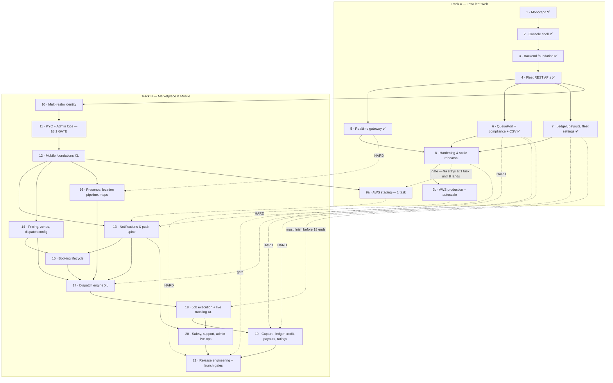

# TowFleet Web — Implementation Plan & Progress

> **Superseded by [TowFleet-Implementation-Plan-V2.md](./TowFleet-Implementation-Plan-V2.md)** — same content, Track B re-homed into ownership lanes B0 (shared spine) · B1 (TowGo) · B2 (TowPartner) · B3 (Admin Ops). Update V2, not this file.

**Scope:** two tracks over one backend. **Track A** = TowFleet Web Console (fleet-owner web app, spec §8.3/§9.3) + the shared NestJS backend that powers it (spec §15–§17). **Track B** = the marketplace and the two mobile apps (TowGo customer §9.1, TowPartner driver §9.2) plus the minimum Admin Ops surface (§9.4) they cannot function without.
**Source of truth for product behavior:** [Towing-Project-Specification_v3.md](./Towing-Project-Specification_v3.md).
**Status (06 Aug 2026):** Track A phases 1–8 complete and verified · **the Phase 8 deploy gate is released** (Redis throttler storage + shared refresh fix, both proven across two instances), though two further items belong on it — see Phase 8 · Track A phase 9a next · **Track B Phase 10 (multi-realm identity) is COMPLETE** — the backend now serves four auth realms (fleet, customer, driver, admin) and Phase 11 (KYC + minimal Admin Ops, the §3.1 gate) is next. Track B was never blocked on Track A: Phases 5, 6 and 7 have all landed, so the 16/13/17/19 interlocks are met.

### Track A — TowFleet Web (fleet SaaS)

| Phase | Deliverable | Status |
|---|---|---|
| 1 | Monorepo & workspace scaffolding | ✅ Complete |
| 2 | Console shell + design system + full mock-mode UI | ✅ Complete |
| 3 | Backend foundation: DB, auth, tenancy, seed & simulator | ✅ Complete |
| 4 | Core fleet REST APIs + console goes real | ✅ Complete |
| 5 | Realtime: live fleet map, KPI deltas, presence | ✅ Complete |
| 6 | Compliance engine + bulk CSV import | ✅ Complete |
| 7 | Money: earnings, split, payouts, reports **+ fleet settings & Route onboarding** | ✅ Complete |
| 8 | Hardening & scale rehearsal | ✅ Complete |
| 9 | AWS deployment (**executes in two stages — see Track interlock**) | ⬜ Planned |

### Track B — Marketplace & Mobile (TowGo + TowPartner + Admin Ops)

| Phase | Deliverable | Effort | Status |
|---|---|---|---|
| 10 | Multi-realm identity: customer + driver + admin auth | M | ⬜ Planned |
| 11 | Driver KYC pipeline + minimal Admin Ops console (**the §3.1 gate**) | L | ⬜ Planned |
| 12 | Mobile foundations: both apps stop being mocks | **XL** | ⬜ Planned |
| 13 | Notifications & push spine (FCM/APNs, SMS, WhatsApp, SES) | M | ⬜ Planned |
| 14 | Pricing engine, service catalog, zone & dispatch config | M | ⬜ Planned |
| 15 | Booking lifecycle & the §5.1 state machine | L | ⬜ Planned |
| 16 | Driver presence, the location pipeline & mobile maps | L | ⬜ Planned |
| 17 | Dispatch engine (progressive-radius) | **XL** | ⬜ Planned |
| 18 | Job execution, live tracking & share trip | **XL** | ⬜ Planned |
| 19 | Money: capture, ledger credit, earnings, payouts, ratings | L¹ | ⬜ Planned |
| 20 | Safety, support, admin live-ops & the long tail | M | ⬜ Planned |
| 21 | Mobile release engineering & launch gates | L | ⬜ Planned |

¹ **L, now settled: Track A Phase 7 has landed**, so Phase 19 extends an existing ledger rather than absorbing one. It would have been XL otherwise — see Phase 19.

**Why a second track and not phases 10–21 of one list.** Track A is a tenant-scoped CRUD console over data the seed and simulator fabricate. Track B is a two-sided realtime marketplace whose correctness bar is different in kind (never double-assign, never credit an uncaptured payment, never let an unapproved driver receive a job). They share the backend process, `packages/api-contracts`, the theme bridge and the ledger — but their dependency graphs barely interleave, so splitting them keeps Track A independently shippable, keeps existing numbering stable, and lets the two tracks run in parallel with the small, explicit set of interlocks below.

**Sequenced by the supply gate, not by app.** §3.1 makes admin KYC approval a hard gate: no approved driver → no online driver → no dispatch candidate → every customer screen after "Confirm Booking" is unreachable. The order is therefore forced: identity → KYC + admin approval surface → mobile apps can authenticate → notifications → pricing → booking → presence → dispatch → tracking → money → safety → launch. The flashiest work (dispatch, tracking) sits deliberately late because nothing testable can precede the gate.

---

## Dependency graph



---

## Track interlock — what Track B needs from Track A

| Track A phase | Needed by | Hard or soft | Why |
|---|---|---|---|
| **5** ✅ — Socket.io gateway + `@socket.io/redis-adapter`, room scoping, REST-resync discipline | **16** | **Hard** | Every Track B event (`job:offer`, `location:update`, `booking:status`, `search:progress`, `eta:update`, `sos:alert`) rides this transport. The `/fleet` namespace generalizes; the adapter, handshake auth and the "never trust socket completeness" rule do not get rebuilt. **Landed** — see Phase 5 below, in particular the `.local` relay rule: Phase 17's `job:offer` to `driver:{id}` is the case that must NOT use it. |
| **6** ✅ — `QueuePort` + BullMQ adapter *(first bullet of Phase 6 only)* | **13, 17, 19** | **Hard — LANDED** | §12.3 requires queue-backed notification fan-out with retries and a DLQ (13). Dispatch's 20 s offer timers and wave state must be durable and single-owner across N tasks (17). Phase 19's 5-minute reconciliation sweep and webhook retry must be single-owner too — `setInterval`/`@Cron` on N tasks runs the sweep N times against the same uncaptured payment (19). **Landed in Phase 6**: `bullmq ^5.81.3` is installed and `QueuePort` exposes `enqueue`/`schedule`/`process`/`stats`. `@nestjs/schedule` is deliberately NOT used — BullMQ repeatable jobs deduplicate by schedule key in Redis, so N tasks give one timer, which is exactly the single-owner property these three phases need. Phase 6's *compliance worker and CSV import* are **not** prerequisites and may slip past Track B. |
| **7** ✅ — `LedgerService` (sole `wallet_transactions` writer), split math, `PayoutProviderPort` + Razorpay Route adapter, fleet Route linked-account onboarding | **19** | **Hard — LANDED** | Phase 19 extends this; it must not duplicate it. Two ledger writers is not a survivable state — `db/ledger/sole-writer.spec.ts` now fails the build if a second one appears. **The scheduling gate is met**, so Phase 19 starts against an existing ledger and stays L rather than XL. What generalizes with no migration: `LedgerService.post` (owner is a parameter), `payout_accounts` and `payouts` (both keyed `(owner_type, owner_id)`), `PayoutProviderPort` (`ownerType` on every call) and the webhook. What Phase 19 adds: capture → `creditBookingSettlement`, driver payouts, and the §9.4.10 Finance approval queue. |
| **8** — Redis-backed `ThrottlerStorage`, multi-instance statelessness audit, BFF refresh lock | **9a scale-out, 21** | **Hard for 9a > 1 task and for 21**; soft for day-to-day Track B development | `throttler.config.ts` documents in its own comment that the default store is per-process and that "with N instances behind the load balancer the effective limit becomes N x the configured one". Phase 10's bespoke Redis window covers only `/auth/otp/send`; the `money` (20/min) and `reads` (120/min) buckets and the BFF refresh serialization stay per-process until Phase 8. **Therefore 9a's ECS service is pinned to `desiredCount: 1` and may not be raised until Phase 8's Redis `ThrottlerStorage` and the shared BFF refresh lock have landed.** That pin is a written deploy gate, not a convention. |
| **9** — AWS deployment | **see below** | Split | — |

**Phase 9 executes in two stages.**

- **9a (staging), executed between Phase 12 and Phase 13.** ECS Fargate + ALB (WS sticky, idle ≥ 75 s) at **`desiredCount: 1`** (see the Phase 8 row), RDS Postgres 16 + PostGIS, ElastiCache, S3 SSE-KMS with pre-signed URLs behind the existing `StoragePort`, a real HTTPS origin and a `staging.towing.app` DNS record. Pulled forward for three reasons: APNs/FCM device testing wants a reachable origin; Razorpay webhooks and the public share-trip page need public HTTPS; and Expo dev clients on cellular cannot reach a laptop.
  **On presigning being "built twice": it is not.** Phase 11 ships `presignPut`/`presignGet` on `StoragePort` with a **disk** implementation, and that disk implementation is the **permanent local-development path** — `pnpm db:seed` + `pnpm backend` must keep working with no AWS account, forever, exactly as `LogNotificationAdapter` and `DevOtpAdapter` do for their ports. 9a adds an S3 SSE-KMS adapter behind the same two methods. That is an adapter swap, which is the entire reason the port exists.
- **9b (production), executed before Phase 21.** CloudFront, WAF, Secrets Manager, CloudWatch alarms on §19.1 SLOs, GitHub Actions ECR → ECS rolling deploy, `api.towing.app` / `fleet.towing.app`, **plus the whole of §19.6** (see Phase 9b below).

Track B **development** is not blocked by 9a — Expo dev clients over LAN plus a tunnel for webhooks cover it. Track B **acceptance** is blocked by it: device testing on cellular, real webhook delivery, store review, and the §19.7 load/chaos gates all require the deployed environment.

---

## Guiding decisions (locked)

| Decision | Choice | Why |
|---|---|---|
| Shared contracts | `packages/api-contracts` — Zod schemas, TS source for web/tsx/vitest via `import` condition, compiled CJS `dist/` for the built backend via `require` condition | One source of truth, runs in Nest pipes and browser forms; no codegen |
| ORM | Drizzle + plain SQL migrations | SQL-first fits PostGIS (`geography` customType, GIST), natural keyset pagination, no native binaries |
| Background jobs | BullMQ behind a `QueuePort` (Phase 6) | Redis already required; SQS/EventBridge becomes an adapter swap on AWS |
| Web map | MapLibre GL JS behind a `<FleetMap>` seam (Phase 5) | Always-open ops map is expensive on Google JS billing; mobile keeps Google per spec |
| Money | Ledger-first (§14): append-only signed `wallet_transactions`, unique idempotency keys, `wallets.balance` = SUM projection. API speaks **integer paise**; DB stores NUMERIC(12,2) rupee strings; `rupeeStringToPaise`/`paiseToRupeeString` are the only bridge | Float never touches money |
| Tenancy | `fleet_id` only from the verified JWT (`@CurrentFleet()` → branded `FleetId`); every repo method takes it as first arg; `FleetScopeGuard` rejects client-supplied foreign fleet ids | Tenant boundary is a compile error + runtime rejection |
| Sessions | Separate fleet auth realm (§15.2): email+password → OTP challenge → JWT (15 min) + rotating refresh tokens with family reuse detection. Browser holds only httpOnly cookies; the Next BFF proxy injects bearers | Tokens never reach client JS |
| Mock/real switch | Every web feature has a `DataSource` interface with mock + REST implementations behind `NEXT_PUBLIC_USE_MOCKS` (mirrors the mobile apps' seam) | Console demos with zero infrastructure, forever |
| Deploy target | **AWS** (§15): ECS Fargate + ALB (WS sticky), RDS Postgres+PostGIS, ElastiCache, S3 SSE-KMS, SQS/EventBridge, CloudFront — executed in Phase **9a (staging, after Phase 12) and 9b (production, before Phase 21)**; all vendor touchpoints behind ports today | Adapter swap, not rewrite |

## Track B — guiding decisions (locked)

| Decision | Choice | Why |
|---|---|---|
| Admin surface, minimum viable | **Routes inside `apps/towfleet-web` under `/admin/*`** with an `admin_session` realm-prefixed cookie — not a new Next app. Phase 11 ships the KYC queue + capability toggle + audit log; Phase 14 ships the pricing/commission config API; Phase 17 ships dispatch-config; Phase 19 adds the Finance payout queue; Phase 20 adds SOS, the dispatch inspector, live-ops and the thin config forms | Phase 2 already shipped the realm-prefixed cookie + `middleware.ts` coexistence seam for exactly this (§4.1); the BFF proxy, `web-ui` kit, theme and DataSource convention are reusable verbatim; `api-contracts/src/admin/` is an empty placeholder waiting. A second Next app duplicates the shell for zero pre-launch value. Only the KYC queue must be human-operable every booking-day |
| Auth realms | Four realms over one parameterized `TokenService`: `fleet` (exists), `customer`, `driver`, `admin`. `realm` becomes a **parameter** of mint/rotate/logout, not a compile-time constant | `refresh_tokens.realm`/`subject_id` (FK-free, already polymorphic) and `otpPurposeEnum` (`fleet_login`/`driver_login`/`customer_login`/`booking_start`) were built realm-agnostic in Phase 3. `login_challenges` was **not** — it is fixed in migration 0005, see Phase 10 |
| Dispatch execution model | **Durable + single-owner**: BullMQ delayed jobs (Phase 6 `QueuePort`) + a Redis lock per booking + wave state persisted on the booking row. Never in-process `setTimeout` | Over N stateless Fargate tasks, in-process timers produce **double-assignment** — two drivers against one fare-locked booking — which corrupts the ledger rather than degrading UX. §19.7's game day kills a task mid-dispatch and expects resumption |
| Degraded paths | Every degradation-ladder branch (§19.2) is written **in the same commit** as its primary: Redis GEOSEARCH + PostGIS `ST_DWithin` fallback; Directions + Haversine ETA; socket + 10 s REST polling; Razorpay + `COMPLETED (unpaid)`. The *detector* — timeouts, bounded retries with jitter, circuit breakers (§19.3) — is a single shared `ExternalCallPolicy` built in Phase 14 | Retrofitting the fallback later means rewriting the matcher and both mobile clients. A ladder that has never executed is not a ladder — and a ladder with no breaker never trips |
| Driver liveness | **Ping freshness, not socket connectivity.** A driver whose last location ping is > 15 s old is excluded from dispatch | Stale GPS is phantom supply — a connected socket with a frozen position is worse than an absent driver |
| Mobile money types | Integer paise over the wire everywhere; both apps' `formatINR` becomes paise-in/rupee-out **before** any real data flows | Both apps currently carry rupee floats. Displayed commission math must reconcile to the paisa against the ledger (§9.2.4 AC) — float rounding makes that assertion unpassable |
| Mobile runtime | **EAS dev-client builds become the default runtime from Phase 12.** `expo-dev-client` is already a dependency in both apps and both `eas.json` files already carry `development` / `preview` / `production` profiles — what does not exist is a single built binary | Expo Go cannot host react-native-maps, FCM, background location or MMKV. Native rebuild points are Phases 12 (MMKV, pickers), 13 (push) and 16 (maps, location, task-manager); 18 adds no new native module by design |
| OTA policy | `expo-updates` with runtime versions: JS-only changes ship OTA; **any** native module change (maps, location, push, MMKV) requires a store build | The failure mode is an OTA that bricks installs whose native layer predates the JS |
| Mobile e2e | **Maestro** flows in `apps/*/maestro/`, run both mocks-on (hermetic, CI) and mocks-off (against the docker test stack) | Mirrors the Playwright mocks-on/mocks-off split from Phases 2/4; no new heavyweight runner |

---

## ✅ Phase 1 — Monorepo & workspace scaffolding (complete)

**Delivered**
- `turbo.json` gained `build` (cached, `dependsOn ^build`), `dev` (persistent, `dependsOn ^build`), `test`; root scripts `pnpm fleet` / `pnpm backend` / `pnpm build`.
- `apps/towfleet-web`: Next 15.5 App Router, Tailwind v4, React pinned to the Expo apps' exact 19.2.3 via root `pnpm.overrides` (single hoisted React — verify with `pnpm why react` after dependency changes).
- `apps/backend`: NestJS 11 workspace package with `/v1/health`.
- `packages/api-contracts` (error envelope §16, branded ids, page/cursor envelopes) and `packages/web-ui` (shadcn-style kit: Button/Card/Input/Badge/Table/DataTable/Empty/Error states per §10.9).
- Theme bridge: `@towing/theme` gained a web-safe `./tokens` subpath (pure objects, no react-native import); `web-ui` emits the semantic tokens as CSS variables with the Fleet Navy accent (§10.3) and maps them into Tailwind utilities — one design-token source shared with the mobile apps.

**Verification:** one React version; full turbo build/typecheck green; Expo apps unaffected.

## ✅ Phase 2 — Console shell + full mock-mode UI (complete)

**Delivered**
- All §8.3 routes: `/login`, `/` (KPIs + alert feed), `/map`, `/trucks` (table + compliance drawer), `/drivers`, `/jobs`, `/earnings` (Recharts + split table), `/reports`, `/settings`; dark mode persisted; ≥1280 px layout (§10.12).
- Auth shell: realm-prefixed `fleet_session` httpOnly cookie + `middleware.ts` route guard (Admin-console coexistence seam, §4.1).
- Feature convention mirroring the mobile apps: `features/<name>/{api/*.keys,*.queries,*DataSource,*MockSource}, mocks/, types.ts` with per-feature §10.9 state overrides via `src/lib/env.ts`.
- Playwright smoke: login → every route renders (hermetic, mocks-on).

**Verification:** Playwright 2/2; `next build` proves no react-native leaks into the web bundle.

## ✅ Phase 3 — Backend foundation (complete)

**Delivered**
- Local infra: `apps/backend/docker-compose.yml` — `postgis/postgis:16-3.4` + `redis:7` (dev 5432/6379) plus a tmpfs/fsync-off **test profile** (5433/6380).
- Drizzle schema for §17 (users, fleets, trucks, compliance, drivers, bookings + status history, zones, wallets/ledger/payments/payouts/refunds, auth tables) with GIST geo indexes, the fleet feed index, and partial indexes; migrations 0000–0003.
- Auth realm (§16.4): scrypt credentials, anti-enumeration login, OTP challenges (attempt-capped, single-use), rotating refresh tokens with **family reuse detection**, `JwtAuthGuard` + `FleetScopeGuard` + `@CurrentFleet()`.
- Cross-cutting: §16 error-envelope filter, header-driven `IdempotencyInterceptor` (Redis CAS, replay/mismatch/in-flight semantics per §19.4), request-id middleware, pino with credential redaction, throttle buckets (reads 120/min · money 20/min · auth 5/min).
- **Deterministic seed** (`pnpm db:seed` / `db:reset`, importable as `runSeed()` for tests): 2 fleets, 20 trucks + 79 compliance docs at staged expiries, 12 drivers, 506 bookings over 90 days with §7-correct fares and §3.3 band locks, 755 signed ledger rows, payouts — with **three SQL invariants enforced at exit** (wallet = SUM ledger; commission + payout = total; ledger legs = payout).
- Location **simulator** (`pnpm sim:locations`): drives seeded trucks (Redis pub/sub + GEO sets per §6.1/§11.2, lazy Postgres flush), advances live bookings through §5.1.
- Test infrastructure + 68 tests: pricing/split math, scrypt, guards, token rotation/reuse/concurrency, full login flow, idempotency, seed invariants & tenancy audits.

**Verification:** 68/68 green; E2E login → OTP → JWT → `/me` against seeded data; seed invariants zero-drift.
**Console demo credentials:** `lakshmi@recovery.in` / `ops@chennaihighwayrescue.in`, password `Password123!` (dev OTP prints in the backend terminal).

## ✅ Phase 4 — Core fleet REST APIs + console goes real (complete)

**Delivered**
- Contracts `packages/api-contracts/src/fleet/{trucks,drivers,dashboard,jobs}.ts` + `common/money.ts`; new error codes `duplicate_plate`, `duplicate_mobile`, `truck_already_assigned`.
- Migration 0004: `drivers.assigned_truck_id` (partial unique index = one driver per truck, also the race arbiter) + per-fleet plate uniqueness; seed now assigns trucks to drivers.
- Backend modules (all `JwtAuthGuard + FleetScopeGuard`):
  - **trucks** — paged list (batched-lookup pattern; maps DB `expiring_soon`→client `expiring`, synthesizes `missing` checklist entries), create/update, multipart compliance upsert via `StoragePort` (disk adapter; S3 in Phase 9) with truck-status recompute (`active ↔ non_compliant`, manual `inactive` sticky) per §9.3.4.
  - **drivers** — list with ledger-derived month-net (IST boundaries), invite (KYC-incomplete + `NotificationPort` stub), assign-truck (§16.4).
  - **dashboard** — KPIs + live-derived alerts, 15 s Redis cache (`CacheService`) with event-driven invalidation. Utilization = distinct assigned trucks on active bookings ÷ active trucks (honest proxy until bookings carry a truck id).
  - **jobs** — cursor-keyset feed matching `idx_bookings_fleet_feed`, filters, and a batched **streaming CSV export** with quoting + formula-injection defense.
- Web: **BFF proxy** `/api/proxy/[...path]` (httpOnly `fleet_session` + `fleet_refresh`, **serialized refresh** — parallel 401s must not both call refresh or family reuse-detection force-logs-out; per-process, revisit in Phase 8), real two-step login, restSources for the four features, compliance upload form in the drawer, CSV export button. Earnings stays pinned to mock until Phase 7.
- 4 supertest e2e suites (full `AppModule` boot via `src/test/app.ts`): tenancy negatives, assign-truck races, month-net math, KPI fixtures, cursor stability, CSV escaping, EXPLAIN index check.

**Verification:** 86/86 tests; full mocks-off E2E through Next (login → cookies → proxied dashboard/trucks/CSV → logout); transparent refresh proven with a 3 s token TTL (DB showed the rotated token row); Playwright mocks-on still green.
**Notable fix found by tests:** drizzle-kit emits `DESC NULLS LAST` indexes while `ORDER BY … DESC` implies `NULLS FIRST` — the jobs feed now orders `desc nulls last` explicitly, or Postgres re-sorts every page.

---

## ✅ Phase 5 — Realtime: live fleet map, KPI deltas, presence (complete)

Spec targets: positions ≤ 2 s behind pings (§9.3.3, §11), fleet-scoped rooms (§16.6).

**Delivered**
- Contracts `packages/api-contracts/src/realtime/{events,presence,ticket,positions}.ts` — socket event
  names + payload schemas, `fleetRoom()`, the shared presence thresholds, and the snapshot DTO.
  `dashboardKpisSchema` was split out of `dashboardSummarySchema` so `ops:metrics` carries exactly the
  shape the console patches.
- **Socket.io gateway** (`/fleet` namespace) with `@socket.io/redis-adapter` installed in `main.ts`
  before `listen()`. **Zero `@SubscribeMessage` handlers** — rooms come only from the verified
  handshake, so nothing client-supplied can reach a room name (the WS analogue of `FleetScopeGuard`).
  `allowRequest` validates Origin, because a WebSocket upgrade bypasses browser CORS entirely.
- **Handshake tickets**: opaque `randomBytes(32)` in Redis, single-use via `GETDEL`,
  `POST /v1/fleet/realtime/ticket` through the existing BFF proxy. Not a JWT — a token signed with
  `JWT_ACCESS_SECRET` carrying `role: 'fleet_owner'` is indistinguishable from a real access token.
  The response carries `wsUrl` from backend env, so moving the gateway needs no web rebuild.
- **Location fan-out**: `REDIS_SUB` (provisioned since Phase 3 for exactly this) → `LocationBatcher`
  (last-write-wins, out-of-order drop) → one `location:update` per fleet per `REALTIME_FLUSH_MS`.
  Nodes with no local sockets for a fleet do zero work for its whole ping stream.
- **`GET /v1/fleet/realtime/positions`** — the §18 resync source and the §19.2 polling source.
  Postgres is authoritative for *which* trucks exist, Redis only upgrades *freshness*; read-repairs
  GEO members whose hash expired; returns `degraded: true` and serves PostGIS when Redis is down.
- **KPI deltas**: `FleetEventsService` (`common/events/`, `@Global()`) is now the single seam for
  "this fleet's dashboard is stale" — invalidate + publish in one place. `MetricsBroadcaster`
  debounces per fleet, takes a `SET NX PX` **cost** guard (not a correctness one), recomputes through
  `DashboardService`, and publishes a full `kpis` payload every node relays.
- **Web**: `<FleetMap>` (MapLibre 5, GeoJSON layers not DOM markers), rAF interpolation with
  shortest-arc heading (§11.4), presence-driven opacity (§11.6), click→side panel and status/driver/
  zone filters (§9.3.3), dashboard mini-map, a `RealtimeProvider` that patches the query cache, and a
  status chip that never claims "Live" when it isn't.
- **Active job legs** (§9.3.3 "active job routes"): a **dashed** truck→pickup→drop line per on-job
  truck, with hollow endpoint rings, redrawn with the tween so the leg tracks the marker. Dashed and
  labelled "(direct)" on purpose — it is a straight line, and §11.4's road-following polyline needs
  the Directions API from Track B. A solid line would imply a driven route.
- **Basemap is vendorless by default** — token-coloured background plus the seeded `service_zones` as
  GeoJSON. No API key, no external request, works offline. `NEXT_PUBLIC_MAP_STYLE_URL` swaps in a
  vendor style; the truck and zone layers compose on top either way.
- **§19.2 shipped with its primary**: `REALTIME_ENABLED=false` → ticket 503s `realtime_unavailable`,
  relays skip, console drops to 10 s REST polling. The client owns its reconnect loop with
  backoff + jitter, because a socket.io middleware rejection sets `socket.active === false` and
  **never auto-retries**.

**New surface**
- **Dependencies** — backend: `socket.io ^4.8.3`, `@socket.io/redis-adapter ^8.3.0`,
  `@nestjs/websockets` + `@nestjs/platform-socket.io ^11.1.28` (pinned to the `@nestjs/core ^11` peer
  range), `socket.io-client ^4.8.3` as a devDependency for the specs and the load script. Web:
  `socket.io-client ^4.8.3` and **`maplibre-gl ^5.24.0` — deliberately not 6.x**, which shipped
  2026-07-22 and was two weeks old at the time. No `react-map-gl` (raw MapLibre in a `useEffect` gives
  the interpolation control for one less dependency) and no `@nestjs/event-emitter` (the cross-process
  Redis bus is mandatory anyway; two event systems would mean a permanent "which one?" question).
- **Env** — `REALTIME_ENABLED`, `REALTIME_FLUSH_MS` (1000), `REALTIME_TICKET_TTL_SECONDS` (60),
  `REALTIME_METRICS_DEBOUNCE_MS` (2000), `PUBLIC_WS_URL`. All documented in `Aws/04`. Web gains
  `NEXT_PUBLIC_MAP_STYLE_URL` and `NEXT_PUBLIC_MOCK_REALTIME_STATE`; there is deliberately **no**
  `NEXT_PUBLIC_WS_URL` — the socket origin rides the ticket response so relocating the gateway needs
  no web rebuild.
- **Scripts** — `pnpm --filter @towing/backend smoke:realtime` (the §19.1 load gate). `src/scripts` is
  now excluded from `tsconfig.build.json`, so the `socket.io-client` devDependency never reaches the
  runtime image.
- **No migration.** Presence lives entirely in Redis and `booking_location_path` already existed, so
  `Aws/migrations/` and `Aws/db/schema-snapshot.sql` did not need regenerating. The new **env vars**
  did go into `Aws/04`.

**Deliberately NOT in this phase** — both need the Directions API, which Track B Phases 15–16 bring in:
**ETA** (the side panel says "Available with route tracking" rather than guessing; §11.5's smoothing
engine exists because a whiplashing estimate destroys trust) and **road-following route polylines**
(the straight leg above stands in). Presence uses §11.6's **15 s stale / 60 s offline** thresholds
rather than tying "offline" to the 30 s Redis hash TTL: the browser only ever sees `at` timestamps, so
a client-side age is the honest signal, and §11.6 is the spec the plan cites.

**Verification:** 127/127 backend tests (19 files, +41 over Phase 4); Playwright 9/9 mocks-on with the
real `canvas.maplibregl-canvas` rendering under swiftshader (`--use-angle=swiftshader` in
`playwright.config.ts`; without it headless Chromium has no GPU and every map assertion would land on
the fallback panel). Load smoke across **two gateway processes** (4000 + 4001, one Redis): 50 clients ·
200 trucks · 60 s → **p95 1041 ms** (budget 2000), **0.00 % loss**, **0 duplicates**. Full mocks-off
E2E: real login → OTP → snapshot with hot Redis positions and seeded zones → live socket carrying
`ops:metrics`, `location:update` (relay p50 732 ms) and a `booking:status` from a real simulator
transition, with ticket replay refused. Kill switch verified live: 503 + relays skipped + polling
source still 200.

> **Repeating the two-process rehearsal on Windows:** bash `kill`/`pkill` does **not** kill node
> processes started from an earlier shell — free the ports with PowerShell
> (`Get-NetTCPConnection -LocalPort 4000,4001 | Stop-Process -Id {OwningProcess} -Force`) and verify
> they are gone first. A surviving gateway on the port made the `REALTIME_ENABLED=false` check read as
> a bug until the stale process was found. Same class of trap as `next dev` clobbering the production
> `.next` before Playwright.

**Do not regress these** — each one cost real time to find or would fail silently:

1. **Every Redis-channel relay emits with `nsp.local`.** Each node is subscribed to the same channel
   and holds the same message, so a non-local emit republishes through the adapter and every client
   receives N copies (N = node count). `multi-instance.e2e.spec.ts` asserts both halves — exactly one
   frame per client, *and* that a deliberate non-local emit still crosses nodes (the first alone
   passes with no adapter installed at all). The load smoke's `duplicates 0` is the same assertion at
   scale. **Track B Phase 17's `job:offer` → `driver:{id}` is the case that must NOT be local** — use
   `FleetGateway.broadcastAcrossNodes()`, which exists and is named for exactly that.
2. **`RealtimeSubscriberService` holds a LIST of handlers per channel, not one.** `fleet:events` has
   two independent consumers — the relay (forwards `booking:status`) and `MetricsBroadcaster`
   (recomputes KPIs). The first implementation was a single-handler map and whichever registered
   second silently erased the other; `ops:metrics` simply never arrived, with no error anywhere.
3. **The positions snapshot is Postgres-authoritative, Redis-accelerated.** Redis may only make a
   Postgres-known truck *fresher*, never add one. Reading the GEO set first would let a stale or
   poisoned key inject another tenant's truck into the response — `positions.e2e.spec.ts` plants
   exactly that and asserts it never surfaces.
4. **WS tickets are opaque single-use Redis keys, never JWTs** (see the handshake bullet above).
5. **The console owns its reconnect loop.** socket.io-client does not auto-reconnect after a
   middleware rejection, which is precisely the expired-ticket case.
6. **Do not set `NEXT_PUBLIC_MAP_STYLE_URL` for the build Playwright runs against.** It is inlined at
   `next build`, and a vendor style would give the hermetic smoke a network dependency.
7. **Timers must not outlive the app.** `MetricsBroadcaster`'s debounce and the relay's flush interval
   are `.unref()`'d, cleared in `onModuleDestroy`, and guarded by a `destroyed` flag — otherwise they
   fire after `truncateAll()`/`app.close()` against a closed postgres pool and surface as an unhandled
   rejection in an unrelated spec.

**Bug found and fixed:** `DriversService.assignTruck` never invalidated `dash:{fleetId}` despite
moving `utilizationPct`'s numerator — the KPI stayed wrong for up to the 15 s TTL. Covered by a
regression test that fails without the fix. (`invite` deliberately does not emit: no KPI reads driver
count.)

**Deviation from the plan as written:** `GET /v1/fleet/realtime/positions` returns **all active
service zones, not fleet-scoped ones** — `service_zones` has no `fleet_id` column. It is platform-wide
coverage geography that every fleet dispatches into, so nothing tenant-specific is exposed; the truck
positions in the same response *are* strictly fleet-scoped. Worth knowing before Phase 14 adds
zone/pricing configuration on top.

**Consumed by Track B:** Phase 16 (hard). The namespace/room/handshake design is generic — a
`/customer` or `/driver` namespace is a new gateway class over the same adapter, subscriber and ticket
service. `RealtimeSubscriberService` is a channel→handler table, so sharding `location:ping` per fleet
is a one-file change.

## ✅ Phase 6 — Compliance engine + bulk CSV import (complete)

Spec targets: §9.3.4 (30-day alerts, auto `non_compliant`, bulk import with row-level error report), §5.7 lifecycle.

**Delivered**
- **`QueuePort` + BullMQ adapter** (`common/queue/`) — the Track-B-blocking bullet. Typed job
  registry (`JobPayloads`), `enqueue` with dedup/delay/retry, `schedule` (cron), `process`, `stats`.
  **One BullMQ queue per job name**, not one shared queue: Phase 13's notification fan-out is
  high-volume and slow while Phase 17's offer timers are latency-critical, and sharing a queue would
  let a notification backlog delay an offer expiry — and make the §12.3 depth alarm one meaningless
  number over unrelated work.
- **`GET /v1/health/queues`** — per-queue waiting/active/delayed/failed/completed plus a top-level
  `deadLettered`. Failed jobs are **never trimmed**: an exhausted job *is* the DLQ, and deleting it
  throws away the only record that something needs a human.
- **Compliance engine** (`modules/compliance/compliance-sweep.ts`) — a plain function over a Drizzle
  handle, mirroring `runSeed()`, because the worker, the tests and `pnpm db:seed` all need to run it
  and only one has a DI container. Expiry → doc `expired` → truck `non_compliant`; the 30-day window
  → `expiring_soon` + alert; renewal walks all of it back. `ComplianceService` wraps it with the
  notification fan-out and a `FleetEventsService` emit so the dashboard busts and the console gets a
  live push.
- **`alerts` table + `GET /v1/fleet/alerts`** (keyset paginated, severity filter, `includeResolved`)
  and `POST /v1/fleet/alerts/recheck`. The dashboard feed now reads **stored** alerts —
  `AlertsService.dashboardFeed()` and the list endpoint are the same rows, so there is no second
  definition of what an alert is.
- **`POST /v1/fleet/trucks/bulk`** with `GET bulk/:id`, `bulk/:id/errors.csv` and
  `bulk/template.csv`. ≤ `BULK_IMPORT_SYNC_MAX_ROWS` (500) commits in the request; above that it is
  handed to the queue. **Row-at-a-time inserts**: one duplicate plate in a 500-row file must not roll
  back the other 499. Errors are `{row, field, code, message}`, capped at 500 in the report while the
  counts stay exact.
- **Web**: `/alerts` page (severity filter, show-resolved toggle, re-check button) and a bulk-import
  drawer on `/trucks` with Papa Parse preview + pre-validation against the *same*
  `truckImportRowSchema` the server uses — a courtesy, never a trust boundary.
- **Seed runs the real sweep** at the end, so a fresh `pnpm db:seed` produces a populated alert feed
  (10 alerts) rather than an empty one until the first cron tick.

**Verification:** 170/170 backend tests (23 files, +43 over Phase 5), Playwright 14/14. Mocks-off E2E:
6 stored alerts served identically by `/alerts` and the dashboard; a 3-row import committing 2 and
reporting 1 with a correct `row,field,code,message` CSV; **a 501-row import queued to BullMQ and
completed by a real worker (501/501)**; an idempotent re-check; and `/v1/health/queues` showing the
scheduled sweep as `delayed: 1` with `deadLettered: 0`.

**Design notes worth keeping**
- **Idempotence is the whole design.** The sweep runs hourly forever, so every write is either a
  no-op on re-run (`WHERE status <> $new`) or guarded by `uq_alerts_open_subject` — a hand-written
  partial unique index on *unresolved* rows, scoped that way so a renewed-then-re-expiring document
  can legitimately alert again next year. `alert_sent_30d` tracks *notification* separately from
  *open alert*, because an hourly job that emails hourly is worse than no alerting.
- **`QUEUE_ENABLED=false` disables workers, enqueue and cron.** Work is deferred, not lost — the
  sweep is idempotent and catches up. It is also what lets a task be deployed API-only.
- **Tests run with the queue OFF by default** (`src/test/setup.ts`). Every `createTestApp()` boots the
  full AppModule, so a live worker on the shared test Redis would pick up a queued import while the
  spec was still asserting it was `pending`. `common/queue/queue.e2e.spec.ts` turns it back on for
  itself and proves the real round trip: delivery, jobId dedup, retry→DLQ, delay, and **three
  adapters converging on one cron schedule** (the property `@nestjs/schedule` cannot give us).

**Bug caught by the queue spec:** BullMQ rejects a custom job id containing `:` — and the import path
used `import:<uuid>`, which would have failed at enqueue time in production only. The adapter now
normalises job ids so no caller has to know.

**Deviation from the plan as written:** failed-payout alerts are opened by the same sweep. Phase 6
made the dashboard stored-only, and without this a failed payout would silently stop appearing until
Phase 7 builds the payout write path. **Phase 7 should open that alert at the point of failure and
delete `syncPayoutAlerts`** — catching up hourly is a stopgap, not the design.

**Consumed by Track B:** the **`QueuePort` + BullMQ adapter bullet only** is a hard prerequisite for
Phases 13, 17 and 19 — and it has landed, so none of them is blocked on this phase any more. Adding a
job is: one entry in `JobPayloads`, one `process()` call, one `enqueue()`. The compliance worker and
CSV import are not prerequisites for anything in Track B.

## ✅ Phase 7 — Money: earnings, split, payouts, reports, fleet settings (complete)

Spec targets: §14 (ledger-first, idempotent), §3.4, §7, §9.3.1, §9.3.7/§9.3.8, §19.3, §19.4.

**Delivered**
- **`LedgerService`** (`db/ledger/`) — the sole `wallet_transactions` writer, mirroring the seed's
  transaction shape exactly. `post(legs, {precondition})` resolves owners → wallets, locks every row
  `FOR UPDATE` in a deterministic order (no deadlock when two settlements touch the same
  driver+fleet pair), runs the caller's rule with all locks held, then inserts
  `ON CONFLICT (idempotency_key) DO NOTHING` and applies `balance = balance + x`. A duplicate key is
  a **replay, not an error** — queue redeliveries want "already done, carry on".
  `creditBookingSettlement` is the seed's two shapes as a named operation, and is what Phase 19
  extends.
- **Sole-writer enforcement, layered, cheapest first**: `sole-writer.spec.ts` walks `src/` and fails
  the build if any non-spec file writes the ledger (or if a `DB_READER` injector writes at all);
  then the unique key, now `NOT NULL`; then the nightly reconciliation. A `BEFORE INSERT` trigger is
  deliberately **not** shipped — it would break the seed, the fixtures and any psql repair.
- **`earnings_daily` projection** at grain `(fleet_id, IST day, driver_id)`, maintained by a
  BullMQ worker enqueued after each settlement commit, plus `pnpm earnings:rebuild`. **Recomputed
  absolutely, never as a delta** (at-least-once delivery makes an additive job double-count
  silently), and a cell whose source rows vanish is **deleted** — the projection bug that otherwise
  leaves stale money on screen forever.
- **Nightly `earnings.reconcile`** (01:00 IST): the three §14 invariants, a projection audit that
  **re-enqueues drifted cells** (self-healing), and a payout-alert reconcile. Throws on drift, so
  `deadLettered` rises on the existing `/health/queues` alarm. **Never auto-repairs** — `SET balance
  = sum(ledger)` would erase the evidence of the bug that caused it. New `GET /v1/health/ledger`.
- **`DbReader` seam**: `DB_READER`/`PG_READER`; with `DATABASE_READ_URL` unset the reader *is* the
  primary pool object, so there is no second connection locally or in CI (and `onApplicationShutdown`
  must not close it twice). Earnings, reports, statements, jobs, alerts and the dashboard compute
  take it.
- **`GET /v1/fleet/earnings`** (KPIs + trend from the projection), **`/earnings/split`** (keyset feed
  over the ledger), **`/earnings/statement.csv`**, **`GET /v1/fleet/reports`** (truck/driver/period)
  and **`/reports/export.csv`**. `csvEscape`/`streamCsv` hoisted to `common/csv/` and `jobs.service.ts`
  refactored onto it in the same commit — one formula-injection defence, not two.
- **`POST /v1/fleet/payouts`** — the first route ever to use the `money` throttle bucket. Preflight
  (linked account, min, max), then one transaction: insert + `payout_debit` under the wallet lock;
  the vendor call happens **after commit**. `@IdempotencyKey()` requires the header at the DTO layer.
- **`PayoutProviderPort`** with `DevPayoutAdapter` (the permanent local path, settling through the
  *real* `markPaid` on a durable delayed job) and `RazorpayRouteAdapter`, selected by
  `PAYOUT_PROVIDER`. **`POST /v1/webhooks/razorpay`** — no session, no fleet guard, not under
  `fleet/`, HMAC-verified before any DB write, deduped on `webhook_events(provider, event_id)`.
  Plus the §19.3 five-minute reconciliation poll.
- **Fleet settings & Route onboarding**: `GET/PUT /v1/fleet/settings`, `POST/DELETE
  /settings/payout-account`, `POST /settings/onboarding/advance`. The console gains a real settings
  screen, a resumable `/onboarding` wizard whose panels are the *same components*, a reports screen,
  a print statement route, and `Dialog`/`Switch` in `web-ui`. **`earningsDataSource.ts` is un-pinned.**
- **`syncPayoutAlerts` deleted.** `payout_failed` alerts are opened at the point of failure by
  `modules/money/payout-alerts.ts` and resolved when that payout is later paid.

**New surface**
- **Dependencies: none.** `Dialog` is the native `<dialog>` element, `Switch` is a button, the
  Razorpay adapter is `fetch`, and the PDF is the browser's own print dialog.
- **Migration 0006** — `payout_accounts`, `earnings_daily`, `webhook_events`; `fleets` gains
  `notification_prefs jsonb` / `onboarding_step` / `profile_completed_at` (with a backfill, without
  which every existing account would be locked out of payouts); `payouts` gains `failure_reason` /
  `provider` / `last_synced_at` / `updated_at` and **`uq_payouts_one_open_per_owner`**;
  `wallet_transactions.idempotency_key` becomes `NOT NULL`.
- **Env** — `DATABASE_READ_URL`, `LEDGER_*`, `PAYOUT_*`, `RAZORPAY_*`. All in `.env.example` and
  `Aws/04`. `assertProductionSafety` now also refuses `PAYOUT_PROVIDER=dev`, a placeholder webhook
  secret, and missing Razorpay credentials.
- **Scripts** — `pnpm --filter @towing/backend earnings:rebuild [--fleet <id>] [--since <days>]`.

**Verification:** 310/310 backend tests (34 files, +140 over Phase 6); Playwright 26/26 mocks-on
(+12). `pnpm db:reset` → all three invariants zero, 757 ledger rows, 299 projection cells built by
the real projector. Mocks-off E2E: real login → earnings KPIs/split/trend from the projection →
payout requested → `requested → processing → paid` on the dev adapter → statement CSV with no
customer column → forced failure opening a `payout_failed` alert on the dashboard immediately →
`GET /v1/health/ledger` clean → injected drift detected and the job failed.

**Do not regress these:**

1. **A hold in a signed append-only ledger IS a debit.** The wallet is debited at *request* time; a
   failure writes a compensating `adjustment` credit rather than removing it (§14.5: "compensating
   entries, never edits"). A `requested` payout with no debit means the balance still shows the money
   as available and the fleet can request it twice.
2. **A timeout is not a failure.** If the provider call times out the payout stays `requested` — the
   provider may have accepted it and only the response was lost. Failing it there would return money
   to a wallet the bank is about to debit. `PAYOUT_STUCK_MINUTES` resolves it later.
3. **`uq_payouts_one_open_per_owner`** is the database's own defeat of the concurrent double-payout.
   It holds with Redis down and the idempotency interceptor bypassed entirely.
4. **The stored payout idempotency key is namespaced by fleet.** `uq_payouts_idempotency_key` is
   global; two fleets sending `Idempotency-Key: 1` would otherwise collide and the second would
   receive the first one's payout.
5. **The webhook hashes `req.rawBody`,** never a re-serialised object — hence `rawBody: true` in
   `main.ts` **and in both factories in `src/test/app.ts`**. Miss the second and the spec fails with a
   baffling 401.
6. **`ORDER BY type` on a pgEnum column sorts by DECLARATION order,** not alphabetically. Use
   `type::text` in assertions.
7. **A raw `db.execute` bypasses Drizzle's column mappers,** so postgres.js returns timestamps as
   strings. Coerce in the repo, not downstream.
8. **The web payout `Idempotency-Key` is minted once per user intent** (when the dialog opens), and
   the mutation sets `retry: false`.
9. **The split feed is anchored on `bookings`, not on the fleet's wallet.** `fleet_driver_shares`
   permits a 100/0 split, which produces no fleet leg at all — a wallet-anchored feed would silently
   drop those jobs from the fleet's own split table.
10. **The settings mock defaults to `onboarding.step: 'done'`.** `NEXT_PUBLIC_*` is inlined at
    `next build` and the whole Playwright suite runs against one build, so anything else puts a setup
    banner in front of every spec.

**Deviations from the plan as written**
- **`wallets.balance` kept; no `wallet_balances` table.** Spec §17, the schema header and the shipped
  first invariant all say `wallets.balance`; the plan's phrasing was naming drift.
- **No `commission_debit` ledger row, ever.** The plan's prose listed one, but the seed never wrote
  one and the platform has no wallet for it to credit. Commission lives as
  `bookings.commission_amount` and by the pool's absence; writing one would break the third invariant.
  The enum member is now documented as reserved.
- **Split stays at credit time** — two positive credits, exactly the seed's shape. §3.4 and §9.3.7 say
  "split at payout layer" while §14.3 says "two ledger credits in one transaction"; the seed
  implements the latter and the plan names the seed as the executable specification. The readings
  reconcile because a payout draws only the fleet's own already-split balance — **a payout never
  re-splits**. Moving it later would leave a fleet's wallet holding the driver's money.
- **The §9.3.1 gate is scoped to the money paths** (`POST /fleet/payouts`, `POST
  /settings/payout-account`) rather than every mutation, and the wizard is reachable from a
  `/settings` banner rather than a forced redirect. An incomplete fleet can still run its business;
  it just cannot move money out.
- **`refunds.idempotency_key` is still absent**, matching §17 exactly. No refund writer exists yet
  (Track B owns it), and inventing a key grammar for a writer that does not exist would only mean
  altering it later.

**Consumed by Track B:** Phase 19 (hard) — **the scheduling gate is met**. `LedgerService`,
`PayoutProviderPort`, `payout_accounts` (already keyed `(owner_type, owner_id)`) and the webhook all
generalize to drivers with no migration. Phase 19 adds capture, driver payouts and the Finance
approval queue on top; **it must not add a second ledger writer** — `sole-writer.spec.ts` will say so.

**Deliberately NOT in this phase** — each would ship an unsafe or unusable half:
**scheduled/automatic payouts** (§14.4's "schedule"): an unattended recurring bank transfer with no
approver, when §9.4.10's Finance role is Phase 19 and the admin console is Phase 11, is the one thing
here worth refusing; **Admin Finance approval** (no approver exists — and `payout_status` needs no
new value for it, since adding one nothing sets is worse than adding it later); a real PDF library;
refund paths; client-facing realtime payout events (named as a seam in `FleetEvent.payout_status`);
and web-ui Drawer/Toast/Tabs/Select/DatePicker.

## ✅ Phase 8 — Hardening & scale rehearsal (complete)

Spec targets: §19.1 (SLOs), §19.3, §19.7 (load & chaos), §15.5, §16.4 (rotation).

**Delivered**
- **`RedisThrottlerStorage`** — one Lua script via `defineCommand`, hand-rolled rather than
  imported (both published packages peer-dep `ioredis@^5` against our `6.0.0`, which would resolve a
  second `Redis` class and a second pool). Redis down ⇒ **fail *soft*** to the stock in-memory store:
  fail-closed makes a Redis blip a total outage, fail-open is a DoS hole, and the fallback degrades
  to exactly the guarantee we shipped before.
- **`TenantThrottlerGuard`** — budgets are per FLEET, not per source address, and per BUCKET, not per
  handler. Both were defects: behind the BFF every tenant shared one `req.ip` bucket, and the stock
  key hashes in `ClassName-handlerName`, so "120/min" was really 120/min × 21 GET handlers. The
  guard verifies the JWT itself, because a global guard runs before `JwtAuthGuard` and any tracker
  built on *unverified* client data is evadable by editing it. `reads` 120 → **300/min** to absorb
  the ~21× tightening; every limit is now env-driven.
- **Refresh grace window** (`refresh-grace.service.ts`) — the winner of the rotation parks its
  successor pair in Redis for `REFRESH_GRACE_SECONDS`; concurrent callers replay it instead of
  tripping reuse detection. Chosen over a lock in the BFF because it needs no new infrastructure and
  is correct across N Next processes **and** N backends **and** Track B's native clients, which have
  no BFF at all. It **fails closed** on a Redis error — the opposite polarity to `CacheService`.
- **Query timing** (`db/query-timing.ts`) — a `Proxy` over the postgres.js client, because drizzle's
  `logger` and postgres.js's `debug` both fire *pre-execution* and neither can produce a duration.
  Feeds a slow-query log (request-id correlated, SQL truncated, **never** parameters) and `dbMs` /
  `dbCalls` on every access-log line.
- **`GET /v1/metrics`** (prom-client) — request latency by route *pattern*, database time and
  statement count per route, throttle rejections by bucket, plus default metrics for event-loop lag.
- **`ErrorReporterPort`** with noop + `@sentry/node` adapters, hooked into the error filter's 5xx
  branch only, sharing the logger's redaction list.
- **Contract tests** — `expectMatchesContract(schema, body)` asserts responses parse **and** carry
  nothing undeclared, over every fleet GET route, with a completeness guard that walks Express's
  router so the table cannot rot.
- **`pnpm db:seed:load`** (`--scale=N`), the **k6 harness** (`load/`), the **rehearsal proxy**
  (`src/scripts/rehearsal-proxy.ts`), a **mocks-off Playwright suite** (`e2e-live/`), and a
  **CI job that actually runs the tests** — the `validate` job had been named "Lint, Type-Check, and
  Test" while running no tests at all.

**Measured** (one laptop, Docker Postgres/Redis, seed ×10 = 5,006 bookings / 7,589 ledger rows):

| Load | Result |
|---|---|
| 10 VUs (~66 rps) | p95 **90 ms** — SLO met with margin |
| 25 VUs (~95 rps) | p95 **191 ms** global (met); `/trucks` 248 ms and `/drivers` 225 ms breach |
| 50 VUs (~133 rps) | p95 **431 ms** — one instance is saturated |
| Realtime, 500 trucks / 100 clients, 2 gateways, reconnect storm every 20 s | relay p95 **840 ms**, client p95 971 ms, **0.00 % loss, 0 duplicates**, 2.9 M positions |
| Throttler across 2 instances via the proxy | **300 served, 1 refused** at a limit of 300 |

**The knee for a single instance is ~25 concurrent console sessions**, and it is database-bound, not
CPU-bound: `/fleet/dashboard` spends 4.5 ms per request in SQL (its 15 s cache) and passes at every
level, while `/trucks` and `/drivers` issue **4 statements each** and saturate the 10-connection pool
first. Not an N+1 — that is the batched-lookup pattern working as designed — so the lever for Phase
9a is task count and `DATABASE_POOL_MAX`, not query rewriting. **Per-route thresholds earned their
place here:** at 25 VUs the global p95 passes while two routes breach.

**Verification:** 351/351 backend tests (45 files, +15 over Phase 7); Playwright 26/26 hermetic and
**5/5 mocks-off across 2 backends + 2 Next processes behind the proxy**; `pnpm build` 3/3;
`pnpm typecheck` 8/8. `pnpm db:seed:load` → 5,006 bookings with all three §14 invariants at 0 in 15.6 s.

**Do not regress these:**

1. **`@SkipThrottle()` skips nothing here.** The library's decorator defaults to `{ default: true }`
   and the guard matches skip metadata per throttler NAME — no bucket is called `default`. It had
   been silently inert on the webhook controller and the gateway since Phase 7. **Use
   `SkipThrottling()`**, and `throttler.config.spec.ts` fails if a bucket is added without it.
2. **ms in, seconds out.** `@nestjs/throttler` passes `ttl`/`blockDuration` in MILLISECONDS and reads
   `timeToExpire`/`timeToBlockExpire` back in SECONDS. Getting it backwards yields `Retry-After: 60000`.
3. **A blocked caller must not keep counting**, or it re-arms its own block forever; and the window
   counter must be retired *with* the block, or one burst locks a tenant out permanently.
4. **The query-timing wrapper must return the SAME `Query` object** (drizzle chains `.values()`,
   which returns `this`) and must **never call `.then()` itself** (that executes the statement). It
   also reports **once per query** — postgres.js attaches its own continuation inside a transaction,
   which double-counted every statement in every transaction until it was guarded.
5. **`DbModule.onApplicationShutdown` compares `readerSql !== sql`.** The client is wrapped ONCE in
   the `PG` factory and the reader aliases that same wrapped object; wrapping twice would make the
   identity check false and `end()` the one pool twice.
6. **`X-Forwarded-For` must be forwarded rightmost-entry-only** by the BFF. A proxy *appends*, so the
   raw header contains whatever the browser claimed — replaying it makes `req.ip` attacker-chosen the
   moment `TRUST_PROXY_HOPS > 0`, and rate limits become evadable.
7. **Health probes and the metrics scrape must stay un-throttled.** They are unauthenticated, so
   per-tenant keying resolves every one of them to a single shared `ip:` bucket — a scaled-out
   deployment would 429 its own health checks and the load balancer would kill healthy targets.
8. **prom-client metrics go on the module's own `Registry`**, never the default global one, or the
   second app booted in a vitest file throws "already registered".
9. **The seed's `--scale` multiplies volume, never the cast.** Cloning fixtures would insert draws
   into the middle of one sequential RNG stream and silently change the demo data that
   `seed.spec.ts` pins seven counts against.
10. **The rehearsal proxy's two head buffers travel in opposite directions.** `upstreamHead` goes to
    the client, `head` goes to the upgraded upstream SOCKET (not the ClientRequest). Reversed, every
    WebSocket handshake fails with a timeout that says nothing about why.

**Deviations from the plan as written**
- **The seed scales volume, not the cast** (2 fleets / 20 trucks / 12 drivers stay put; bookings,
  payments, ledger and projection rows multiply). Query cost on every console read path is driven by
  table size, not by how many tenants the rows are spread across — and one fleet holding 2,600
  bookings is a harder case for per-tenant queries than twenty holding 260 each.
- **No standalone `db_query_duration_seconds`.** Feeding a global histogram from inside the postgres
  client would have needed module-level mutable state; `http_request_db_seconds{route}` and
  `http_request_db_queries{route}` come off the async context in the interceptor instead, are
  labelled by route, and answer the question better.
- **Access-log exclusion uses nestjs-pino's `exclude`, not `pinoHttp.autoLogging.ignore`.** The
  `ignore` predicate was verified against a running server to have no effect; `exclude` was verified
  to work.
- **`realtime_*` gauges were not added.** `pnpm smoke:realtime` already measures the realtime SLO and
  gates on it, and duplicating that through a second mechanism would mean two numbers to trust.

**Deploy gate — RELEASED, but wider than the brief stated.** The Redis `ThrottlerStorage` and the
shared refresh fix have both landed and are proven across two instances. Two further items belong on
the same gate and are **not** done: the **S3 `StoragePort` adapter** (`DiskStorageAdapter` writes
node-local `local://` URLs, so a document uploaded to one task 404s from another) and **ALB WebSocket
stickiness + idle timeout ≥ 75 s**. Both are Phase 9a work; see `ToBeDoneEhsan.md`.

**Deliberately NOT in this phase:** `@sentry/nextjs` (heavy integration, and the shipped console
build is mock-driven); OpenTelemetry tracing (9b); `pg_stat_statements` (needs an RDS parameter
group); §19.7's "500 concurrent active bookings" and "10× booking surge" — there is no
booking-creation path on the fleet console, so both are blocked on Track B Phase 15+; and raising
`desiredCount` itself, which lives in 9a's CDK.

## ⬜ Phase 9a — AWS staging (executes between Phase 12 and Phase 13)

- Multi-stage Dockerfiles (`pnpm deploy` for the backend; Next `output: 'standalone'`).
- CDK (extend `infrastructure/deploy-all.sh` output): VPC 3-tier, RDS Postgres 16 + PostGIS, ElastiCache, ECS Fargate services (backend + towfleet-web) **at `desiredCount: 1` — see the Phase 8 gate**, ALB with **WS stickiness + idle timeout ≥ 75 s**.
- `StoragePort` → **S3 SSE-KMS adapter** implementing the `presignPut`/`presignGet` methods added in Phase 11. The disk adapter stays as the permanent local-dev implementation; nothing that calls the port changes.
- Migrations + seed as ECS one-off tasks (scripts already env-driven and non-interactive).
- A real HTTPS origin + `staging.towing.app` DNS record, so APNs/FCM device testing, Razorpay webhooks, the public share-trip page and Expo dev clients on cellular all have somewhere to point.

## ⬜ Phase 9b — AWS production (executes before Phase 21)

- CloudFront, WAF, Secrets Manager, CloudWatch alarms on §19.1 SLOs; `api.towing.app` / `fleet.towing.app`.
- Notifications → SQS fan-out + the MSG91/FCM/SES adapters built in Phase 13.
- GitHub Actions: turbo-pruned build → ECR → ECS rolling deploy.
- **§19.6 autoscaling & capacity — required before Phase 21's gates can pass, not optional polish:**
  - Target-tracking scaling policies on **CPU *and* per-task active-WebSocket-connection count** (a gateway task can be socket-saturated at low CPU); aggressive scale-out, conservative scale-in.
  - **Connection draining**: ALB deregistration delay plus in-app graceful shutdown (stop accepting, emit a reconnect hint, drain, exit) on both deploy and scale-in. A rolling deploy without this drops every live tracking socket mid-job.
  - **RDS Proxy in front of Multi-AZ Postgres** — 2,000 drivers pinging at 3 s against an unpooled RDS exhausts connections on task churn.
  - Documented **3× peak headroom** sizing for RDS and ElastiCache.

---

# Track B — Marketplace & Mobile

## ✅ Phase 10 — Multi-realm identity: customer + driver + admin auth — **COMPLETE (06 Aug 2026)**

**Delivered.** 44 backend test files → **59 files / 449 tests**, all green; the 374 that existed
before this phase are unchanged. Migration **0007** (not 0005 — the original text below predates
Phases 6 and 7 taking those numbers).

**What shipped:** `modules/auth` gained a four-realm `AccessClaims` union with `realm` DERIVED from
`role`, a `RealmPolicyRegistry` with one policy per realm, a realm-parameterised `TokenService`
(`issueSession`/`rotate`/`logout`/`revokeSubject`) and a generic `JwtAuthGuard` with `@Realms()` /
`@Roles()`. New `modules/auth-public` (customer + driver OTP, social sign-in, refresh, logout) and
`modules/admin-auth` (password → OTP, audit, one RBAC-gated KYC route). Contracts under
`packages/api-contracts/src/{common,customer,driver,admin}`. **Zero new dependencies.**

**Phase 10 invariants that must not regress:**
(43) **The realm predicate lives INSIDE `rotate()`'s conditional UPDATE**, never in a check after the
claim. Moved out, probing the wrong endpoint with a valid token stamps `rotated_at` on a row the
prober does not own, and the victim's next legitimate refresh trips reuse detection and burns their
family. `claims-cast.spec.ts` asserts the shape; `realm-isolation.e2e.spec.ts` asserts the behaviour.
(44) **`explainFailedClaim`'s branch order is load-bearing** — off-realm must precede
rotated/revoked, or a cross-realm probe burns a family.
(45) **No `@Realms()` metadata means FLEET-ONLY.** That default is what let all eleven existing
controllers keep byte-identical behaviour with zero edits, and it makes a new controller that forgets
the decorator fail CLOSED. Widening it to "any realm when unset" opens every fleet route in one
character.
(46) **Claims are rebuilt from live state on every rotation, never copied off the token row** — a
driver approved five minutes ago must refresh into `kyc_status:'approved'`. A policy returning `null`
means the subject may no longer hold a session, and the family is revoked. Consequence, deliberate: a
suspended fleet/driver/admin and a deleted customer now lose their session at the next refresh rather
than at the 30-day family expiry.
(47) **`RefreshGraceService` is realm-scoped.** Its key is the token digest alone and `rotate()`
consults it BEFORE the realm is known, so the parked entry stores its realm. Without that, a customer
token replayed at `/v1/fleet/auth/refresh` inside the 10-second window is handed the customer's pair
*by the fleet route*.
(48) **`verifyAccessToken` validates `sub` and `role` ONLY** — never `sub_role`/`kyc_status`.
Realm-specific shape is the guard's job, after the realm check, or an off-realm token reports as a
malformed-token 401 instead of a 403 (`jwt-auth.guard.spec.ts:73` pins that status).
(49) `login_challenges.subject_id` is FK-free and paired with `subject_type` (CHECK-constrained).
It referenced `users` until 0007, so the first driver OTP login took a 23503 —
`driver-login-challenge.e2e.spec.ts` is the guard.
(50) **`social_identities` is unique on `(provider, provider_subject, SUBJECT_TYPE)`**, not the first
two. One person can drive and also book tows, exactly as `users.mobile` and `drivers.mobile` are
independent unique keys. Found by a test: without `subject_type`, a driver signing in with the Google
account they already use as a customer silently gets no binding and orphans a driver row per login.
(51) `algorithms: ['RS256']` on the Google verification is a SECURITY CONTROL. Without it an attacker
signs their own payload with HS256 using the service's own `JWT_ACCESS_SECRET` and is accepted as any
Google user. Tested explicitly.

**Bug found and fixed in a Phase 8 file:** `THROTTLE_DISABLED=1` had only ever disabled the `reads`
bucket. `ThrottlerGuard` resolves the switch as `namedThrottler.skipIf || commonOptions.skipIf` — an
OR, not a merge — so every bucket carrying `skipUnlessTagged(...)` (money, auth, refresh, realtime)
never saw the module-level `skipIf`, in the test suite and in every k6 run. Same family as invariants
(33) and (41): a library option that looks applied and silently is not.

**Deliberately deferred, with reasons:** Sign in with Apple ships dark behind the port (no Apple
credentials exist; production refuses to boot with the flag on) → Phase 13. TOTP for admins — the
column ships nullable, but enrolment needs the Phase 11 console. The admin *console* itself, the KYC
queue and per-document review → Phase 11; only `POST /v1/admin/drivers/:id/kyc` ships here, so the
"a `support` admin cannot approve KYC" criterion is a test rather than an aspiration and
`drivers.approved_by`'s repointed FK is exercised rather than assumed.

<details>
<summary>Original phase plan (as written before Phases 6–7 took migrations 0005/0006)</summary>


**Goal:** turn the single-realm fleet auth into a four-realm identity layer so a customer, a driver and an admin can each hold a session — the precondition for every other Track B phase.

Spec targets: §15.2, §16.1, §16.4, §4.2 (RBAC), §3.1 (`kyc_status` as a JWT claim), §20.4 (audit).

- **Refactor `modules/auth/token.service.ts`** — `realm` becomes a parameter of `issueSession`/`rotate`/`logout`; `fleetId` is required only for `realm='fleet'`. Today `rotate()` filters on the fleet realm and revokes the **entire token family** with reason `missing_fleet_binding` for any token lacking a fleet, and `logout()` early-returns for any non-fleet realm — a non-fleet logout returns success having revoked nothing. Both are silent, destructive bugs the moment a second realm exists.
- **Widen the claim type** — replace `FleetAccessClaims` in `auth.types.ts` with a discriminated union over `role: 'customer' | 'driver' | 'fleet_owner' | 'admin'` (`actorRoleEnum` already enumerates exactly these plus `system`); driver claims carry `kyc_status`, admin claims carry `sub_role`. Note this is a **cross-cutting type change, not additive**: `common/idempotency/idempotency.interceptor.ts` and `common/tenancy/fleet-scope.guard.ts` both consume the fleet-shaped `AuthedRequest`.
- `@Realm()` / `@Roles()` metadata + a generic `JwtAuthGuard` (today it hard-403s anything whose role ≠ `fleet_owner`). `FleetScopeGuard` stays fleet-only. **Keep** `IdempotencyInterceptor`'s existing key namespace (`fleetId ?? sub ?? 'anon'`) — customer and driver tokens get per-subject namespacing for free.
- **`login_challenges` is not realm-portable yet — fix it in migration 0005 before writing anything else.** `db/schema/auth.ts` declares `loginChallenges.userId` as `uuid('user_id').notNull().references(() => users.id, { onDelete: 'cascade' })`. Drivers live in the separate `drivers` table and admins in the not-yet-existing `admin_users` table; **neither id exists in `users`, so the first driver OTP login inserts a challenge row and takes a foreign-key violation.** `refresh_tokens.subject_id` has no FK and happens to work, which will make this present as a driver-only mystery bug. Migration 0005 therefore: **drops `login_challenges_user_id_fkey`, renames `user_id` → `subject_id`, and adds `subject_type text NOT NULL` (`'user' | 'driver' | 'admin'`)** — mirroring the already-polymorphic, FK-free `refresh_tokens.subject_id` + `realm` pair — and re-points `idx_login_challenges_user` at `(subject_type, subject_id, expires_at)`. **Write the supertest that creates a driver login challenge first**, before the rest of this phase, so the constraint is proven gone rather than assumed.
- **New `modules/auth-public`**: `POST /v1/auth/otp/{send,verify}`, `/refresh`, `/logout`. Reuses `otp_verifications` + `otpPurposeEnum` (already enumerates `customer_login`, `driver_login`), the repaired `login_challenges`, `OtpPort`/`DevOtpAdapter`, `@ThrottleBucket('auth')`. `users.mobile` and `drivers.mobile` are both UNIQUE, so first-login provisioning is a plain upsert.
- **Driver provisioning writes `kyc_status: 'incomplete'` explicitly, and migration 0005 changes the column default to match.** `drivers.kyc_status` is `.notNull().default('pending')` today (`db/schema/drivers.ts`), and `pending` is exactly what Phase 11's approval queue selects — leave it and the queue fills with zero-document rows from every driver who has merely entered an OTP, while Phase 11's "resume from `incomplete`" path becomes unreachable for self-signup. Only the Phase 4 invite path sets `incomplete` explicitly today (`drivers.repo.ts` on invite; asserted in `drivers.e2e.spec.ts`). `pending` must mean *submitted and awaiting a human*, and nothing else.
- **`POST /v1/auth/social` — Google now, Apple dark.** A new `SocialIdentityPort` with a **Google ID-token verification adapter implemented and tested in this phase**. **Apple ships behind the same port and a feature flag, disabled, and is enabled and verified in Phase 13** — Sign in with Apple needs a Services ID, Team ID and private key from a paid Apple Developer account whose enrolment only *starts* at this phase (org enrolment needs a D-U-N-S number and takes weeks). Shipping an Apple code path that has never once executed is worse than shipping none. Schema: `users` has no provider columns today, so `social_identities` lands in migration 0005 covering both providers from the start.
- **Admin realm** — `admin_users` (reuse the existing scrypt helpers in `modules/auth/password.ts`, plus `twofa_secret`), `admin_actions` audit table, `POST /v1/admin/auth/{login,verify,refresh,logout}`, RBAC over `super_admin | operations | support | finance` enforced server-side on every admin route.
- **Migration 0005** — the `login_challenges` repair above; `drivers.kyc_status` default → `'incomplete'`; `admin_users`, `admin_actions`, `social_identities`; **repoint `drivers.approved_by` and `driver_documents.verified_by` FKs to `admin_users.id`** (both currently reference `users.id`, the *customer* table). Decide this now — post-launch it is an expensive data migration.
- Redis-backed rate window on the unauthenticated `/auth/otp/send`. `throttler.config.ts` documents its own store as per-process and therefore N× too permissive behind more than one task; Phase 8 fixes the general store, but an unauthenticated OTP endpoint cannot wait for it.
- Contracts: `packages/api-contracts/src/{customer,driver,admin}/auth.ts`, filling the empty `admin/` folder.

**Depends on:** Phase 4 state only.
**Verification:** the driver-login-challenge supertest lands first and must fail before migration 0005 and pass after. Then supertest suites per realm mirroring the existing fleet login e2e — a customer refresh token presented to the fleet route is rejected **without burning the family**; off-realm logout actually revokes; the driver JWT carries `kyc_status`; a freshly provisioned driver is `incomplete`, not `pending`; suspending a driver revokes the family so authority dies immediately rather than at the 900 s access TTL; admin RBAC negatives (a `support` admin cannot approve KYC); Google ID-token verification against a stubbed JWKS, and the Apple path asserted **disabled**. The existing 86 tests must stay green — the guard/type refactor is the whole risk of this phase, so run the full suite before and after.
**Effort:** M surface, **high blast radius** — small in lines, load-bearing for everything.

</details>

## ⬜ Phase 11 — Driver KYC pipeline + minimal Admin Ops console (the §3.1 gate)

**Goal:** make it possible for a driver to submit KYC and an admin to approve it — the hard gate that every other Track B phase is downstream of.

Spec targets: §3.1, §5.3, §9.2.1, §9.4.3, §4.2, §20.4.

Why this comes third and why it is minimal: §3.1 makes admin approval a precondition of a driver going online, §6.1 only considers online drivers, and every customer screen after "Confirm Booking" is downstream of a driver accepting. Until an approval surface exists, no driver can legitimately reach `approved`, so dispatch, tracking, job execution and payments are **all** untestable end-to-end regardless of how much app UI gets built. The console stays minimal because only the KYC queue needs a human operating it daily; config editors can be SQL until Phases 14/17/20 give them endpoints and forms.

- **Nothing in the backend serves a file over HTTP today** — `DiskStorageAdapter.put()` writes under `UPLOADS_DIR` and returns an opaque `local://<key>` string, `StoragePort` declares only `put()`, and Phase 4's compliance upload stores and never reads back. The admin drawer cannot render a single document until that changes, so this phase ships:
  - **`StoragePort` gains `presignPut(key, ttl)` / `presignGet(key, ttl)`.**
  - **A signed-GET controller: `GET /v1/files/:key`**, `@Public()` (outside `JwtAuthGuard`), validating an HMAC `sig` + `exp` query pair against a server secret, rejecting expired signatures, and resolving the key **inside** `UPLOADS_DIR` with directory-traversal rejection. The disk adapter's `presignGet`/`presignPut` sign URLs against this route.
  - The S3 SSE-KMS adapter implements the same two methods in Phase 9a; the disk implementation stays as the permanent local-dev path.
- **`modules/driver-kyc`** — `POST /v1/driver/kyc/documents` (issues pre-signed PUTs, then a submit call flips `kyc_status` from `incomplete` to `pending`), `GET /v1/driver/kyc/status` (overall + per-doc `{doc_type, status, rejection_reason}`), `PUT /v1/driver/capabilities` (`vehicle_class`, `long_distance_enabled`). Most columns exist — `drivers.kyc_status` is currently touched by exactly two lines of application code — but **`driver_documents` has no `rejection_reason` column** (only `drivers.rejection_reason` exists, and that is the overall reason). Per-doc rejection needs migration 0006.
- **`modules/admin-drivers`** — `GET /v1/admin/drivers/pending`, **scoped to `kyc_status = 'pending'` only**, which after Phase 10's default change means *submitted and awaiting a human*; `POST /v1/admin/drivers/:id/{approve,reject,request-info,suspend,reactivate}`; `PUT /v1/admin/drivers/:id/capabilities` (admin can revoke the Band C long-distance opt-in per §3.2). Reject requires a reason and writes it per-document where applicable. Every action writes `admin_actions` with admin id, before/after and timestamp. **Suspend revokes the driver's refresh family** via Phase 10.
- **`KycApprovedGuard`** — reads `kyc_status` from the JWT **and** re-reads `drivers.kyc_status` from the DB on sensitive actions. §3.1 specifies both layers; the claim alone goes stale for up to the access-token TTL.
- **Migration 0006** — **`driver_documents.rejection_reason text`** plus expiry/renewal columns (today only `compliance_documents`, for fleet *trucks*, carries expiry); a **`devices` table** (§12 needs per-device FCM tokens and drivers reinstall — a column on `drivers` is the wrong shape); `drivers.current_zone_id` (§6.1 keys the hot set by zone).
- **Web** — `/admin/login`; `/admin/drivers` queue (name, phone, vehicle class, LD opt-in, submitted date, doc thumbnails, status) with per-row acting state and §10.9 empty/error states; a detail drawer with zoomable documents/selfie/vehicle photos served through short-lived pre-signed GETs against the new `/v1/files/:key` route; Approve / Reject(reason) / Request Info / Suspend / Reactivate. Built mock-first behind `NEXT_PUBLIC_USE_MOCKS` then switched to REST — the same convention as Phases 2 and 4.
- **Analytics (§22.1):** emit `kyc_submit` and `kyc_approved` through the tracker Phase 12 installs (or buffer them server-side and flush once it exists).
- **Seed** — extend `db/seed` with drivers in each of the five `kycStatusEnum` states (`pending`/`approved`/`rejected`/`incomplete`/`suspended`) plus document fixtures, so `pnpm db:seed` produces a queue with content and the console is demoable with zero manual setup.

**Depends on:** 10.
**Verification:** supertest — an un-approved driver gets `403 {reason:'kyc_not_approved'}` on every guarded route; approve flips status, writes `admin_actions`, and suspend revokes the family; **a pre-signed GET expires** and a traversal key (`../../etc/passwd`) is rejected — both now have a route to test against; RBAC negatives per sub-role; a driver still at `incomplete` never appears in the pending queue. Playwright: admin login → queue → open drawer → render a document through a signed GET → approve → row leaves the queue. Seed invariants extended to cover KYC-state fixtures.
**Effort:** L.

## ⬜ Phase 12 — Mobile foundations: both apps stop being mocks

**Goal:** give TowGo and TowPartner a real network layer, real persistence and real sessions, so that from this phase on every subsequent phase can put its feature in front of a human on a device.

Spec targets: §9.1.1–§9.1.3, §9.1.11, §9.2.1, §9.2.5, §16.1, §16.2 (profile group), §20.4 (DPDP), §22.1 (analytics), §21.

Starting position, stated plainly: a repo-wide search finds **zero** fetch/axios/WebSocket calls and no API base-URL variable in either app. `apps/towgo/src/lib/storage/storage.ts` is an in-memory `Map` whose own header comment describes the MMKV swap that never happened; `react-native-mmkv` is in neither app's dependencies. Every `DataSource` is hardcoded (`export const homeDataSource: HomeDataSource = homeMockSource;`), and although `env.useMocks` exists in both apps' `src/lib/env.ts`, no DataSource reads it. Both apps are unreachable from a server today.

**Shared**
- `packages/api-contracts/src/{customer,driver}/*` mirroring the shape of `fleet/*`.
- Per-app `src/lib/api/client.ts`: base URL from `EXPO_PUBLIC_API_URL`, bearer injection, **serialized** refresh-on-401 (the Phase 4 BFF lesson — parallel 401s must not both call refresh, or family reuse-detection force-logs-out), decoding of the backend's existing `{error:{code,message,details}}` envelope into typed errors, `Idempotency-Key` on money and booking mutations.
- Install `react-native-mmkv`; implement the existing `KVStorage` interface against it exactly as `storage.ts` documents; persist the token bundle, last-known location and a TanStack Query persister (`queryClient.ts` already sets a 24 h `gcTime` in anticipation).
- Make `env.useMocks` real: every `xDataSource` export becomes conditional. Add mutation methods to every DataSource interface — not one exists in either app today.
- **Contract corrections, all before real data flows:** integer paise on the wire and `formatINR` → paise-in/rupee-out; ISO 8601 replacing pre-formatted `date`/`time`/`dateTimeLabel`; `ImageSourcePropType` → `string | null` URLs; `BookingStatus` and `JobStatus` widened to the full §5.1/§5.2 enums (`bookingStatusEnum` already carries all ten values server-side) with a client display map (`statusMeta.ts`, `STATUS_CHIP`); `SavedLocation` gains lat/lng or a saved address can never seed a booking; `Vehicle.type` re-modelled to the **customer's** vehicle category with the tow class derived server-side (it currently models the tow-truck class, which §9.1.5 says is derived).
- **First EAS dev-client builds become the default runtime.** `expo-dev-client` is already a dependency in both apps and both `eas.json` files already define `development` (`developmentClient: true`), `preview` and `production` profiles — what has never happened is an actual build. Produce one for each app now, before maps, FCM, background location and MMKV land, so nobody debugs the runtime migration and a feature simultaneously.
- **Analytics spine (§22.1)** — install the client SDK (GA4 or Amazon Pinpoint) and a **typed `track(event, props)` wrapper** in both apps. This is the last cheap moment: the 19 spec-named events are the input to every §2.5 KPI (time-from-install-to-first-online, activation %, fill rate, repeat-booking rate) and **events not emitted at launch cannot be recovered for the launch cohort**. This phase emits `app_open`, `signup_start`, `signup_complete`; every later phase emits its own (Phase 11 `kyc_submit`/`kyc_approved`, 15 `service_selected`/`estimate_viewed`/`booking_confirmed`, 16 `driver_first_online`, 17 `search_wave_advanced`/`driver_assigned`/`no_drivers_found`, 18 `job_started`/`trip_shared`, 19 `payment_success`/`payment_failure`/`booking_cancelled`/`booking_completed`/`payout_requested`, 20 `sos_triggered`). The admin *analytics dashboards* stay deferred — instrumentation is a separate concern from reporting.
- **DPDP §20.4, client + API half.** Consent capture at first-run with a **versioned policy id** recorded server-side (privacy policy + terms acceptance record); `DELETE /v1/me` filing a deletion request and `GET /v1/me/export` returning the user's data; entry points on both apps' Account screens. Two reasons this cannot wait: §30 lists PII/DPDP compliance as a day-one risk, and **Apple requires in-app account deletion for any app that supports account creation** — without it Phase 21's submission fails for both apps. The server-side retention/erasure worker is Phase 20.

**TowGo**
- Splash + Auth stack + a gated root switch in `RootNavigator.tsx` (today: one unconditional native-stack with no auth route and no session check); phone entry → 6-digit OTP with auto-submit + 30 s resend + Google sign-in (Apple sign-in ships enabled in Phase 13, per Phase 10).
- `GET/PUT /me`, `GET/POST/DELETE /me/{vehicles,addresses,emergency-contacts}` — `users`, `saved_vehicles`, `addresses` and `emergency_contacts` all exist in `db/schema/users.ts` and have been unused since Phase 3. These replace the seeded `profileStore` / `vehiclesStore` / `savedLocationsStore`. Adds the §9.1.3 first-run profile setup and pre-signed photo/RC upload. `emergency_contacts` is a hard §13 prerequisite, so it is captured here rather than in Phase 20.
- Working logout, and real handlers for the account sub-screens whose actions are currently `const notReady = useCallback(() => {}, [])` (PersonalInformation, AddVehicle, AddSavedLocation, PaymentMethods, ContactUs).
- `expo-location` + permission flow replacing `locationStore.useCurrentLocation()`, which currently sleeps and re-sets the same hardcoded Bengaluru pickup; the declared-but-unreachable `denied` state becomes reachable.

**TowPartner**
- Auth stack + session (there is no auth feature directory at all) with secure token storage.
- **KYC wizard + status screen**, replacing the `Documents` → `PlaceholderScreen` stub: `expo-image-picker` / `expo-document-picker` (neither app has any file-picker dependency, so the driver app is physically incapable of uploading today), client-side compression, per-doc progress, rejection reasons, resume from `incomplete`, and the "Free to join, you keep 90–95%" reassurance copy.
- Capabilities screen (`vehicle_class`, `long_distance_enabled`) replacing the `MyVehicles` stub — `PUT /driver/capabilities` has no consumer otherwise.
- **`driverStatusStore`'s `isOnline: true` initial value is deleted.** The driver currently boots *online and unverified* (`features/dashboard/store/driverStatusStore.ts`) with a toggle no code path can disable. State becomes server-derived, `kycStatus` is added, and the toggle renders disabled behind a verification banner until approved. This is §3.1 layer 1, currently implemented with the worst-case default.
- Durable, idempotency-keyed mutation queue in MMKV so the §9.2.2 "offer arrives on weak signal → accept queued and replayed" AC has a home. The backend's `IdempotencyInterceptor` already services it.

**Depends on:** 10, 11.
**Verification:** mocks-off runs of both apps against the local backend and seeded data on a physical device over LAN. New Maestro flows in `apps/*/maestro/`: customer login → OTP → home; driver login → KYC submit. Then the money shot — **driver submits KYC (Maestro) → admin approves (Playwright) → driver's online toggle unlocks on refetch**, proving the §3.1 gate across three surfaces. Supertest for the `/me` group, for `DELETE /me` filing a request, and for the consent record carrying a policy version. Mocks-on Maestro flows retained as the hermetic CI path.
**Effort:** **XL** — two apps from zero networking, zero persistence and zero sessions. The largest single lift in Track B and the one most likely to be underestimated.

> **Phase 9a (staging AWS) executes here.** See Track interlock.

## ⬜ Phase 13 — Notifications & push spine

**Goal:** a queue-backed, multi-channel delivery pipeline with a registry that later phases cannot silently skip, proven by making KYC approval unlock the driver's toggle instantly instead of on the next refetch.

Spec targets: §12 (whole), §9.4.3 AC, §16.6 `config:update`.

- `notifications` table + the `devices` table from migration 0006; `POST /v1/{me,driver}/devices` registration with token refresh handling.
- **`NotificationPort` gains four adapters, all behind the one existing interface, all with a log/sandbox fallback exactly as Phase 7 does for Razorpay.** `common/notifications/notification.port.ts` already types `NotificationChannel = 'push' | 'sms' | 'whatsapp' | 'email'` and names MSG91/FCM/SES in its own comment, but ships only `LogNotificationAdapter`:
  - **FCM/APNs** via Expo push.
  - **MSG91 SMS.**
  - **WhatsApp Cloud API.**
  - **SES** (SMTP in dev). §12.1 lists email as a first-class channel and §12.2 marks it **required** for four rows — *Completed + invoice*, *Payment success/failure (receipt)*, *Compliance doc expiring (30d)* and *Payout processed/failed*. Without it customers never receive an invoice and fleets never receive a compliance-expiry mail. Ship the four templates here; the invoice **attachment** wiring lands with the invoice PDF in Phase 19.
- **The §12.2 trigger-matrix registry — the durable half of this phase.** A typed registry mapping *event → channels → template → recipient resolver*, plus **a test that enumerates every §12.2 row and fails on any row without a registered handler.** This phase registers only what exists today (OTP → SMS + WhatsApp; KYC approved / rejected / request-info → Push + SMS + WhatsApp) and leaves the rest failing-but-known. **Every later phase wires its own rows in the same commit that emits the event:** Phase 15 *booking confirmed*; Phase 17 *search widening*, *no drivers found*, *driver assigned* (this is the literal §9.1.6 AC — app backgrounded during search → push on match); Phase 18 *en route*, *arrived*, *job started*; Phase 19 *completed + invoice*, *payment success/failure*, *earnings credited per trip*, *weekly earnings summary*, *payout processed/failed*, *dispute update*. The registry test is what makes that non-optional.
- Queue-backed fan-out on `QueuePort` (**Phase 6 dependency**) with retries + exponential backoff + a **DLQ and a depth alarm**; the request path never blocks (§12.3). Outbound vendor calls go through the `ExternalCallPolicy` wrapper from Phase 14 (or, if 14 has not landed, this phase builds it and 14 reuses it — one policy, not four).
- **Create the high-priority Android notification channel with its distinct sound now**, unused, so it exists and is battle-tested before Phase 17's `job:offer` depends on it — this is the delivery mechanism for an offer when the driver's app is backgrounded, and a WebSocket-only offer path fails at exactly that moment. A normal-priority push will not reliably wake a Doze-mode device inside a 20-second window.
- Server-side notification preferences (TowGo's `notificationPrefsStore` is in-memory booleans today), with transactional and safety notifications always-on.
- In-app notification centre in both apps + unread/mark-read. The bell in `AppHeader` and `DriverHeader` is a no-op today.
- **Enable Sign in with Apple** (dark since Phase 10) if Apple Developer enrolment has completed, and verify it end-to-end on a device.

**Depends on:** 11, 12; **Phase 6's `QueuePort`**.
**Verification:** supertest with a fake push/SES adapter asserting each *registered* trigger-matrix row fires on the right channels to the right recipients; the registry-completeness test enumerates §12.2 and reports the still-unregistered rows by name; a poison-message test proving DLQ landing and alarm-metric increment; on-device proof that admin approval unlocks the driver's toggle **without a manual refetch**, closing the §9.4.3 AC that Phase 11 could only approximate.
**Effort:** M.

## ⬜ Phase 14 — Pricing engine, service catalog, zone & dispatch config

**Goal:** `POST /v1/pricing/estimate` returns a spec-correct line-item breakdown with a locked commission band — the thing no booking can be created without and no offer card can be rendered without — and every runtime knob §6.7 calls tunable lives in a table with a seeded value.

Spec targets: §7 (whole), §3.3, §6.7 (config seam), §16.5, §19.3, Appendix B.

The backend half has no runtime dependency on dispatch, realtime or payments — only on zones and config tables — which makes it the cheapest correct work in Track B and fully parallelizable with 12 and 13.

- **Promote, don't rewrite.** `src/db/seed/pricing.ts` is already a complete, unit-tested §7.1/§7.2/§7.3 implementation — wheel-lift and flatbed base slabs in integer paise, the Band C long-distance ranges, flat roadside fares, band resolution including the accident → Band B minimum, commission with half-up rounding, and largest-remainder §14.3 split math, with a single `toRupees` boundary. It lives under `db/seed` and is imported only by the seeder. Move it to `modules/pricing/pricing.math.ts`; `pricing.spec.ts` moves with it.
- **Migration 0007** — `pricing_rules`, `charge_config`, `commission_config`, `commission_config_history`, so slabs, night/highway/accident/waiting/surge and band percentages become admin-editable data instead of the `const BAND_PCT` / slab arrays they are today. **Plus the table that holds the §6.2 scorer weights** — proximity/ETA, rating, acceptance, completion, and the stale-ping threshold — named and created *here*, not discovered in Phase 17. Server-side guardrail: commission writes validated against **floor 5 / cap 10**, out-of-band attempts rejected *and* audited — the `bookings` CHECK already enforces 5..10, so the config table must never be allowed to disagree with it.
- **Admin config API (§16.5) — the guardrail needs a way to be exercised.** `GET/PUT /v1/admin/pricing` and `GET/PUT /v1/admin/commission`, RBAC-gated to `super_admin | finance`, writing `commission_config_history` and `admin_actions` on every change. Phase 14 builds the guardrail and the history table; without these endpoints nothing can ever trip either. The thin `/admin/*` forms (§9.4.8/§9.4.9) land in Phase 20; `/admin/dispatch-config` lands in Phase 17 with its consumer.
- `POST /v1/pricing/estimate` — full line-item breakdown + band + ETA in ≤ 2 s (§7.6). Customers see fares, never commission.
- **Zone + dispatch config, seeded — not just the polygon.** `seed.ts` currently inserts each zone with `{ name, area, surgeBand: 'standard' }`, leaving `service_zones.dispatch_config` **NULL** and `is_highway` false on every row. `dispatch_config` is a JSONB column that exists for exactly the §6.7 knobs and has never been written *or* read. This phase: seeds `dispatch_config` on **every** zone (radius ladder, Band C ladder, offers per wave, offer timeout, max search deadline, per-service overrides), seeds **one `is_highway = true` zone** so the highway surcharge path is reachable, and ships a **typed, validated code-level default used when the column is NULL** so Phase 17's matcher can never read undefined and silently fall back to constants — which is precisely the hard-coded-ladder outcome Phase 17 is written to prevent.
- Zone resolution by point-in-polygon against `service_zones` (the GIST index exists) supplying surge band, highway flag and the radius ladder. `service_zones` has never been read by any handler.
- **`ExternalCallPolicy` — §19.3, built once here and reused everywhere.** A shared wrapper providing explicit timeouts (2–5 s), bounded retries with exponential backoff **and jitter**, an opossum-style circuit breaker, and per-vendor metrics. Applied first to `RoutingPort`/`GeocodingPort`, then reused by `NotificationPort` and `OtpPort` (Phase 13) and `PaymentGatewayPort` (Phase 19). Without it the §19.2 ladder has no detector: "Maps degraded → Haversine" and "Razorpay down → COMPLETED (unpaid)" both need something that *notices*, and a slow Distance Matrix call otherwise sits inside `POST /pricing/estimate` and blows both the §7.6 ≤ 2 s guarantee and the §19.1 p95 < 200 ms SLO.
- `RoutingPort` + Google Distance Matrix adapter **with the straight-line Haversine fallback written in the same commit** (§19.2). Nothing in the repo computes road distance today; `distanceMetersSql()` already exists for the PostGIS side.
- `GET /v1/services` — resolve the catalog gap: `serviceTypeEnum` has 6 values (`tow`, `battery`, `flat_tyre`, `fuel`, `breakdown`, `accident_recovery`) while Appendix B defines 9 (car / bike / flatbed / wheel-lift tow are distinct services). Decide the enum extension here. This endpoint replaces TowGo's static `services.data.ts` and `towTypes.data.ts`, whose own comment says its hardcoded fares "become the estimate API later".
- Mobile: the fare-breakdown sheet behind BookTow's currently-inert "Total Estimate ⓘ" icon, skeleton "computing fare" rows, and the surge badge (§9.1.5). Emit `service_selected` and `estimate_viewed`.

**Depends on:** 12 for the mobile surface; the backend half depends on nothing in Track B and can run in parallel with 12/13.
**Verification:** `pricing.spec.ts` passes unchanged after the move (proof it was a move, not a rewrite); new suites for config-driven slabs, guardrail rejection + audit-row write via `PUT /admin/commission`, zone resolution, `dispatch_config` schema validation on seed **and** the NULL-column default path, and Distance-Matrix-down → breaker opens → Haversine fallback (asserted by tripping the breaker, not by stubbing the adapter away). **Golden-file test:** re-price a seeded booking through the live engine and assert it reproduces the seed's stored fare and commission exactly — the Phase 3 seed is already §7-correct, so it becomes the oracle for free.
**Effort:** M.

## ⬜ Phase 15 — Booking lifecycle & the §5.1 state machine

**Goal:** a customer can create a real booking that locks its fare, mints its OTB OTP and legitimately sits in `SEARCHING` — the spine every later subsystem hangs off.

Spec targets: §5.1, §3.4, §3.5 (free branch only), §3.7, §3.8, §9.1.4–§9.1.6, §9.1.10, §16.2.

- **`BookingStateMachine` as one transition service** — guarded transitions, `booking_status_history` write and event emission in a single place. Every downstream subsystem (dispatch, tracking, payments, admin actions) calls it. Built any other way, each subsystem invents its own inconsistent transitions.
- `POST /v1/bookings` — the §3.4 single transaction: fare lock + commission band/% lock + booking OTP mint + dispatch enqueue. `Idempotency-Key` required. Enforces §3.8 one-active-booking-per-customer. **The creation guard also enforces §3.7/§3.8 account state: `users.status` must be `active` (the column and `idx_users_status` exist in `db/schema/users.ts` and have never been read or written by any handler), and a customer with an unpaid prior balance is blocked.** The `bookings` table is fully modelled to spec (fare breakdown, band/pct/amount/payout, OTP columns, share token, cancellation columns, plus CHECK constraints for 5..10 % and `commission + payout <= total`) and is currently written **only by the seed and the simulator**.
- **Migration 0008** — `bookings.truck_id` snapshotted at assign (without it, reassigning a driver's truck silently rewrites historical job attribution and fleet earnings reports; `dashboard.service.ts` already carries the "honest proxy until bookings carry a truck_id" comment); durable dispatch-state columns (`search_wave`, `dispatch_deadline_at`); a **UNIQUE index on `share_token`** (today a plain nullable text column with no index — seq-scan lookups and unguarded collisions).
- `GET /v1/bookings` (reuse `encodeCursor`/`decodeCursor` from `jobs.cursor.ts`) and `GET /v1/bookings/:id` — the latter is the reconnect authority for every realtime surface built later. `GET /v1/bookings/:id/otp`: never before assignment, one-time, 30-minute expiry.
- `POST /v1/bookings/:id/cancel` — **free branch only** here (always free during `SEARCHING`, plus the 0–2 min window). The chargeable branches need the ledger and land in Phase 19. Cancelling aborts dispatch and revokes any pending offer.
- Places proxies behind a `GeocodingPort` (through the Phase 14 `ExternalCallPolicy`): `GET /v1/places/autocomplete`, `/places/details`, reverse geocode. Absent from the §16.2 table — added here, because §9.1.5 mandates Places autocomplete and a draggable pin.
- **§12.2:** register and wire the *booking confirmed* row (Push + SMS + WhatsApp). **§22.1:** emit `booking_confirmed`.
- **TowGo:** `bookingStore` gains pickup/drop `LatLng` (today plain strings with no coordinates — it can never seed a real booking), `serviceId`, saved-vehicle id, scheduled timestamp, and the server-returned `bookingId` + fare lock. BookLocation gets real autocomplete, a map-pin picker, a working schedule pill (its `onPress` is an inline no-op today, so "later" is unreachable), a note editor, and the "booking for someone else" contact payload. BookTow's `confirmBooking` stops being a bare `navigation.navigate('Searching')` and becomes the real POST. The bookings list gains pagination and the **active-trip card** — today an in-flight trip is unrecoverable once you leave Tracking.

**Depends on:** 12, 14.
**Verification:** supertest transition matrix — every legal transition writes history, every illegal one 409s; double-POST with the same idempotency key yields one booking; one-active-booking negative; a `suspended` user and an unpaid-balance user are both refused; OTP not exposed pre-assignment; cursor stability under concurrent insert. Maestro: home → location → estimate → confirm → a booking exists in `SEARCHING` with an OTP. **The booking correctly sits in `SEARCHING` forever at the end of this phase** — that is the honest end state, since dispatch is Phase 17, and it is fully verifiable.
**Effort:** L.

## ⬜ Phase 16 — Driver presence, the location pipeline & mobile maps

**Goal:** an approved driver can go online and stream location; the fleet map shows a real human instead of a simulated truck, and the customer's home screen renders a real map with real nearby-driver markers.

Spec targets: §11.2, §11.3, §11.8, §11.9, §6.1 (the candidate store), §16.3, §20.4.

The framing that determines the sequence: **the same Redis writes that draw the customer's map *are* the dispatch candidate store.** The matcher has nothing to read until this exists, so this precedes Phase 17 rather than following it — and it is independently valuable on its own.

- `POST /v1/driver/{online,offline}` behind `KycApprovedGuard` — **§3.1 layer 3** — resolving `current_zone_id` and doing the GEO add/evict.
- **Redis key redesign.** The simulator writes `trucks:online:{fleetId}` (`scripts/simulate-locations.ts`), keyed by **truck** and by **tenant**; §6.1 needs `drivers:online:{zone}`, keyed by **driver**. This is a new scheme, not a reuse of the existing one. Plus a per-driver hash (heading, class, capability flags, last-ping timestamp) at 30 s TTL.
- **A fleet fan-out adapter, named explicitly because the fleet map does not otherwise get one.** Phase 5 fans out *truck*-keyed data into `fleet:{fleet_id}` rooms; nothing translates a driver ping into that shape. This phase adds an adapter that resolves an incoming driver ping to `drivers.assigned_truck_id` → the owning `fleets.id` → **the existing `fleet:{id}` room payload shape**, so Phase 5's `<FleetMap>` and its contracts are unchanged. **Only a fleet-affiliated driver with an assigned truck can appear on a fleet map** — an independent driver has `fleet_id` null and no assigned truck by construction, and the default self-signup driver Phase 12 creates is exactly that. Seed and fixture a fleet-affiliated, truck-assigned, KYC-approved driver deliberately, or the acceptance criterion below is unreachable.
- `POST /v1/driver/location` and the socket `location:update` on the Phase 5 gateway: monotonic `seq` with late/out-of-order packets **discarded server-side**, accuracy > 50 m flagged (rendered as a halo, not a confident position), fan-out to the Redis GEO set + pub/sub on `LOCATION_CHANNEL` (already shared with the simulator), sampled persistence to `booking_location_path` (~30 s; the table exists and nothing writes it), and the slow PostGIS flush to `drivers.current_location` (~30 s, and on go-online/offline) as the authoritative store for verification and Redis rebuild.
- **Liveness is ping freshness, not socket connectivity** — a driver whose last ping is older than 15 s is excluded from candidate selection. The threshold is read from the Phase 14 config table.
- `config:update` driving ping cadence (3 s on an active job, 10 s online-idle, none offline) so battery/fidelity tuning ships without an app release.
- `GET /v1/drivers/nearby` (§11.9) — count and ~100 m-coarsened positions **only**, viewport-scoped. TowGo's `NearbyDriver` type currently exposes `name`, `vehiclePlate` and `rating`; §11.9 forbids identity pre-assignment, so those fields are deleted from the contract. `useNearbyDrivers` already exists as a TanStack query but `HomeScreen` never calls it.
- **Mobile maps land here, not in Phase 18.** `packages/ui/src/map/MapPreview.tsx` is literally `export const MapPreview = MapPreviewPlaceholder` — a themed View — and `react-native-maps` is in neither app's dependencies, so without this the customer half of this phase's own goal cannot be demonstrated. Install `react-native-maps` **behind the existing `MapPreview` prop seam**, which its own header comment was written for ("point this at a react-native-maps implementation (`MapPreview.maps`) with the same props — no consumer changes required"), and ship `MapPreview.maps` with markers, user location and camera fit. Wire `useNearbyDrivers` into `HomeScreen` and render real markers. **Route polylines, bearing interpolation, pan-pause/re-center and ETA camera work stay in Phase 18** — but the native module and the dev-client rebuild happen once, here, alongside `expo-location` and `expo-task-manager`.
- **TowPartner:** `expo-location` + `expo-task-manager`; the §11.8 Android foreground service with its persistent "You're online — Towing" notification (Play policy) and the iOS background mode; a local ping buffer that flushes **in order** on reconnect; capture only while online or on a job (§20.4). `NewJobScreen`'s current "Enable location" banner flips a local `useState` and requests no OS permission at all. Emit `driver_first_online` (§22.1).
- **Simulator:** add a `pnpm sim:drivers` mode writing driver-keyed zone GEO sets, so Phase 17 can be developed and load-tested without 200 physical phones.

**Depends on:** 12; **Phase 5** (gateway + Redis adapter).
**Verification:** two gateway processes prove cross-node fan-out (ALB rehearsal). Supertest: un-approved driver gets 403 on `/online`; a driver whose ping is aged past 15 s disappears from `/drivers/nearby` and from the candidate query; out-of-order `seq` is discarded; `/drivers/nearby` responses contain no name, plate or rating. On device: pings continue with the app backgrounded and the screen off; battery drain measured against the §11.10 6–8 %/h target; **TowGo's home screen renders a real map with real coarsened markers**. **The Phase 5 fleet map shows a real driver** via the fan-out adapter — using the seeded fleet-affiliated, truck-assigned driver — the first end-to-end proof of the mobile → backend → web path.
**Effort:** L.

## ⬜ Phase 17 — Dispatch engine (progressive-radius)

**Goal:** a booking in `SEARCHING` finds a driver — offered, accepted, atomically assigned — with no double-offer and no double-assignment.

Spec targets: §6 (whole), §3.2, §3.4, §6.7 + §16.5 + §19.8 (config & kill switches), §9.1.6, §9.2.2.

**Architecture locked before the first line of code:** dispatch state is durable and single-owner — BullMQ delayed jobs (Phase 6 `QueuePort`) + a Redis lock per booking + wave state persisted on the booking row (migration 0008). Twenty-second offer timers as in-process `setTimeout` over N stateless Fargate tasks produce **double-assignment** — two drivers against one fare-locked booking — which corrupts the ledger rather than degrading UX. `dispatch_attempts` is an append-only audit log, not state; it is not a substitute.

- **`modules/dispatch`** — candidate selection via Redis `GEOSEARCH` on `drivers:online:{zone}` **plus** the PostGIS `ST_DWithin` / KNN fallback path written in the same commit (§19.2 requires that Redis-degraded falls back to direct PostGIS; a ladder that has never run is not a ladder). `distanceMetersSql()` already exists.
- The §3.2 eligibility filter — the join point where KYC (11), presence + ping freshness (16), capabilities (11), zone (14) and truck compliance (Phase 4's `non_compliant` exclusion status) must **all** already be functioning. It cannot be built earlier.
- §6.2 weighted scorer — proximity/ETA 60 %, rating 15 %, acceptance 15 %, completion 10 % — with **every weight read at query time from the config table created in Phase 14's migration 0007.** Hard-coding constants and retrofitting a config service later is a matcher rewrite.
- **`drivers.acceptance_rate` gets its writer here.** All three of `drivers.rating`, `acceptance_rate` and `completion_rate` exist in `db/schema/drivers.ts` and are touched only by the seed and by one read in `drivers.service.ts` — that is 40 % of the §6.2 score plus the §9.2.2 dashboard number running on frozen seed values. **The offer lifecycle is the only place that knows offered/accepted/rejected/expired, so it owns acceptance rate:** recompute a rolling 30-day rate from `dispatch_attempts` on every offer resolution. `completion_rate`, `total_trips` and `rating` are owned by Phases 18/19. Until 19 lands, `rating` is still a seeded default — say so in the code comment rather than pretending the signal is live.
- **Offer lifecycle** — `job:offer` on `driver:{id}` over **both** the socket and high-priority FCM (Phase 13's channel), carrying `expires_at` on the **server clock** so a lagging client can never extend it, plus the gross → commission (band + %) → net triple. A per-driver Redis lock `offer:{driver_id}` (TTL = timeout + grace) makes a driver with a pending offer invisible to every other search. `POST /v1/jobs/:id/{accept,reject}`, idempotent. Accept is `SELECT … FOR UPDATE` → still `SEARCHING` → **still eligible (this is where the §3.1 database layer actually lands)** → write assignment + `bookings.truck_id` snapshot + status history → commit, with a graceful 409 "job no longer available" for the loser of a simultaneous accept.
- **Wave ladder** 2 / 4 / 7 / 10 / 15 km × 3–4 offers, read per-zone and per-service from `service_zones.dispatch_config` — **populated by Phase 14's seed, with Phase 14's typed default covering NULL**; a wider 10 / 25 / 50 km ladder for Band C; **an empty wave advances immediately**; ~180 s deadline. Note the arithmetic explicitly in code: 16 sequential offers × 20 s = 320 s, so **the deadline binds before the ladder exhausts** — the deadline is the real terminator, not wave 5.
- **§6.5 re-dispatch on driver cancel** — priority re-queue at the front, canceller excluded, **search resumes at the wave where it previously matched**, customer never charged, cancel logged against acceptance/completion rate.
- `search:progress` (wave, radius, drivers_contacted) to `booking:{id}`; every offer writes a `dispatch_attempts` row — the table has existed since Phase 3 and nothing has ever read or written it.
- **`GET/PUT /v1/admin/dispatch-config` (§16.5)** — owned here because this phase is the consumer and already reads `service_zones.dispatch_config`: radius ladder, offer countdown, offers per wave, max search time, scoring weights, stale-ping threshold, all editable with **no deploy** per §6.7, validated against the same typed schema Phase 14 seeds, and audited to `admin_actions`. The thin admin form is Phase 20.
- **Kill switches (§19.8)**, Redis-backed, no deploy: pause new bookings per zone, disable long-distance offers, force REST-polling mode.
- **§12.2:** register and wire *search widening*, *no drivers found* and *driver assigned* (Push) — the last of these is the literal §9.1.6 AC "app backgrounded during search → push on match". **§22.1:** emit `search_wave_advanced`, `driver_assigned`, `no_drivers_found`.
- **TowGo:** `features/booking/hooks/useSearchSimulation.ts` is **deleted** — it is a pure timer producing fixed phase transitions, and "wave transitions reflect the actual engine state (no fake progress)" is a literal AC. Replaced by the socket plus `GET /bookings/:id` resync. Cancel wires to the real endpoint.
- **TowPartner:** the offer becomes a full-screen takeover with sound, haptic and a 20 s countdown ring (a bottom-tab screen cannot do this); the offer card gains gross → commission → net and the customer rating (§9.2.2 AC — it shows one unqualified fare number today, and a relative `expiresInSeconds` is replaced by an absolute server `expiresAt`); Accept stops landing on `PlaceholderScreen`.

**Depends on:** 13, 14, 15, 16; **Phase 6's `QueuePort`**.
**Verification:** the heaviest test phase in the plan. Concurrency: two simultaneous accepts → exactly one assignment, loser 409s; the offer lock prevents double-offer under a 50-driver fixture. **Durability: kill the worker mid-wave and assert the search resumes at the correct wave with the correct exclusions** (§19.7's game day does exactly this). `sim:drivers` at 200 drivers / 2 km measures time-to-match against the §6.10 p50 < 30 s / p90 < 90 s target. Flush Redis mid-search and assert the PostGIS fallback still matches. Table-driven ladder + deadline tests, including the NULL-`dispatch_config` default path. Acceptance-rate recomputation asserted across accept / reject / expire. Two-device manual: customer confirms → the driver's phone takes over → accept → both see `ASSIGNED` within 1 s.
**Effort:** **XL — the genuinely hard phase.** It is simultaneously stateful, latency-critical, correctness-critical and money-critical. Budget accordingly and do not compress it.

## ⬜ Phase 18 — Job execution, live tracking & share trip

**Goal:** the assigned job runs to completion — arrive, OTP, start, complete — with a live map on both sides and a shareable public trip link.

Spec targets: §5.2, §9.1.7, §9.2.3, §11.4–§11.7, §11.10, §16.6.

- Driver job machine on the Phase 15 transition service: `POST /v1/jobs/:id/{arrived,start,complete,unable}`. `start` consumes `booking_otp` with capped retries against `otp_expires_at` (`otpPurposeEnum` already carries `booking_start`) — **the job cannot start without a valid OTP**. `arrived` arms the 15-minute waiting grace; `complete` finalizes the fare including waiting charges. `unable` carries a reason enum and triggers re-dispatch.
- **`drivers.completion_rate` and `total_trips` get their writers here** — incremented on `complete`, penalized on driver cancel / `unable`, computed **inside the same transition service** so the numbers reconcile against `booking_status_history` rather than drifting from it. Together with Phase 17's acceptance rate and Phase 19's rating rollup, this retires the last of the four frozen seed columns feeding the §6.2 scorer.
- **ETA engine (§11.5)** — Directions at assignment (through the Phase 14 `ExternalCallPolicy`); recompute every 60 s, on > 200 m deviation, > 90 s stationary, or a status change; **±40 % smoothing** so the displayed ETA never jumps without a route change to explain it; `eta:update` events. Straight-line fallback when the Directions breaker is open.
- Arrival assist: within 100 m of pickup and under 5 km/h → "Mark arrived?".
- **Share trip (§11.7)** — `POST` / `DELETE /v1/bookings/:id/share`; public `GET /v1/track/:shareToken` as a `@Public()` route outside `JwtAuthGuard`, projecting **first name + plate + coarse position only**; 128-bit booking-scoped token against the migration-0008 unique index, expires at completion + 30 min, revocable; public Next.js page at `/t/{token}` in `apps/towfleet-web` with no login.
- Masked calling behind a new `TelephonyPort` (absent from §16.2 — added here). **Defer in-app chat to Phase 20** — §17 has no messages table and this phase is already XL; masked call satisfies the contact requirement.
- **Mobile maps, part two — the largest client rebuild in the plan.** Phase 16 installed `react-native-maps` behind the `MapPreview` seam and shipped markers, user location and camera fit, so **no new native module lands here**. This phase adds the parts that need a route: interpolated bearing-rotated driver markers, snapped Directions polylines, auto-fit camera with pan-pause + a re-center chip, and ETA-driven camera behaviour. Every route line and driver marker in TowGo today is a hardcoded percent-positioned SVG path; all of it is deleted.
- **TowGo TrackingScreen rebuild** — takes a real `bookingId` (`navigation/types.ts` declares `Tracking: undefined` today, so the screen cannot know which booking it is showing), status timeline, booking OTP display, share sheet, policy-aware cancel showing the fee before confirming, and the §11.6 honesty states: ghost marker + "reconnecting…" at ping age > 15 s, support banner at > 60 s, REST resync on reconnect. The frozen `assignedDriver` mock the screen imports directly — which is why tracking would show the same driver forever regardless of who matched — is deleted.
- **TowPartner ActiveJob screen**, replacing the `PlaceholderScreen` that Accept currently lands on: OTP entry, arrived / start / complete, unable-to-deliver, navigation hand-off, live waiting-charge ticker.
- §19.2 fallback in both apps: built-in REST polling every 10 s when the socket is unavailable.
- **§12.2:** register and wire *driver en route*, *arrived* and *job started* (Push + WhatsApp). **§22.1:** emit `job_started`, `trip_shared`.

**Depends on:** 17. **Track A Phase 7 must complete before this phase finishes** — Phase 19 starts immediately after and must not have to build the ledger.
**Verification:** §11.10 acceptance **measured, not asserted** — p95 ping → customer-render ≤ 2 s under `sim:drivers` load; no teleporting for updates ≤ 10 s apart; resync ≤ 3 s. A contract test on the public share projection asserts it leaks nothing beyond first name and plate. Supertest: wrong OTP capped, `start` blocked without OTP, `unable` re-dispatches, `complete` increments `total_trips` and moves `completion_rate`. Two-device manual run of the full §5.2 chain. Airplane-mode toggle mid-job proves buffered pings flush in order.
**Effort:** **XL** — the second genuinely hard phase, mostly on the client.

## ⬜ Phase 19 — Money: capture, ledger credit, earnings, payouts, ratings

**Goal:** a completed job gets paid, the ledger credits the driver at the locked commission, and both apps display math that reconciles to the paisa.

Spec targets: §14 (whole), §3.3, §3.5 (chargeable branches), §9.1.9, §9.1.10, §9.2.4, §9.4.10, §19.3.

**This extends Track A Phase 7; it must not duplicate it.** Phase 7 delivers `LedgerService` as the sole `wallet_transactions` writer, the split math, `PayoutProviderPort` + the Razorpay Route sandbox adapter, and the fleet's Route linked account. **If Phase 7 has not run when this phase starts, pull it in wholesale — two ledger writers is not a survivable state — and this phase's effort becomes XL, not L.** The Phase 3 seed already writes the entire money path end-to-end (payment row → commission debit → driver share credit → fleet share credit → payout debit) with SQL invariants asserted at exit; treat `seed.ts` as the executable specification for `LedgerService` rather than inventing a second transaction shape.

- `PaymentGatewayPort` + Razorpay adapter (through the Phase 14 `ExternalCallPolicy`); `POST /v1/payments/:bookingId/capture` (idempotent, `@ThrottleBucket('money')` — the 20/min bucket is configured in `throttler.config.ts` and currently has zero users); a **signature-verified webhook route** driving `COMPLETED → PAID` (required by §14.2, absent from the §16 endpoint table).
- **Reconciliation sweep as a BullMQ repeatable job (§19.3), not a cron.** A 5-minute sweep for missed webhooks, scheduled on **Phase 6's `QueuePort`** with **a Redis lock per booking**. `apps/backend/package.json` has neither `bullmq` nor `@nestjs/schedule` today; implemented as `setInterval` or `@Cron` it runs N times concurrently across N Fargate tasks against the same uncaptured payment — the exact double-credit failure mode Phase 17 refuses to accept for offers. Webhook retry rides the same queue.
- **Credit occurs only on capture.** The booking legitimately sits at `COMPLETED (unpaid)` indefinitely when Razorpay is down (§19.2 — the breaker from Phase 14 is what detects it), so the driver wallet must never assume a credit at completion. Commission retained at the **locked** %; a fleet driver's pool splits into two ledger legs in one transaction (`fleet_driver_shares` exists).
- Customer wallets: provision `wallets` rows with `owner_type='user'` (`walletOwnerTypeEnum` includes `user` but no such row is ever created today); `GET /v1/wallet` + `/wallet/transactions`; `POST /v1/coupons/validate` + the `coupons` table.
- `GET /v1/driver/earnings` and `/earnings/weekly` — per-trip `{grossFare, commissionBand, commissionPct, commissionAmount, netCredited}` read **from the ledger**, so the displayed math is audit-consistent (§9.2.4 AC). TowPartner's earnings feature has one `amount` per transaction today and no commission field anywhere; `Transaction` also gains payout and adjustment/reversal kinds for §14.5 compensating entries (`walletTxnTypeEnum` already carries `adjustment`, `refund_credit`, `refund_debit`).
- `POST /v1/driver/payouts` and `/v1/fleet/payouts` via Route: min-threshold and schedule rules, webhook-driven `processing → paid | failed`, behind an **admin Finance approval queue** — the second admin surface, added to the Phase 11 console. Driver-side Route linked-account onboarding ships here; the fleet-side equivalent shipped in Phase 7.
- Invoice PDF generation via `StoragePort`; `GET /v1/bookings/:id/invoice`; **the SES invoice-attachment wiring against Phase 13's email adapter**.
- **`ratings` table + `POST /v1/bookings/:id/rate`** (two-way) + a rollup into `drivers.rating`. Not cosmetic: §6.2 gives rating 15 % of the dispatch score, so **the Phase 17 scorer stops running on a seeded default here** — the last of the four scorer inputs to get a real writer.
- **Chargeable cancellation (§3.5)** — 2–10 min partial fee, > 10 min or driver en route → full base fare with driver compensation, all amounts from `charge_config`. Refunds and dispute reversals as **compensating ledger entries, never edits**.
- Mobile: TowGo payment sheet (Razorpay tokenized instruments — never raw card data, §9.1.9 AC), wallet, coupon entry, invoice download, post-trip rating prompt. TowPartner earnings with the gross → commission → net breakdown, bank / Route linked-account onboarding, payout request + history.
- **§12.2:** register and wire *completed + invoice* (incl. email), *payment success/failure receipt* (incl. email), *earnings credited per trip*, *weekly earnings summary*, *payout processed/failed* (incl. email), *dispute update*. **§22.1:** emit `booking_completed`, `payment_success`, `payment_failure`, `booking_cancelled`, `payout_requested`.

**Depends on:** 18; **Track A Phase 7**; **Phase 6's `QueuePort`**.
**Verification:** extend the existing seed invariants (wallet = SUM ledger; commission + payout = total; ledger legs = payout) to cover every path this phase adds. Idempotent double-capture and a replayed webhook produce exactly one ledger effect. **Two workers racing the reconciliation sweep produce one capture, not two.** A dispute reversal leaves the original entries intact. A capture failure leaves `COMPLETED (unpaid)` and the sweep resolves it. **The driver's displayed earnings reconcile to the paisa against a direct ledger query** — that assertion *is* the §9.2.4 acceptance criterion. Razorpay sandbox e2e.
**Effort:** **L if Track A Phase 7 has run; XL if it has not.** The schema and the seed have de-risked most of the L branch; the XL branch adds `LedgerService`, split math, `earnings_daily` projections and `PayoutProviderPort` on top of an already large scope.

## ⬜ Phase 20 — Safety, support, admin live-ops & the long tail

**Goal:** SOS works on a degraded network, ops can actually see and resolve what is happening, and the remaining §9.1/§9.2 dead ends stop being no-ops.

Spec targets: §13, §5.6, §9.1.8, §6.6, §9.4.2, §9.4.4–§9.4.9, §20.4.

- `sos_alerts` table; `POST /v1/sos`; SMS + WhatsApp fan-out to `emergency_contacts` (captured in Phase 12); `sos:alert` to `admin:ops`; the acknowledge → contact → resolve timeline, fully audited. **The SMS fallback must fire when the data network is degraded** — the one safety path that has to be built into the client, not the server.
- TowGo SOS control: 2-tap arm, 5 s undo, available during any active booking. Zero occurrences of SOS exist anywhere in the app today. Emit `sos_triggered` (§22.1).
- **Admin live-ops — the minimum operable set, because §5.1's `DISPUTED` state otherwise has no operator at all:**
  - `GET /v1/admin/dashboard` (§9.4.2 KPIs + activity feed) and an **`admin:ops` room** the console subscribes to for the live map of active bookings and driver positions — Phase 5 relays `ops:metrics` / `booking:status` to the *fleet* room only.
  - The §9.4.6 **dispatch inspector** reading `dispatch_attempts` (live wave, radius, candidates contacted, declines). The spec calls it "invaluable for tuning"; in practice it is the only way to debug Phase 17 in production.
  - `GET /v1/admin/{users,drivers,fleets}` — read-only search with **suspend / reactivate** writing `admin_actions` and `users.status` (§9.4.4, §9.4.5). `users.status` gains its admin writer here; Phase 15 gave it its reader.
  - `GET /v1/admin/bookings` + `POST /v1/admin/bookings/:id/{cancel,reassign,dispute}` (§9.4.7), all going through the Phase 15 transition service — the only thing that can put a booking into `DISPUTED` and resolve it, which §12.2's *dispute update* notification and Phase 19's reversal both assume exists.
  - The thin `/admin/*` config forms over the endpoints Phases 14 and 17 already built (§9.4.8 pricing/charges, §9.4.9 commission band editor with live guardrail validation and change history, dispatch config) **plus the §9.4.8 service-zone polygon editor** — Phase 14 seeds one zone by hand, and something has to draw the second.
- `support_tickets` + `POST /v1/support/tickets` — gates the "Get help" action offered on `NO_DRIVERS_FOUND` (§6.6) and booking-scoped help from BookingDetails. Plus `Linking` wiring for `tel:` / `mailto:` / `wa.me` in ContactUs, where the rows are `notReady` no-ops today.
- `banners` (home carousel), content endpoints for FAQs and legal.
- In-app chat (`chat:message` + a messages table), if it was deferred from Phase 18.
- **DPDP §20.4, server half.** A **retention/erasure worker on `QueuePort`** that executes the deletion requests Phase 12 files and enforces the written retention policy: purge or anonymize `users` PII, booking PII, `driver_documents` and their S3 objects per policy, **while leaving `wallet_transactions`, `payments`, `payouts` and `refunds` intact as immutable financial records** (a ledger is not erasable; anonymize its subject, never its amounts). Data-access and correction paths ship alongside.

**Depends on:** 13, 18. Uses Phase 6's `QueuePort` for the erasure worker.
**Verification:** SOS asserted to fire with the socket path blocked (SMS fallback exercised, not assumed); ops alerted within 2 s on a healthy network; the full resolution timeline audited. Supertest for ticket creation with `bookingId` attachment; for an admin putting a booking into `DISPUTED` and back out; for suspend blocking `POST /bookings` via the Phase 15 guard. An erasure run asserted to leave ledger row counts and the three seed invariants unchanged while the PII is gone.
**Effort:** M.

## ⬜ Phase 21 — Mobile release engineering & launch gates

**Goal:** both apps ship to stores, and the whole system passes the §19.7 gates on production infrastructure.

Spec targets: §19.7, §19.8, §10.12, §21.

- Both `eas.json` files already define `development` / `preview` / `production` build profiles; this phase adds **EAS Submit**, app signing, and **the OTA policy written down**: `expo-updates` with runtime versions — JS-only changes ship OTA, and **any** native module change (maps, location, push, MMKV) requires a store build. The failure mode this prevents is an OTA that bricks installs whose native layer predates the JS.
- Store readiness: privacy nutrition labels / Data Safety; **background-location prominent disclosure and the Play declaration form** (a review path that has held apps for weeks — start it during Phase 16, not here); permission rationale copy; screenshots; review notes with a demo account that has already passed the KYC gate. **Two hard submission gates that are built earlier and merely *verified* here: App Store Guideline 4.8 makes Sign in with Apple mandatory alongside Google sign-in — the Phase 10 flag must be ON before the first production build — and Apple requires in-app account deletion, which is the `DELETE /me` path Phase 12 ships.**
- Device matrix and the §19.7 mobile gates: crash-free sessions ≥ 99.5 %, ANR < 0.5 %, cold start < 3 s on mid-range Android; Sentry behind an env flag; staged rollouts.
- Backend launch gates (§19.7) against production: k6/Artillery at 500 concurrent active bookings, 2,000 drivers pinging at 3 s, a 10× booking-creation surge for 5 min, and a WebSocket reconnect storm. **Pass = SLOs hold AND no message loss** (location samples and status history complete). Game days: kill a Fargate task mid-dispatch, fail over RDS, block Razorpay egress.
- Kill-switch drill and a full walk of the §19.2 degradation ladder, top to bottom.
- **§22.1 analytics acceptance:** assert all 19 spec-named events are arriving from both apps before the first production build — an event missing at launch is unrecoverable for the launch cohort.

**Depends on:** 19, 20; **Phase 9b** (including its §19.6 autoscaling, connection draining and RDS Proxy work — the load and chaos gates cannot pass without them), **Phase 8**.
**Effort:** L.

---

## External dependencies & lead times

These are procurement and approval timelines, not engineering time. Start each one at the phase in the "Start by" column, not the one it gates.

| Dependency | Gates | Start by | Interim path |
|---|---|---|---|
| **Apple Developer Program** enrolment (org enrolment needs a D-U-N-S number; weeks) | Sign in with Apple → enabled in **Phase 13** (ships dark in 10); APNs key → **13**; distribution + Guideline 4.8 → **21** | **Phase 10** | Google-only social sign-in; Android-only device testing (the iOS simulator has no push) |
| **Google Play Console** account + **background-location declaration & prominent-disclosure review** | Phase 21 distribution; the location review can reject late | **Phase 16** | Internal testing track |
| **MSG91 account + DLT sender/template registration** (Indian telecom regulator; weeks) | Real OTP SMS → Phase 12 device testing; §12 SMS rows → 13; launch → 21 | **Phase 10** | `DevOtpAdapter` prints the code to the backend terminal (already built, refuses to log in production) |
| **WhatsApp Cloud API / BSP + template approval** | §12 WhatsApp channel → Phase 13; **hard-gates the §13 SOS contact fan-out AC** → Phase 20 | **Phase 11** | SMS-only fan-out |
| **Amazon SES production access** (sandbox → production is a support-ticket review) | §12.2 email rows → Phase 13; invoice email → 19 | **Phase 12** | SMTP-to-console in dev; log adapter |
| **Google Maps Platform**: Distance Matrix, Directions, Places, Geocoding + Maps SDK for Android/iOS, billing enabled, keys restricted | Pricing distance → Phase 14; autocomplete → 15; **map rendering → 16**; routes/ETA → 18 | **Phase 12** — the earliest-needed external key | Haversine distance and the `MapPreview` placeholder (both are required §19.2 fallbacks anyway, so the work is not throwaway) |
| **Firebase project + FCM server key** | Push → Phase 13; the high-priority offer channel → 17 | **Phase 12** | Log adapter |
| **Razorpay merchant account + Route linked-account onboarding/KYC** | Fleet payouts → Track A Phase 7; driver payouts → Phase 19 | **Phase 14** (earlier if Track A Phase 7 runs first) | Sandbox adapter from Phase 7 covers capture; Route onboarding is the slow half |
| **AWS account, domain, ACM certificate** | Phase 9a staging (between 12 and 13); 9b before 21 | **Phase 11** | LAN + tunnel; the disk `StoragePort` adapter is a permanent local path, not a stopgap |
| **Telephony masked-calling provider** (Exotel/Twilio India) | Masked call → Phase 18 | **Phase 16** | Direct dial with a privacy warning, or ship chat first |
| **Analytics property** (GA4 or Amazon Pinpoint) | §22.1 instrumentation → Phase 12 onward; acceptance → 21 | **Phase 12** | None worth having — un-emitted events are unrecoverable |

---

## Mobile-specific realities this plan has not had to deal with yet

Every Track B phase assumes these; they are called out once here because none of Phases 1–9 touch them.

- **Distribution is not a deploy.** A backend fix ships in minutes; a native mobile fix ships in hours-to-days through review, and users must then *choose* to update. Anything that can be wrong in a way only a store build can fix — permission strings, native config, the FCM channel, the Apple sign-in entitlement — needs to be right before the first production build. That is why Phase 12 produces real dev-client builds early and Phase 13 creates the high-priority notification channel before anything uses it.
- **OTA has a hard boundary.** `expo-updates` can replace JS but never the native layer. Runtime versions must be bumped in lockstep with every native dependency change (`react-native-maps`, `expo-location`, `expo-notifications`, MMKV) or an OTA lands on an incompatible binary. The plan has exactly three native rebuild points — Phases 12, 13 and 16 — and Phase 18 deliberately adds no new module.
- **Background location is a policy problem before it is a technical one.** Android needs a foreground service with a persistent notification and a Play Console declaration plus a prominent-disclosure screen; iOS needs the background mode and a defensible "always" justification. Both are reviewed by a human. §20.4's "captured only while online or on a job" is not just privacy hygiene — it is the argument that gets the declaration approved.
- **Push infrastructure is two vendors, not one.** FCM for Android, APNs (which requires the paid Apple account) for iOS, with Expo's service in front. The offer path additionally needs a **high-priority channel with a distinct sound that bypasses notification batching** — a normal-priority push will not reliably wake a Doze-mode Android device inside a 20-second offer window.
- **Device testing is a matrix, not a laptop.** The §19.7 mobile gates (cold start < 3 s on mid-range Android, ANR < 0.5 %) are not observable on a simulator, and neither is the §11.10 battery target of 6–8 %/h on an active job. Budget real low-end hardware and real cellular from Phase 16.
- **Two apps, one contract.** Every wire-format decision (paise, ISO 8601, status enums, anonymized `NearbyDriver`) now has three consumers — TowGo, TowPartner and the web console — and only one of them can be hot-fixed. This is why the contract corrections are front-loaded into Phase 12 rather than discovered per-feature.

---

## Non-goals — what Track B removes, and what stays out

Track B removes three items from the original Track A non-goals list: the **dispatch engine** (Phase 17), **customer/driver mobile flows** (Phases 12, 15–20), and the **Towing Admin console** — though only in the minimal form described below. **Real Razorpay/MSG91 credentials** also stop being a non-goal, becoming procurement line items in the table above. What remains out of scope:

- **The full §9.4 Admin console.** Shipped: the KYC queue, capability toggle and audit log (11); the pricing/commission config API (14) and dispatch-config API (17); the Finance payout approval queue (19); SOS feed, dispatch inspector, KPI dashboard, `admin:ops` live map, user/driver/fleet search with suspend/reactivate, booking cancel/reassign/dispute, the thin config forms and the zone polygon editor (20). **Still out:** analytics dashboards and heat maps, take-rate reporting, promotions management, bulk approve/reject, and read-only impersonation. §22.1 *instrumentation* ships in Phase 12 onward; only the *reporting surfaces* are deferred.
- **Cash payments** — explicitly a §29.4 roadmap item, even though `paymentMethodEnum` already carries `cash` for future use. TowGo's `BookingPaymentMethod` currently includes `'cash'`; it is removed in Phase 12.
- **Band C > 600 km custom manual quotes** — blocked at booking time in Phase 14; the manual-quote admin path is post-launch.
- **Reward/level engine (§3.6)** — `drivers.level` (`driverLevelEnum`, defaulting to `bronze`) is displayed, never computed; the Phase 17 scorer's level boost stays at zero weight. Note this is now the *only* frozen driver column left: `rating`, `acceptance_rate`, `completion_rate` and `total_trips` all get writers in Phases 17–19.
- **Multi-city operations** — Phase 14 seeds one active zone plus one highway zone; a real zone-management workflow (as opposed to the Phase 20 polygon editor) is post-launch.
- **Read-replica routing** — the `DbReader` token seam ships in Phase 7; actually pointing it at a replica is a Phase 9b-or-later capacity decision.
- **Compliance worker & bulk CSV import (Phase 6, second and third bullets)** — a Track A convenience, not a Track B prerequisite; only the `QueuePort` bullet is load-bearing.

## How to run

```bash
# Infra (Docker Desktop required)
cd apps/backend && docker compose up -d --wait          # dev DB + Redis
pnpm db:migrate && pnpm db:seed                          # schema + demo data
pnpm backend                                             # API on :4000 (dev OTP prints here)
pnpm sim:locations                                       # optional: live truck movement

# Console
pnpm fleet                                               # mock mode (default)
# Real mode: NEXT_PUBLIC_USE_MOCKS=false + API_BASE_URL — see apps/towfleet-web/.env.example
# Login: lakshmi@recovery.in / Password123! · OTP from the backend terminal

# Tests
cd apps/backend && docker compose --profile test up -d --wait
pnpm test                                                # 351 tests (unit + supertest e2e)
cd ../towfleet-web && pnpm test:e2e                      # Playwright 26, mocks-on (run `pnpm build` first)

# Load & scale (Phase 8) — see docs/load-testing.md and docs/rehearsal.md
cd apps/backend
pnpm db:seed:load                                        # seed x10: ~5,000 bookings
pnpm load:tokens                                         # signed tokens for k6 to read
docker compose --profile load run --rm k6 run /scripts/read-paths.js   # needs THROTTLE_DISABLED=1
pnpm smoke:realtime --trucks=500 --clients=100 --reconnect-every=20
```

## Engineering notes (hard-won, do not regress)

1. Backend build uses `tsconfig.build.json` with its buildinfo **inside `dist/`** — typecheck and build must never share incremental state or `dist` comes out half-empty.
2. `@towing/api-contracts` serves TS source via the `import` condition and compiled CJS via `require` — run `turbo build` after editing contracts or the compiled backend sees stale code.
3. Express 5 route patterns: `'{*splat}'`, never `'*'` (middleware and nestjs-pino `forRoutes`).
4. Raw drizzle `sql` fragments bypass column mapping — pass `date.toISOString()`, never a bare `Date` (postgres.js Bind throws).
5. drizzle-kit emits `DESC NULLS LAST` indexes; queries must order `desc nulls last` explicitly to stay sortless.
6. `next dev` clobbers the production `.next` — rebuild before `next start`/Playwright.
7. `@towing/theme`'s root entry imports react-native; web code imports **only** `@towing/theme/tokens`.
8. **`login_challenges.user_id` FKs to `users.id`** — drivers and admins are not in `users`, so the second auth realm takes a foreign-key violation on its first login. Migration 0005 makes it polymorphic (`subject_id` + `subject_type`, FK-free) to match `refresh_tokens`. Do not add an FK back.
9. **`drivers.kyc_status` defaults to `pending`, which is also the admin approval-queue filter** — a self-signup driver would enter the queue with zero documents. Provisioning writes `incomplete` explicitly and migration 0005 changes the default. `pending` means *submitted and awaiting a human*, nothing else.
10. **Nothing serves an uploaded file over HTTP** — `DiskStorageAdapter.put()` returns an opaque `local://<key>` and `StoragePort` declares only `put()`. Any feature that needs to *show* an upload needs the Phase 11 signed-GET route first.
11. **`@SkipThrottle()` from `@nestjs/throttler` skips nothing in this codebase** — it defaults to a throttler named `default` and every bucket here has a real name. Use `SkipThrottling()` from `common/throttling/throttler.config.ts`; a spec fails if a new bucket is added without it.
12. **`@nestjs/throttler` takes milliseconds and returns seconds** from a `ThrottlerStorage`. Mixing them up produces a `Retry-After` measured in hours.
13. **postgres.js's `Query extends Promise` and executes on the first `.then()`** — one microtask after, which is why drizzle can still call `.values()` on it. Anything wrapping the client must return the same object, must not settle it early, and must count each query once (postgres.js attaches its own continuation inside a transaction).
14. **nestjs-pino's `pinoHttp.autoLogging.ignore` has no effect here; its module-level `exclude` does.** Verified against a running server, in both directions.
15. **A Windows `pkill`/`kill` from a bash shell does not kill node processes started in another shell.** Use `Get-NetTCPConnection -LocalPort … | Stop-Process -Force` — the multi-instance rehearsal will otherwise appear to start and quietly serve the previous build.
```
